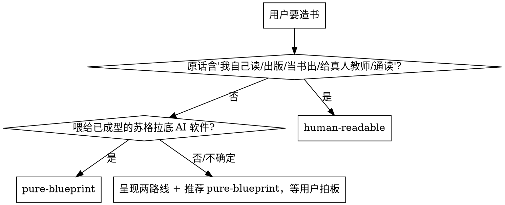

# 亲手造属于你自己的教材（Craft Your Textbook）

## 铁律（不可违反）

**先出设计再写正文；先写金标准再并行；交付前必拆脚手架；触发后必问路线，不替用户默认。**
**违反本条的字面 = 违反本条的精神。**

---

## 这是什么

造书 = 为学习者制备一份**教材**。有两种形态（触发后必选，见下"第一步：定路线"）：
- **pure-blueprint**：给 AI 苏格拉底老师读的教学蓝本（pedagogical spec），结构化、含元指令
- **human-readable**：给人读的流畅教材，AI 拿到也能直接教

三方分工决定所有下游规则：

| 角色 | 做什么 | 看到什么 |
|---|---|---|
| **用户（学习者）** | 跟 AI 老师对话学习 | 只看到对话（blueprint）或读教材+对话（human-readable） |
| **AI 老师** | 读书，用引导式提问教学 | 读完整本书作为输入 |
| **书（造物）** | 教学素材 | 是 AI 老师的输入，或人读的教材 |

**最常见的根本错误**：把书写成"给读者感受的文学作品"——开篇钩子写给谁看？"你"指谁？写每一块前先问："AI 老师/人读到这块会怎么用它？"

书对 AI 老师的四个功能：①**内容锚定**（防跑题/幻觉）②**知识结构**（推理主线）③**弹药库**（案例随取随用）④**提问路线图**（引导学生抵达知识点的问题方向）。

## 何时用

- 用户要把教材/领域知识做成 AI 能教的书或人读的教材
- 用户说"造一本书""做一本教材""按这套方法写 XX"
- 需要从 PDF 教材加工出结构化教学素材

**第一步：定路线**（触发后必须问，不替用户默认）：

> "这本书是喂给 AI 苏格拉底老师教学用的教学蓝本（推荐——AI 教学精度最高），还是一本给人读的流畅教材（AI 也能直接拿它教，但教学约束更少）？"

决策启发式：
1. 用户原话含"我自己读/出版/给别人看/当书出/通读/给真人教师/我想先通读" → human-readable
2. 书要喂给已成型的苏格拉底 AI 软件（Socratopia 等） → pure-blueprint
3. 用户不确定 → 推荐 pure-blueprint 并等拍板



路线差异和细节见 `references/two-routes.md`。

## 全流程导航（6 阶段）

先出设计，再写正文；先写一章金标准审到满意，再并行铺开。平均每本书 5-7 轮审校。

| 阶段 | 名称 | 做什么 | 产出 |
|---|---|---|---|
| **Phase 1** | 源材料准备 | PDF→MD（MinerU API）+ 复制脚本进项目 + 装依赖 | `sources-md/`、`scripts/` |
| **Phase 2** | 源探查 | 所有有源书必走：摸源结构、角色标签、简码表、权威层级 | `源材料索引.md` 第一层 |
| **Phase 3** | 教学设计 | **核心阶段**：五步设计（见下）+ 三个用户确认关卡 | META/OUTLINE/style-spec/源材料索引 |
| **Phase 4** | 金标准验证 | 选一章按设计的语法写 → 四层审计 + 试教（条件触发）→ 通过后回填 style-spec | 金标准章 md |
| **Phase 5** | 全量写作+收网 | 5.1 sub-agent 并行铺章（分批写，写一批即跑章级独立审计）→ 5.2 附录汇编 → 5.3 跨章全书审计（查映射表/事实一致性/时间线/术语）→ 5.4 合并 BOOK.md（human-readable 注入 loader 指令） | chapters/、appendix/、BOOK.md |
| **Phase 6** | 终检与交付 | **修订复审**（核实 5.3 的修复到位且没引入新问题）→ 终检 → 拆脚手架 → 质量门 → 交付 | 纯净 BOOK.md |

Mode A（无源从零造）差异：Phase 2 跳过、幻觉 gate 更严，仅适合 AI 知识密度高领域（见 `references/source-material.md` 知识密度自评）。Mode B（有源造书）：Phase 2 必走，按源数量选择探查深度（轻量/中量/完整版）。

**Phase 5.1 并行铺章的落盘纪律**：
- **进度 ledger**：每批/每章写完，在 `<项目根>/chapters/progress.md` 记一行状态（章号 → 完成 → 审计结论）。上下文压缩后靠它恢复进度，别靠记忆。
- **模型分级**：章节写作 = 标准档模型（prose 生成非机械任务）；机械任务（合并/批量替换/脚本）= 廉价档；全书审计/收尾终审 = 最强档。审计顽固问题升一档重试。

## 核心：Phase 3 教学设计五步

这是本 skill 的核心——Agent 不套模板，自己设计书的形状。

1. **Phase 3.1 分析源+推导目标**（不读模式库，免先入为主）：
   - 源材料形态是什么？
   - 这本书让学习者最终能做到什么？（通过考试/理解概念/掌握技能/通读建体系）
   - 学习者最大的坑是什么？
   - **用户确认关卡 ①**：目标和坑是否准确

2. **Phase 3.2 路线决策**（见"第一步：定路线"）

3. **Phase 3.3 模式选型+板块语法设计**：
   - 读 `references/patterns/README.md`，理解模式库
   - 带 Phase 3.1 的教学问题翻卡（每张卡判断"这个问题本书有没有"）
   - 回答两个强制问题写进 style-spec：
     ① 考虑过哪些模式、拒绝了哪些、为什么拒绝？
     ② 所选每个模式对应本书哪个具体教学问题？
   - 可选：从预装配包（认证/叙事/K-12）出发再定制
   - 设计章内板块语法（必含/循环/可选板块、叙事约定、章末教学区）
   - **用户确认关卡 ②**：模式选型和板块语法是否合理

4. **Phase 3.4 整书教学架构设计**：
   - 知识链主线、卷/部划分、逐章骨架
   - 特殊功能章（地基章/收网章）
   - 跨章引用机制、附录汇编策略
   - 贯穿案例/主角约定
   - 回填源材料索引第二层（章级映射）
   - **用户确认关卡 ③**：全书架构和逐章骨架

5. **Phase 3.5 META+源索引完稿**：
   - META 完成（必答 10 个问题见 `references/file-contracts.md`）
   - 源材料索引完成

不变量底线见 `references/invariants.md`——任何设计都不能违反。

## 关键工程原则

- **金标准先行**：没有金标准就并行 = agent 必然漂移
- **一个 agent 只写一章**，避免长上下文漂移
- **断言可追溯**：每写一条定义/公式/偏好判断，都能回源或回判断根
- **深度承诺**：Phase 3 在 style-spec 声明四维深度目标（默认"中"底线），金标准兑现，未兑现回炉
- **防螺旋**：Phase 3 定稿后不允许加章/附录/机制板块，新需求先问"能不能塞进现有结构"
- **交付前必拆脚手架**

## 参考文件按需加载

> `**REQUIRED:**` = Phase 3 开跑前必须读（不变量是底线、模式库是菜单、契约强制回答设计问题）。其余按需。

| 场景 | 参考文件 |
|---|---|
| **REQUIRED** Phase 3 不变量底线 | `references/invariants.md` |
| **REQUIRED** Phase 3 模式选型 | `references/patterns/README.md` |
| **REQUIRED** Phase 3 四文件契约 | `references/file-contracts.md` |
| Phase 1 PDF 转换 | 见下方"Phase 1 前置"段落 + `scripts/01_pdf_to_md.py` docstring |
| Phase 2 源探查 | `references/source-material.md` |
| Phase 3 板块语法起点 | `references/chapter-grammar-starter.md` |
| Phase 3.3 深度设计 / Phase 4 深度审计 | `references/depth.md` |
| Phase 3 路线差异 | `references/two-routes.md` |
| Phase 4-5 审计 | `references/audit-and-testing.md` |
| Phase 5 写作 subagent prompt | `references/subagent-prompts/writing-agent-prompt.md` |
| Phase 5 审计 subagent prompt | `references/subagent-prompts/audit-agent-prompt.md` |
| Phase 6 交付 | `references/delivery-checklist.md` |
| 避坑 | `references/anti-patterns.md` |

## Quick Reference 速查表

| 常见操作 | 命令 / 判据 |
|---|---|
| Phase 1 PDF→MD | `python <项目>/scripts/01_pdf_to_md.py <PDF> sources-md/`（理科 `ENABLE_FORMULA=True`） |
| 定路线 | 见上方流程；两路线差异见 `two-routes.md` |
| 审计何时跑 | 章写完 L1/L2/L3；全书 L4；试教条件触发（见 `audit-and-testing.md`） |
| Phase 6 禁用词终检 | `grep -rn "AI\|伴读\|指挥官\|prompt\|批量指挥\|对话框\|Socratopia\|让学生" chapters/ appendix/ \| grep -v 'AI 老师'`（先 `export LC_ALL=C.UTF-8`） |
| Phase 6 拆脚手架 | `python scripts/strip_meta_sections.py chapters/ appendix/` + 逐类 grep 清理 |
| Phase 6 合并 | `python scripts/merge_book.py`（human-readable 加 `--strip-frontmatter`） |
| 质量门判据⑥ baseline | `wc -c < BOOK.md \| tr -d ' ' > .book-baseline`；重跑时 ±10% 内 |

## ⚠️ Phase 1 前置：MinerU API Token

PDF→Markdown 默认走 MinerU 在线 API（`mineru.net`）。开跑前让用户完成：

0. 定位 skill 脚本目录 + 装依赖：
   ```bash
   # 依次在用户级、项目级目录查找 skill 位置，取第一个命中
   SKILL_DIR=$(dirname "$({ find ~/.claude -name SKILL.md -path '*craft-your-textbook*' 2>/dev/null; find . -name SKILL.md -path '*craft-your-textbook*' 2>/dev/null; } | head -1)")
   if [ -z "$SKILL_DIR" ]; then
     echo "错误：找不到 craft-your-textbook skill 目录。请确认已正确安装（见 README 安装节）。"
     return 1 2>/dev/null || exit 1
   fi
   pip install -r "$SKILL_DIR/scripts/requirements.txt"
   ```
   复制脚本：`cp "$SKILL_DIR/scripts/"*.py <项目根>/scripts/`
1. 打开 https://mineru.net 注册申请 API Token
2. 设环境变量：`export MINERU_TOKEN="你的token"`
3. 运行 `python <项目根>/scripts/01_pdf_to_md.py <PDF路径> sources-md/`

理科改 `ENABLE_FORMULA = True`。已有 MD 跳过 Phase 1。

## 一句话核心

> 书是给 AI 老师或人读的教学素材，学生主要跟 AI 老师对话。触发后先定路线；不套模板，Phase 3 自己设计书的形状——不变量是底线、模式库是菜单、四文件契约强制回答设计问题。**先出设计再写正文，先写金标准再并行，交付前必拆脚手架。**
