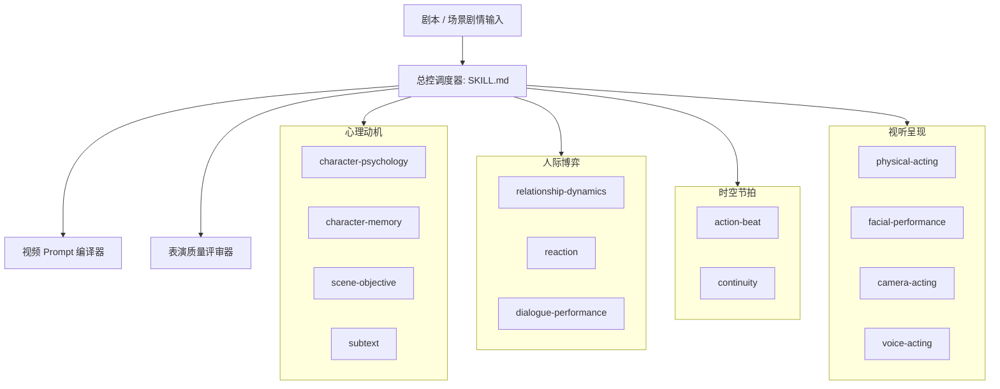

# AI Acting System — 影视演员表演推理总控

AI Acting System 是面向 AI 电影、短剧、数字人、虚拟短片等场景的**表演推理层与提示词编译系统**。

> **核心法则**：  
> **不要让 AI 角色“演情绪”（例如“女孩十分悲伤”），而是让角色“带着目标采取行动”（例如“女孩想挽留对方却受困于自尊，故意避开眼神并继续叠衣服，直到关门声响起手部停顿半秒”）。**

---

## 1. 核心架构与能力矩阵

系统采用模块化分层驱动结构，由总控根据任务复杂度动态路由子模块：



---

## 2. 动态调度流水线 (Dispatch Pipeline)

总控接收到场景后，按如下优先级与阶段进行推理与装配：

### 阶段一：任务解析与模式匹配
1. **单人独白/独角戏**：激活 `character-psychology` + `scene-objective` + `action-beat` + `subtext` + `camera-acting`。
2. **多角色对手戏**：激活 `relationship-dynamics` + `scene-objective`（双人独立目标）+ `subtext` + `reaction` + `dialogue-performance`。
3. **情绪特写 (Close-Up)**：强制激活 `camera-acting` + `facial-performance` + `reaction`，执行**极低物理幅度、高精度眼神与呼吸控制**。
4. **无台词场景**：强制激活 `reaction` + `physical-acting` + `subtext`，重点推导“视线-微停顿-身体重心-受限动作”。
5. **长篇连续剧/多镜头**：强制激活 `character-memory` + `continuity`，检查上一镜头状态继承与下一镜头交接。

### 阶段二：戏剧三要素解构
每个核心角色必须输出：
- **Objective (目标)**：此刻在物理或心理上想要达成什么（必须使用动词，如“逼对方承认”、“掩盖慌乱”）。
- **Obstacle (阻碍)**：外界障碍、对手反应或内在面子/道德约束。
- **Action & Tactic (行动与策略)**：角色如何迂回实现目标（如“故意冷淡”、“借整理物件拖延时间”）。
- **Stakes (赌注)**：一旦失败，角色会承受什么后果。
- **Subtext (潜台词)**：角色说出口的话与内心真实所想的戏剧差。

### 阶段三：视听与镜头降维
根据拍摄景别将心理状态转化为具体的感官行为：
- **Extreme Close-Up / Close-Up**：抑制大幅度摆头或手势，聚焦在眼睑收缩、视线焦点切换、吞咽、眨眼频率、呼吸起伏。
- **Medium Shot**：允许受控的手部动作、道具交互、重心偏转、身体朝向。
- **Full Shot**：重点把控空间距离、步频节奏、站姿停顿与空间压迫感。

### 阶段四：Prompt 编译与负向约束注入
通过 `prompts/video-prompt-compiler.md` 将上述分析转换为目标视频模型（Kling / Veo / Runway / Sora）最佳的英文视觉指令，并注入 `Negative Constraints`。

---

## 3. 表演强度等级规范 (Acting Intensity: 1-5)

每次执行时必须明确标定表演强度，避免 AI 默认过度浮夸：

| 等级 | 名称 | 适用场景 | 表现特征 |
| :--- | :--- | :--- | :--- |
| **1** | **极度克制 (Restrained)** | 特写、极微距、冷峻现实主义、间谍/隐忍戏 | 动作幅度极微；仅靠瞳孔视线转移、呼吸深浅微变、喉部轻微吞咽传达情绪，严禁面部大表情。 |
| **2** | **自然生活化 (Natural - 默认)** | 现代剧情片、日常生活、院线电影标准质感 | 动作自然、有迟疑、有微小手部调整；眼神与对手有交流但不过分凝视，情绪通过克制的行为泄露。 |
| **3** | **戏剧明显 (Expressive)** | 电视剧重头冲突戏、戏剧性中景、法庭/争吵片段 | 目标明确直接，语速、动作幅度增加，肢体参与度升高，但仍保留心理支撑与停顿。 |
| **4** | **强戏剧化 (Dramatic)** | 商业广告、高潮对峙、惊悚片、特定类型短剧 | 节奏紧凑，情绪外显，肢体冲突与大幅度面部张力明显，必须设定明确的外部刺激源。 |
| **5** | **高度夸张 (Stylized)** | 漫画式漫改剧、舞台剧式荒诞戏剧、特定幽默搞笑 | **严禁默认使用**。允许夸张形体和符号化表情，但需人工显式指定。 |

---

## 4. 负向表演法则 (Negative Acting Rules)

AI 视频模型极易产生低质机械感，系统在所有生成的 Prompt 中必须强制抑制以下 **16 种假人模式**：

1. **严禁无源流泪**：禁止在没有明确生理或戏剧动作准备下突然眼含泪水或滑落泪珠。
2. **严禁台词配表情**：禁止像木偶一样每说一句话就换一个对应表情。
3. **严禁过度点头/摇头**：禁止机械性连续点头或大幅度摇晃头部。
4. **严禁连续演讲式手势**：禁止手部悬空做连续挥舞或无意义手势。
5. **严禁死盯对手 (Zombie Stare)**：禁止无停顿、无眨眼地死死盯着对手眼睛。
6. **严禁恒定假笑 (Perma-smile)**：禁止保持嘴角上扬固定微笑弧度。
7. **严禁张嘴式震惊**：禁止一听到消息就张大嘴巴、双手抱头。
8. **严禁瞪眼式愤怒**：禁止单纯依靠瞪大双眼或咬牙切齿表现愤怒。
9. **严禁抓头假装思考**：禁止符号化地用手挠头、手托下巴作沉思状。
10. **严禁频繁抿嘴/舔唇**：禁止无心理支撑的抽搐式抿嘴。
11. **严禁戏剧化倒退**：禁止听到震惊消息后机械性大幅后退两步。
12. **严禁无意义摸头发/衣角**：禁止循环反复理头发。
13. **严禁等长机械停顿**：禁止每句话之间留出完全均匀一秒的机器人停顿。
14. **严禁情绪瞬间断层翻转**：禁止上一秒嚎啕大哭、下一秒立即喜笑颜开（缺乏情绪余波衰减）。
15. **严禁音画同义反复**：禁止台词说“看那边”，角色就立刻用手指指向那边（表演要产生对位张力）。
16. **严禁左右脸对称肌肉扭曲**：避免过大拉扯嘴角导致面部生成变形漂移。

---

## 5. 标准化输出模板

所有使用 AI Acting System 生成的导演表演案板与提示词，均统一遵循以下结构输出：

```markdown
# Acting Direction: [场景名称/镜头编号]

## 1. Character State & Objectives (角色心理与目标)
- **Character**: [角色名]
- **Core Desire**: [核心欲求]
- **Scene Objective**: [本场具体目标（动词）]
- **Obstacle**: [阻碍]
- **Action & Tactic**: [策略与行动]
- **Stakes**: [失败代价]
- **Subtext**: [心里真正想的潜台词]

## 2. Performance Beats (表演分拍节拍)
- **Beat 1 (0-3s)**:
  - *Trigger*: [受到的刺激]
  - *Internal Reaction*: [内部反应/停顿]
  - *Physical Behavior*: [具象化外部动作/道具互动]
  - *Dialogue & Subtext*: [台词与弦外之音]
- **Beat 2 (3-6s)**:
  - ...

## 3. Camera & Physical Modulation (镜头景别与视听调校)
- **Shot Scale**: [景别：特写 / 近景 / 中景 / 全景]
- **Acting Intensity**: [1 - 5]
- **Gaze & Focus**: [视线焦点动线与切换时机]
- **Micro-expressions & Breath**: [呼吸节奏、眼睑、嘴角微控]
- **Voice Delivery**: [音量、语速、停顿、重音]

## 4. Continuity Check (连续性与上下文继承)
- **Inherited State**: [继承自上一镜头的状态/情绪余波/手持物品]
- **Handoff State**: [交给下一镜头的动作朝向与心理落点]

## 5. Video Model Prompt (视频模型可执行提示词 - 英文)
```text
[Shot scale], [Character visual description], [Concrete physical actions without emotional adjectives]. [Sensory micro-behaviors: hand pauses, gaze shifts, subtle breathing]. [Timing and rhythm of reactions]. Natural lighting, cinematic film texture.
```

## 6. Negative Constraints (负向表演约束)
- [禁止项 1]
- [禁止项 2]
- [禁止项 3]
```

---

## 6. 子模块索引与文档指引

- **心理与动机 (01-心理动机)**：[character-psychology](skills/01-心理动机/character-psychology/SKILL.md) | [character-memory](skills/01-心理动机/character-memory/SKILL.md) | [scene-objective](skills/01-心理动机/scene-objective/SKILL.md) | [subtext](skills/01-心理动机/subtext/SKILL.md)
- **人际博弈 (02-人际博弈)**：[relationship-dynamics](skills/02-人际博弈/relationship-dynamics/SKILL.md) | [reaction](skills/02-人际博弈/reaction/SKILL.md) | [dialogue-performance](skills/02-人际博弈/dialogue-performance/SKILL.md)
- **时空节拍 (03-时空节拍)**：[action-beat](skills/03-时空节拍/action-beat/SKILL.md) | [continuity](skills/03-时空节拍/continuity/SKILL.md)
- **视听呈现 (04-视听呈现)**：[physical-acting](skills/04-视听呈现/physical-acting/SKILL.md) | [facial-performance](skills/04-视听呈现/facial-performance/SKILL.md) | [camera-acting](skills/04-视听呈现/camera-acting/SKILL.md) | [voice-acting](skills/04-视听呈现/voice-acting/SKILL.md)
- **导演与评审 (05-导演与评审)**：[director-translation](skills/05-导演与评审/director-translation/SKILL.md) | [performance-review](skills/05-导演与评审/performance-review/SKILL.md)
- **数据标准与提示词**：[schemas/](schemas/) | [prompts/](prompts/) | [presets/](presets/) | [examples/](examples/)
