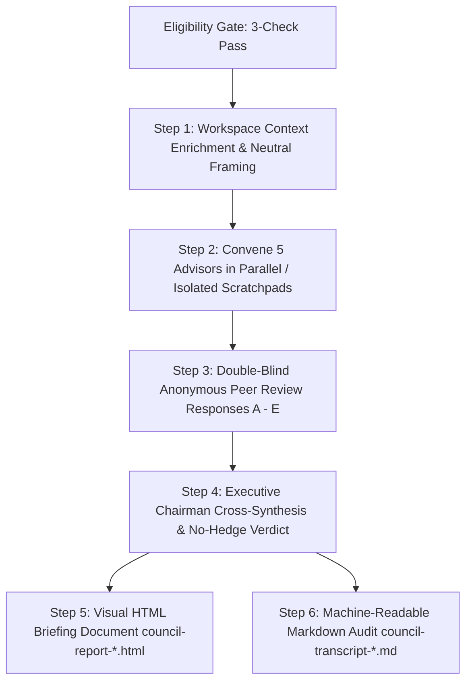

# LLM Council

You ask one AI a question, you get one answer. That answer might be articulate, but it is fundamentally limited to a single perspective, prone to premature consensus, and blind to unstated assumptions.

**The LLM Council fixes this.** It runs your dilemma through 5 autonomous advisors, each operating from a fundamentally contradictory cognitive lens. They deliberate independently, conduct a double-blind peer review of each other's work to expose fatal flaws, and a Chairman synthesizes an unhedged, decisive verdict with one immediate next step.

Adapted from **Andrej Karpathy's LLM Council methodology**, tailored for Claude environments with rigorous persona firewalls, automated cross-critique, and executive deliverables.

---

## Instructions

### 1. The Eligibility Gate (Pre-Flight Filter)

Before initiating the council protocol, run the user's prompt through this **Deterministic 3-Gate Check** (takes 2 seconds):

```
┌─────────────────────────────────────────────────────────────┐
│                   COUNCIL ELIGIBILITY GATE                  │
├─────────────────────────────────────────────────────────────┤
│ 1. DIVERGENCE GATE:                                         │
│    Are there at least 2 distinct strategic paths or a       │
│    genuine dilemma with real tradeoffs?                     │
│                                                             │
│ 2. COST-OF-ERROR GATE:                                      │
│    Is being wrong expensive (capital, time, reputation)?   │
│                                                             │
│ 3. NON-FACTUAL GATE:                                        │
│    Does this require subjective judgment rather than a      │
│    deterministic formula or factual lookup?                 │
└─────────────────────────────────────────────────────────────┘
```

- **IF ALL 3 PASS (YES):** Proceed immediately to **Step 1 (Context Enrichment & Framing)**.
- **IF ANY GATE FAILS (NO):** **DO NOT CONVENE THE COUNCIL.** Answer the prompt directly in a single, crisp paragraph without multi-agent overhead. Explain the direct answer cleanly.

#### Trigger Calibration
- **Mandatory Triggers (Always Run Gate):** `'council this'`, `'run the council'`, `'war room this'`, `'pressure-test this'`, `'stress-test this'`, `'debate this'`.
- **Strong Tradeoff Triggers:** `'should I X or Y'`, `'which option'`, `'what would you do'`, `'is this the right move'`, `'validate this'`, `'I'm torn between'`.
- **Hard Exclusions:** Factual queries (*"What is the syntax for useEffect?"*), creation tasks (*"Write a cold email"*), or low-stakes preferences (*"Should I use tabs or spaces?"*).

---

### 2. Dual-Engine Execution Architecture

The council adapts dynamically to your Claude operating environment:

- **Mode A: Native Sub-Agent Spawning (Claude Code / Agent CLI)**
  - Use when the host environment supports background sub-agents (`Agent`, `Task`, or parallel tool workers).
  - Spawn all 5 advisors simultaneously in parallel. Collect outputs asynchronously.
- **Mode B: Cognitive Scratchpad Firewall (Claude Desktop / Web / Single-Threaded)**
  - Use when background sub-agents are unavailable.
  - Execute sequentially within strict private scratchpads (`<scratchpad_contrarian>`, `<scratchpad_first_principles>`, etc.).
  - **Firewall Rule:** When generating Advisor $N$, you must strictly ignore and purge context from Advisors $1$ through $N-1$ to prevent persona contamination.

---

### 3. The Five Advisory Archetypes & Negative Constraints

Each advisor represents a disciplined cognitive lens—not a job title. To combat natural LLM sycophancy and "polite helpfulness," each advisor operates under strict **Negative Constraints**.

| Advisor | Cognitive Lens | Hard Negative Constraints (What They MUST NOT Do) | Primary Tension |
| :--- | :--- | :--- | :--- |
| **1. The Contrarian** | Probes for failure modes, structural vulnerabilities, and catastrophic risk. | **FORBIDDEN** from polite disclaimers, compliments, or hedging. Must NOT suggest compromises. Must locate the single fatal kill shot. | **Downside** vs. Expansionist |
| **2. The First Principles Thinker** | Demolishes conventions; rebuilds the problem from foundational truths. | **FORBIDDEN** from choosing between Option A or B until proving whether A and B solve the root problem. May declare the premise invalid. | **Rethink** vs. Executor |
| **3. The Expansionist** | Hunts for 10x asymmetric upside, hidden distribution, and scalable leverage. | **FORBIDDEN** from discussing risk, compliance, or budget constraints (others cover that). Must focus purely on wild upside. | **Upside** vs. Contrarian |
| **4. The Outsider** | Zero industry bias or domain jargon; evaluates purely as an intelligent newcomer. | **FORBIDDEN** from using industry acronyms or technical jargon. Must flag insider assumptions and confusing customer propositions. | **Clarity Anchor** |
| **5. The Executor** | Tactical operational reality; path of least friction starting immediately. | **FORBIDDEN** from strategic theorizing beyond 14 days. Must focus entirely on operational feasibility and the next 10 business hours. | **Execution** vs. First Principles |

---

### 4. Step-by-Step Deliberation Protocol



---

#### Step 1: Context Enrichment & Neutral Framing

Before dispatching the query:
1. **Quick Workspace Scan (< 30 seconds):** Search for and read 2–3 grounding files:
   - `CLAUDE.md` or `claude.md` (project constraints, architectural preferences)
   - `memory/` or user profile notes (target audience, business model, financials)
   - Recent council transcripts (to avoid repeating previous territory)
2. **Neutral Re-Framing:** Synthesize the user's raw dilemma and workspace facts into a crisp, neutral framing prompt containing:
   - **Core Dilemma:** The exact strategic decision.
   - **Grounding Facts:** Revenue, audience, tech stack, constraints.
   - **Stakes:** Why being wrong is costly.
   - **Do NOT inject opinions or lead the witness.**

---

#### Step 2: Convene the Council (5 Divergent Dispatches)

Spawn all 5 advisors with this exact prompt template:

```
[SYSTEM INSTRUCTION: ADVISOR DELIBERATION]
You are [Advisor Name] on an LLM Council.
Thinking style: [Insert Archetype Description from Section 3]
Hard Constraints: [Insert Negative Constraints from Section 3]

The user has brought this high-stakes dilemma to the council:
---
[Insert Framed Question + Context]
---

OPERATING RULES:
- Write strictly between 150 - 250 words.
- Zero introductory fluff or pleasantries ("I think", "Great question").
- Go directly into your unvarnished analysis.
- Champion your assigned cognitive angle aggressively. The other 4 advisors will cover what you omit.
```

---

#### Step 3: Double-Blind Peer Review (Masked Responses A–E)

1. Collect all 5 dispatches.
2. **Scramble and anonymize** them as **Response A, B, C, D, and E** (record the mapping privately).
3. Dispatch the anonymized batch to 5 independent reviewer instances.
4. Each reviewer evaluates the set using this **Standardized Evaluation Taxonomy**:

```
[SYSTEM INSTRUCTION: PEER REVIEW AUDIT]
You are an anonymous peer reviewer on an LLM Council.
Five advisors independently answered this dilemma:
---
[Insert Framed Question]
---

ANONYMIZED RESPONSES:
**Response A:** [Content]
**Response B:** [Content]
**Response C:** [Content]
**Response D:** [Content]
**Response E:** [Content]

AUDIT DIRECTIVE:
Evaluate all responses strictly on intellectual merit. Reference by letter only.
Format your review exactly as follows (under 180 words total):

[STRONGEST_ARGUMENT]: [Letter ID] - [Explain the single strongest insight and why it holds up under scrutiny].
[FATAL_BLINDSPOT]: [Letter ID] - [Identify the most dangerous unexamined assumption or fatal risk].
[UNIVERSAL_OMISSION]: [Identify the critical external variable that ALL five responses failed to address].
```

---

#### Step 4: Chairman Synthesis (Anti-Hedging Mandate)

The Chairman receives:
- The Framed Question & Workspace Context
- All 5 Advisor Dispatches (de-anonymized to trace reasoning)
- All 5 Standardized Peer Reviews

#### The Anti-Hedging Blacklist
The Chairman is strictly **FORBIDDEN** from using weasel words:
❌ *"It ultimately depends on your goals..."*  
❌ *"Both options have valid merits..."*  
❌ *"Consider a balanced hybrid approach..."*  
❌ *"There is no right or wrong answer..."*  

#### Permitted Decision Models:
1. **Direct Decisive Directive:** Choose Option X over Option Y with unequivocal reasoning.
2. **Metric-Gated Fork:** State a crisp, conditional threshold (e.g., *"If current runway is < 4 months, execute Option A; if runway > 4 months, execute Option B"*).

**Chairman Output Structure:**

```markdown
## Where the Council Agrees
[High-confidence consensus signals where independent advisors converged.]

## Where the Council Clashes
[Fundamental strategic conflicts. Present both sides and explain why reasonable experts disagree.]

## Blind Spots the Council Caught
[Emergent risks and overlooked variables surfaced during the double-blind peer review.]

## The Recommendation
[An unequivocal, decisive strategic choice or metric-gated fork. No hedging.]

## The One Thing to Do First
[A single, concrete operational milestone for the next 10 business hours. Not a checklist.]
```

---

#### Step 5: Generate the Visual HTML Briefing Document

Save to the workspace as: `council-report-[timestamp].html`

**Mandatory Specifications:**
- Fully self-contained single HTML file with inline CSS (zero CDN or network dependencies).
- **Aesthetic:** Stark bone-on-ink executive styling (dark slate background `#0c0d10`, bone text `#f4f1ea`, 1px borders `#242934`).
- **Header:** Question, timestamp, consensus score (`CONSENSUS: HIGH | SPLIT | CONTRARIAN_LEAD`).
- **Executive Verdict Box:** Top-level prominent callout featuring The Recommendation and The One Thing to Do First.
- **Agreement / Clash Grid:** Visual breakdown showing advisor alignment.
- **Collapsible Drawers (`<details>`):** Collapsible containers for each raw advisor response and the 5 peer-review scorecards.

---

#### Step 6: Save the Machine-Readable Transcript

Save to the workspace as: `council-transcript-[timestamp].md`

**Standardized YAML Schema:**

```markdown
---
dilemma: "[Exact Framed Question]"
timestamp: "[ISO-8601 Timestamp]"
consensus_score: "HIGH | SPLIT | CONTRARIAN_LEAD"
primary_tension: "Downside vs Upside | Execution vs Rethink | Clarity vs Convention"
anonymization_key:
  Response A: "[Advisor Name]"
  Response B: "[Advisor Name]"
  Response C: "[Advisor Name]"
  Response D: "[Advisor Name]"
  Response E: "[Advisor Name]"
verdict: "[One-sentence executive summary]"
first_step: "[Single operational milestone]"
---

# LLM Council Full Audit Transcript

## 1. Context & Framed Dilemma
[Details]

## 2. Independent Advisor Dispatches
### The Contrarian
[Raw Response]
### The First Principles Thinker
[Raw Response]
### The Expansionist
[Raw Response]
### The Outsider
[Raw Response]
### The Executor
[Raw Response]

## 3. Double-Blind Peer Review Audit
[Reviewer scores A through E]

## 4. Executive Chairman Synthesis
[Full Synthesis]
```

---

## Production HTML Report Blueprint

Use this exact, self-contained HTML/CSS blueprint when generating `council-report-[timestamp].html`:

```html
<!DOCTYPE html>
<html lang="en">
<head>
  <meta charset="UTF-8" />
  <meta name="viewport" content="width=device-width, initial-scale=1.0" />
  <title>Council Verdict Briefing</title>
  <style>
    :root {
      --bg: #0c0d10;
      --card: #14171d;
      --border: #242934;
      --bone: #f4f1ea;
      --muted: #848c9c;
      --cobalt: #2563eb;
      --amber: #d97706;
      --emerald: #10b981;
      --font-mono: 'JetBrains Mono', monospace, -apple-system;
      --font-sans: -apple-system, BlinkMacSystemFont, 'Segoe UI', Roboto, sans-serif;
    }
    * { box-sizing: border-box; margin: 0; padding: 0; }
    body { background: var(--bg); color: var(--bone); font-family: var(--font-sans); line-height: 1.5; padding: 1.5rem; max-width: 960px; margin: 0 auto; }
    header { border-bottom: 1px solid var(--border); padding-bottom: 1rem; margin-bottom: 1.5rem; }
    .badge { font-family: var(--font-mono); font-size: 0.7rem; padding: 2px 8px; border-radius: 2px; text-transform: uppercase; letter-spacing: 0.05em; display: inline-block; }
    .badge-amber { background: rgba(217,119,6,0.15); color: var(--amber); border: 1px solid var(--amber); }
    .badge-emerald { background: rgba(16,185,129,0.15); color: var(--emerald); border: 1px solid var(--emerald); }
    .title { font-size: 1.5rem; font-weight: 700; margin: 0.5rem 0; color: var(--bone); }
    .verdict-box { background: var(--card); border: 1px solid var(--emerald); border-radius: 4px; padding: 1.25rem; margin-bottom: 1.5rem; }
    .verdict-title { font-family: var(--font-mono); font-size: 0.75rem; color: var(--emerald); letter-spacing: 0.08em; text-transform: uppercase; font-weight: 700; margin-bottom: 0.4rem; }
    .action-step { background: rgba(16,185,129,0.08); border-left: 3px solid var(--emerald); padding: 0.75rem 1rem; margin-top: 1rem; font-size: 0.95rem; }
    .grid { display: grid; grid-template-columns: 1fr 1fr; gap: 1rem; margin-bottom: 1.5rem; }
    @media (max-width: 640px) { .grid { grid-template-columns: 1fr; } }
    .section-card { background: var(--card); border: 1px solid var(--border); border-radius: 4px; padding: 1rem; }
    .section-head { font-family: var(--font-mono); font-size: 0.7rem; color: var(--muted); text-transform: uppercase; margin-bottom: 0.5rem; }
    details { background: var(--card); border: 1px solid var(--border); border-radius: 4px; margin-bottom: 0.6rem; padding: 0.75rem 1rem; }
    summary { font-family: var(--font-mono); font-size: 0.8rem; font-weight: 600; cursor: pointer; color: var(--bone); outline: none; }
    .drawer-content { margin-top: 0.75rem; font-size: 0.85rem; color: var(--muted); border-top: 1px solid var(--border); padding-top: 0.75rem; }
  </style>
</head>
<body>
  <header>
    <div style="display:flex; justify-content:space-between; align-items:center;">
      <span class="badge badge-amber">LLM COUNCIL VERDICT BRIEFING</span>
      <span style="font-family:var(--font-mono); font-size:0.75rem; color:var(--muted);" id="meta-ts">[TIMESTAMP]</span>
    </div>
    <h1 class="title">[DILEMMA QUESTION]</h1>
  </header>

  <main>
    <div class="verdict-box">
      <div class="verdict-title">EXECUTIVE RECOMMENDATION</div>
      <p style="font-size:1.05rem; font-weight:600; color:var(--bone);">[THE DIRECT RECOMMENDATION]</p>
      <div class="action-step">
        <strong style="color:var(--emerald);">ONE THING TO DO FIRST:</strong> [CONCRETE NEXT ACTION STEP]
      </div>
    </div>

    <div class="grid">
      <div class="section-card">
        <div class="section-head">WHERE THE COUNCIL AGREES</div>
        <p style="font-size:0.85rem; color:var(--bone);">[Points of consensus across advisors]</p>
      </div>
      <div class="section-card">
        <div class="section-head">WHERE THE COUNCIL CLASHES</div>
        <p style="font-size:0.85rem; color:var(--bone);">[Core tensions and opposing arguments]</p>
      </div>
    </div>

    <h2 style="font-family:var(--font-mono); font-size:0.85rem; color:var(--muted); text-transform:uppercase; margin-bottom:0.75rem;">Advisory Dispatches & Cross-Audit</h2>
    <!-- Collapsible Drawers for Advisors 1-5 -->
    <details>
      <summary>SEAT 01 // THE CONTRARIAN</summary>
      <div class="drawer-content">[Dispatch Content]</div>
    </details>
    <details>
      <summary>SEAT 02 // THE FIRST PRINCIPLES THINKER</summary>
      <div class="drawer-content">[Dispatch Content]</div>
    </details>
    <details>
      <summary>SEAT 03 // THE EXPANSIONIST</summary>
      <div class="drawer-content">[Dispatch Content]</div>
    </details>
    <details>
      <summary>SEAT 04 // THE OUTSIDER</summary>
      <div class="drawer-content">[Dispatch Content]</div>
    </details>
    <details>
      <summary>SEAT 05 // THE EXECUTOR</summary>
      <div class="drawer-content">[Dispatch Content]</div>
    </details>
    <details>
      <summary>DOUBLE-BLIND PEER REVIEW MATRIX (RESPONSES A–E)</summary>
      <div class="drawer-content">[Peer Review Scorecards & Universal Omissions]</div>
    </details>
  </main>
</body>
</html>
```

---

## Examples

### Reference Walkthrough: Product Launch Dilemma

**User Prompt:**
> "Council this: I'm planning to launch a $297 course on Claude Code for beginners. My audience is mostly non-technical solopreneurs. Should I launch this course or build a live workshop first?"

**Pre-Flight Gate:**
1. *Divergence Gate:* Yes ($297 pre-recorded course vs. live workshop).
2. *Cost-of-Error Gate:* Yes (4–8 weeks production time, refund risk, brand reputation).
3. *Non-Factual Gate:* Yes (subjective market positioning and business strategy).
$\rightarrow$ **Council Triggered.**

**The Contrarian Dispatch:**
> "The market is saturated with generic Claude tutorials. At $297, your non-technical buyers will hit terminal installation hurdles (Node.js, Git, API keys) within 15 minutes, triggering high refund rates and an unsustainable customer support backlog. Beginners don't want to buy a CLI tool course; they will churn before finishing Module 1."

**The First Principles Thinker Dispatch:**
> "Why are you selling a course? If the objective is revenue validation, pre-recording 6 hours of video is the slowest possible feedback loop. If the objective is customer transformation, non-technical solopreneurs do not learn technical workflows from static videos. You are packaging a solution before proving that students can achieve the promised outcome."

**The Expansionist Dispatch:**
> "Beginner AI implementation for non-technical solopreneurs is an enormous untapped market because technical creators speak in jargon. However, $297 is an awkward middle ground. If you prove you can automate 10 hours/week of administrative tasks, this should be a $997 transformation program with community accountability and live implementation sprints."

**The Outsider Dispatch:**
> "I have no idea what 'Claude Code' means, and your audience doesn't either. The phrase sounds like software engineering software. If you lead your marketing with the name of the tool, you will only attract developers who will find the course too basic. Sell the outcome: 'How to automate your administrative work and reclaim 10 hours a week.'"

**The Executor Dispatch:**
> "Do not record a single video. Announce a live, 90-minute workshop priced at $97 capped at 50 seats. Teach them how to automate one single repetitive business task live on Zoom. You validate demand, collect immediate cash, encounter real customer friction points, and record the session as raw footage for future packaging."

**Chairman's Verdict:**
- **Where the Council Agrees:** The target audience has real demand for AI automation, but tool-centric branding ("Claude Code") is fatal for non-technical buyers.
- **Where the Council Clashes:** Price and delivery format. Contrarian and Executor advocate for low-friction live validation ($97); Expansionist sees an eventual high-ticket program ($997).
- **Critical Blind Spot Surfaced:** The Outsider identified that using the tool's brand name in the course title alienates the target buyer before they even see the syllabus.
- **The Recommendation:** Cancel pre-recorded course production immediately. Reframe the offer entirely around outcome transformation rather than tool mechanics.
- **The One Thing to Do First:** Launch a registration page for a $97 live workshop titled *"Automate Your First Business Task with AI (No Coding Required)"* capped at 50 seats.
