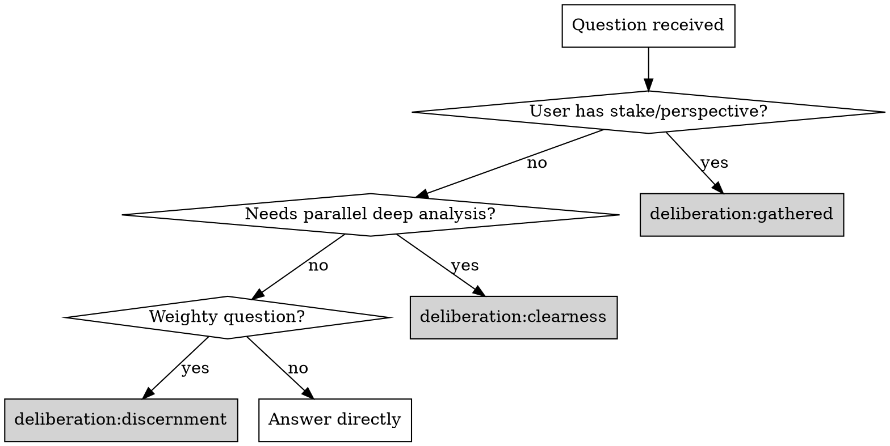

# Deliberation

## Overview

Decision-making through deliberation — seeking unity through discernment rather than consensus through debate.

*This approach draws on Quaker business practice, adapted for AI-assisted decision-making.*

**Core insight:** Some decisions deserve more than quick answers. These skills provide structured approaches for genuine discernment.

## The Three Skills

| Skill | Purpose | When to Use |
|-------|---------|-------------|
| `deliberation:discernment` | Internal voices seeking clarity | Weighty questions, ethical decisions, trade-offs, multiple valid approaches |
| `deliberation:clearness` | Multi-agent committee with parallel deep work | Code reviews, architecture decisions, research needing distributed depth |
| `deliberation:gathered` | User participates alongside agent voices | User has stake/perspective, wants to discern together rather than receive advice |

## Routing Logic

## Signals for Each Skill

**Use `deliberation:gathered` when:**
- "I've been thinking about this for weeks"
- "I'm torn between..."
- "I think X, but..."
- "I don't just want your opinion"
- User expresses their own position in the question

**Use `deliberation:clearness` when:**
- Complex code review touching multiple concerns
- Architecture decision with many dimensions
- Research requiring deep exploration of multiple options
- Task where you'd write a very long response covering many angles shallowly

**Use `deliberation:discernment` when:**
- Ethical weight or potential for harm
- Multiple valid approaches exist
- Significant trade-offs
- You'd naturally want to say "it depends"

## Shared Principles

All three skills share these principles:

| Principle | Meaning |
|-----------|---------|
| **Sense of the meeting** | Clerk discerns where unity lies - not counting votes |
| **Speaking once** | Each perspective speaks once, then listens |
| **Silence** | Pausing between voices lets insights emerge |
| **Standing aside** | "I disagree but won't block" - honest without preventing |
| **Blocking** | Rare - only for violations of core principles |
| **Way opens** | Recognizing when clarity emerges vs. forcing decision |

## Shared Resources

- `skills/shared/principles.md` - Core principles
- `skills/shared/vocabulary.md` - Shared terminology
- `skills/shared/clerk-patterns.md` - Synthesis patterns for clerk role
