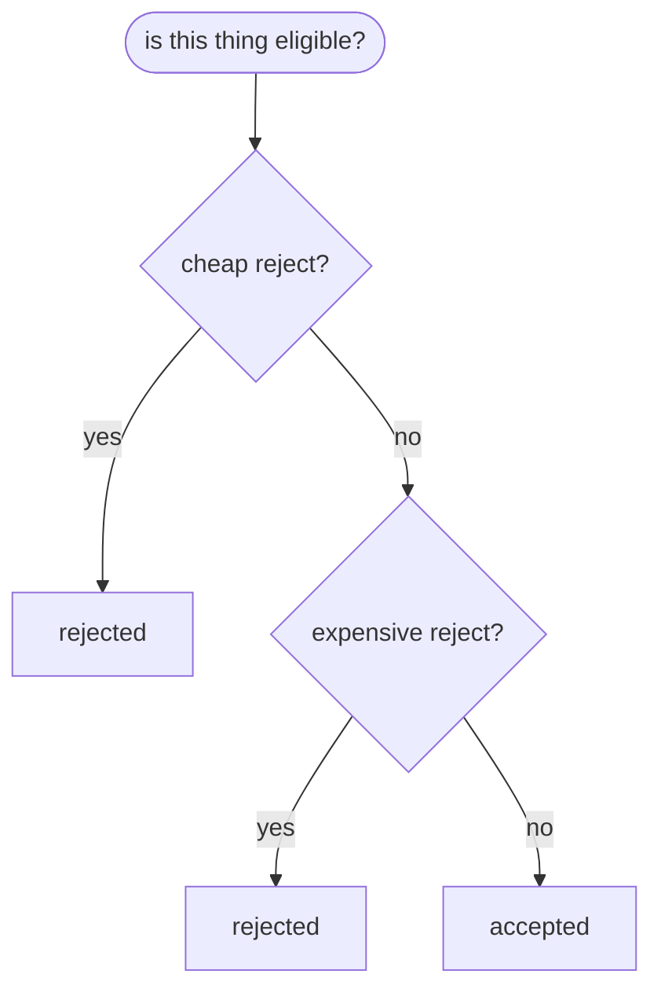
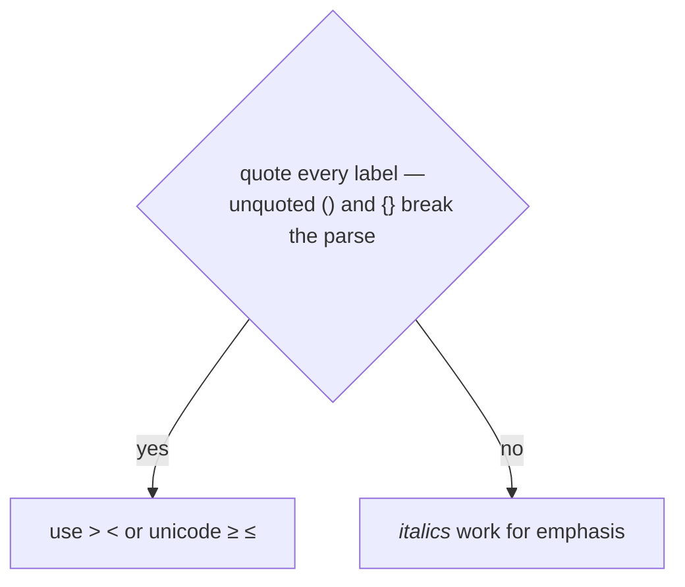

# Charting Code Chains

A chain of branches is hard to hold in your head and trivial to see. Turn it into a
mermaid flowchart, render a PNG, and look at the PNG before handing it over.

## Pick the shape from the chain

Three kinds of chain, three different diagrams. Getting this wrong produces a picture
that is technically accurate and still misleading.

**Short-circuit ladder** — `if/elif`, guard clauses, early returns, `&&` chains.
A staircase: each test is a diamond, the rejecting edge exits to its own leaf, the
surviving edge drops to the next test. **Order is semantics** — a test only ever sees
inputs that passed everything above it. Never reorder to balance the layout.



**Switch / dispatch** — one node fanning out to N labeled edges, *not* a ladder. Cases
are unordered, and a staircase would imply a precedence that does not exist. Draw
fallthrough as an explicit edge between case bodies; that is the only ordering there is.

**Callstack** — linear, one node per frame, top to bottom. Put the interesting content
on the **edges**, not the nodes: a callstack's substance is what each frame hands the
next, and where the representation changes.

## Build it from the source

- Read the actual code. Every branch in the source gets an edge; the silently-dropped
  `else` / `default` is the usual defect.
- Title the chart `func_name — file.cc:LINE`. Get LINE from `grep -n`, never by adding
  offsets to a windowed read.
- Name real thresholds and constants (`120 m`, `kMinSpeedForDirection`) or say you
  elided them. Do not quietly round them away.
- Terminals say what the **caller** observes — `blocked` / `not blocked`, `nullptr`,
  `Status::kInvalidArgument` — not `end`.
- Say in chat what the diagram made obvious that the code did not. That insight is the
  deliverable; the PNG is how you got there.

## Label syntax that survives rendering



Break long labels yourself at phrase boundaries. Mermaid also auto-wraps, and a manual
break landing mid-phrase collides with it and reads as a typo.

A palette that stays legible in both light and dark, with the true/false distinction
carried by the text too, not by color alone:

```
classDef yes   fill:#1b6b3a,stroke:#0d3d20,stroke-width:2px,color:#ffffff
classDef no    fill:#e8e8ea,stroke:#6b6b70,stroke-width:1.5px,color:#1a1a1a
classDef test  fill:#fdf3d7,stroke:#a8871f,stroke-width:1.5px,color:#1a1a1a
classDef entry fill:#1f4e79,stroke:#12314b,stroke-width:2px,color:#ffffff
```

## Render

Write `<name>.mmd`, then:

```bash
~/.claude/skills/charting-code-chains/scripts/render_mermaid.sh -i chart.mmd -o chart.png
```

Uses the system Chrome via `npx`, so nothing installs onto `PATH` and no Chromium is
downloaded. First run pulls mermaid-cli into `~/.npm/_npx` and takes ~60s; later runs
are seconds. `-s` sets scale (default 3), `-b` background (default white).

**Never render through mermaid.ink, kroki, or any hosted service** — that POSTs the
source structure of the user's code to a third party.

## Verify by looking

Read the PNG back. Rendering succeeds while producing overlapped nodes, mid-phrase
wraps, and labels clipped out of the viewport, and none of that is visible in the
source. This costs one tool call and is the whole reason to render a raster at all.

## Where the files land

Default to the session scratchpad, three files together — `.mmd` (re-renderable
source), `.md` (mermaid block plus the notes), `.png`. Then give the **absolute path**
to the PNG; the user opens it outside the terminal. Offer to move them into the repo
rather than putting them there uninvited.
