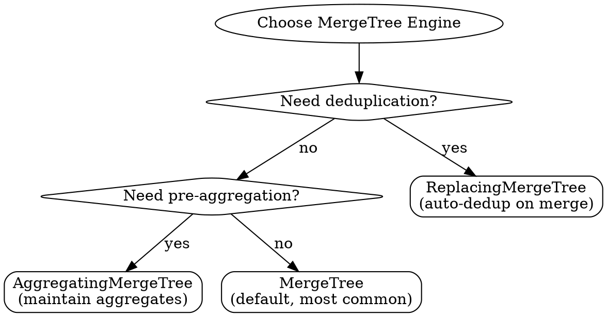

# ClickHouse Analytics Patterns

## Overview

ClickHouse is a column-oriented DBMS for OLAP workloads. **Core principle:** Design tables for your query patterns, batch writes, leverage pre-aggregation.

**Key insight:** ClickHouse trades write complexity for read speed. If you're doing OLTP-style operations, you're using the wrong tool.

## Scope

**This skill covers:**

- Table schema design and MergeTree engine selection
- Query optimization and performance tuning
- Batch INSERT patterns (scheduled ETL jobs)
- Materialized views for pre-aggregation

**This skill does NOT cover:**

- Real-time streaming from Kafka/RabbitMQ → See `clickhouse-streaming`
- Database replication (PostgreSQL/MySQL sync) → See `clickhouse-cdc`

**If unsure:** Start here for fundamentals, then check specialized skills.

## When to Use

**Symptoms:**

- Analytical queries timeout on datasets > 1M rows
- Need to choose between MergeTree variants
- Seeing "too many partitions" or "too many parts" errors
- Small frequent inserts causing degradation
- Confused about ORDER BY vs PRIMARY KEY

**When NOT to use:**

- OLTP workloads (use PostgreSQL/MySQL)
- Small datasets < 100k rows
- Need ACID transactions across tables
- Real-time individual row updates

## Quick Reference

### Engine Selection



| Engine | Use When | Example |
|--------|----------|---------|
| **MergeTree** | Default (90% of cases) | Event logs, metrics |
| **ReplacingMergeTree** | Duplicate data from sources | User events, CDC |
| **AggregatingMergeTree** | Real-time dashboard stats | Hourly/daily aggregations |

### Critical Rules

| Rule | Why | Example |
|------|-----|---------|
| **ORDER BY first** | Primary index only works on prefix | `ORDER BY (date, user_id)` |
| **Batch inserts** | Each insert = new part | Minimum 1000 rows |
| **Specify columns** | Column storage reads ALL | Never `SELECT *` |
| **Monthly partitions** | Too many = slow scans | `PARTITION BY toYYYYMM(date)` |

## Table Design Patterns

### MergeTree (Default)

```sql
CREATE TABLE events (
    date Date,
    timestamp DateTime,
    user_id String,
    event_type LowCardinality(String),
    properties String
) ENGINE = MergeTree()
PARTITION BY toYYYYMM(date)
ORDER BY (date, user_id, timestamp)
SETTINGS index_granularity = 8192;
```

**Key decisions:**

- `PARTITION BY toYYYYMM(date)` - Monthly partitions (sweet spot)
- `ORDER BY (date, user_id, timestamp)` - Filter columns FIRST
- `LowCardinality(String)` - For repeated values (< 10k unique)

### ReplacingMergeTree (Deduplication)

```sql
CREATE TABLE user_events (
    event_id String,
    user_id String,
    timestamp DateTime,
    version UInt64
) ENGINE = ReplacingMergeTree(version)
PARTITION BY toYYYYMM(timestamp)
ORDER BY (user_id, event_id, timestamp);

-- ⚠️ Dedup happens during MERGE, not on read
-- Use FINAL for guaranteed dedup (slower):
SELECT * FROM user_events FINAL WHERE user_id = 'user-123';
```

### AggregatingMergeTree (Pre-aggregation)

```sql
-- 1. Target table
CREATE TABLE stats_hourly (
    hour DateTime,
    market_id String,
    total_volume AggregateFunction(sum, UInt64),
    total_trades AggregateFunction(count, UInt32)
) ENGINE = AggregatingMergeTree()
PARTITION BY toYYYYMM(hour)
ORDER BY (hour, market_id);

-- 2. Materialized view (auto-populates)
CREATE MATERIALIZED VIEW stats_hourly_mv TO stats_hourly
AS SELECT
    toStartOfHour(timestamp) AS hour,
    market_id,
    sumState(amount) AS total_volume,
    countState() AS total_trades
FROM trades
GROUP BY hour, market_id;

-- 3. Query with merge functions
SELECT
    hour,
    sumMerge(total_volume) AS volume,
    countMerge(total_trades) AS trades
FROM stats_hourly
WHERE hour >= now() - INTERVAL 24 HOUR
GROUP BY hour, market_id;
```

## Query Optimization

### Leverage ORDER BY

```sql
-- ✅ GOOD: Filter on ORDER BY columns
SELECT user_id, event_type, timestamp
FROM events
WHERE date >= '2025-01-01'      -- First in ORDER BY
  AND user_id = 'user-123'       -- Second in ORDER BY
LIMIT 100;

-- ❌ BAD: Filter on non-indexed columns
SELECT *
FROM events
WHERE event_type = 'purchase'    -- Not in ORDER BY
  AND properties LIKE '%premium%';
```

### Use ClickHouse Functions

```sql
SELECT
    toStartOfDay(timestamp) AS day,
    sum(volume) AS total,
    count() AS trades,              -- Not count(*)
    uniq(user_id) AS users,         -- Not COUNT(DISTINCT)
    quantile(0.95)(size) AS p95     -- Not percentile
FROM trades
WHERE timestamp >= today() - INTERVAL 7 DAY
GROUP BY day
HAVING total > 10000
ORDER BY day DESC;
```

## Data Insertion

### Bulk Insert (Required)

```typescript
import { ClickHouse } from 'clickhouse';

// ✅ GOOD: Batch 1000+ rows
async function bulkInsert(trades: Trade[]) {
  const BATCH_SIZE = 5000;

  for (let i = 0; i < trades.length; i += BATCH_SIZE) {
    const batch = trades.slice(i, i + BATCH_SIZE);
    const values = batch.map(t =>
      `('${t.id}', '${t.market_id}', ${t.amount}, '${t.timestamp.toISOString()}')`
    ).join(',');

    await clickhouse.query(`
      INSERT INTO trades (id, market_id, amount, timestamp) VALUES ${values}
    `).toPromise();
  }
}

// ❌ BAD: Individual inserts create "merge hell"
async function slowInsert(trade: Trade) {
  await clickhouse.query(`INSERT INTO trades VALUES (...)`).toPromise();
}
```

**Why batching matters:** Each insert creates a new "part". Too many parts = slow merges = degraded performance.

## Common Mistakes

| Mistake | Why It Fails | Fix |
|---------|--------------|-----|
| **SELECT *** | Reads ALL columns | Specify: `SELECT id, name` |
| **Small frequent inserts** | Too many parts → merge hell | Batch 1000-5000 rows |
| **Too many partitions** | Scans all partitions | Monthly/daily, not hourly |
| **Wrong ORDER BY** | Can't use primary index | Filtered columns FIRST |
| **FINAL everywhere** | Forces merge per query | Only when truly needed |
| **JOINs on large tables** | Not optimized for joins | Denormalize or use dictionaries |

## Performance Monitoring

```sql
-- Find slow queries (> 1s in last hour)
SELECT
    query_duration_ms / 1000 AS seconds,
    read_rows,
    formatReadableSize(memory_usage) AS memory,
    substring(query, 1, 100) AS query_preview
FROM system.query_log
WHERE type = 'QueryFinish'
  AND query_duration_ms > 1000
  AND event_time >= now() - INTERVAL 1 HOUR
ORDER BY query_duration_ms DESC
LIMIT 10;

-- Check table health
SELECT
    table,
    formatReadableSize(sum(bytes)) AS size,
    sum(rows) AS rows,
    count() AS parts  -- If > 100, investigate merges
FROM system.parts
WHERE active
GROUP BY table
ORDER BY sum(bytes) DESC;
```

## Analytics Patterns

```sql
-- Daily Active Users
SELECT
    toDate(timestamp) AS date,
    uniq(user_id) AS dau
FROM events
WHERE timestamp >= today() - INTERVAL 30 DAY
GROUP BY date;

-- Retention Cohort
WITH cohorts AS (
    SELECT user_id, min(toDate(timestamp)) AS signup_date
    FROM events GROUP BY user_id
)
SELECT
    toStartOfMonth(signup_date) AS cohort,
    dateDiff('day', signup_date, toDate(e.timestamp)) AS days,
    uniq(e.user_id) AS active_users
FROM events e
JOIN cohorts c ON e.user_id = c.user_id
WHERE e.timestamp >= today() - INTERVAL 90 DAY
GROUP BY cohort, days;

-- Conversion Funnel
SELECT
    countIf(event_type = 'view') AS step1,
    countIf(event_type = 'cart') AS step2,
    countIf(event_type = 'purchase') AS step3,
    round(step2 / step1 * 100, 2) AS view_to_cart_rate
FROM events
WHERE date = today();
```

## Best Practices

**Design:**

- Choose engine via flowchart
- Partition by time (monthly for most)
- ORDER BY = query filter columns

**Query:**

- Specify columns (never SELECT *)
- Filter on ORDER BY columns
- Use ClickHouse functions (uniq, quantile)

**Insert:**

- Batch 1000-5000 rows minimum
- Use materialized views for aggregations
- Monitor parts count

## Red Flags

Stop if you're saying:

- ❌ "I'll add a B-tree index" → ClickHouse uses ORDER BY
- ❌ "SELECT * then filter in app" → Extremely slow
- ❌ "Small inserts for prototype" → Technical debt
- ❌ "JOIN like PostgreSQL" → Denormalize instead
- ❌ "FINAL everywhere" → Kills performance

## When to Escalate

**Symptoms:**

- Query > 10s on < 10M rows
- "Too many parts" despite batching
- Memory exhaustion (need distributed)
- Need ACID transactions (wrong tool)

**Where to look:**

- ClickHouse docs: <https://clickhouse.com/docs>
- System tables: query_log, parts, merges

## Related Skills

**For specialized use cases:**

- **Database replication:** PostgreSQL/MySQL → ClickHouse sync → See `clickhouse-cdc`
- **Streaming ingestion:** Kafka/RabbitMQ → ClickHouse → See `clickhouse-streaming`

---

**Remember:** Design for query patterns, batch writes, leverage materialized views. If constantly fighting the tool, reconsider if OLAP is what you need.
