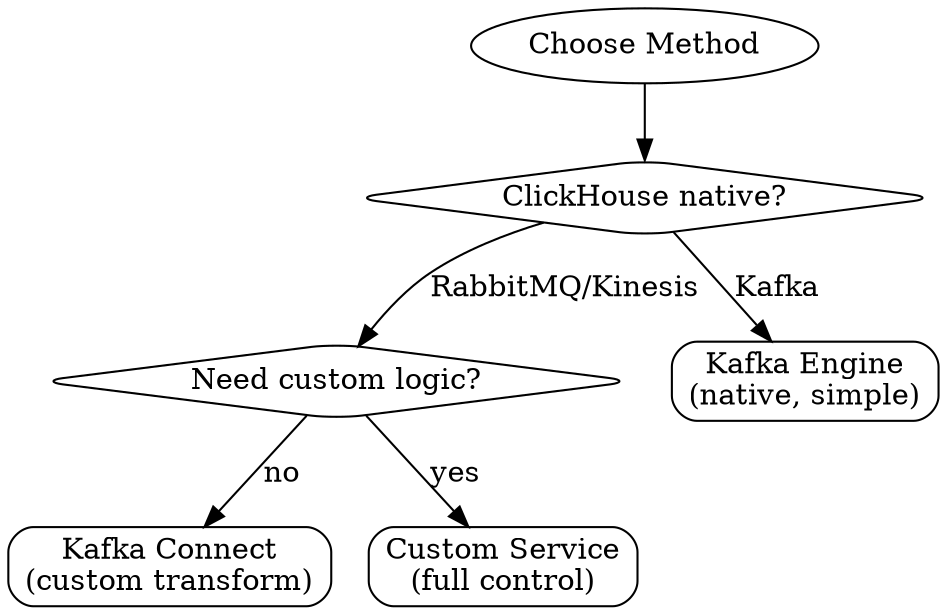

# ClickHouse Streaming Patterns

## Overview

Stream processing continuously ingests data from message queues into ClickHouse. **Core principle:** Balance throughput with latency, handle failures gracefully, ensure exactly-once delivery.

**Key challenge:** ClickHouse is optimized for batch inserts. Streaming requires careful tuning to avoid "too many parts" while maintaining low latency.

## When to Use

**Symptoms:**

- Need to ingest Kafka/RabbitMQ messages into ClickHouse
- Real-time analytics dashboard (< 1 minute latency)
- IoT sensor data, application logs, clickstream
- Message rate varies (need backpressure handling)

**When NOT to use:**

- Database replication (PostgreSQL/MySQL) → See `clickhouse-cdc`
- Scheduled batch jobs (hourly/daily) → See `clickhouse-patterns`
- One-time data import → Use batch INSERT

## Prerequisites

- Understanding of message queue semantics (Kafka offsets, RabbitMQ acks)
- Basic ClickHouse knowledge → See `clickhouse-patterns`
- Familiarity with stream processing concepts

## Quick Reference

### Method Selection



| Method | Best For | Pros | Cons |
|--------|----------|------|------|
| **Kafka Engine** | Simple Kafka → CH | Native, no code | Limited transformation |
| **Custom Service** | Complex logic, any queue | Full control | Must handle failures |

### Critical Settings

| Setting | Low Latency | High Throughput |
|---------|-------------|-----------------|
| **Batch size** | 1000 rows | 50000 rows |
| **Flush interval** | 500ms | 5000ms |
| **Target latency** | < 1 second | 5-10 seconds |

## Pattern 1: ClickHouse Kafka Engine

### Setup

```sql
-- 1. Kafka staging table
CREATE TABLE events_queue (
    timestamp UInt64,
    user_id String,
    event_type String,
    properties String
) ENGINE = Kafka()
SETTINGS
    kafka_broker_list = 'kafka:9092',
    kafka_topic_list = 'events',
    kafka_group_name = 'clickhouse_consumers',
    kafka_format = 'JSONEachRow',
    kafka_num_consumers = 4,           -- Match Kafka partitions
    kafka_max_block_size = 65536,      -- Batch size
    kafka_poll_timeout_ms = 1000;      -- Wait time

-- 2. Target table
CREATE TABLE events (
    date Date,
    timestamp DateTime,
    user_id String,
    event_type LowCardinality(String),
    properties String
) ENGINE = MergeTree()
PARTITION BY toYYYYMM(date)
ORDER BY (date, user_id, timestamp);

-- 3. Materialized view
CREATE MATERIALIZED VIEW events_mv TO events AS
SELECT
    toDate(toDateTime(timestamp)) AS date,
    toDateTime(timestamp) AS timestamp,
    user_id, event_type, properties
FROM events_queue;
```

### Tuning Parameters

```sql
SETTINGS
    kafka_max_block_size = 65536,        -- Batch size (larger = higher latency)
    kafka_poll_timeout_ms = 1000,        -- Poll wait (longer = better batching)
    kafka_num_consumers = 4,             -- Parallel consumers
    kafka_skip_broken_messages = 100,    -- Skip errors (use carefully)
    kafka_commit_every_batch = 1;        -- Commit frequency
```

### Monitoring

```sql
-- Consumer status
SELECT database, table, consumer_id, exceptions, last_exception_time
FROM system.kafka_consumers;

-- Consumption lag
SELECT table, partition_id,
       current_offset - last_committed_offset AS lag
FROM system.kafka_consumers;
```

## Pattern 2: Custom Service (Node.js)

### Use Case

- Complex transformations
- Multiple sources (RabbitMQ, Kinesis)
- Custom error handling

### Implementation

```typescript
import { Kafka } from 'kafkajs';
import { ClickHouse } from 'clickhouse';

class StreamProcessor {
  private buffer: any[] = [];
  private readonly BATCH_SIZE = 5000;
  private readonly FLUSH_INTERVAL_MS = 1000;

  async start() {
    const consumer = kafka.consumer({ groupId: 'events-processor' });
    await consumer.subscribe({ topic: 'events' });

    setInterval(() => this.flush(), this.FLUSH_INTERVAL_MS);

    await consumer.run({
      eachBatchAutoResolve: false,
      eachBatch: async ({ batch, resolveOffset, heartbeat }) => {
        for (const message of batch.messages) {
          const event = JSON.parse(message.value.toString());

          this.buffer.push({
            date: new Date(event.timestamp).toISOString().split('T')[0],
            timestamp: new Date(event.timestamp),
            user_id: event.userId,
            event_type: event.type,
            properties: JSON.stringify(event.properties)
          });

          if (this.buffer.length >= this.BATCH_SIZE) await this.flush();

          await resolveOffset(message.offset);
          await heartbeat();
        }
      }
    });
  }

  async flush() {
    if (this.buffer.length === 0) return;

    try {
      await clickhouse.insert('events', this.buffer);
      console.log(`Flushed ${this.buffer.length} events`);
      this.buffer = [];
    } catch (err) {
      await this.retryWithBackoff(this.buffer);
    }
  }

  async retryWithBackoff(batch: any[], attempt = 1) {
    if (attempt > 3) {
      console.error('Max retries, sending to DLQ');
      return;
    }

    const delay = Math.min(1000 * Math.pow(2, attempt), 10000);
    await new Promise(r => setTimeout(r, delay));

    try {
      await clickhouse.insert('events', batch);
    } catch (err) {
      await this.retryWithBackoff(batch, attempt + 1);
    }
  }
}
```

## Exactly-Once Semantics

### Challenge

Kafka at-least-once + ClickHouse idempotency = exactly-once

### Solution 1: Deduplication Table

```sql
CREATE TABLE processed_messages (
    message_id String,
    processed_at DateTime
) ENGINE = MergeTree()
ORDER BY message_id
TTL processed_at + INTERVAL 7 DAY;

-- Insert only new messages
INSERT INTO events
SELECT * FROM events_staging
WHERE message_id NOT IN (SELECT message_id FROM processed_messages);
```

### Solution 2: ReplacingMergeTree

```sql
CREATE TABLE events (
    message_id String,  -- Kafka offset or UUID
    timestamp DateTime,
    user_id String
) ENGINE = ReplacingMergeTree()
ORDER BY message_id;

SELECT * FROM events FINAL WHERE user_id = 'user-123';
```

## Backpressure Handling

### Bounded Buffer Pattern

```typescript
class BackpressureBuffer {
  private buffer: any[] = [];
  private readonly MAX_BUFFER_SIZE = 100000;
  private processing = false;

  async add(item: any) {
    while (this.buffer.length >= this.MAX_BUFFER_SIZE) {
      await new Promise(r => setTimeout(r, 100));
    }
    this.buffer.push(item);
  }

  async tryFlush() {
    if (this.processing || this.buffer.length < BATCH_SIZE) return;

    this.processing = true;
    const batch = this.buffer.splice(0, BATCH_SIZE);

    try {
      await clickhouse.insert('events', batch);
    } finally {
      this.processing = false;
    }
  }
}
```

### Pause Consumer Pattern

```typescript
consumer.run({
  eachBatch: async ({ batch, pause }) => {
    if (buffer.length > MAX_BUFFER_SIZE) {
      const pauseHandle = pause();
      await flush();
      pauseHandle.resume();
    }
  }
});
```

## Performance Optimization

### Async Inserts

```sql
SET async_insert = 1;
SET wait_for_async_insert = 0;
SET async_insert_max_data_size = 10485760;  -- 10MB
SET async_insert_busy_timeout_ms = 1000;    -- 1s
```

### Parallel Consumers

```sql
-- Match number to Kafka partitions
SETTINGS kafka_num_consumers = 8;
```

## Common Mistakes

| Mistake | Why It Fails | Fix |
|---------|--------------|-----|
| **Small batches** | Too many parts | Minimum 1000 rows |
| **No backpressure** | Memory overflow | Bounded buffer + pause |
| **Sync inserts** | Low throughput | Use async_insert = 1 |
| **No error handling** | Lost messages | Retry + DLQ |
| **Single consumer** | Low throughput | Parallel = partitions |

## Monitoring

```sql
-- Throughput
SELECT toStartOfMinute(now()) AS minute, count() AS events_per_minute
FROM events
WHERE timestamp >= now() - INTERVAL 5 MINUTE
GROUP BY minute;

-- Lag analysis
SELECT
    quantile(0.50)(now() - timestamp) AS median_lag,
    quantile(0.95)(now() - timestamp) AS p95_lag
FROM events
WHERE timestamp >= now() - INTERVAL 1 MINUTE;

-- Errors
SELECT toStartOfMinute(event_time) AS minute, count() AS errors
FROM system.kafka_consumers
WHERE last_exception_time >= now() - INTERVAL 1 HOUR
GROUP BY minute;
```

## Best Practices

**Design:**

- Use Kafka Engine for simple pipelines
- Custom service for complex transformations
- Always implement deduplication

**Performance:**

- Batch size: 1000-50000 (tune for latency)
- Flush interval: 500ms-5s
- Parallel consumers = Kafka partitions

**Reliability:**

- Bounded buffer for backpressure
- Exponential backoff retry
- Dead letter queue for failures
- Monitor lag continuously

## Red Flags

- ❌ "Insert per message" → Too many parts
- ❌ "Unbounded buffer" → Memory overflow
- ❌ "No lag monitoring" → Stale data
- ❌ "Ignore errors" → Data loss
- ❌ "Sync inserts" → Low throughput

## When to Escalate

- Lag > 1 minute despite tuning
- Memory exhaustion with backpressure
- "Too many parts" errors
- Multi-datacenter streaming needed

**Resources:** ClickHouse Kafka engine docs, system.kafka_consumers table

## Related Skills

- **ClickHouse fundamentals:** See `clickhouse-patterns`
- **Database replication:** See `clickhouse-cdc`

---

**Remember:** Balance latency, throughput, and reliability. Monitor lag, implement backpressure, tune batch sizes for your SLA.
