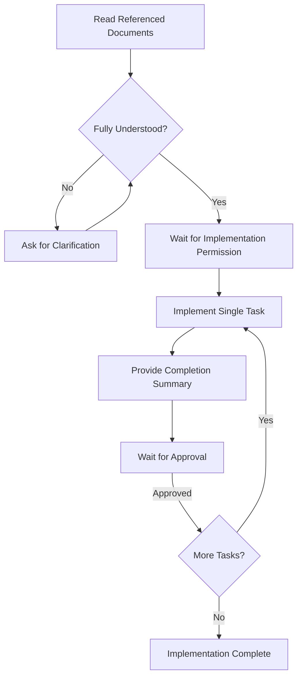

# Controlled Implementation Skill

Execute implementation work in a strictly controlled, step-by-step manner based on approved design and implementation documents, preventing scope creep, premature execution, and task skipping.

## Preconditions (Must Read First)

Before starting any implementation, the agent **MUST**:

1. Read and fully understand **all** referenced documents provided by the user (design specs, architecture docs, implementation plans)
2. Make no assumptions. If anything is unclear or contradictory, **stop and ask for clarification**

## Core Rules (Non-Negotiable)

| Rule | Description |
| :--- | :--- |
| **No Immediate Implementation** | Reading and analysis only until explicit permission to start implementation is given |
| **Single-Task Execution** | Implement one task at a time, exactly as defined. Never batch tasks. Never partially start, pre-empt, or prepare future tasks |
| **Mandatory Completion Checkpoint** | After completing a task, stop all further work immediately and provide a short, clear completion summary |
| **Explicit Approval Gate** | Proceed to the next task **only** after receiving explicit approval ("green light") from the user |
| **No Forward-Looking Work** | Do not anticipate future steps, refactor unrelated areas, or add "helper" changes for upcoming tasks |

## Expected Behaviour

* Operate as a senior engineer in a production environment
* Optimise for safety, clarity, and reviewability
* Follow provided documents as the **single source of truth**
* Prefer correctness over speed

## Completion Output Format

After completing each task, respond with:

```markdown
## ✅ Task Complete: [Task Name or Identifier]

### Summary
- Bullet point 1
- Bullet point 2
- Bullet point 3
- (3–5 bullets describing what was implemented)

### Scope Confirmation
✓ No other tasks were touched
✓ No forward-looking changes made

### Next Step
Awaiting your approval to proceed to: [Next Task Name]
```

## Workflow



## Anti-Patterns to Avoid

| ❌ Anti-Pattern | ✅ Correct Behaviour |
| :--- | :--- |
| Implementing multiple tasks at once | One task at a time |
| Starting work without reading docs | Read all docs first |
| Making "helpful" additions | Strict scope adherence |
| Preparing code for future tasks | Current task only |
| Proceeding without explicit approval | Wait for green light |
| Making assumptions about unclear specs | Ask for clarification |
