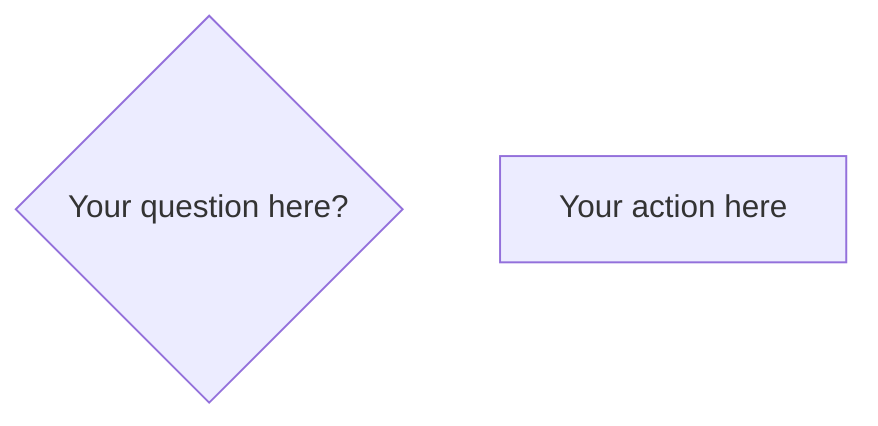

# Creating Mermaid Flowcharts

## Overview

Mermaid has strict syntax rules: node identifiers must be simple alphanumeric (a, b, node1), while labels can contain any text. Modern `@{ shape: ..., label: "..." }` syntax is preferred over legacy shorthand for clarity and reliability.

## When to Use

**Use this skill when:**
- Creating new Mermaid flowchart diagrams
- Encountering parse errors ("Expecting 'SEMI'", syntax errors)
- Converting diagrams from other formats (dot, graphviz)
- Unsure about shape syntax, connection types, or styling
- Need to add colors or classes to nodes

**Don't use for:**
- Other Mermaid diagram types (sequence, gantt, class diagrams)
- Complex state machines (use stateDiagram instead)

## Quick Reference

### Common Shapes

| Shape | Modern Syntax | Use Case |
|-------|---------------|----------|
| Diamond | `a@{ shape: diam, label: "Decision?" }` | Decisions, questions |
| Rectangle | `a@{ shape: rect, label: "Action" }` | Process steps, actions |
| Stadium | `a@{ shape: stadium, label: "Start/End" }` | Start/end points (preferred) |
| Circle | `a@{ shape: circle, label: "Start" }` | Alternative for start/end |
| Rounded | `a@{ shape: rounded, label: "Event" }` | Events, states |

**Note:** Use `stadium` for start/end nodes (more readable). Use `circle` for compact diagrams.

See [mermaid-flowchart-reference.md](mermaid-flowchart-reference.md) for complete shape list.

### Connections

| Type | Syntax | Example |
|------|--------|---------|
| Solid arrow | `-->` | `a --> b` |
| Labeled arrow | `-->\|label\|` | `a -->\|yes\| b` |
| Dotted | `-.->` | `a -.-> b` |
| Thick | `==>` | `a ==> b` |

### Styling

| Pattern | Syntax | Purpose |
|---------|--------|---------|
| Define class | `classDef name fill:#color` | Create reusable style |
| Apply class | `node:::className` | Style specific node |

## Core Pattern

**❌ WRONG - Spaces in identifiers:**

```mermaid
graph LR
    "New constraint revealed?" --> "Return to Phase 1"
```

**Error:** Identifiers can't have spaces. Parse will fail.

**✅ CORRECT - Simple IDs + Labels:**

```mermaid
graph LR
    a@{ shape: diam, label: "New constraint revealed?" }
    b@{ shape: rect, label: "Return to Phase 1" }
    a -->\|yes\| b
```

## Implementation

### Step 1: Choose Graph Direction

```mermaid
graph TD    ← Top-down (vertical flow)
graph LR    ← Left-right (horizontal flow)
```

**Choose based on flow:**
- `TD` (or `TB`) = Top-down for sequential processes, workflows
- `LR` = Left-right for timelines, state transitions
- `BT` = Bottom-up (rare)
- `RL` = Right-left (rare)

### Step 2: Define Nodes with Modern Syntax



**Rules:**
- **Identifier** = simple alphanumeric only (a, b, node1, step2)
- **Label** = any text in quotes after `label:`
- **Shape** = from reference list (diam, rect, circle, stadium, etc.)

### Step 3: Connect Nodes

```mermaid
    a -->\|yes\| b
    a -->\|no\| c
```

**Always label decision branches** (yes/no, true/false, etc.)

### Step 4: Apply Styling (Optional)

```mermaid
    classDef highlight fill:#ffcccc
    classDef success fill:#ccffcc

    b:::highlight
    c:::success
```

**Define classes before applying them.** Each node can only have one class applied.

**Styling patterns:**
- Multiple end nodes: Use separate end nodes when paths have different outcomes; use single end node when all paths converge naturally
- Decision nodes: Keep neutral (no styling) or style based on their context (error flow vs success flow)
- Need composite styles? Create a new class combining properties rather than applying multiple classes

## Common Mistakes

### Mistake 1: Spaces in Identifiers

**Problem:**

```mermaid
"My Node" --> "Other Node"
```

**Fix:** Use simple IDs with labels:

```mermaid
a@{ shape: rect, label: "My Node" } --> b@{ shape: rect, label: "Other Node" }
```

### Mistake 2: Missing Edge Labels on Decisions

**Problem:**

```mermaid
decision --> optionA
decision --> optionB
```

**Fix:** Label your decision branches:

```mermaid
decision -->\|yes\| optionA
decision -->\|no\| optionB
```

### Mistake 3: Applying Undefined Classes

**Problem:**

```mermaid
a:::highlight  ← Class never defined
```

**Fix:** Define before applying:

```mermaid
classDef highlight fill:#ffcccc
a:::highlight
```

### Mistake 4: Mixing Legacy and Modern Syntax

**Problem:**

```mermaid
a@{ shape: diam, label: "Modern" }
b{"Legacy"}  ← Inconsistent
```

**Fix:** Use modern syntax consistently throughout diagram.

## Debugging Checklist

When you get parse errors:
- [ ] All identifiers are simple alphanumeric (no spaces, no special chars)
- [ ] Modern `@{ shape: ..., label: "..." }` syntax used consistently
- [ ] Decision nodes have labeled edges
- [ ] Classes defined before applied
- [ ] No trailing semicolons or extra whitespace
- [ ] Graph direction specified (LR, TD, etc.)

## Real-World Impact

Using modern syntax eliminates 90% of parse errors. Proper identifier naming allows diagrams to render on first attempt in Obsidian without web lookups or trial-and-error debugging.
