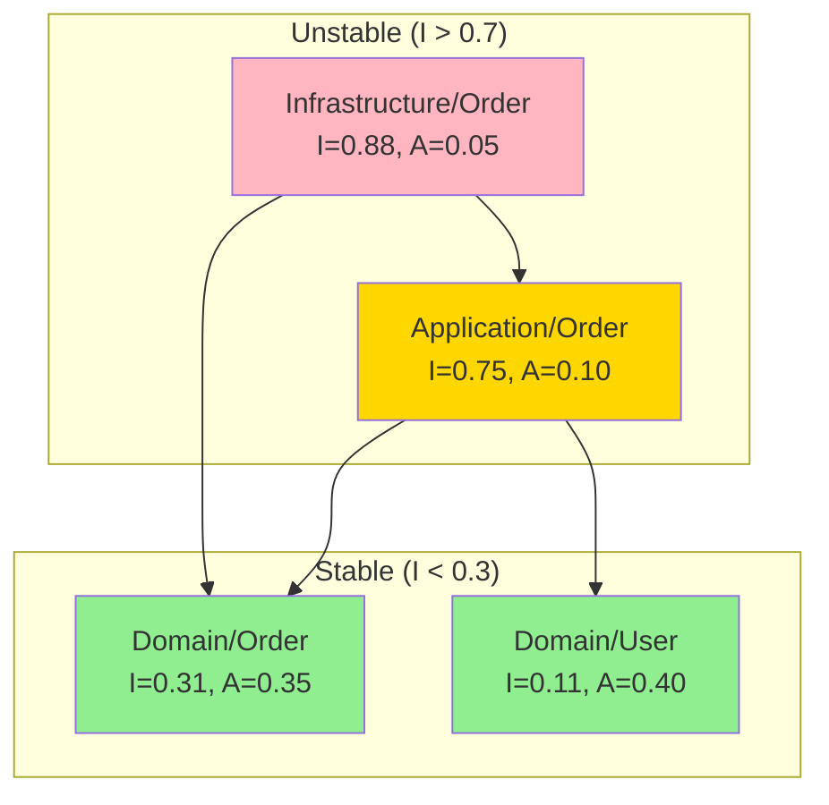

# Coupling & Cohesion Analyzer

## Overview

This skill analyzes PHP codebases for coupling and cohesion metrics, helping identify architectural issues like unstable dependencies, low cohesion classes, and tightly coupled modules.

## Metrics Reference

| Metric | Formula | Target | Description |
|--------|---------|--------|-------------|
| Ca (Afferent) | Incoming deps | - | Classes depending ON this |
| Ce (Efferent) | Outgoing deps | < 10 | Classes this DEPENDS on |
| Instability (I) | Ce / (Ca + Ce) | 0.0-1.0 | 0=stable, 1=unstable |
| Abstractness (A) | Abstract / Total | 0.0-1.0 | Ratio of interfaces |
| Distance (D) | \|A + I - 1\| | < 0.3 | Distance from main sequence |
| LCOM | Methods not sharing fields | < 0.5 | Lack of cohesion |

## Detection Patterns

### Phase 1: Dependency Discovery

```bash
# Count imports per file (Efferent Coupling - Ce)
Grep: "^use " --glob "**/*.php"
# Group by file, count unique namespaces

# Find who imports a class (Afferent Coupling - Ca)
Grep: "use [A-Z][a-z]+\\\\[A-Z][a-z]+\\\\[A-Z]+" --glob "**/*.php"
# For each class, count files importing it

# Constructor dependencies
Grep: "__construct\(" --glob "**/*.php" -A 15
# Count injected dependencies
```

### Phase 2: Efferent Coupling (Ce) Analysis

```bash
# Classes with high outgoing dependencies
# For each PHP file in src/:

# Count use statements
grep -c "^use " "$file"

# Count constructor parameters
grep -A 20 "__construct" "$file" | grep -c "private\|readonly"

# Count method parameters with type hints
grep -c "function.*[A-Z][a-z]+.*\$" "$file"
```

**Thresholds:**
- Ce < 5: Low coupling (good)
- Ce 5-10: Moderate coupling
- Ce 10-15: High coupling (warning)
- Ce > 15: Very high coupling (critical)

### Phase 3: Afferent Coupling (Ca) Analysis

```bash
# Find highly depended-on classes
# For target class "User":

Grep: "use.*\\\\User;|use.*\\\\User as" --glob "**/*.php" --output_mode count

# Find classes imported across many modules
Grep: "use [A-Z]" --glob "**/*.php" --output_mode content
# Aggregate by imported class
```

**High Ca Classes (> 20):**
- May be stable core abstractions (good)
- May be God classes (bad)
- Should be interfaces, not concrete classes

### Phase 4: Instability Index

```php
// I = Ce / (Ca + Ce)
// I = 0: Maximally stable (many depend on it, depends on few)
// I = 1: Maximally unstable (few depend on it, depends on many)
```

```bash
# Calculate per package/namespace
# Example for src/Order/:

# Ce: outgoing dependencies from Order to other namespaces
grep -rh "^use " src/Order/ | grep -v "Order\\\\" | sort -u | wc -l

# Ca: incoming dependencies to Order from other namespaces
grep -rh "use.*Order\\\\" src/ | grep -v "src/Order/" | sort -u | wc -l
```

**Stable Dependencies Principle:**
- Unstable packages should depend on stable packages
- I(dependent) > I(dependency)

### Phase 5: Abstractness Analysis

```bash
# Count interfaces and abstract classes per package
Grep: "^interface |^abstract class " --glob "**/Domain/**/*.php"

# Count concrete classes
Grep: "^class |^final class |^readonly class " --glob "**/Domain/**/*.php"

# Abstractness = abstract / total
```

**Target Abstractness by Layer:**
- Domain interfaces: A ≈ 0.3-0.5
- Application: A ≈ 0.2-0.3
- Infrastructure: A ≈ 0.1-0.2 (mostly concrete)

### Phase 6: LCOM (Lack of Cohesion of Methods)

```bash
# LCOM measures how methods share instance variables
# High LCOM = methods don't share state = low cohesion

# For each class, analyze:
# 1. List all instance variables
# 2. For each method, list variables it uses
# 3. Calculate pairs of methods not sharing any variable

Grep: "private \$|private readonly" --glob "**/*.php"
Grep: "\$this->" --glob "**/*.php"
```

**LCOM Calculation:**
```
LCOM = (methods not sharing fields) / (total method pairs)

If class has 5 methods and 3 pairs share no fields:
LCOM = 3 / 10 = 0.3 (acceptable)

If class has 10 methods and 40 pairs share no fields:
LCOM = 40 / 45 = 0.89 (high - consider splitting)
```

### Phase 7: Dependency Cycles Detection

```bash
# Find circular dependencies between packages

# Build dependency graph
# For each namespace A, find dependencies to namespace B
# If B also depends on A → cycle

# Package A imports from B
Grep: "namespace Order|use Payment\\\\" --glob "**/Order/**/*.php"

# Package B imports from A
Grep: "namespace Payment|use Order\\\\" --glob "**/Payment/**/*.php"

# If both match → circular dependency
```

## Report Format

```markdown
# Coupling & Cohesion Analysis Report

## Package Metrics

| Package | Ce | Ca | I | A | D | Status |
|---------|----|----|---|---|---|--------|
| Domain/User | 3 | 25 | 0.11 | 0.40 | 0.29 | ✅ Stable |
| Domain/Order | 8 | 18 | 0.31 | 0.35 | 0.04 | ✅ Good |
| Application/Order | 15 | 5 | 0.75 | 0.10 | 0.15 | ✅ Unstable (OK) |
| Infrastructure/Persistence | 22 | 3 | 0.88 | 0.05 | 0.07 | ⚠️ High Ce |

**Legend:**
- Ce = Efferent coupling (outgoing)
- Ca = Afferent coupling (incoming)
- I = Instability (0=stable, 1=unstable)
- A = Abstractness
- D = Distance from main sequence

## Main Sequence Diagram

```
Abstractness (A)
1.0 ┌───────────────────────────────────┐
    │ Zone of Uselessness               │
    │          ╲                        │
0.5 │           ╲ Main Sequence         │
    │ Domain/User ●                     │
    │              ╲ Domain/Order       │
    │               ● ╲                 │
0.0 │                  ╲ Infra/Persist  │
    │ Zone of Pain      ● ●App/Order    │
    └───────────────────────────────────┘
    0.0                              1.0
                Instability (I)
```

## Critical Issues

### COUP-001: High Efferent Coupling
- **Package:** `src/Application/Order/`
- **Ce:** 22 (threshold: 15)
- **Dependencies:**
  - Domain/Order (4 classes)
  - Domain/User (3 classes)
  - Domain/Payment (2 classes)
  - Domain/Shipping (3 classes)
  - Infrastructure/Persistence (4 classes)
  - Infrastructure/Messaging (3 classes)
  - External/Stripe (3 classes)
- **Issue:** Too many external dependencies
- **Refactoring:**
  - Split into focused use cases
  - Introduce facades/mediators
  - Use domain events instead of direct calls
- **Skills:** `acc-create-use-case`, `acc-create-mediator`

### COUP-002: Unstable Package Depends on Unstable
- **Violation:** Stable Dependencies Principle
- **Package:** `Domain/Order` (I=0.31)
- **Depends on:** `Application/Reporting` (I=0.82)
- **Issue:** Stable domain depends on unstable application
- **Refactoring:** Invert dependency, use interface

### COUP-003: Circular Dependency
- **Packages:** `Order` ↔ `Payment`
- **Order → Payment:**
  - `Order.php` imports `PaymentService`
- **Payment → Order:**
  - `PaymentProcessor.php` imports `OrderRepository`
- **Refactoring:**
  - Introduce shared interface in Domain
  - Use domain events for communication
- **Skills:** `acc-create-domain-event`

## Warning Issues

### COUP-004: Low Cohesion Class
- **File:** `src/Application/Service/OrderService.php`
- **LCOM:** 0.78 (threshold: 0.5)
- **Methods:** 12
- **Shared fields:** Only 2 fields used across all methods
- **Issue:** Class has multiple responsibilities
- **Refactoring:** Split into focused classes
  - `OrderCreationService`
  - `OrderValidationService`
  - `OrderNotificationService`
- **Skills:** `acc-create-use-case`, `acc-create-domain-service`

### COUP-005: Zone of Pain
- **Package:** `src/Infrastructure/Legacy/`
- **Metrics:** I=0.15, A=0.05
- **Issue:** Stable concrete package (hard to change, many depend on it)
- **Refactoring:** Extract interfaces, increase abstractness

### COUP-006: High Afferent on Concrete
- **Class:** `src/Domain/Order/Order.php`
- **Ca:** 45 (many classes depend on it)
- **Type:** Concrete class
- **Issue:** Changes affect 45 dependents
- **Refactoring:** Ensure class is stable, consider interface

## Class Metrics

### High Coupling Classes (Ce > 10)

| Class | Ce | Layer | Recommendation |
|-------|----|----|----------------|
| OrderService | 18 | Application | Split responsibilities |
| ReportGenerator | 15 | Application | Use query service |
| UserController | 12 | Presentation | Extract handlers |
| ImportProcessor | 14 | Infrastructure | Use adapter pattern |

### Low Cohesion Classes (LCOM > 0.5)

| Class | LCOM | Methods | Fields | Recommendation |
|-------|------|---------|--------|----------------|
| OrderManager | 0.82 | 15 | 4 | Split by responsibility |
| UserService | 0.71 | 12 | 3 | Extract domain logic |
| ReportHelper | 0.68 | 8 | 2 | Group related methods |

## Dependency Diagram



## Recommendations

### Immediate Actions
1. Break circular dependencies with events
2. Split high Ce classes (> 15 dependencies)
3. Extract interfaces for high Ca concrete classes

### Short-term
4. Split low cohesion classes (LCOM > 0.5)
5. Move unstable code away from stable packages
6. Increase abstractness in Zone of Pain packages

### Metrics Targets
| Metric | Current | Target |
|--------|---------|--------|
| Max Ce per class | 22 | < 10 |
| Avg LCOM | 0.45 | < 0.3 |
| Circular deps | 2 | 0 |
| Zone of Pain packages | 3 | 0 |
```

## Coupling Reduction Strategies

### High Efferent Coupling

```php
// BAD: High Ce
class OrderService
{
    public function __construct(
        private UserRepository $users,
        private ProductRepository $products,
        private PaymentGateway $payment,
        private ShippingService $shipping,
        private NotificationService $notifications,
        private InventoryService $inventory,
        private TaxCalculator $tax,
        private DiscountService $discounts,
    ) {}
}

// GOOD: Lower Ce via Facade
class OrderService
{
    public function __construct(
        private OrderDependencies $deps,
    ) {}
}

// Or split into focused classes
class CreateOrderUseCase { /* uses only 3 deps */ }
class CalculateOrderUseCase { /* uses only 2 deps */ }
```

### Circular Dependencies

```php
// BAD: Circular
// Order depends on Payment
// Payment depends on Order

// GOOD: Domain events
class Order
{
    public function pay(): void
    {
        $this->recordEvent(new OrderPaidEvent($this->id));
    }
}

class PaymentSubscriber
{
    public function __invoke(OrderPaidEvent $event): void
    {
        $this->paymentService->record($event->orderId);
    }
}
```

## Quick Analysis Commands

```bash
# Coupling analysis
echo "=== High Efferent Coupling (Ce) ===" && \
for f in $(find src -name "*.php"); do \
  count=$(grep -c "^use " "$f" 2>/dev/null || echo 0); \
  [ $count -gt 10 ] && echo "$f: $count imports"; \
done && \
echo "=== Circular Dependencies ===" && \
for ctx in Order User Payment; do \
  for other in Order User Payment; do \
    [ "$ctx" != "$other" ] && \
    grep -l "use.*${other}\\\\" src/${ctx}/**/*.php 2>/dev/null | head -1 && \
    grep -l "use.*${ctx}\\\\" src/${other}/**/*.php 2>/dev/null | head -1; \
  done; \
done
```

## Integration

Works with:
- `acc-detect-code-smells` — God Class detection
- `acc-structural-auditor` — Architecture analysis
- `acc-grasp-knowledge` — GRASP principles (Low Coupling, High Cohesion)
- `acc-create-mediator` — Reduce coupling via mediator

## References

- "Agile Software Development" (Robert C. Martin) — Package Coupling Principles
- "Object-Oriented Metrics in Practice" (Lanza, Marinescu)
- "A Metrics Suite for Object Oriented Design" (Chidamber, Kemerer) — LCOM metric
