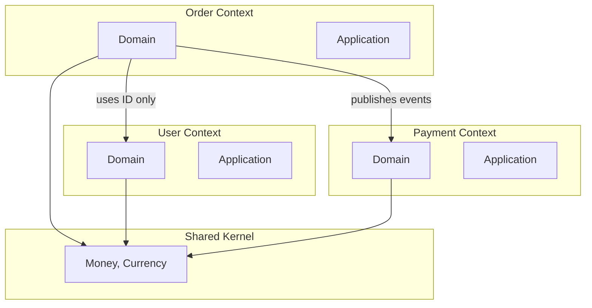

# Bounded Contexts Analyzer

## Overview

This skill analyzes PHP DDD projects for bounded context boundary issues, cross-context coupling, and context mapping violations.

## Bounded Context Concepts

| Concept | Definition | Violation Indicator |
|---------|------------|---------------------|
| Bounded Context | Explicit boundary with its own domain model | Missing namespace separation |
| Ubiquitous Language | Consistent terminology within context | Same term, different meanings |
| Context Map | Relationships between contexts | Unclear dependencies |
| Anti-Corruption Layer | Translation between contexts | Direct foreign model usage |
| Shared Kernel | Deliberately shared code | Unintentional sharing |
| Published Language | Public API contracts | Breaking changes |

## Detection Patterns

### Phase 1: Context Discovery

```bash
# Identify bounded contexts from directory structure
Glob: **/src/**/Domain/*
Glob: **/src/**/Context/*
Glob: **/src/**/Bounded/*
Glob: **/src/**/Module/*

# Namespace-based contexts
Grep: "namespace.*\\\\Domain\\\\|namespace.*\\\\Context\\\\" --glob "**/*.php"

# Composer autoload namespaces
Read: composer.json (check autoload paths for context namespaces)
```

**Context Indicators:**
- Top-level namespace under `src/` (e.g., `Order`, `User`, `Payment`)
- Explicit `Domain/` subfolder per context
- `BoundedContext/` or `Context/` folder structure

### Phase 2: Cross-Context Coupling Detection

#### Direct Cross-Context Imports

```bash
# Find cross-context imports (most critical)
# Pattern: Context A importing from Context B's Domain layer

# Order context importing User domain
Grep: "use Order\\\\.*\\\\Domain" --glob "**/User/**/*.php"
Grep: "use User\\\\.*\\\\Domain" --glob "**/Order/**/*.php"

# General pattern: Domain layer importing another Domain
Grep: "use [A-Z][a-z]+\\\\Domain\\\\" --glob "**/Domain/**/*.php"

# Direct entity references across contexts
Grep: "use.*\\\\Entity\\\\(?!.*\\\\self)" --glob "**/Domain/**/*.php"
```

#### Foreign Aggregate References

```bash
# Aggregates referencing foreign entities directly
Grep: "private.*[A-Z][a-z]+Entity\|private readonly [A-Z][a-z]+" --glob "**/Aggregate/**/*.php"

# Should use ID references only
# Good: private UserId $userId
# Bad: private User $user (from another context)

# Detect direct object references vs ID references
Grep: "\\$user[^I]|\\$order[^I]|\\$customer[^I]" --glob "**/Domain/**/*.php"
```

#### Shared Repository Usage

```bash
# Repository from one context used in another
Grep: "UserRepositoryInterface" --glob "**/Order/**/*.php"
Grep: "OrderRepositoryInterface" --glob "**/User/**/*.php"

# Generic repository pattern violations
Grep: "RepositoryInterface" --glob "**/*.php"
# Check if implementations span contexts
```

### Phase 3: Shared Kernel Analysis

```bash
# Identify potential shared kernel (common code between contexts)
Glob: **/Shared/**/*.php
Glob: **/Common/**/*.php
Glob: **/Core/**/*.php
Glob: **/SharedKernel/**/*.php

# Find duplicated Value Objects across contexts
# Same class name in multiple contexts
Glob: **/Domain/**/Email.php
Glob: **/Domain/**/Money.php
Glob: **/Domain/**/Address.php

# Shared events
Grep: "class.*Event.*implements|extends.*Event" --glob "**/Shared/**/*.php"
```

**Shared Kernel Rules:**
- Must be explicitly designated
- Minimal and stable
- Changes require agreement from all context owners
- Should contain only Value Objects, not Entities

### Phase 4: Context Map Relationships

#### Upstream/Downstream Detection

```bash
# Event publishers (upstream)
Grep: "EventDispatcher|MessageBus|publish\(" --glob "**/Domain/**/*.php"
Grep: "class.*Event\s*\{|final readonly class.*Event" --glob "**/Domain/**/*.php"

# Event subscribers (downstream)
Grep: "EventSubscriber|MessageHandler|Listener" --glob "**/*.php"
Grep: "function __invoke\(.*Event" --glob "**/*.php"

# Check which context publishes and which subscribes
```

#### Customer/Supplier Relationships

```bash
# API clients (customer role)
Grep: "ApiClient|HttpClient|RestClient" --glob "**/Infrastructure/**/*.php"

# API providers (supplier role)
Grep: "Controller|Action|Endpoint" --glob "**/Presentation/**/*.php"
```

#### Anti-Corruption Layer Detection

```bash
# ACL presence
Glob: **/AntiCorruption/**/*.php
Glob: **/ACL/**/*.php
Glob: **/Adapter/**/*.php
Glob: **/Translator/**/*.php

# Missing ACL (direct external model usage)
Grep: "use External\\\\|use ThirdParty\\\\|use Legacy\\\\" --glob "**/Domain/**/*.php"
```

### Phase 5: Ubiquitous Language Analysis

```bash
# Find same term with different meanings
# Example: "Account" in User context vs Payment context

# Find class with same name in different contexts
Glob: **/User/**/Account.php
Glob: **/Payment/**/Account.php
Glob: **/Billing/**/Account.php

# Find similar entity names
Glob: **/Domain/**/User.php
Glob: **/Domain/**/Customer.php
Glob: **/Domain/**/Client.php

# Inconsistent naming
Grep: "class Order|class Purchase|class Sale" --glob "**/Domain/**/*.php"
```

## Report Format

```markdown
# Bounded Context Analysis Report

## Context Map



## Detected Contexts

| Context | Location | Entities | Events | Dependencies |
|---------|----------|----------|--------|--------------|
| Order | `src/Order/` | 5 | 8 | User (ID), Payment (event) |
| User | `src/User/` | 3 | 4 | None |
| Payment | `src/Payment/` | 4 | 6 | Order (event) |
| Shared | `src/Shared/` | 0 | 0 | All contexts |

## Critical Issues

### BC-001: Cross-Context Entity Reference
- **File:** `src/Order/Domain/Entity/Order.php:15`
- **Issue:** Direct reference to User entity instead of UserId
- **Code:** `private User $user` (from User context)
- **Expected:** `private UserId $userId`
- **Impact:** Tight coupling, breaks context isolation
- **Refactoring:** Replace with ID reference, use ACL if needed
- **Skills:** `acc-create-value-object` (for UserId), `acc-create-anti-corruption-layer`

### BC-002: Missing Anti-Corruption Layer
- **File:** `src/Payment/Infrastructure/Gateway/StripeGateway.php`
- **Issue:** Stripe models used directly in domain
- **Code:** `use Stripe\PaymentIntent;`
- **Impact:** External API changes affect domain
- **Refactoring:** Create PaymentIntent adapter/translator
- **Skills:** `acc-create-anti-corruption-layer`

### BC-003: Unintended Shared Kernel
- **Files:**
  - `src/Order/Domain/ValueObject/Address.php`
  - `src/User/Domain/ValueObject/Address.php`
- **Issue:** Duplicated Address VO without explicit sharing
- **Impact:** Inconsistent behavior, maintenance burden
- **Refactoring:** Either consolidate to Shared Kernel or differentiate
- **Skills:** `acc-create-value-object`

## Warning Issues

### BC-004: Ambiguous Ubiquitous Language
- **Context 1:** `src/User/` uses `Account` for user profile
- **Context 2:** `src/Payment/` uses `Account` for financial account
- **Issue:** Same term, different meanings
- **Refactoring:** Rename to `UserProfile` and `PaymentAccount`

### BC-005: Missing Published Language
- **Context:** Order
- **Issue:** No explicit contract for inter-context communication
- **Events published:** 8
- **Documented:** 0
- **Refactoring:** Create event schema documentation

### BC-006: Upstream Without Events
- **Context:** User (upstream)
- **Downstream:** Order, Payment (via direct queries)
- **Issue:** Downstream contexts query User directly
- **Refactoring:** User should publish events, downstreams react

## Context Relationship Matrix

| From \ To | Order | User | Payment | Shared |
|-----------|-------|------|---------|--------|
| Order | - | ID ref | Events | Uses |
| User | - | - | - | Uses |
| Payment | Queries | Queries | - | Uses |
| Shared | - | - | - | - |

**Legend:**
- ID ref: References only by ID (good)
- Events: Async event communication (good)
- Queries: Direct query (warning)
- Uses: Shared kernel usage (acceptable)

## Recommendations

### Immediate Actions
1. Replace direct entity references with ID Value Objects
2. Add ACL for external service integrations

### Short-term
3. Document published language (event contracts)
4. Consolidate or differentiate duplicated VOs

### Long-term
5. Consider event-driven communication between contexts
6. Review shared kernel scope
```

## Context Integration Patterns

### Recommended Patterns

| Pattern | When to Use | Skills |
|---------|-------------|--------|
| ID Reference | Entity association across contexts | `acc-create-value-object` |
| Domain Events | Async communication | `acc-create-domain-event` |
| ACL | External systems, legacy | `acc-create-anti-corruption-layer` |
| Shared Kernel | Common VOs (Money, etc.) | `acc-create-value-object` |
| Published Language | Public contracts | Documentation |

### Anti-patterns

| Anti-pattern | Issue | Remediation |
|--------------|-------|-------------|
| Direct Entity Reference | Tight coupling | Use ID + resolve via query |
| Shared Entities | Ownership unclear | Split or explicit ownership |
| Cross-Context Repository | Boundary violation | Use events or ACL |
| Synchronous Cross-Context Calls | Temporal coupling | Use async events |

## Quick Analysis Commands

```bash
# Detect bounded contexts
echo "=== Bounded Contexts ===" && \
find src -maxdepth 2 -type d -name "Domain" && \
echo "=== Cross-Context Imports ===" && \
for ctx in $(find src -maxdepth 1 -type d | tail -n +2); do \
  name=$(basename $ctx); \
  grep -rn "use .*\\\\Domain\\\\" --include="*.php" "$ctx" | grep -v "use $name"; \
done && \
echo "=== Shared Kernel ===" && \
find src -type d -name "Shared" -o -name "Common" -o -name "Core"
```

## Integration

Works with:
- `acc-ddd-auditor` — Domain model quality
- `acc-structural-auditor` — Layer violations
- `acc-ddd-generator` — Generate missing components

## References

- "Domain-Driven Design" (Eric Evans) — Chapter 14: Context Mapping
- "Implementing Domain-Driven Design" (Vaughn Vernon) — Chapter 3: Context Maps
- Strategic DDD patterns documentation