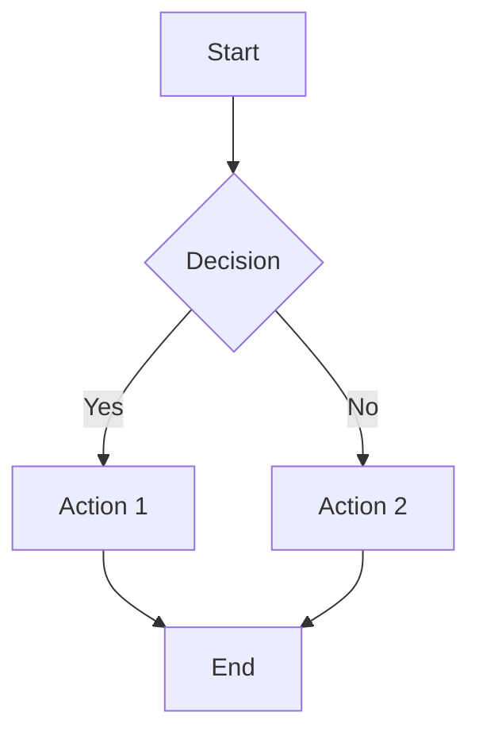
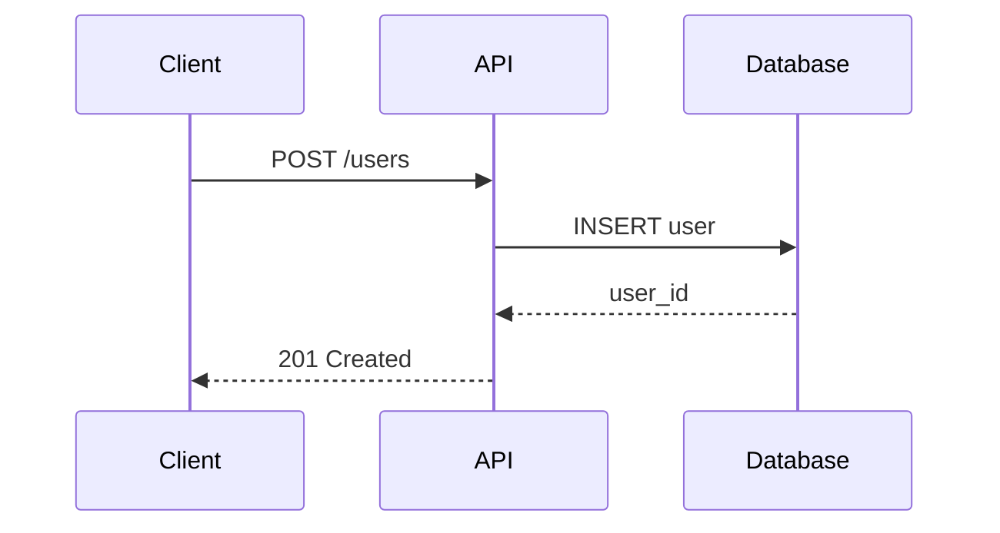
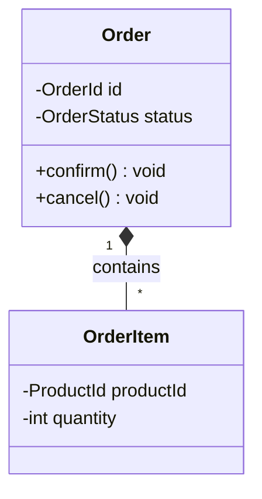
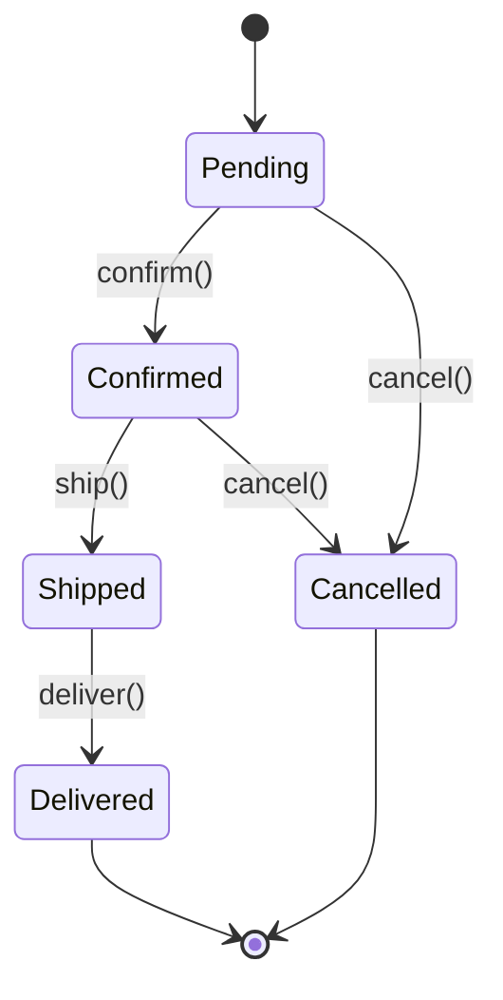
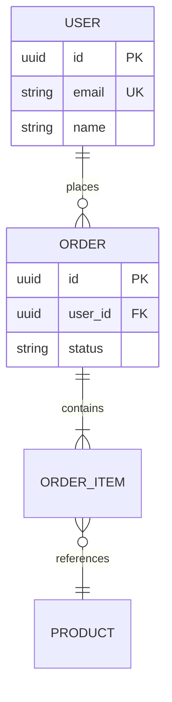
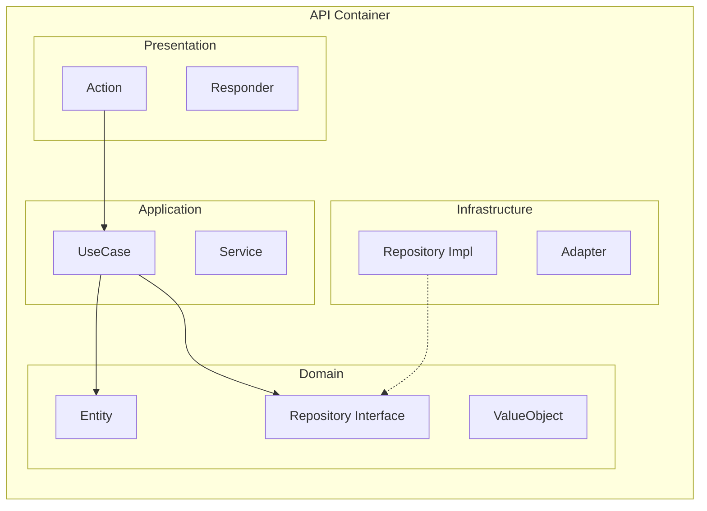
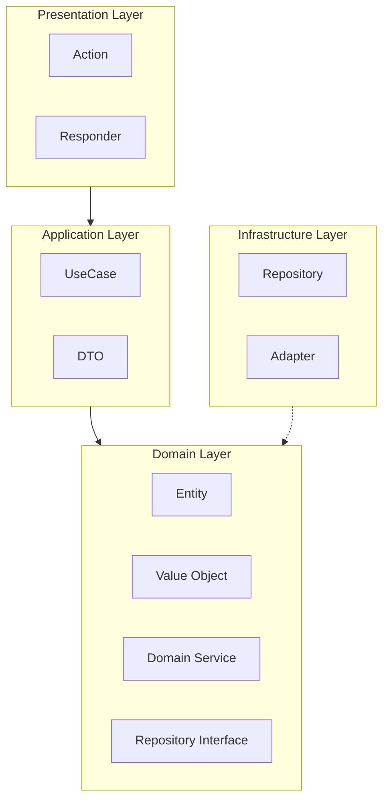
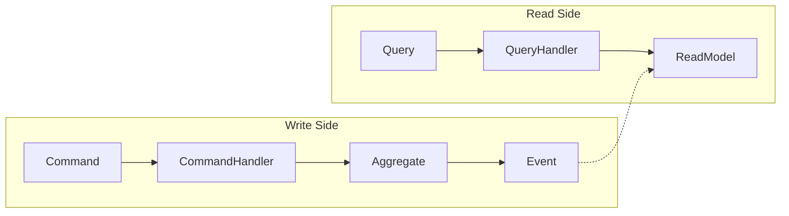

# Diagram Knowledge Base

Quick reference for technical diagrams, Mermaid syntax, and C4 model.

## Diagram Types Overview

| Type | Use Case | When to Use |
|------|----------|-------------|
| **C4 Context** | System boundaries | External actors, systems |
| **C4 Container** | Deployable units | Apps, databases, services |
| **C4 Component** | Internal structure | Classes, modules in container |
| **Sequence** | Interactions | Request flows, protocols |
| **Class** | Structure | Domain model, relationships |
| **ER** | Data | Database schema |
| **Flowchart** | Process | Algorithms, decisions |
| **State** | Lifecycle | Entity states, transitions |

## Mermaid Basics

### Flowchart



**Syntax:**
```
flowchart TD|TB|BT|LR|RL
    id[Rectangle]
    id(Rounded)
    id{Diamond}
    id([Stadium])
    id[[Subroutine]]
    id[(Database)]
    id((Circle))
```

### Sequence Diagram



**Syntax:**
```
->>   Solid arrow (sync)
-->>  Dashed arrow (async/response)
-)    Open arrow
--)   Dashed open arrow
Note right of A: Note text
loop Loop name
    actions
end
alt Condition
    actions
else Other
    actions
end
```

### Class Diagram



**Relationships:**
```
<|-- Inheritance
*--  Composition
o--  Aggregation
-->  Association
--   Link
..>  Dependency
..|> Implementation
```

### State Diagram



### ER Diagram



**Cardinality:**
```
||--|{  One to many
}|--|{  Many to many
||--||  One to one
||--o{  One to zero-or-many
```

## C4 Model

### Level 1: Context Diagram

Shows system and external actors.

```mermaid
flowchart TB
    subgraph boundary[System Boundary]
        S[("🖥️ E-Commerce System")]
    end

    U[("👤 Customer")]
    PS[("💳 Payment Service")]
    ES[("📧 Email Service")]

    U -->|"Browse, Order"| S
    S -->|"Process payment"| PS
    S -->|"Send notifications"| ES
```



### Level 2: Container Diagram

Shows deployable units.

```mermaid
flowchart TB
    subgraph boundary[E-Commerce System]
        WA[("🌐 Web App\nReact")]
        API[("⚙️ API\nPHP/Symfony")]
        DB[("🗄️ Database\nPostgreSQL")]
        CACHE[("💾 Cache\nRedis")]
        MQ[("📬 Queue\nRabbitMQ")]
    end

    WA -->|"REST/JSON"| API
    API -->|"SQL"| DB
    API -->|"Cache"| CACHE
    API -->|"Publish"| MQ
```



### Level 3: Component Diagram

Shows internal structure.



## Best Practices

### Diagram Guidelines

| Principle | Description | Example |
|-----------|-------------|---------|
| **7±2 Rule** | Max 5-9 elements | Aggregate related items |
| **Clear labels** | Descriptive names | "User Service" not "S1" |
| **Consistent style** | Same shapes = same type | Rectangles for services |
| **Flow direction** | Top-down or left-right | Pick one per diagram |
| **Context first** | Start high-level | C4 Context → Container |

### Naming Conventions

```markdown
✅ Good:
- "Payment Service" (descriptive)
- "PostgreSQL Database" (specific)
- "POST /orders" (action-based)

❌ Bad:
- "Service A" (meaningless)
- "DB" (ambiguous)
- "Process" (vague)
```

### Layout Tips

```markdown
# Top-down flow (recommended for hierarchies)
flowchart TD

# Left-right (recommended for timelines)
flowchart LR

# Subgraphs for grouping
subgraph name[Label]
    content
end

# Styling
style id fill:#f9f,stroke:#333
classDef className fill:#f9f
class id1,id2 className
```

## Common Antipatterns

| Antipattern | Problem | Fix |
|-------------|---------|-----|
| **Spaghetti** | Too many crossing lines | Reorder, use subgraphs |
| **Kitchen sink** | Everything in one diagram | Split by level/aspect |
| **Mystery meat** | Cryptic labels | Use full names |
| **Outdated** | Doesn't match code | Automate from code |
| **No legend** | Unknown symbols | Add legend/key |
| **Invisible boundaries** | Unclear scope | Add subgraphs |

## Tool Comparison

| Tool | Type | Best For | Pros | Cons |
|------|------|----------|------|------|
| **Mermaid** | Text-based | Documentation-as-code | Git-friendly, embeds in MD, live preview | Limited styling, complex layouts hard |
| **PlantUML** | Text-based | UML diagrams | Full UML support, more diagram types | Requires Java, slower rendering |
| **Draw.io** | GUI | Quick prototypes, business diagrams | Free, intuitive, many templates | Binary files, merge conflicts |
| **Excalidraw** | GUI | Sketches, whiteboarding | Hand-drawn style, collaborative | Less precise, limited exports |
| **Lucidchart** | GUI | Enterprise, presentations | Professional output, integrations | Paid, not text-based |

### Tool Selection Guide

| Scenario | Recommended Tool |
|----------|------------------|
| Code documentation (README, docs/) | Mermaid |
| Strict UML compliance required | PlantUML |
| Quick whiteboard session | Excalidraw |
| Stakeholder presentations | Draw.io or Lucidchart |
| CI/CD pipeline diagrams | Mermaid (auto-generate) |
| Living documentation (auto-update) | Mermaid + code generation |

### Tool Features Matrix

| Feature | Mermaid | PlantUML | Draw.io | Excalidraw |
|---------|---------|----------|---------|------------|
| Version control friendly | ✅ | ✅ | ❌ | ⚠️ JSON |
| GitHub/GitLab rendering | ✅ | ❌ | ❌ | ❌ |
| No install required | ✅ | ❌ | ✅ | ✅ |
| Offline support | ⚠️ | ✅ | ✅ | ✅ |
| C4 model support | ✅ | ✅ | Manual | Manual |
| Export to PNG/SVG | ✅ | ✅ | ✅ | ✅ |
| Real-time collaboration | ❌ | ❌ | ✅ | ✅ |

## Diagram Selection Guide

```
What are you documenting?
│
├─ System overview → C4 Context
│
├─ Deployment units → C4 Container
│
├─ Internal structure → C4 Component / Class
│
├─ Data flow
│  ├─ Request/Response → Sequence
│  └─ Data processing → Flowchart
│
├─ Data structure
│  ├─ Domain model → Class
│  └─ Database → ER
│
└─ Behavior
   ├─ State machine → State
   └─ Algorithm → Flowchart
```

## PHP-Specific Diagrams

### DDD Layers



### CQRS Pattern



## References

For detailed information, load these reference files:

- `references/mermaid-syntax.md` — Complete Mermaid syntax reference
- `references/c4-model.md` — C4 model detailed guide
- `references/sequence-patterns.md` — Common sequence diagram patterns
- `references/diagram-tools.md` — Tools and automation
