# Mermaid Diagram Template Generator

Generate Mermaid diagrams for technical documentation.

## Diagram Templates

### Flowchart - Basic

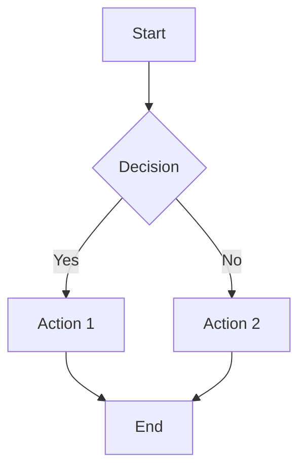

### Flowchart - Process

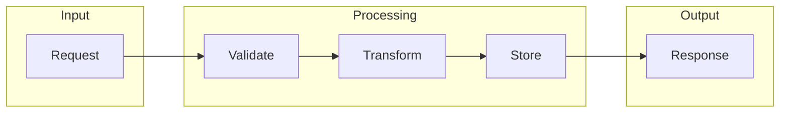

### Flowchart - Architecture Layers

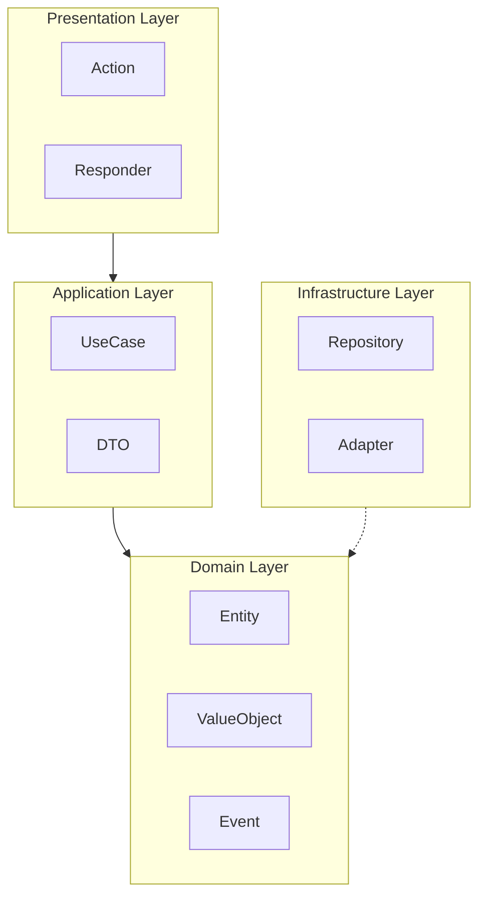

### Sequence - Basic

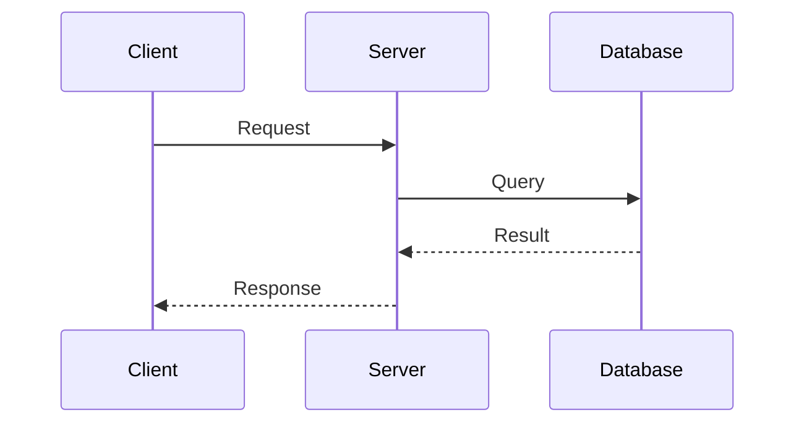

### Sequence - With Authentication

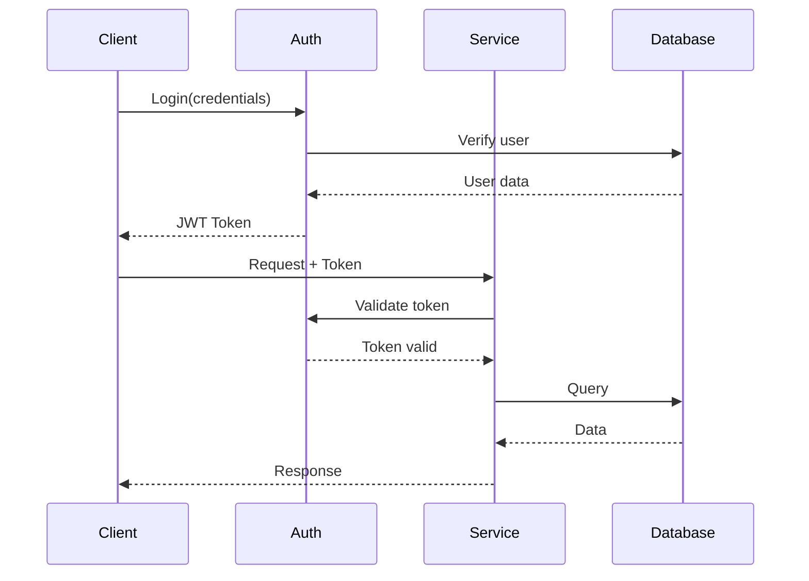

### Sequence - With Error Handling

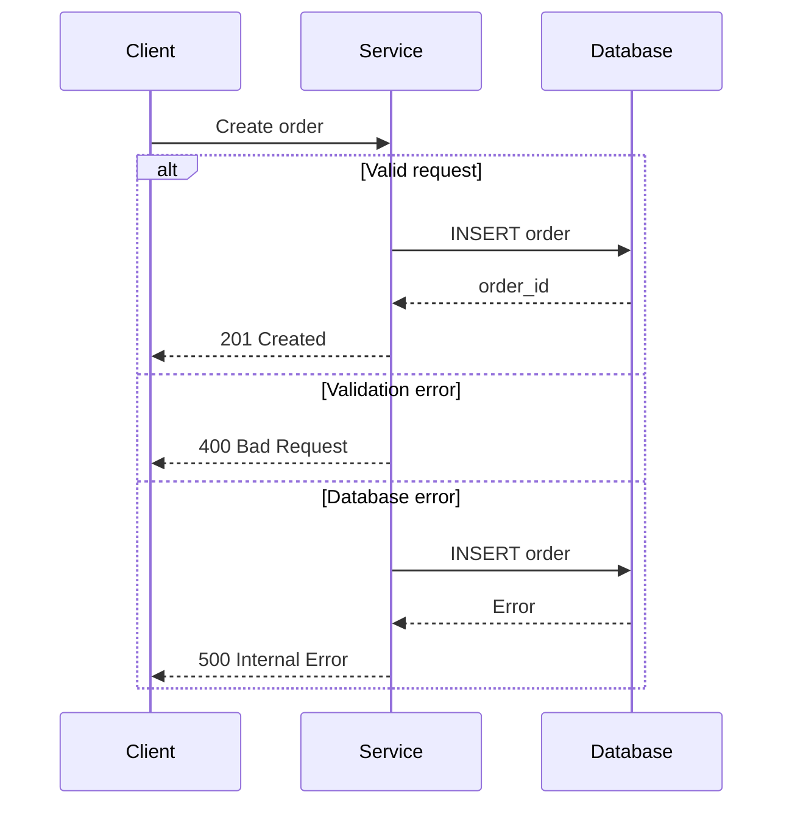

### Sequence - Async with Queue

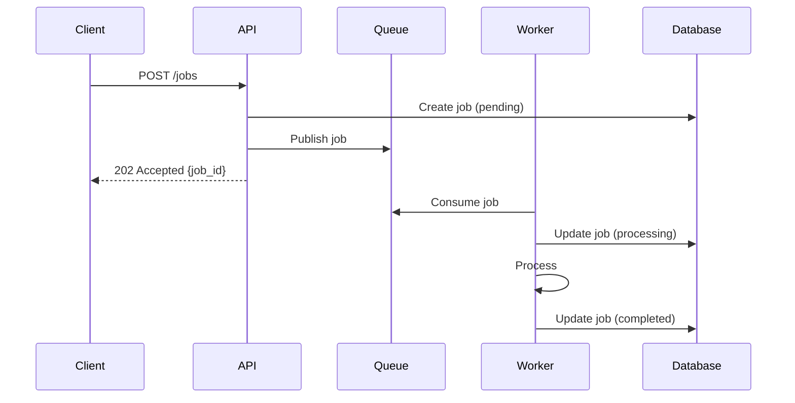

### Class - Domain Model

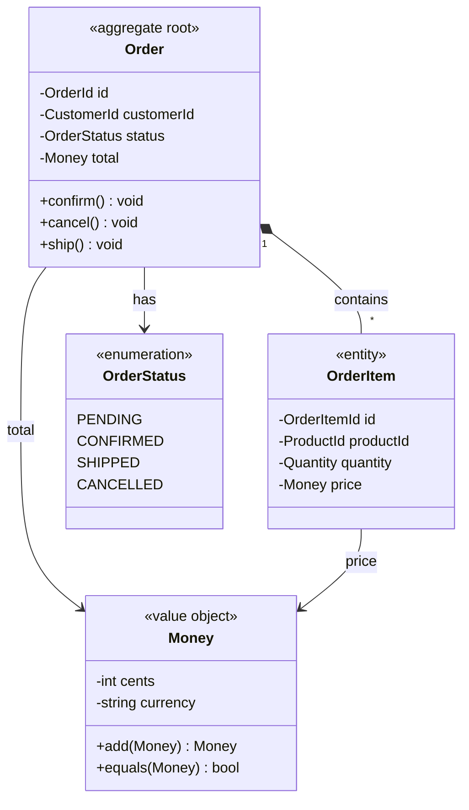

### Class - Repository Pattern

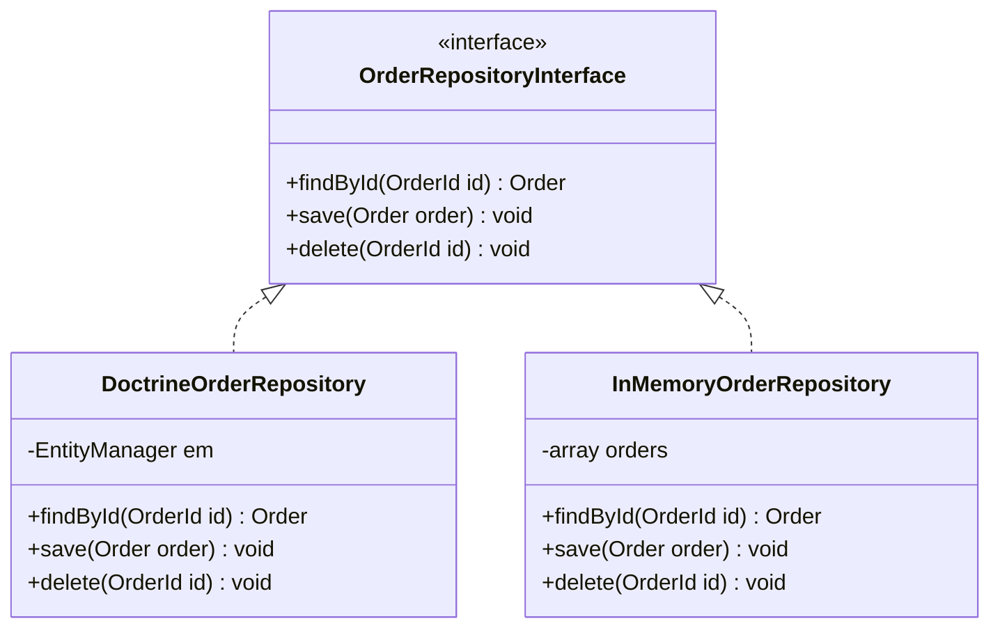

### ER - Database Schema

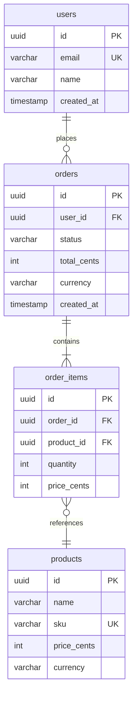

### State - Entity Lifecycle

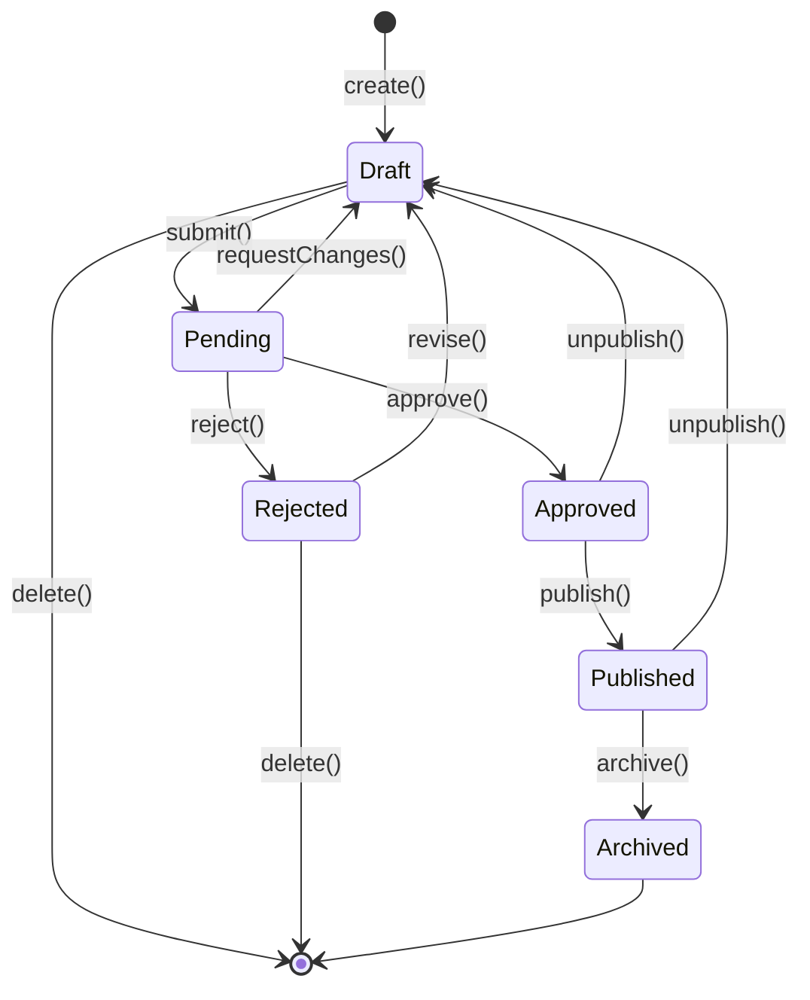

### C4 - Context Diagram

```mermaid
flowchart TB
    subgraph boundary[System Boundary]
        S[("📦 Order Management System\n\nManages customer orders\nand inventory")]
    end

    C[("👤 Customer\n\nPlaces and tracks orders")]
    A[("👤 Admin\n\nManages products\nand orders")]
    P[("💳 Payment Gateway\n\nProcesses payments")]
    E[("📧 Email Service\n\nSends notifications")]
    W[("🚚 Warehouse\n\nFulfills orders")]

    C -->|"Browse, Order, Track"| S
    A -->|"Manage"| S
    S -->|"Process payment"| P
    S -->|"Send emails"| E
    S -->|"Ship orders"| W
```

### C4 - Container Diagram

```mermaid
flowchart TB
    subgraph boundary[Order Management System]
        WA[("🌐 Web App\nReact SPA")]
        API[("⚙️ API\nPHP/Symfony")]
        WRK[("⚡ Worker\nPHP")]
        DB[("🗄️ Database\nPostgreSQL")]
        CACHE[("💾 Cache\nRedis")]
        Q[("📬 Queue\nRabbitMQ")]
    end

    C[("👤 Customer")]
    P[("💳 Payment")]
    E[("📧 Email")]

    C -->|"HTTPS"| WA
    WA -->|"REST/JSON"| API
    API -->|"SQL"| DB
    API -->|"Cache"| CACHE
    API -->|"Publish"| Q
    WRK -->|"Consume"| Q
    WRK -->|"SQL"| DB
    API -->|"HTTPS"| P
    WRK -->|"SMTP"| E
```

### CQRS Flow

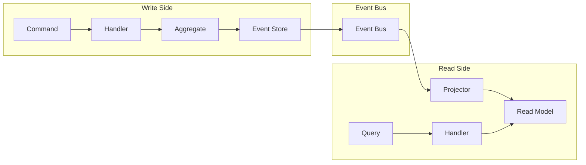

## Node Shapes Reference

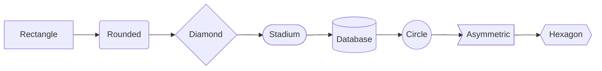

## Arrow Reference

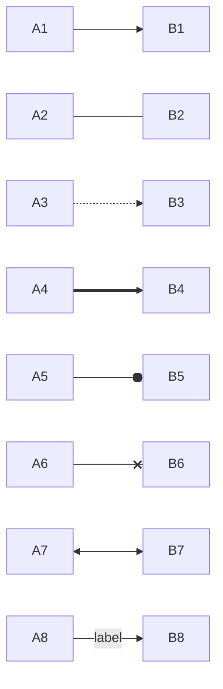

## Styling

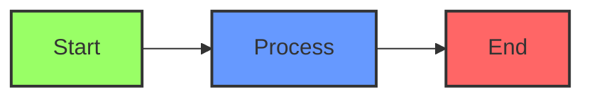

## Generation Instructions

When generating Mermaid diagrams:

1. **Choose appropriate type** based on what you're showing
2. **Limit to 7±2 elements** per diagram
3. **Use descriptive labels** (not A, B, C)
4. **Add subgraphs** for grouping
5. **Show direction** of flow/dependencies
6. **Include legend** if using custom styles
7. **Test rendering** before finalizing
