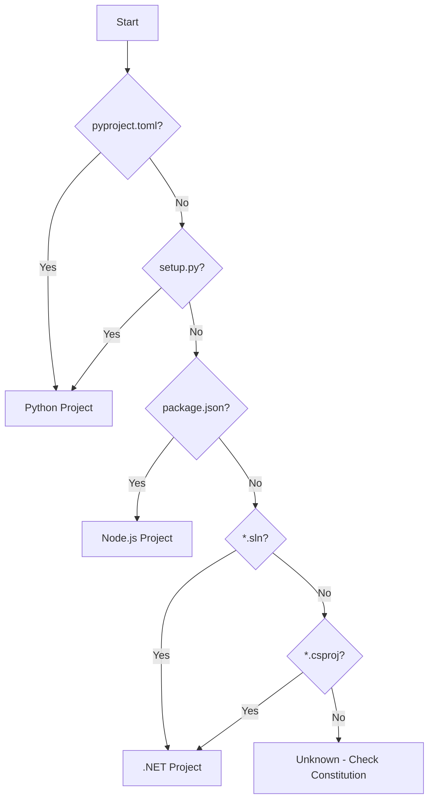

# agent-ops-build

Language-aware build orchestration skill that detects project language and runs the appropriate build pipeline.

## Purpose

Provide a unified build command that:
1. Auto-detects project language(s) from configuration files
2. Runs language-appropriate build stages
3. Reports findings in a consistent format
4. Integrates with agent-ops-baseline for comparison

## When to Use

- Running a full build pipeline
- Validating changes before commit
- Capturing baseline metrics
- When constitution lacks explicit build commands

## Detection Logic



## Language Detection

| Language | Indicators | Priority |
|----------|-----------|----------|
| Python | `pyproject.toml`, `setup.py`, `requirements.txt` | 1 |
| TypeScript/JS | `package.json`, `tsconfig.json` | 2 |
| C#/.NET | `*.sln`, `*.csproj` | 3 |

For mixed projects, run pipelines in priority order.

## Build Pipelines

### Python Pipeline

```
Stage 1: Dependencies  → uv sync / pip install
Stage 2: Format        → ruff format --check
Stage 3: Lint          → ruff check
Stage 4: Type Check    → mypy src/
Stage 5: Test          → pytest --cov
Stage 6: Coverage      → Check threshold
```

**Commands:**
```bash
uv sync
uv run ruff format --check .
uv run ruff check .
uv run mypy src/
uv run pytest --cov=src --cov-report=term-missing
```

### TypeScript/Node.js Pipeline

```
Stage 1: Dependencies  → npm ci / pnpm install
Stage 2: Format        → prettier --check
Stage 3: Lint          → eslint
Stage 4: Type Check    → tsc --noEmit
Stage 5: Test          → vitest run / jest
Stage 6: Coverage      → Check threshold
```

**Commands:**
```bash
pnpm install
pnpm run format:check
pnpm run lint
pnpm run typecheck
pnpm run test:coverage
```

### C#/.NET Pipeline

```
Stage 1: Dependencies  → dotnet restore
Stage 2: Format        → dotnet format --verify-no-changes
Stage 3: Build         → dotnet build -c Release
Stage 4: Test          → dotnet test --collect:"XPlat Code Coverage"
Stage 5: Coverage      → ReportGenerator (if available)
```

**Commands:**
```bash
dotnet restore
dotnet format --verify-no-changes
dotnet build -c Release --no-restore
dotnet test -c Release --no-build --collect:"XPlat Code Coverage"
```

## Workflow

### 1. Detection Phase

```
Detecting project type...
  ✓ Found pyproject.toml → Python
  ✓ Found package.json → Node.js
  
Detected: Python + Node.js (mixed project)
```

### 2. Configuration Phase

Check for existing configuration:
- Constitution commands (highest priority)
- Package manager detection (uv vs pip, pnpm vs npm)
- Tool configuration files (ruff.toml, eslint.config.js)

### 3. Execution Phase

Run each stage, stopping on first failure:

```
Python Build Pipeline
═════════════════════

[1/6] Dependencies
  $ uv sync
  ✓ Resolved 45 packages (2.1s)

[2/6] Format Check
  $ uv run ruff format --check .
  ✓ 23 files checked (0.3s)

[3/6] Lint
  $ uv run ruff check .
  ✓ 0 issues (0.4s)

[4/6] Type Check
  $ uv run mypy src/
  ✓ Success, no errors (1.2s)

[5/6] Tests
  $ uv run pytest --cov=src
  ✓ 45 passed (3.1s)

[6/6] Coverage
  ✓ 84.2% (threshold: 80%)

═════════════════════
✓ BUILD SUCCESSFUL
  Total time: 7.1s
```

### 4. Report Phase

Generate consistent output:

```markdown
## Build Report

**Project**: my-project
**Languages**: Python, Node.js
**Date**: 2024-01-15 10:30:00

### Python

| Stage | Status | Time | Notes |
|-------|--------|------|-------|
| Dependencies | ✓ | 2.1s | 45 packages |
| Format | ✓ | 0.3s | 23 files |
| Lint | ✓ | 0.4s | 0 issues |
| Type Check | ✓ | 1.2s | - |
| Tests | ✓ | 3.1s | 45 passed |
| Coverage | ✓ | - | 84.2% |

### Node.js

| Stage | Status | Time | Notes |
|-------|--------|------|-------|
| Dependencies | ✓ | 4.2s | 120 packages |
| Format | ✓ | 0.5s | - |
| Lint | ✓ | 1.1s | 0 warnings |
| Type Check | ✓ | 2.3s | - |
| Tests | ✓ | 5.2s | 78 passed |
| Coverage | ✓ | - | 72.1% |

### Summary

- **Status**: ✓ PASSED
- **Total Time**: 19.4s
- **Warnings**: 0
- **Errors**: 0
```

## Constitution Integration

If constitution.md has explicit commands, prefer those:

```markdown
# Constitution

## Commands
- **Build**: `make build`
- **Test**: `make test`
- **Lint**: `make lint`
```

The skill will use constitution commands over auto-detected ones.

## Baseline Integration

When `--baseline` flag is used or baseline.md exists:

1. Run build pipeline
2. Compare results to baseline
3. Report differences

```
Comparing to baseline (2024-01-14)...

| Metric | Baseline | Current | Change |
|--------|----------|---------|--------|
| Tests | 45 | 48 | +3 |
| Coverage | 82.1% | 84.2% | +2.1% |
| Lint | 0 | 0 | - |
| Type Errors | 0 | 0 | - |

✓ No regressions detected
```

## Options

| Option | Description | Default |
|--------|-------------|---------|
| `--language` | Force specific language | auto-detect |
| `--stage` | Run specific stage only | all |
| `--fix` | Auto-fix issues (format, lint) | false |
| `--baseline` | Compare to baseline | false |
| `--strict` | Fail on warnings | false |
| `--coverage-threshold` | Minimum coverage | from config |

## Error Handling

### Stage Failure

```
[3/6] Lint
  $ uv run ruff check .
  ✗ 3 issues found

  src/auth.py:45:1: E501 Line too long (120 > 100)
  src/users.py:12:5: F401 Unused import 'os'
  src/users.py:30:1: E302 Expected 2 blank lines

  Hint: Run with --fix to auto-fix 2 issues
  
═════════════════════
✗ BUILD FAILED at stage: Lint
```

### Missing Tools

```
[2/6] Format Check
  ⚠ ruff not found

  Hint: Install with 'uv add --dev ruff'
  Skipping format check...
```

## Examples

### Basic Build

```
Run the build pipeline
```

### Specific Language

```
Run Python build only
```

### With Auto-fix

```
Run build and fix any auto-fixable issues
```

### Compare to Baseline

```
Run build and compare to baseline
```

## Output Files

The skill can optionally output:

- `build-report.md` — Markdown report
- `build-report.json` — Machine-readable JSON
- Updates to `baseline.md` — If capturing new baseline

## Integration with Other Skills

| Skill | Integration |
|-------|-------------|
| `agent-ops-baseline` | Compare results, update baseline |
| `agent-ops-validation` | Pre-commit validation |
| `agent-ops-constitution` | Read custom commands |
| `agent-ops-recovery` | Handle build failures |

## Troubleshooting

### "No project detected"

Ensure you have one of:
- `pyproject.toml` / `setup.py` (Python)
- `package.json` (Node.js)
- `*.sln` / `*.csproj` (.NET)

Or add explicit commands to constitution.md.

### "Tool not found"

Install required tools:
- Python: `uv`, `ruff`, `mypy`, `pytest`
- Node.js: `pnpm`/`npm`, `eslint`, `prettier`
- .NET: `dotnet` CLI

### "Coverage below threshold"

Either:
1. Add more tests to increase coverage
2. Adjust threshold in configuration
3. Use `--coverage-threshold` to override
