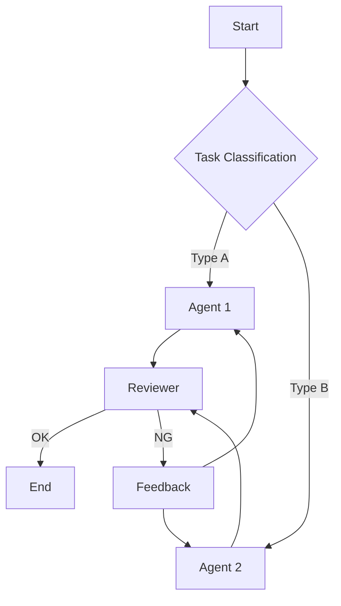

# Agentic Workflow Guide

A comprehensive guide for designing, reviewing, and improving agent workflows based on proven design principles.

## When to Use

- **New Workflow Design** - Define agent roles, responsibilities, and execution order
- **Workflow Review** - Detect issues by checking against design principles
- **Pattern Selection** - Choose the right workflow pattern for your task
- **Quality Improvement** - Iteratively refine workflows step by step
- **Scaffolding** - Generate workflow directory structures and templates
- **Long-Horizon Tasks** - Manage context for multi-hour agent sessions

## Core Principles

→ See **[references/design-principles.md](references/design-principles.md)** for details

| Tier                  | Principles                                                                  | Focus                      |
| --------------------- | --------------------------------------------------------------------------- | -------------------------- |
| **Tier 1: Essential** | SSOT, SRP, Simplicity First, Fail Fast, Iterative Refinement, Feedback Loop | Must-have for any workflow |
| **Tier 2: Quality**   | Transparency, Gate/Checkpoint, DRY, ISP, Idempotency                        | Recommended for production |
| **Tier 3: Scale**     | Human-in-the-Loop, KISS, Loose Coupling, Graceful Degradation               | Advanced patterns          |

**Anthropic's Key Insight:**

> "Start with simple prompts, optimize them with comprehensive evaluation, and add multi-step agentic systems only when simpler solutions fall short."

## Workflow Patterns

→ See **[references/workflow-patterns.md](references/workflow-patterns.md)** for details

### Pattern Selection Guide

```
What's the nature of the task?
├─ Sequential processing needed ──→ Prompt Chaining
├─ Multiple independent tasks ────→ Parallelization
├─ Dynamic task decomposition ────→ Orchestrator-Workers
├─ Until quality criteria met ────→ Evaluator-Optimizer
└─ Processing varies by input ────→ Routing
```

### Pattern Overview

| Pattern                  | Use Case                           | Iterative Level |
| ------------------------ | ---------------------------------- | --------------- |
| **Prompt Chaining**      | Sequential with validation         | ⭐⭐⭐          |
| **Routing**              | Classify → route to specialists    | ⭐⭐            |
| **Parallelization**      | Execute independent tasks together | ⭐⭐            |
| **Orchestrator-Workers** | Dynamic decomposition → workers    | ⭐⭐⭐          |
| **Evaluator-Optimizer**  | Generate → evaluate → improve loop | ⭐⭐⭐⭐⭐      |

## Design Workflow

### Step 1: Requirements Gathering

```markdown
## Workflow Design Interview

1. **Goal**: What do you want to achieve?
2. **Task Decomposition**: What subtasks can this be broken into?
3. **Dependencies**: Are there ordering dependencies between tasks?
4. **Parallelism**: Which tasks can run independently?
5. **Quality Criteria**: What defines success/failure?
6. **Error Handling**: How should failures be handled?
```

### Step 2: Pattern Selection

Choose the optimal pattern based on requirements:

| Condition                         | Recommended Pattern  |
| --------------------------------- | -------------------- |
| Tasks have clear ordering         | Prompt Chaining      |
| Tasks are independent             | Parallelization      |
| Number of tasks is dynamic        | Orchestrator-Workers |
| Repeat until quality criteria met | Evaluator-Optimizer  |
| Processing varies by input type   | Routing              |

### Step 3: Create Design Diagram

Visualize with Mermaid:



### Step 4: Principle Check

Validate design against principles (use review checklist)

### Step 5: Implement & Iterate

Build small → verify → get feedback → improve

## Review Checklist

→ See **[references/review-checklist.md](references/review-checklist.md)** for complete checklist (includes anti-patterns)

### Quick Check (5 items)

```markdown
- [ ] Is each agent focused on a single responsibility? (SRP)
- [ ] Can errors be detected and stopped immediately? (Fail Fast)
- [ ] Is it divided into small steps? (Iterative)
- [ ] Can results be verified at each step? (Feedback Loop)
- [ ] Are related files (references, scripts) simple and minimal? (DRY)
```

## Context Engineering

→ See **[references/context-engineering.md](references/context-engineering.md)** for details

For long-running agents, manage context as a finite resource:

| Technique                   | When to Use                            |
| --------------------------- | -------------------------------------- |
| **Compaction**              | Context window 70%+ full               |
| **Structured Note-taking**  | Multi-hour tasks with milestones       |
| **Sub-agent Architectures** | Complex research, parallel exploration |
| **Just-in-Time Retrieval**  | Large codebases, dynamic data          |

**Key Insight:**

> "Context must be treated as a finite resource with diminishing marginal returns." — Anthropic

## Scaffold Workflow

Automatically generate workflow directory structures.

### Usage

```bash
# Basic workflow
python scripts/scaffold_workflow.py my-workflow

# Specify pattern
python scripts/scaffold_workflow.py code-review --pattern evaluator-optimizer

# Specify output path
python scripts/scaffold_workflow.py data-pipeline --pattern orchestrator-workers --path ./projects

# List available patterns
python scripts/scaffold_workflow.py --list-patterns
```

### Available Patterns

| Pattern                | Description                    |
| ---------------------- | ------------------------------ |
| `basic`                | Basic workflow structure       |
| `prompt-chaining`      | Sequential processing pattern  |
| `parallelization`      | Parallel processing pattern    |
| `orchestrator-workers` | Orchestrator + workers pattern |
| `evaluator-optimizer`  | Evaluation-improvement loop    |
| `routing`              | Routing pattern                |

### Generated Structure

```
my-workflow/
├── Agent.md                    # Workflow overview & agent list
├── README.md                   # Usage guide
├── .github/
│   ├── copilot-instructions.md # GitHub Copilot instructions
│   └── instructions/           # File-pattern-specific rules
│       ├── workflow.instructions.md
│       ├── agents.instructions.md
│       └── prompts.instructions.md
├── agents/                     # Agent definitions
├── prompts/                    # Prompt templates
│   ├── system_prompt.md
│   ├── task_prompt.md
│   └── error_handling_prompt.md
├── docs/                       # Design documentation
│   ├── design.md
│   └── review_notes.md
└── config/                     # Configuration files
```

## Resources

| File                                                        | Content                            |
| ----------------------------------------------------------- | ---------------------------------- |
| [design-principles.md](references/design-principles.md)     | Design principles (Tier 1-3) + ACI |
| [workflow-patterns.md](references/workflow-patterns.md)     | 5 workflow patterns with examples  |
| [review-checklist.md](references/review-checklist.md)       | Full checklist + anti-patterns     |
| [context-engineering.md](references/context-engineering.md) | Context management for long tasks  |
| [scaffold_workflow.py](scripts/scaffold_workflow.py)        | Directory structure generator      |

## References

- [Building Effective Agents - Anthropic](https://www.anthropic.com/engineering/building-effective-agents)
- [Effective Context Engineering - Anthropic](https://www.anthropic.com/engineering/effective-context-engineering-for-ai-agents)
- [Writing Tools for Agents - Anthropic](https://www.anthropic.com/engineering/writing-tools-for-agents)
- [Prompt Engineering Tutorial - Anthropic](https://github.com/anthropics/prompt-eng-interactive-tutorial)
- [subagent-driven-development - obra/superpowers](https://github.com/obra/superpowers/tree/main/skills/subagent-driven-development)
- [dispatching-parallel-agents - obra/superpowers](https://github.com/obra/superpowers/tree/main/skills/dispatching-parallel-agents)
