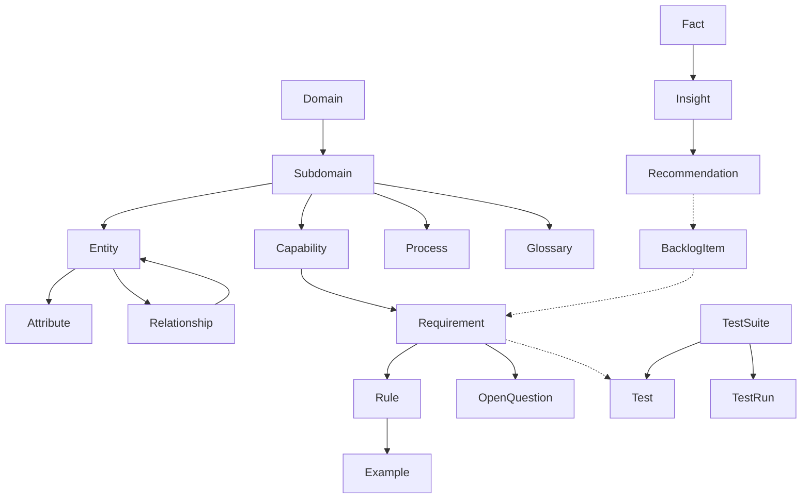

# PM Airtable Data Model

Reference for Airtable tables used by PM plugins.

## Entity Relationships

```mermaid
erDiagram
    Domain ||--o{ Subdomain : contains

    Subdomain ||--o{ Capability : contains
    Subdomain ||--o{ Entity : contains
    Subdomain ||--o{ Process : has
    Subdomain ||--o{ Glossary : has

    Entity ||--o{ Attribute : has
    Entity ||--o{ Relationship : from
    Entity ||--o{ Relationship : to

    Capability ||--o{ Requirement : has

    Requirement ||--o{ Rule : has
    Requirement ||--o{ OpenQuestion : has
    Requirement ||--o{ Test : inspires

    Rule ||--o{ Example : has

    TestSuite ||--o{ Test : contains
    TestSuite ||--o{ TestRun : executes

    Fact ||--o{ Insight : supports
    Insight ||--o{ Recommendation : leads-to
    Recommendation ||--o{ BacklogItem : becomes

    BacklogItem }o--o{ Requirement : links
```

## Hierarchy



## Tables Overview

| Table | Links To | Purpose |
|-------|----------|---------|
| Domain | - | Top-level areas |
| Subdomain | Domain | Sub-areas, has 3-letter prefix |
| Capability | Subdomain | Categorizes requirements, has 3-letter prefix |
| Entity | Subdomain | Domain objects |
| Attribute | Entity | Entity properties |
| Relationship | Entity, Entity | Entity-to-entity connections |
| Process | Subdomain | Business workflows |
| Glossary | Subdomain | Ubiquitous language |
| Requirement | Capability | BDD requirements (MoSCoW), ReqID: SUB-CAP-NNN |
| Rule | Requirement | Business rules |
| Example | Rule | Concrete examples |
| OpenQuestion | Requirement | Unresolved questions |
| TestSuite | - | Groups related tests |
| Test | TestSuite, Requirement | Individual test cases |
| TestRun | TestSuite | Execution record with results |
| Fact | - | Raw research observations |
| Insight | Fact[] | Patterns from facts |
| Recommendation | Insight[] | Actionable suggestions |
| BacklogItem | Requirement[], Recommendation | Prioritized work items |

For detailed field specifications, see [table-specs.md](references/table-specs.md).
