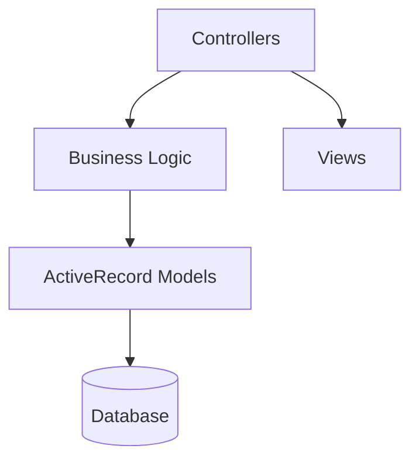

# Analyze Yii2 Project Workflow

## Purpose

Comprehensive workflow for analyzing legacy Yii2 projects to extract business logic, understand architecture, and plan modernization.

## When to Use

- ✅ User provides Yii2 codebase for analysis
- ✅ Planning Yii2 → NestJS/Modern framework migration
- ✅ Need to understand undocumented Yii2 project
- ✅ Extracting business requirements from Yii2 code
- ✅ Technical debt assessment of Yii2 application

## Prerequisites

### Infrastructure Check
```bash
codecompass health
```

**Verify**:
- ✅ Weaviate running (localhost:8081)
- ✅ Ollama running (localhost:11434)
- ✅ PostgreSQL running (localhost:5433)

### Project Requirements
- Yii2 project directory accessible
- `vendor/` directory present (run `composer install` if missing)
- Read permissions on all files

## Step-by-Step Workflow

### Phase 1: Initial Scan (Quick Overview)

**Step 1.1: Run Yii2 Analyzer**
```bash
codecompass analyze:yii2 <path-to-yii2-project>
```

**What this does**:
- Scans directory structure
- Detects Yii2 version
- Identifies conventions (controllers, models, views)
- Extracts routing patterns
- Maps database migrations

**Expected output**:
- Framework version
- Directory structure validation
- Controller/Model counts
- Migration history

**Step 1.2: Validate Results**
Check for:
- ❌ Missing `vendor/` → Run `composer install`
- ❌ Old Yii2 version (<2.0.40) → Check compatibility notes in `docs/YII2_QUICK_REFERENCE.md`
- ❌ Non-standard structure → May need manual configuration

### Phase 2: Business Capability Extraction

**Step 2.1: Extract Controllers → Capabilities**
```bash
# Analyzer automatically extracts business capabilities from controllers
```

**What this maps**:
```
Controller → Business Capability
├── UserController → User Management
├── OrderController → Order Processing
├── PaymentController → Payment Handling
└── ReportController → Reporting & Analytics
```

**Step 2.2: Extract Models → Domain Entities**
**Identifies**:
- ActiveRecord models → Database entities
- Validation rules → Business rules
- Relationships → Domain model connections

**Step 2.3: Extract Migrations → Data Model Evolution**
**Traces**:
- Schema changes over time
- Business logic embedded in migrations
- Data transformation patterns

### Phase 3: Dependency Analysis

**Step 3.1: Analyze Class Dependencies**
Uses: `AstAnalyzerService` for PHP parsing

**Maps**:
- Tight coupling (classes depending on many others)
- Circular dependencies (refactoring red flags)
- Inheritance hierarchies
- Service dependencies

**Step 3.2: Identify Core vs Supporting Logic**
**Categorizes**:
- **Core Domain**: Business-critical logic (preserve carefully)
- **Supporting**: Infrastructure, utilities (can be replaced)
- **Generic**: Framework boilerplate (discard in migration)

### Phase 4: Requirements Extraction

**Step 4.1: Run Requirements Extractor**
```bash
codecompass requirements:extract --project-id <yii2-project-id>
```

**Extracts**:
- Validation rules from models → Business constraints
- Controller actions → Use cases
- RBAC rules (if present) → Authorization requirements
- Database constraints → Data integrity rules

**Step 4.2: Generate Documentation**
**Outputs**:
- Business capability map (Markdown)
- Domain model diagram (Mermaid)
- Use case catalog
- Data dictionary

### Phase 5: Semantic Indexing (Optional but Recommended)

**Step 5.1: Index Codebase**
```bash
codecompass batch:index <path-to-yii2-project>
```

**Why**:
- Enables semantic search for "business logic for payment processing"
- Cross-file pattern discovery
- Similar code detection
- Natural language queries

**Step 5.2: Verify Indexing**
```bash
curl http://localhost:8081/v1/schema
# Check for CodeContext or AtlasCode collection
```

**Step 5.3: Test Semantic Search**
```bash
codecompass search:semantic "validation rules for customer registration"
```

Should return: User model validators, controller logic, related code

### Phase 6: Migration Planning

**Step 6.1: Identify Migration Complexity**
**Assess**:
- **Low complexity**: CRUD operations, standard patterns
- **Medium complexity**: Custom workflows, business rules
- **High complexity**: Legacy integrations, undocumented logic

**Step 6.2: Prioritize by Business Value**
**Map**:
```
Business Capability → Migration Priority
├── Core Revenue Generating → HIGH (do first, carefully)
├── Customer-Facing → MEDIUM (visible impact)
└── Internal Tools → LOW (can defer)
```

**Step 6.3: Generate Migration Roadmap**
**Structure**:
1. Infrastructure setup (NestJS, TypeORM, etc.)
2. Domain models (migrate ActiveRecords → TypeORM entities)
3. Core business logic (preserve carefully)
4. API layer (REST/GraphQL endpoints)
5. Background jobs (if using Yii2 queue)
6. Testing & validation

## Common Patterns to Look For

### Yii2 Controller Patterns
```php
// CRUD pattern
public function actionIndex() // → LIST endpoint
public function actionView($id) // → GET/:id endpoint
public function actionCreate() // → POST endpoint
public function actionUpdate($id) // → PUT/:id endpoint
public function actionDelete($id) // → DELETE/:id endpoint
```

**Maps to NestJS**:
```typescript
@Controller('users')
export class UsersController {
  @Get() findAll()
  @Get(':id') findOne()
  @Post() create()
  @Put(':id') update()
  @Delete(':id') remove()
}
```

### Yii2 Model Patterns
```php
// Validation rules
public function rules() {
  return [
    [['email'], 'required'],
    [['email'], 'email'],
  ];
}
```

**Maps to NestJS DTO**:
```typescript
export class CreateUserDto {
  @IsNotEmpty()
  @IsEmail()
  email: string;
}
```

### Yii2 Database Patterns
```php
// ActiveRecord query
$users = User::find()
  ->where(['status' => User::STATUS_ACTIVE])
  ->orderBy('created_at DESC')
  ->all();
```

**Maps to TypeORM**:
```typescript
const users = await this.userRepository.find({
  where: { status: UserStatus.ACTIVE },
  order: { createdAt: 'DESC' },
});
```

## Output Artifacts

### 1. Architecture Diagram (Mermaid)


### 2. Business Capability Map
```markdown
## Core Capabilities
- User Management (UserController, User model)
- Order Processing (OrderController, Order/OrderItem models)
- Payment Handling (PaymentController, Payment model)

## Supporting Capabilities
- Reporting (ReportController)
- Notifications (EmailService)
```

### 3. Migration Checklist
- [ ] Set up NestJS project structure
- [ ] Migrate database schema (Yii2 migrations → TypeORM migrations)
- [ ] Port models (ActiveRecord → TypeORM entities)
- [ ] Reimplement business logic (preserve rules!)
- [ ] Create API endpoints (REST/GraphQL)
- [ ] Port authentication/authorization
- [ ] Migrate background jobs
- [ ] Integration testing
- [ ] Performance testing
- [ ] Gradual rollout

## Common Issues & Solutions

### Issue 1: Cannot find controllers
**Symptom**: Analyzer reports 0 controllers
**Cause**: Non-standard directory structure
**Solution**: Check `@app` alias configuration in Yii2, adjust paths

### Issue 2: Missing database schema
**Symptom**: Cannot extract models properly
**Cause**: Database not accessible or migrations not run
**Solution**: Ensure database connection configured, run pending migrations

### Issue 3: Circular dependencies detected
**Symptom**: Dependency graph shows circular references
**Meaning**: Code smell - tight coupling between modules
**Action**: Plan refactoring to break cycles during migration

### Issue 4: Undocumented business rules
**Symptom**: Complex logic in controllers with no comments
**Action**:
1. Use semantic search to find similar patterns
2. Interview original developers if available
3. Write tests to capture behavior before migration
4. Document assumptions in requirements docs

## Best Practices

### ✅ Do
- Run full analysis before planning migration
- Extract ALL business rules (even implicit ones)
- Document assumptions and unknowns
- Test semantic search to validate indexing
- Create comprehensive capability map
- Prioritize by business value, not technical ease

### ❌ Don't
- Skip dependency analysis (will bite you later)
- Assume standard Yii2 patterns everywhere
- Ignore validation rules (they're business requirements!)
- Start coding before understanding full architecture
- Migrate everything at once (strangler fig pattern instead)

## Related Skills

- `extract-requirements.md` - For detailed requirements extraction
- `semantic-search.md` - For code exploration
- `software-architect.md` - For architecture perspective

## Related Modules

From `.ai/capabilities.json`:
- `yii2-analyzer` - Main analysis module
- `ast-analyzer` - PHP parsing
- `database-analyzer` - Schema extraction
- `requirements` - Business rules extraction
- `business-analyzer` - Capability mapping

---

**Remember**: The goal is not just to understand the code, but to preserve the business knowledge embedded in it.
