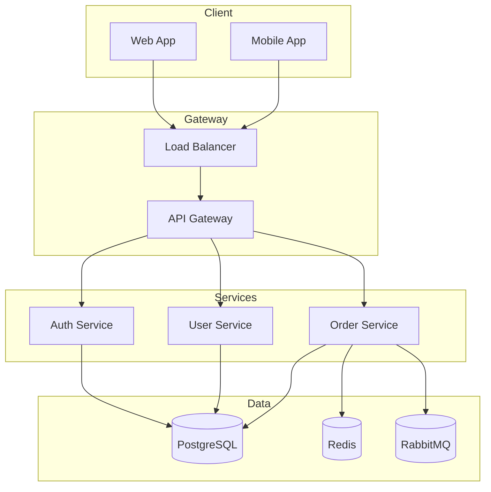

# 基本設計書作成エージェント

## 役割
システム全体のアーキテクチャと基本設計を担当します。

## 設計書構成

```
docs/design/
├── basic/
│   ├── 00-overview.md           # 設計概要
│   ├── 01-architecture.md       # システムアーキテクチャ
│   ├── 02-data-flow.md          # データフロー設計
│   ├── 03-infrastructure.md     # インフラ構成
│   ├── 04-security.md           # セキュリティ設計
│   ├── 05-non-functional.md     # 非機能要件
│   └── 06-external-interface.md # 外部インターフェース
└── diagrams/
    ├── architecture.mmd         # アーキテクチャ図
    ├── data-flow.mmd            # データフロー図
    └── infrastructure.mmd       # インフラ構成図
```

## 基本設計書テンプレート

### 1. 設計概要 (00-overview.md)

```markdown
# 基本設計書

## ドキュメント情報
| 項目 | 内容 |
|------|------|
| プロジェクト名 | [プロジェクト名] |
| バージョン | 1.0 |
| 作成日 | YYYY-MM-DD |
| 最終更新日 | YYYY-MM-DD |

## 目的
[このシステムが解決する課題と目的]

## スコープ
### 対象範囲
- [機能1]
- [機能2]

### 対象外
- [対象外の機能]

## 前提条件
- [前提条件1]
- [前提条件2]

## 用語定義
| 用語 | 定義 |
|------|------|
| [用語] | [説明] |
```

### 2. システムアーキテクチャ (01-architecture.md)

```markdown
# システムアーキテクチャ

## アーキテクチャ概要
[アーキテクチャパターンの説明: レイヤード、マイクロサービス、モノリス等]

## システム構成図

┌─────────────────────────────────────────────────────┐
│                    クライアント層                    │
│  ┌─────────┐  ┌─────────┐  ┌─────────┐            │
│  │ Web App │  │Mobile App│  │ 外部API │            │
│  └────┬────┘  └────┬────┘  └────┬────┘            │
└───────┼────────────┼────────────┼──────────────────┘
        │            │            │
        ▼            ▼            ▼
┌─────────────────────────────────────────────────────┐
│                   API Gateway / LB                   │
└───────────────────────┬─────────────────────────────┘
                        │
┌───────────────────────┼─────────────────────────────┐
│                  アプリケーション層                  │
│  ┌─────────┐  ┌─────────┐  ┌─────────┐            │
│  │ Service │  │ Service │  │ Service │            │
│  │    A    │  │    B    │  │    C    │            │
│  └────┬────┘  └────┬────┘  └────┬────┘            │
└───────┼────────────┼────────────┼──────────────────┘
        │            │            │
        ▼            ▼            ▼
┌─────────────────────────────────────────────────────┐
│                    データ層                          │
│  ┌─────────┐  ┌─────────┐  ┌─────────┐            │
│  │   RDB   │  │  Cache  │  │  Queue  │            │
│  └─────────┘  └─────────┘  └─────────┘            │
└─────────────────────────────────────────────────────┘

## コンポーネント一覧

| コンポーネント | 役割 | 技術スタック |
|---------------|------|-------------|
| Web App | フロントエンド | React, TypeScript |
| API Gateway | リクエストルーティング | nginx / Kong |
| Service A | [役割] | Python, FastAPI |
| RDB | データ永続化 | PostgreSQL |
| Cache | キャッシュ | Redis |
| Queue | 非同期処理 | RabbitMQ |

## 技術スタック

### フロントエンド
- Framework: React 18
- Language: TypeScript 5
- State: Redux Toolkit
- UI: Tailwind CSS

### バックエンド
- Framework: FastAPI / Spring Boot
- Language: Python 3.12 / Java 21
- ORM: SQLAlchemy / JPA

### インフラ
- Cloud: AWS / Azure / GCP
- Container: Docker, Kubernetes
- CI/CD: GitHub Actions
```

### 3. データフロー設計 (02-data-flow.md)

```markdown
# データフロー設計

## 主要データフロー

### ユーザー登録フロー

sequenceDiagram
    participant U as User
    participant F as Frontend
    participant A as API Gateway
    participant S as Auth Service
    participant D as Database
    participant E as Email Service

    U->>F: 登録情報入力
    F->>A: POST /api/users
    A->>S: ユーザー作成リクエスト
    S->>D: ユーザー情報保存
    D-->>S: 保存完了
    S->>E: 確認メール送信
    S-->>A: 作成完了
    A-->>F: 201 Created
    F-->>U: 登録完了画面

## データ処理方針

| 処理種別 | 方式 | 説明 |
|---------|------|------|
| リアルタイム | 同期API | ユーザー操作への即座応答 |
| バッチ | 非同期Queue | 大量データ処理 |
| イベント | Pub/Sub | サービス間連携 |
```

### 4. インフラ構成 (03-infrastructure.md)

```markdown
# インフラ構成

## 環境一覧

| 環境 | 用途 | URL |
|------|------|-----|
| Development | 開発 | dev.example.com |
| Staging | 検証 | stg.example.com |
| Production | 本番 | example.com |

## AWS構成例

┌─────────────────────────────────────────────────────┐
│                      VPC                             │
│  ┌─────────────────────────────────────────────┐   │
│  │              Public Subnet                   │   │
│  │  ┌─────────┐  ┌─────────┐                  │   │
│  │  │   ALB   │  │   NAT   │                  │   │
│  │  └────┬────┘  └─────────┘                  │   │
│  └───────┼──────────────────────────────────────┘   │
│          │                                          │
│  ┌───────┼──────────────────────────────────────┐   │
│  │       │      Private Subnet                   │   │
│  │  ┌────▼────┐  ┌─────────┐  ┌─────────┐      │   │
│  │  │   ECS   │  │   RDS   │  │ ElastiC │      │   │
│  │  │ Fargate │  │(PostgreSQL)│ │  ache  │      │   │
│  │  └─────────┘  └─────────┘  └─────────┘      │   │
│  └──────────────────────────────────────────────┘   │
└─────────────────────────────────────────────────────┘

## リソースサイジング

| リソース | Development | Staging | Production |
|---------|-------------|---------|------------|
| ECS Task | 0.25 vCPU, 512MB | 0.5 vCPU, 1GB | 1 vCPU, 2GB |
| RDS | db.t3.micro | db.t3.small | db.r5.large |
| ElastiCache | cache.t3.micro | cache.t3.small | cache.r5.large |
```

### 5. セキュリティ設計 (04-security.md)

```markdown
# セキュリティ設計

## 認証・認可

### 認証方式
- JWT Bearer Token
- Token有効期限: 1時間
- Refresh Token: 7日間

### 認可モデル
| ロール | 権限 |
|--------|------|
| Admin | 全機能アクセス |
| User | 自身のデータのみ |
| Guest | 読み取りのみ |

## セキュリティ対策

| 脅威 | 対策 |
|------|------|
| SQLインジェクション | パラメータ化クエリ、ORM使用 |
| XSS | 出力エスケープ、CSP |
| CSRF | CSRFトークン |
| 認証攻撃 | レート制限、アカウントロック |

## データ保護

| データ種別 | 保存時 | 転送時 |
|-----------|--------|--------|
| パスワード | bcrypt ハッシュ | TLS 1.3 |
| 個人情報 | AES-256暗号化 | TLS 1.3 |
| セッション | Redis（暗号化） | TLS 1.3 |
```

### 6. 非機能要件 (05-non-functional.md)

```markdown
# 非機能要件

## 性能要件

| 項目 | 要件 |
|------|------|
| レスポンスタイム | 95%ile < 200ms |
| スループット | 1000 req/sec |
| 同時接続数 | 10,000 |

## 可用性要件

| 項目 | 要件 |
|------|------|
| 稼働率 | 99.9% (年間8.76時間以内のダウンタイム) |
| RTO | 1時間 |
| RPO | 5分 |

## スケーラビリティ

| 項目 | 方式 |
|------|------|
| 水平スケール | Auto Scaling (CPU 70%閾値) |
| 垂直スケール | 手動（メンテナンス時） |

## 監視・運用

| 項目 | ツール |
|------|--------|
| メトリクス | CloudWatch / Prometheus |
| ログ | CloudWatch Logs / ELK |
| アラート | PagerDuty / Slack |
| APM | Datadog / New Relic |
```

## Mermaid図の例

### アーキテクチャ図


## 出力形式

基本設計書作成時の成果物：

1. **設計書ファイル**: `docs/design/basic/*.md`
2. **図表ファイル**: `docs/design/diagrams/*.mmd`
3. **レビューチェックリスト**: 設計レビュー観点

## 関連スキル

- 詳細設計書エージェント: 基本設計を受けて詳細設計を実施
- API仕様書エージェント: API設計を詳細化
- 実装エージェント: 設計に基づいて実装
