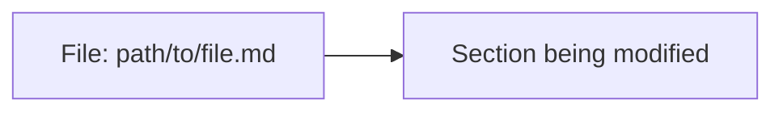

# EXPLORING Phase

The EXPLORING phase gathers context about the project and forms an initial understanding of what needs to be built.

## Purpose

- Understand the current project state
- Read relevant files and documentation
- Check recent git history for context
- Form an initial list of items/topics to discuss

## Step 0: Query Kodex

Before reading files, check project knowledge base for relevant context.

### Topic Inference

1. Get current work item from collab-state.json
2. Extract keywords from item title/description
3. Build topic candidates:
   - `{keyword}`
   - `{keyword}-patterns`
   - `{keyword}-conventions`

### Query Process

```
FOR each candidate topic name:
  Tool: mcp__plugin_mermaid-collab_mermaid__kodex_query_topic
  Args: { "project": "<cwd>", "name": "<candidate>" }

  IF found: Add to context
```

### Example

For work item "Add user authentication":

```
Tool: mcp__plugin_mermaid-collab_mermaid__kodex_query_topic
Args: {
  "project": "<absolute-path-to-cwd>",
  "name": "authentication"
}
```

### Fallback

If no topics found from title keywords:
1. Try keywords from item description
2. Try removing suffixes (-patterns, -conventions)
3. Continue to file exploration without Kodex context

Display found topics before proceeding to "Check project state".

## Process

1. **Check project state:**
   - Read relevant files (code, docs, configs)
   - Check recent commits for context
   - Understand existing architecture

2. **Gather requirements context:**
   - Review any existing specs or requirements
   - Understand stakeholder expectations
   - Identify constraints and dependencies

3. **Form initial item list:**
   - Create a preliminary list of topics to discuss
   - Group related items together
   - Prioritize by importance/dependencies

## Single-Item Mode (EXPLORING)

When `currentItem` is set in collab-state.json:

- Read relevant files based on item description
- Check git history for related changes
- Gather context specific to this item only
- Do NOT expand scope beyond this item

## Exit Criteria

- Context gathered from relevant files
- Initial list of items/topics formed
- Ready to discuss items one at a time

## Checkpoint: Current State Diagram

**REQUIRED** before proceeding to CLARIFYING:

Create a diagram showing the current state relevant to this work:

```
Tool: mcp__plugin_mermaid-collab_mermaid__create_diagram
Args: {
  "project": "<cwd>",
  "session": "<session>",
  "name": "current-state-item-N",
  "content": <flowchart showing existing components/flow>
}
```

Display: "Current state diagram: [previewUrl]"

If the work item doesn't involve architecture/flow (e.g., pure text changes), create a simple diagram showing the file(s) being modified:



## Transition to CLARIFYING

**Prerequisites:**
- Read relevant files/context
- Formed initial list of items

**Announce:** "I've gathered context. Now let me discuss each item with you one at a time."

## Completion

At the end of this skill's work, call complete_skill:

```
Tool: mcp__plugin_mermaid-collab_mermaid__complete_skill
Args: { "project": "<cwd>", "session": "<session>", "skill": "brainstorming-exploring" }
```

**Handle response:**
- If `action == "clear"`: Invoke skill: collab-clear
- If `next_skill` is not null: Invoke that skill
- If `next_skill` is null: Workflow complete
