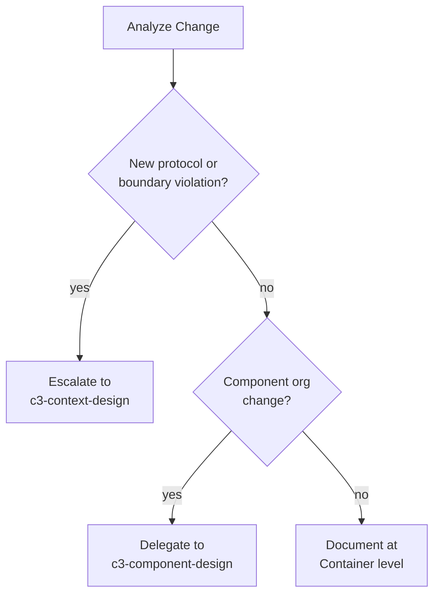

# C3 Container Level Exploration

## ⛔ CRITICAL GATE: Load Parent Context + Current Container First

> **STOP** - Before ANY container-level work, execute:
> ```bash
> # Load parent Context (REQUIRED - containers inherit from here)
> cat .c3/README.md 2>/dev/null || echo "NO_CONTEXT"
> 
> # Load current container (if exists)
> cat .c3/c3-{N}-*/README.md 2>/dev/null || echo "NO_CONTAINER_DOC"
> 
> # Load settings
> cat .c3/settings.yaml 2>/dev/null || echo "NO_SETTINGS"
> ```

**Based on output:**
- If "NO_CONTEXT" → **STOP.** Context must exist first. Escalate to c3-context-design.
- If container doc exists → Read it completely before proposing changes
- Extract from Context: boundary, protocols, actors, cross-cutting concerns for this container

**⚠️ DO NOT read ADRs** unless user specifically asks:
- Container work focuses on current structure, not historical decisions
- ADRs add unnecessary context → hallucination risk
- Only read: Context, this Container, sibling Containers (if coordination needed)

**Why this gate exists:** Containers INHERIT from Context. Proposing changes without understanding inherited constraints causes conflicts.

**Self-check before proceeding:**
- [ ] I executed the commands above
- [ ] I read parent Context doc
- [ ] I know what constraints this container inherits
- [ ] I read existing container doc (if exists)

---

## Overview

The Container level is the **architectural command center** of C3:
- **Full context awareness** from above (inherits from Context)
- **Complete control** over component responsibilities below
- **Mediator** for all interactions

**Position:** MIDDLE (c3-{N}) | Parent: Context (c3-0) | Children: Components (c3-{N}NN)

**📁 File Location:** Container is `.c3/c3-{N}-{slug}/README.md` - a folder with README inside.

**Announce:** "I'm using the c3-container-design skill to explore Container-level impact."

---

## The Principle

> **Upper layer defines WHAT. Lower layer implements HOW.**

At Container level:
- Context defines WHAT I am (my existence, my responsibility)
- I define WHAT components exist and WHAT they do
- Component implements my definitions (HOW it works)
- I do NOT define how components work internally - that's Component's job

**Integrity rules:**
- I must be listed in Context before I can exist
- Components cannot exist without being listed in my inventory

---

## Container Archetypes

| Archetype | Relationship | Typical Components |
|-----------|--------------|-------------------|
| **Service** | Creates/processes | Handlers, Services, Adapters |
| **Data** | Stores/structures | Schema, Indexes, Migrations |
| **Boundary** | Interface to external | Contract, Client, Fallback |
| **Platform** | Operates on containers | CI/CD, Deployment, Networking |

---

## Include/Exclude

| Include (Container Level) | Exclude (Push Up/Down) |
|---------------------------|------------------------|
| Component responsibilities | WHY container exists (Context) |
| Component relationships | HOW components work internally (Component) |
| Data flows between components | Code references |
| Business flows | File paths |
| Inner patterns | |

**Litmus test:** "Is this about WHAT components do and HOW they relate to each other?"

---

## Exploration Process

### Phase 1: Verify Inheritance

From loaded Context, extract for this container:
- **Boundary:** What can/cannot access
- **Protocols:** What we implement (provider/consumer)
- **Actors:** Who we serve
- **Cross-cutting:** Patterns we must follow (auth, logging, errors)

### Phase 2: Analyze Change Impact

| Direction | Action |
|-----------|--------|
| **Upstream** | New protocol/boundary violation → Escalate to c3-context-design |
| **Isolated** | Stack/pattern/API/org change → Document here |
| **Adjacent** | Component-to-component impact → Coordinate |
| **Downstream** | New/changed components → Delegate to c3-component-design |

### Phase 3: Socratic Discovery

**By archetype:**
- **Service:** Responsibility? Key components? Critical flows?
- **Data:** Engine/version? Schema? Access patterns?
- **Boundary:** Contract? Client? Fallback?
- **Platform:** Processes? Affected containers?

---

## Template

See `container-template.md` for complete structure with frontmatter, diagrams, and examples.

**Required sections:**
1. Inherited From Context
2. Overview
3. Technology Stack
4. Architecture - External Relationships (diagram + interface mapping table)
5. Architecture - Internal Structure (diagram with Foundation/Business layering)
6. Component Layering Rules
7. Components table
8. Key Flows

---

## Diagram Requirements

**Container level REQUIRES two diagrams:**

1. **External Relationships** - Shows connections to other containers/external systems
2. **Internal Structure** - Shows how components relate to each other

Use **Mermaid only** - no ASCII art.

---

## ⛔ Enforcement Harnesses

### Harness 1: Template Fidelity

**Rule:** Output MUST match template structure exactly.

**Required sections (in order):**
1. Frontmatter (id, c3-version, title, type, parent, summary)
2. Inherited From Context
3. Overview
4. Technology Stack
5. Architecture - External Relationships (diagram REQUIRED)
6. Architecture - Internal Structure (diagram REQUIRED)
7. Components
8. Key Flows

🚩 **Red Flags:**
- Sections missing or reordered
- Only one diagram (need BOTH)
- Missing "Inherited From Context" section

### Harness 2: Two Diagrams Required

**Rule:** Container docs MUST have both External and Internal diagrams.

```bash
# Verify both diagrams exist
grep -c '```mermaid' .c3/c3-{N}-*/README.md  # Should be >= 2
```

---

## Verification Checklist

Before claiming completion, execute:

```bash
# Verify container doc exists in correct location
ls .c3/c3-*-*/README.md

# Verify frontmatter
grep -E "^id:|^type:|^parent:" .c3/c3-{N}-*/README.md

# Verify BOTH mermaid diagrams exist
mermaid_count=$(grep -c '```mermaid' .c3/c3-{N}-*/README.md)
echo "Mermaid diagrams: $mermaid_count (need >= 2)"
```

- [ ] Critical gate executed (Context + current container loaded)
- [ ] Container is listed in Context's container inventory
- [ ] "Inherited From Context" section populated from parent
- [ ] Template sections present in correct order
- [ ] BOTH diagrams included (External + Internal)
- [ ] Components listed with responsibilities
- [ ] Downstream delegation identified (c3-component-design)

---

## 📚 Reading Chain Output

**At the end of container work, output a reading chain for components and related containers.**

Format:
```
## 📚 To Go Deeper

This container (c3-N) contains:

**Components to explore:**
├─ c3-N01-{slug} - [responsibility, why it matters]
├─ c3-N02-{slug} - [responsibility, why it matters]
└─ ...

**Parent (inherited constraints):**
└─ c3-0 (Context) - [what this container inherits]

**Sibling containers (if coordination needed):**
└─ c3-M-{slug} - [why coordination matters]

*Reading chain generated from components listed in this Container.*
```

**Rules:**
- List components from the Container's inventory
- Highlight which components are affected by this change
- Include parent Context for constraint reference
- Never include ADRs unless user asked

---

## Change Impact Decision



---

## Common Rationalizations

| Excuse | Reality |
|--------|---------|
| "One diagram is enough" | External + Internal are BOTH required. Different purposes. |
| "I'll add diagrams later" | Diagrams drive understanding. Add during exploration, not after. |
| "Template too rigid" | Template is minimum. Add sections if needed, but don't skip required ones. |
| "This container is simple" | Simple containers still need both diagrams. Just smaller diagrams. |
| "Inherited section is obvious" | Make inheritance explicit. What's obvious to you isn't to readers. |
| "Layering doesn't apply here" | All containers have Foundation → Business layering. Show it. |

---

## Common Mistakes

| Mistake | Fix |
|---------|-----|
| **Missing External Relationships diagram** | REQUIRED. Maps Context interfaces to owning components. |
| **Missing Internal Structure diagram** | REQUIRED. Shows Foundation → Business layering. |
| **Not mapping interfaces to components** | Add table: External Interface \| Owning Component \| Protocol |
| **Duplicating Context content** | Reference Context, don't repeat. Show component ownership. |
| **Skipping layering rules** | Always include Foundation/Business rules table. |

---

## Related

- `references/core-principle.md` - The C3 principle
- `defaults.md` - Container layer rules
- `references/container-archetypes.md` - Container types
- `references/diagram-decision-framework.md` - When to use which diagram
