# Card

> **Portable tokens of capability, identity, and access.**

Cards are templates. Put them "in play" in a [room](../room/) to activate them.

> [!TIP]
> **Hero-stories.** Actors. Safe pointers to wisdom. No risks of impersonation, just tribute, storytelling, skill sharing and composing.

---

## 📑 Index

**Architecture**
- [Card Architecture](#card-architecture) — The most important section!
- [Recommended Section Order](#recommended-section-order)
- [What Goes Where](#what-goes-where)
- [Advertisements Before Methods](#advertisements-before-methods)
- [Method Placement Rules](#method-placement-rules)

**Card Types**
- [What's a Card?](#whats-a-card)
- [Sidecar Pattern](#sidecar-cardyml-pattern)
- [Card Types](#card-types)

**Mechanics**
- [Activation Records](#activation-records)
- [Card State](#card-state)
- [Collections](#collections)

---

## Card Architecture

> **KEY INSIGHT: Cards are ACTIVATION TRIGGERS, not activation handlers.**

This is the most important concept in MOOLLM card design.

### The Fundamental Distinction

| | CARD.yml | SKILL.md |
|--|----------|----------|
| **Purpose** | Decide IF this skill applies | Explain HOW to execute |
| **Role** | Activation trigger | Activation handler |
| **Content** | Sniffable interface | Full documentation |
| **Size** | ~150-200 lines | As needed |
| **LLM reads** | First, to decide | Second, if activated |

The CARD asks: "Does this situation call for me?"
The SKILL.md answers: "Here's how to actually do it."

### Recommended Section Order

Order sections for optimal LLM scanning:

```yaml
# 1. Identity (who am I?)
card:
  id: my-skill
  name: "My Skill"
  emoji: 🎯
  tagline: "One-line pitch"
  description: "Brief paragraph"

# 2. Files index (what else should LLM read?)
files:
  - SKILL.md
  - examples/

# 3. K-lines (what concepts does this activate?)
k-lines:
  activates: [MY-SKILL, RELATED-CONCEPT]

# 4. Invoke when (trigger conditions)
invoke_when:
  - "Situation that calls for this skill"

# 5. ADVERTISEMENTS — PRIMARY! Put BEFORE methods!
advertisements:
  DO-THE-THING:
    score: 90
    condition: "When this applies"

# 6. Methods (signatures only, implementations in SKILL.md)
methods:
  DO-THING: { signature: "DO-THING [arg]" }

# 7. State (brief field list)
state:
  fields: [field1, field2]

# 8. Documentation pointers
documentation:
  SKILL.md:
    - "§ Detailed section"
```

### Why Advertisements Before Methods?

Advertisements are the **PRIMARY activation signal**:

1. LLM scans top-down looking for "does this apply?"
2. Ads answer that question directly
3. Methods are secondary — only relevant AFTER activation
4. Front-loading ads speeds up skill selection

```yaml
# GOOD — Ads first
advertisements:
  PET-THE-CAT:
    score: 80
    condition: "Cat is present"
    
methods:
  PAT: { signature: "PAT [cat]" }

# BAD — Methods first (LLM has to read past them)
methods:
  PAT: { ... long list ... }
  SCRITCH: { ... }
  # ... many more ...
  
advertisements:  # Too late! LLM already moved on
```

### What Goes Where

#### In CARD.yml (sniffable interface)

```yaml
# YES — Include these
- Brief description + tagline
- Files index (for one-shot activation)
- K-lines (activation vectors)
- Advertisements (PRIMARY!)
- Method SIGNATURES (one-liners)
- Brief state schema (field names only)
- Documentation pointers

# NO — Move these to SKILL.md
- Implementation details
- Detailed protocols with sequences
- Dispatch tables
- Dialogue examples
- Full state schemas with types
- Worked examples
```

#### In SKILL.md (full documentation)

```markdown
- ## 📑 Index (link to each section)
- Detailed method implementations
- Protocols with step sequences
- Dispatch tables (actor_verb_target)
- State schemas with types and defaults
- Integration points with other skills
- Mechanics explanations
```

#### In examples/ (worked examples)

```yaml
# Separate files with descriptive names
examples/
  ceremony-invocation.yml    # Good!
  buff-chain-trigger.yml     # Good!
  example1.yml               # Bad — not descriptive
```

### Method Placement Rules

| Situation | Place In | Example |
|-----------|----------|---------|
| Short signature | CARD methods | `PAT: { signature: "PAT [cat]" }` |
| Trivial inline | Advertisement | `method: "PAT [nearest-pet]"` |
| Detailed protocol | SKILL.md | Dispatch tables, sequences |
| Multiple variants | SKILL.md | Species-specific versions |
| Dispatch table | SKILL.md | `cat_sniffs_dog`, etc. |

#### Embed in CARD when:
- Method is SHORT (one-liner signature)
- Method is UNIQUE to this skill
- Just showing signature, not implementation

#### Embed in advertisement when:
- Method is TRIVIAL (buff, reply, simple prompt)
- Method is AD-SPECIFIC (only makes sense in this trigger)

#### Delegate to SKILL.md when:
- Method has DETAILED protocol (sequences, tables)
- Method is SHARED with other skills
- Method has multiple VARIANTS
- Method needs EXAMPLES to understand

### Target Card Size

```yaml
card_yml: ~150-200 lines
skill_md: As long as needed, but indexed
examples:  Separate files, descriptively named

smell: "If CARD > 300 lines, refactor"
```

---

## What's a Card?

Cards are **portable tokens** you can carry, give, play, and activate.

### The Card Intersection

CARD.yml sits at the intersection of *many* card traditions, each contributing essential meaning:

| Tradition | What It Contributes | In CARD.yml |
|-----------|---------------------|-------------|
| **PC Board Card** | Slot/interface — plugs into a system | Cards plug into rooms, skills, activations |
| **HyperCard** | Navigable unit of content | Each card is a stack, browsable, clickable |
| **Playing Cards** | Combinable, playable, deckable | Cards compose into decks, hands, plays |
| **Magic: The Gathering** | Abilities, costs, types, combos | Methods, state, synergies, triggered effects |
| **Pokémon** | Creatures with stats, evolution | Characters with sims_traits, mind_mirror, growth |
| **Fluxx** | Cards that change the rules | Meta-cards that modify the game itself |
| **Tarot** | Archetypal symbols, prompts | K-lines as archetypal activation |
| **Business Cards** | Contact, credentials, intro | Hero-Story cards introduce traditions |
| **Key Cards** | Access tokens | Room access, capability gates |
| **Hollerith Cards** | Data as physical artifact | YAML as punchable, portable data |

**The genius is the layering.** When you create a CARD.yml, you're creating:

- An **interface slot** (PC board) that plugs into the MOOLLM system
- A **navigable document** (HyperCard) that LLMs can browse and activate
- A **playable piece** (playing card) that can be dealt, held, played
- A **creature with abilities** (MTG/Pokémon) that has stats and moves
- A **rule modifier** (Fluxx) that can change the game
- An **archetypal pointer** (Tarot/K-line) that invokes patterns
- An **access token** (key card) that grants capabilities

All at once. Different contexts activate different metaphors.

### Card Examples by Tradition

| Type | Examples |
|------|----------|
| **Trading cards** | Hero-Story cards for real people's traditions |
| **Playing cards** | Actions, abilities, spells to play |
| **Magic: The Gathering** | Complex cards with costs, effects, combos |
| **Pokémon cards** | Characters with stats, moves, evolution |
| **Fluxx cards** | Rule-changing cards — play to modify the game itself |
| **Tarot cards** | Archetypal symbols, prompts for reflection |
| **Business cards** | Contact info, credentials, introductions |
| **Pleasure cards** | Memberships, VIP access, perks |
| **Key cards** | Access tokens for rooms and resources |
| **Receipts** | Proof of transaction, claim tickets |
| **Tickets** | Entry passes, reservations, permissions |
| **Coupons** | Redeemable capabilities, discounts |
| **Hollerith cards** | Punch cards — data as physical holes! |
| **QR codes** | Scannable data, links, actions |
| **Wallet cards** | Apple/Google Pay — phone as card carrier |

A card is anything you can **carry in your inventory** and **play when needed**.

---

## Sidecar CARD.yml Pattern

Any entity that lives in a directory can have a **sidecar `CARD.yml`** file that makes it card-playable:

```
pub/
├── ROOM.yml           # The room definition
├── CARD.yml           # Makes the pub a playable card!
└── ...

characters/don-hopkins/
├── CHARACTER.yml      # Character definition
├── CARD.yml           # Don's trading card representation
└── ...

objects/magic-lamp/
├── OBJECT.yml         # Lamp definition
├── CARD.yml           # Card for summoning/playing the lamp
└── ...
```

### Why Sidecars?

- **Separation of concerns** — Entity definition vs. card representation
- **Optional** — Not everything needs to be a card
- **Composable** — Same entity, multiple views
- **Portable** — Card data can reference the entity by path

### Sidecar Card Schema

```yaml
# pub/CARD.yml — makes the pub a playable card
card:
  for: ./ROOM.yml           # What this card represents
  type: location-card       # Card type
  
  # Card-specific presentation
  name: "Gezelligheid Grotto"
  art: "cozy-coffeeshop.png"
  flavor: "Where good vibes flow like espresso"
  
  # What playing this card does
  advertisements:
    VISIT:
      description: "Teleport party to this location"
      effect: "Set party.location = pub/"
      
    SUMMON:
      description: "Bring the pub's vibe to current room"
      effect: "Apply pub buffs to current location"
```

### Character Cards

Characters automatically become tradeable/playable:

```yaml
# characters/don-hopkins/CARD.yml
card:
  for: ./CHARACTER.yml
  type: hero-story        # Real person tradition
  
  # K-line activation
  tradition: "HyperCard, SimCity, OLPC, procedural rhetoric, Maxis"
  concepts:
    - pie_menus
    - constructionist_games
    - micropolis
    
  # Playing the card
  summon: |
    Activate Don's documented ideas:
    - Pie menu interaction patterns
    - Constructionist game design
    - Urban simulation philosophy
```

---

## The Big Idea

```mermaid
graph TD
    C[📇 Card Template] -->|clone + parameterize| I[🎴 Instance in Room]
    I -->|has| S[State: goals, vars, stack]
    I -->|lives in| R[🚪 Room]
    R -->|can hold| M[Multiple instances]
```



A **card** is a capability template — a tool, character, function, familiar, key, receipt.

A **card in play** is an instance with:
- Local variables
- Parameters
- Goal stack (what it's trying to do)
- Return value (when done)
- Room it lives in

You can have **multiple activations** of the same card, in the same or different rooms. They're independent task instances.

---

## Activation Records

> **Full specification:** [ACTIVATION.md](./ACTIVATION.md)

**Playing a card = creating an activation record** — an instantiated method with persistent state.

| Concept | Description |
|---------|-------------|
| **Multiple methods** | Cards have any number of methods (like Self objects) |
| **Implicit params** | LLM infers parameters from context (POSTEL) |
| **Pure state cards** | Cards can be just state, no methods |
| **Activation lifecycle** | pending → in_progress → completed |
| **Advertisements** | Activations expose buttons others can press |
| **Room participation** | Rooms can press buttons on cards in play |
| **Cross-card interaction** | Cards trigger each other's methods |

**The Sims meets Magic: The Gathering** — autonomous agents with triggered abilities.

---

## Fluxx Cards: Rules That Change Rules

> **Full specification:** [FLUXX.md](./FLUXX.md)

Inspired by [Fluxx](https://en.wikipedia.org/wiki/Fluxx), some cards **modify the game itself**.

| Feature | Description |
|---------|-------------|
| **Rule modification** | Cards can change room.rules on play |
| **Stacking** | Multiple Fluxx cards stack effects |
| **Meta-Fluxx** | Rules about rules (prevent further changes) |
| **Dispel** | Cards can advertise removal actions |

Fluxx cards make MOOLLM a **self-modifying game**.

---

## Data Flow Ensembles

> **Full specification:** [ENSEMBLES.md](./ENSEMBLES.md)

Cards can contain **coordinated ensembles** of generators, transformers, and consumers.

| Feature | Description |
|---------|-------------|
| **POSTEL binding** | Components self-wire by compatible inputs/outputs |
| **Factorio-style** | Queues with capacity, overflow, backpressure |
| **Natural language** | Describe wiring in plain English |
| **Orchestration** | Card tracks ensemble health and bottlenecks |

**Factorio meets Dataflow meets Natural Language** — pipelines assembled by intent.

---

## Cards Advertise

Just like [objects in rooms](../advertisement/), cards **advertise what they can do**:

```yaml
# Git Goblin card
advertisements:
  - action: BISECT
    description: "Binary search for bug introduction"
    score_if: "debugging AND has_git_repo"
    score: 90
    
  - action: BLAME
    description: "Find who changed this line"  
    score_if: "examining_code"
    score: 70
    
  - action: LOG
    description: "Show commit history"
    score: 50
```

**In inventory:** Advertisements visible but lower priority.

**Played in room:** Card's advertisements merge with room objects. Best action wins regardless of source.

**Multiple cards:** All advertisements compete. The right tool for the moment rises to top.

---

## Why K-Lines Are Safe

> [!IMPORTANT]
> **Cards for real people don't need proxy abstractions.**

A "Dave Ungar" card doesn't impersonate Dave Ungar. It **activates the tradition**:
- Self language, prototype-based inheritance
- "It's About Time" compilation philosophy
- Message-not-class thinking

This is like citing someone's work, not pretending to be them.

```yaml
card:
  name: "Dave Ungar"
  type: person
  # NOT impersonation — K-line activation
  
  invokes:
    - "Self language"
    - "Prototype-based inheritance"
    - "ITS-ABOUT-TIME compilation"
    - "Message-passing purity"
    
  wisdom: |
    "Programming should be about the experience
    of programming, not fighting the language."
```

When you "play" this card, you invoke the tradition — not simulate the person.

---

## Card Types

| Type | What It Is | Examples |
|------|------------|----------|
| `person` | Real human's wisdom | Dave Ungar, Seymour Papert |
| `character` | Fictional persona | The Gardener, The Archivist |
| `tool` | A capability | fs.read, search.vector |
| `function` | A procedure | summarize, repair |
| `familiar` | Helper spirit | Git Goblin 🧌, Index Owl 🦉 |
| `concept` | An idea | POSTEL, YAML-JAZZ |
| `place` | A location link | kernel/, skills/ |

---

## Card Anatomy

### Hero-Story (Real Person)

```yaml
card:
  name: "Dave Ungar"
  type: person
  
  # K-line activation — what tradition this invokes
  invokes:
    - "Self language"
    - "Prototype-based inheritance"
    - "ITS-ABOUT-TIME compilation"
    - "Message-not-class thinking"
    
  wisdom: |
    "Programming should be about the experience
    of programming, not fighting the language."
    
  contributions:
    - "Self programming language"
    - "Morphic UI framework"
    - "Optimistic compilation"
    
  stats:
    wisdom: 10
    influence: 9
    domain_expertise: ["languages", "VMs", "UI"]
```

### Familiar (Tool Spirit Animal)

```yaml
card:
  name: "Git Goblin"
  type: familiar
  emoji: "🧌"
  enthralled_by: "Linus Torvalds" # My master (I mean main)!
  
  abilities:
    - "Track changes"
    - "Commit with message"
    - "Navigate history"
    
  parameters:
    repo_path: { type: string, required: true }
    
  stats:
    power: 7
    reliability: 9
    learning_curve: 4
    
  synergizes_with:
    - "Session Log"
    - "Plan Then Execute"
```

---

## Putting Cards in Play

When you **activate** a card in a room:

```yaml
# Instance in room: .agent/rooms/debug-session/

activation:
  card: "Git Goblin"
  instance_id: "goblin-001"
  room: ".agent/rooms/debug-session/"
  
  # Instance-specific state
  parameters:
    repo_path: "/path/to/repo"
    
  state:
    current_branch: "main"
    uncommitted_changes: 3
    
  goals:
    - "Find when bug was introduced"
    - "Bisect to culprit commit"
    
  subgoals: []
  
  return_value: null  # Filled when done
```

---

## Multiple Instances

Same card, different activations:

```
.agent/rooms/
  debug-session/
    goblin-001.yml      # Git Goblin hunting a bug
    goblin-002.yml      # Git Goblin checking history
  feature-work/
    goblin-003.yml      # Git Goblin managing commits
```

Each instance has its own state, goals, and lifecycle.

---

## Contents

| File | Purpose |
|------|---------|
| [SKILL.md](./SKILL.md) | Full protocol documentation |
| [CARD.yml.tmpl](./CARD.yml.tmpl) | Template for new cards |
| [COLLECTION.yml.tmpl](./COLLECTION.yml.tmpl) | Template for card collections |

---

## Familiars (Special Cards)

Cards that embody tool capabilities as helpful spirits:

| Familiar | Emoji | Domain |
|----------|-------|--------|
| Git Goblin | 🧌 | Version control |
| Index Owl | 🦉 | Search and lookup |
| Memory Moth | 🦋 | Context management |
| Repair Imp | 🔧 | Self-healing |
| Session Scribe | 📜 | Logging |

See [P-HANDLE-K](../../PROTOCOLS.yml) — familiars are safe K-line wrappers.

---

## Actor Lineage

Cards-in-play ARE actors in the classic sense:

| Tradition | Contribution | In MOOLLM |
|-----------|--------------|-----------|
| **Hewitt (1973)** | Independent concurrent agents | Cards have independent state |
| **Simula (1967)** | Coroutines with state | Cards persist between messages |
| **Smalltalk (1972)** | Everything is message passing | Goals and returns are messages |
| **Self (1987)** | Prototypes, no classes | Cards are cloned, not instantiated |

> **Cards are prototypes. Activation clones them into actors.**

The microworld (filesystem) is the stage. Rooms are the scenes. Cards are the performers.

---

## The Intertwingularity

```mermaid
graph LR
    TC[🎴 card] -->|activates in| R[🚪 room]
    TC -->|can speak via| SC[💬 soul-chat]
    TC -->|logged by| SL[📜 session-log]
    TC -->|composes via| DOP[delegation-object-protocol]
    
    R -->|holds instances of| TC
    SC -->|voices for| TC
```



---

## Dovetails With

### Sister Skills
| Skill | Relationship |
|-------|--------------|
| [room/](../room/) | Cards **activate** in rooms. Rooms hold card instances. |
| [soul-chat/](../soul-chat/) | Cards can **speak** — hero-stories, familiars, all have voice |
| [adventure/](../adventure/) | Cards are your **companions** on quests |
| [play-learn-lift/](../play-learn-lift/) | Card creation follows PLL — play with ideas, learn patterns, lift into cards |

### Protocol Symbols
| Symbol | Meaning | Link |
|--------|---------|------|
| `TRADING-CARD` | Capabilities as cards | [PROTOCOLS.yml](../../PROTOCOLS.yml#TRADING-CARD) |
| `HERO-STORY` | Real person cards (safe) | [PROTOCOLS.yml](../../PROTOCOLS.yml#HERO-STORY) |
| `FAMILIAR` | Tool spirit animals | [PROTOCOLS.yml](../../PROTOCOLS.yml#FAMILIAR) |
| `P-HANDLE-K` | Why K-lines are safe | [PROTOCOLS.yml](../../PROTOCOLS.yml#P-HANDLE-K) |
| `ACTOR` | Cards-in-play are actors | [PROTOCOLS.yml](../../PROTOCOLS.yml#ACTOR) |
| `CARD-IN-PLAY` | Activated instance | [PROTOCOLS.yml](../../PROTOCOLS.yml#CARD-IN-PLAY) |
| `INVENTORY` | Things characters carry | [PROTOCOLS.yml](../../PROTOCOLS.yml#INVENTORY) |

### Meta
- [delegation-object-protocol.md](../delegation-object-protocol.md) — How cards inherit from prototypes
- [skill-instantiation-protocol.md](../skill-instantiation-protocol.md) — Card activation is skill instantiation

### Navigation
| Direction | Destination |
|-----------|-------------|
| ⬆️ Up | [skills/](../) |
| ⬆️⬆️ Root | [Project Root](../../) |
| 🚪 Sister | [room/](../room/) |
| 💬 Sister | [soul-chat/](../soul-chat/) |
