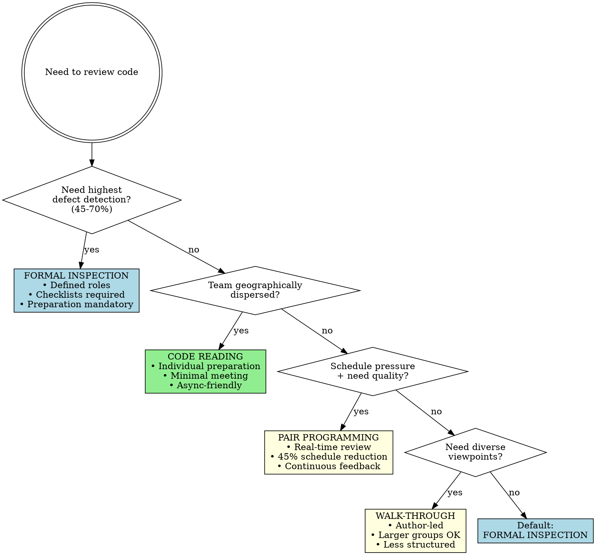
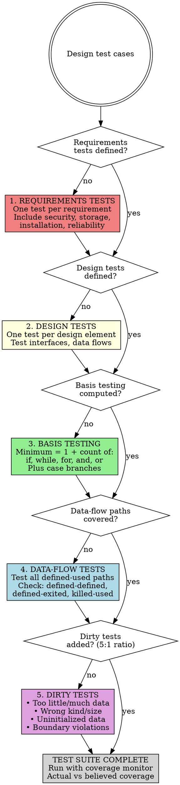
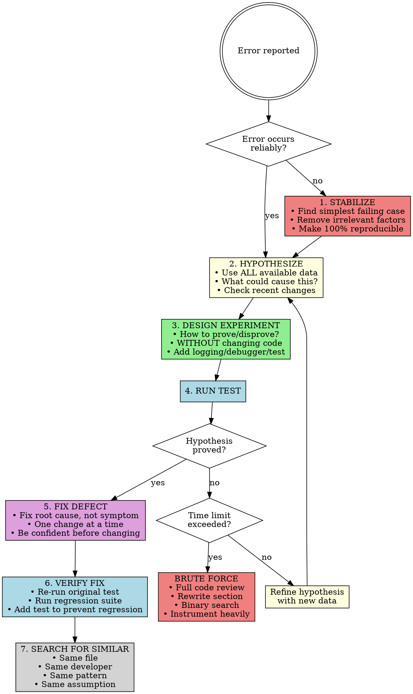

# Skill: cc-quality-practices

## STOP - The Quality Principle

**Improving quality reduces development costs.** No single defect-detection technique exceeds 75% effectiveness. Combining techniques nearly doubles detection rates.

**Critical ratio:** Mature organizations have 5 dirty tests for every 1 clean test.

**Debugging rule:** Do NOT skip to FIX without completing STABILIZE → HYPOTHESIZE → EXPERIMENT. ~50% of defect corrections are wrong the first time.

---

## Key Definitions

### External vs Internal Quality
- **External** (users care about): Correctness, usability, efficiency, reliability, integrity, robustness
- **Internal** (developers care about): Maintainability, flexibility, portability, reusability, readability, testability

Internal quality enables external quality. Poor maintainability → can't fix defects → poor reliability.

### Defect Detection Techniques
- **Formal Inspection**: Structured review with roles, checklists, preparation. 45-70% detection rate.
- **Walk-Through**: Author-led review, less structured. 20-40% detection rate.
- **Pair Programming**: Real-time collaborative development. 40-60% detection rate.
- **Code Reading**: Individual review emphasizing preparation. 20-35% detection rate.
- **Unit Testing**: Developer tests of individual components. 15-50% detection rate.

### Clean vs Dirty Tests
- **Clean tests**: Verify code works correctly (happy path)
- **Dirty tests**: Verify code handles failures gracefully (error paths, bad data, edge cases)

**Critical ratio:** Mature organizations have 5 dirty tests for every 1 clean test. Immature organizations have the inverse.

### Psychological Set
The tendency to see what you expect to see. Causes "debugging blindness" where programmers overlook defects because they expect code to work. Good formatting, naming, and comments help break psychological set by making anomalies stand out.

## Modes

### CHECKER
Purpose: Execute quality, review, and testing checklists against code/process
Triggers:
  - "review this code"
  - "check quality practices"
  - "are my test cases adequate"
Non-Triggers:
  - "how do I debug this" → APPLIER
  - "write tests for this" → APPLIER
Checklist: **See [checklists.md](./checklists.md)**
Output Format:
  | Item | Status | Evidence | Location |
  |------|--------|----------|----------|
Severity:
  - VIOLATION: Fails checklist item
  - WARNING: Partial compliance
  - PASS: Meets requirement

### APPLIER
Purpose: Apply testing techniques, inspection procedures, and debugging method
Triggers:
  - "debug this issue"
  - "design test cases for"
  - "how should we review this"
Non-Triggers:
  - "check my test coverage" → CHECKER
  - "review my QA plan" → CHECKER
Produces: Test cases, debugging hypotheses, review procedures, quality plans

**Test Case Generation (output: test case list):**
1. Identify requirements → write test per requirement
2. Compute minimum tests: 1 + count(if/while/for/and/or)
3. Add data-flow tests: cover all defined-used paths
4. Add boundary tests: below, at, above each boundary
5. Add dirty tests (5:1 ratio): bad data, wrong size, uninitialized
6. Add nominal tests: middle-of-road expected values

**Debugging Method (Scientific) - output: hypothesis + fix:**
1. STABILIZE - Narrow to simplest failing test case
2. HYPOTHESIZE - Form theory from all available data
3. EXPERIMENT - Design test to prove/disprove hypothesis **WITHOUT changing production code**
4. PROVE/DISPROVE - Run test; refine hypothesis if disproved
5. FIX - Only after predicting defect occurrence correctly
6. VERIFY - Re-run original test + regression suite
7. SEARCH - Check same file, same developer, same pattern for similar defects

**Critical clarification on EXPERIMENT:** EXPERIMENT means a test that validates or invalidates your hypothesis WITHOUT changing production code. Examples: add logging/print statements, use a debugger to inspect state, write a failing unit test that exposes the suspected bug, inspect code to verify your theory. If you change production code, you've skipped to FIX—which has a >50% failure rate when done without understanding [Yourdon]. The experiment confirms your understanding; the fix applies it.

**Inspection Procedure (output: defect list) - see [Effective Inspections checklist](./checklists.md#effective-inspections-p485-492):**
1. PLANNING - Moderator distributes materials with line numbers + checklist
2. PREPARATION - Each reviewer works alone using checklist (90% defects found here)
3. MEETING - Reader paraphrases code; scribe records defects (≤2 hours)
4. REPORT - Moderator lists each defect with type and severity
5. REWORK - Author fixes defects
6. FOLLOW-UP - Moderator verifies all fixes complete

## Decision Flowcharts

### Choosing a Review Method

**Key data:** Inspections find 45-70% of defects; walk-throughs find 20-40%. Preparation finds 90% of inspection defects; the meeting only finds 10% more [Votta 1991].

### Test Strategy Selection

**Basis testing formula:** Minimum test cases = `1 + count(if) + count(while) + count(for) + count(and) + count(or) + count(case branches)`. If no default case, add 1 more.

### Scientific Debugging Method

**Critical:** Do NOT skip to FIX without completing steps 1-4. ~50% of defect corrections are wrong the first time [Yourdon 1986b]. Understand the problem before fixing.

**Debugging blindness:** Programmers mentally "slice away" code they think is irrelevant. Sometimes the defect is in the sliced-away portion. If stuck, expand your search area.

## Red Flags - STOP and Reconsider

If you find yourself thinking any of these, you are about to violate the skill:

**Skipping Reviews:**
- "We don't have time for a review before shipping"
- "It's just a small change, doesn't need review"
- "I already tested it, review is redundant"
- "The deadline is too tight for inspections"

**Testing Anti-Patterns:**
- "My tests pass, so the code is correct"
- "100% statement coverage is enough"
- "I'll add more tests after we ship"
- "Happy path tests are sufficient"
- "I don't need a coverage monitor, I know what I tested"

**Debugging Anti-Patterns:**
- "I'll try random changes until something works"
- "It's probably a compiler/OS/framework bug"
- "I don't need to understand it, just fix it"
- "I'll make several changes at once to save time"
- "This is too hard, I'll add a special case workaround"

**Review Anti-Patterns:**
- "The meeting is the important part of the inspection"
- "I didn't have time to prepare, but I'll catch things in the meeting"
- "Management should see how thorough our reviews are"
- "Let me explain why I wrote it this way..." (defending during review)

**Success Streak Rationalizations:**
- "We shipped 5 times without reviews, no bugs"
- "Our recent code has been clean without these practices"
- "We've gotten better at this, we can skip steps"
- "If it was going to fail, it would have failed by now"

**Sunk Cost Rationalizations:**
- "I spent hours on this—it works—why change anything?"
- "Adding more tests to working code is wasteful effort"
- "This skill is for new code, not validating existing code"
- "Requiring changes now undoes my progress"

**Emergency Rationalizations:**
- "Revenue is bleeding, we can't afford to do this properly"
- "Production is back up, crisis is over, remaining steps can wait"
- "The regression suite takes too long in an emergency"
- "I'll find similar defects later when things calm down"

**All of these are violations. Apply the skill. Neither deadline pressure, past success, sunk cost, nor emergency exempts you.**

## Pressure Scenarios

### Scenario 1: Deadline Pressure on Reviews
**Situation:** "Project is behind schedule. Manager suggests skipping code review to ship faster."
**Test:** Will skipping review actually save time?
**REQUIRED Response:** No. Each hour of inspection prevents ~100 hours of downstream work [IBM]. Skipping reviews increases total project time. Push back with data.

### Scenario 2: Test Coverage Confidence
**Situation:** "I've tested this thoroughly. I'm confident coverage is above 90%."
**Test:** Have you measured actual coverage?
**REQUIRED Response:** Developers believe 95% but achieve 30-60% [Beizer]. Use a coverage monitor. Trust data, not intuition.

### Scenario 3: Quick Debug Fix
**Situation:** "I found a fix that makes the test pass. Shipping now."
**Test:** Do you understand WHY it works?
**REQUIRED Response:** ~50% of fixes are wrong. Can you predict when the defect will occur? If not, you don't understand it yet. Continue hypothesis-testing.

### Scenario 4: Blaming External Factors
**Situation:** "This bug is weird. Must be a compiler issue or race condition in the framework."
**Test:** Have you ruled out your own code?
**REQUIRED Response:** 95%+ of errors are programmer's fault. Assume it's your bug until proven otherwise. This assumption helps debugging and credibility.

### Scenario 5: Special Case Fix
**Situation:** "Client 45's total is off by $3.45. I'll add an if-statement to adjust."
**Test:** Is this fixing the root cause?
**REQUIRED Response:** No. Special cases become barnacles. Tomorrow it might be $10,000.02. Find and fix the actual defect in the algorithm.

### Scenario 6: Skipping Preparation
**Situation:** "I didn't have time to review the code before the inspection meeting. I'll just participate actively."
**Test:** Can you contribute effectively?
**REQUIRED Response:** No. 90% of defects are found in preparation, only 10% in the meeting [Votta 1991]. Reschedule or acknowledge your limited contribution.

### Scenario 7: Management in Reviews
**Situation:** "VP wants to attend the code inspection to understand our process."
**Test:** Will this improve defect detection?
**REQUIRED Response:** No. Management presence shifts focus from technical to political. Offer inspection reports instead. Reviews must be safe spaces for technical honesty.

### Scenario 8: Success Streak Confidence
**Situation:** "Last 5 releases shipped without formal reviews or the full test suite. No production bugs. We can skip these practices this time too."
**Test:** Does past success predict future success?
**REQUIRED Response:** No. This is survivorship bias. The 80/20 rule (80% of errors in 20% of code) means you may have been operating in "safe" code. Your next change might hit error-prone code. The IBM IMS case study: 31 of 425 classes (7%) caused nearly all defects. If your last 5 releases touched the "safe" 394 classes, you built false confidence. Detection techniques have fixed effectiveness rates regardless of your history—your next release still has 30-35% detection via testing alone. Techniques that weren't needed don't become unnecessary; they remain your defense for the inevitable exception.

### Scenario 9: Production Outage Emergency
**Situation:** "Production is down. Revenue loss: $5,000/minute. The user demands an immediate fix."
**Test:** Should you skip debugging method steps to save time?
**REQUIRED Response:** No. The Scientific Method is FASTER in emergencies, not slower. Data: ~50% of rushed fixes are wrong [Yourdon]. A wrong fix costs you DOUBLE the time (diagnosis + fix + diagnosis again + correct fix). A 5-minute STABILIZE step that prevents one wrong attempt saves 20+ minutes. The method IS the shortcut. **Critical:** After production is restored, VERIFY and SEARCH are NON-NEGOTIABLE. A similar defect (same file, same pattern) will cause another outage at the same cost-per-minute. Find it now while context is fresh.

### Scenario 10: Sunk Cost - "But My Code Already Works"
**Situation:** "I spent 4 hours implementing this solution. It passes all my tests. Now you're asking me to apply formal quality practices that might require changes."
**Test:** Does time invested guarantee quality?
**REQUIRED Response:** No. "Works" means "passes the tests YOU wrote"—which is typically 30-60% actual coverage when developers believe they have 95% [Beizer]. Time invested is irrelevant to defect density; code that took 4 hours can have the same bug rate as code that took 4 minutes. The General Principle of Software Quality states that improving quality REDUCES total development time. 80% of defects cluster in 20% of code—your 4-hour working solution might BE that 20%. Apply the skill regardless of sunk cost. Confidence is a symptom of insufficient verification, not evidence of quality.

## Rationalization Counters
| Excuse | Reality |
|--------|---------|
| **Reviews** | |
| "Testing will catch the bugs" | Testing alone: 30-35% detection; inspections: 60% [Jones 1996] |
| "We don't have time for reviews" | 1 hour inspection = 100 hours saved [IBM]; ROI 1.38 vs 0.17 testing |
| "Walk-throughs are good enough" | 20-40% detection vs inspections' 45-70%. Choose based on data. |
| "The meeting is the important part" | 90% of defects found in preparation, only 10% in meeting [Votta 1991] |
| "We need management visibility" | Management presence changes focus from technical to political; use reports |
| **Testing** | |
| "My tests pass, coverage is good" | Developers believe 95% but achieve 30-60%; use coverage monitor |
| "I'll test thoroughly after coding" | Test-first takes same time, catches defects earlier |
| "100% statement coverage is sufficient" | 100% branch coverage is better; test every predicate for true AND false |
| "Clean tests (code works) are enough" | Mature orgs have 5 dirty tests per clean test. Test how code BREAKS. |
| "More testing = better quality" | Testing measures, doesn't create quality; improve development practices |
| "I tested it, so it works" | Testing can never prove absence of errors. An absence might mean bad tests. |
| **Debugging** | |
| "It's probably a compiler bug" | 95%+ of errors are programmer's fault; assume responsibility |
| "I'll add a special case fix" | Special cases become barnacles; fix root cause |
| "I'll try random changes" | Voodoo programming; form hypothesis first, be confident before changing |
| "I'll make several changes at once" | Multiple changes obscure which one worked; make one change at a time |
| "I've been staring too long, I'll guess" | Take a break; let subconscious work; come back fresh |
| "This routine has bugs, I'll patch it" | Error-prone code (80% bugs in 20% of code) should be redesigned, not patched |
| "Quick fix now, proper fix later" | Hurrying is time-ineffective; ~50% of fixes are wrong first time [Yourdon] |
| **Success Streaks** | |
| "We haven't needed reviews recently" | Survivorship bias; error-prone code hits unpredictably. IBM IMS: 31 of 425 classes caused nearly all defects. Your streak may end with catastrophic class. |
| "5 successful releases without this" | Detection techniques have fixed rates regardless of history. Next release still has 30-35% detection via testing only. |
| "We've gotten good at this" | Overconfidence. Even experts believe 95% coverage but achieve 50-60%. Your calibration hasn't improved; your luck has. |
| "Our bugs haven't clustered recently" | 80% of errors in 20% of code. You may be in the "easy" 80% of your codebase. |
| "It's worked without this practice" | Past success doesn't reduce future risk. The practice exists for the cases you haven't hit yet. |
| **Emergencies** | |
| "Emergency overrides normal process" | Emergencies REQUIRE systematic process; rushed fixes fail 50%+ [Yourdon] |
| "Revenue loss justifies shortcuts" | Wrong fix costs double (fix + re-fix); the Scientific Method IS the shortcut |
| "Crisis is over, remaining steps can wait" | SEARCH is non-negotiable; defects cluster; next outage costs same $/min |
| **Sunk Cost** | |
| "My code already works, why add tests/reviews?" | "Works" = "passed tests you wrote" = 30-60% actual coverage. Apply the skill anyway. |
| "I've invested hours, requiring changes is wasteful" | Time invested doesn't reduce defect density. The General Principle: quality reduces total time. |
| "This skill is for new code, not existing code" | The skill applies whenever code hasn't been verified by these techniques—regardless of when written. |
| "Adding tests to working code is overkill" | If you believe coverage is 95% but it's actually 50%, half your code is untested. Measure, don't assume. |

---

## Chain

| After | Next |
|-------|------|
| Defect found | cc-refactoring-guidance |
| Design issues | cc-routine-and-class-design (CHECKER) |
| Fix verified | SEARCH for similar defects, then done |

