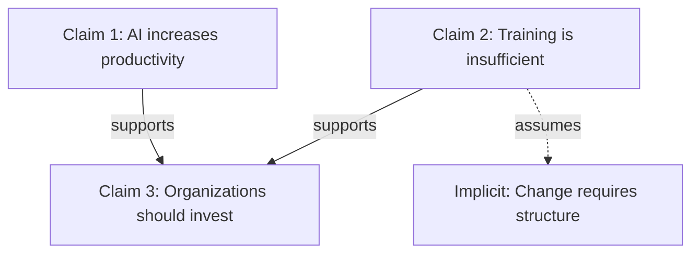

# Claimify

Extract claims from text and map their logical relationships into structured argument networks.

## Overview

Claimify transforms messy discourse (conversations, documents, debates, meeting notes) into analyzable claim structures that reveal:
- Explicit and implicit claims
- Logical relationships (supports/opposes/assumes/contradicts)
- Evidence chains
- Argument structure
- Tension points and gaps

## Workflow

1. **Ingest**: Read source material (conversation, document, transcript)
2. **Extract**: Identify atomic claims (one assertion per claim)
3. **Classify**: Label claim types (factual/normative/definitional/causal/predictive)
4. **Map**: Build relationship graph (which claims support/oppose/assume others)
5. **Analyze**: Identify structure, gaps, contradictions, implicit assumptions
6. **Output**: Format as requested (table/graph/narrative/JSON)

## Claim Extraction Guidelines

### Atomic Claims
Each claim should be a single, testable assertion.

**Good:**
- "AI adoption increases productivity by 15-30%"
- "Psychological safety enables team learning"
- "Current training methods fail to build AI fluency"

**Bad (not atomic):**
- "AI is useful and everyone should use it" → Split into 2 claims

### Claim Types

| Type | Definition | Example |
|------|------------|---------|
| **Factual** | Empirical statement about reality | "Remote work increased 300% since 2020" |
| **Normative** | Value judgment or prescription | "Organizations should invest in AI training" |
| **Definitional** | Establishes meaning | "AI fluency = ability to shape context and evaluate output" |
| **Causal** | X causes Y | "Lack of training causes AI underutilization" |
| **Predictive** | Future-oriented | "AI adoption will plateau without culture change" |
| **Assumption** | Unstated premise | [implicit] "Humans resist change" |

### Relationship Types

- **Supports**: Claim A provides evidence/reasoning for claim B
- **Opposes**: Claim A undermines or contradicts claim B
- **Assumes**: Claim A requires claim B to be true (often implicit)
- **Refines**: Claim A specifies/clarifies claim B
- **Contradicts**: Claims are mutually exclusive
- **Independent**: No logical relationship

## Output Formats

### Table Format (default)

```markdown
| ID | Claim | Type | Supports | Opposes | Assumes | Evidence |
|----|-------|------|----------|---------|---------|----------|
| C1 | [claim text] | Factual | - | - | C5 | [source/reasoning] |
| C2 | [claim text] | Normative | C1 | C4 | - | [source/reasoning] |
```

### Graph Format

Use Mermaid for visualization:



### Narrative Format

Write as structured prose with clear transitions showing logical flow:

```markdown
## Core Argument

The author argues that [main claim]. This rests on three supporting claims:

1. [Factual claim] - This is supported by [evidence]
2. [Causal claim] - However, this assumes [implicit assumption]
3. [Normative claim] - This follows if we accept [prior claims]

## Tensions

The argument contains internal tensions:
- Claims C2 and C5 appear contradictory because...
- The causal chain from C3→C7 has a missing premise...
```

### JSON Format

For programmatic processing:

```json
{
  "claims": [
    {
      "id": "C1",
      "text": "AI adoption increases productivity",
      "type": "factual",
      "explicit": true,
      "supports": ["C3"],
      "opposed_by": [],
      "assumes": ["C4"],
      "evidence": "Multiple case studies cited"
    }
  ],
  "relationships": [
    {"from": "C1", "to": "C3", "type": "supports", "strength": "strong"}
  ],
  "meta_analysis": {
    "completeness": "Missing link between C2 and C5",
    "contradictions": ["C4 vs C7"],
    "key_assumptions": ["C4", "C9"]
  }
}
```

## Analysis Depth Levels

**Level 1: Surface**
- Extract only explicit claims
- Basic support/oppose relationships
- No implicit assumption mining

**Level 2: Standard** (default)
- Extract explicit claims
- Identify clear logical relationships
- Surface obvious implicit assumptions
- Flag apparent contradictions

**Level 3: Deep**
- Extract all claims (explicit + implicit)
- Map full logical structure
- Identify hidden assumptions
- Analyze argument completeness
- Red-team reasoning
- Suggest strengthening moves

## Best Practices

1. **Be charitable**: Steelman arguments before critique
2. **Distinguish**: Separate what's claimed from what's implied
3. **Be atomic**: One claim per line, no compound assertions
4. **Track evidence**: Note source/support for each claim
5. **Flag uncertainty**: Mark inferential leaps
6. **Mind the gaps**: Identify missing premises explicitly
7. **Stay neutral**: Describe structure before evaluating strength

## Common Patterns

### Argument Chains
```
Premise 1 (factual) → Premise 2 (causal) → Conclusion (normative)
```

### Implicit Assumptions
Often found by asking: "What must be true for this conclusion to follow?"

### Contradictions
Watch for:
- Same speaker, different times
- Different speakers, same topic
- Explicit vs implicit claims

### Weak Links
- Unsupported factual claims
- Causal claims without mechanism
- Normative leaps (is → ought)
- Definitional ambiguity

## Examples

See `references/examples.md` for detailed worked examples.
