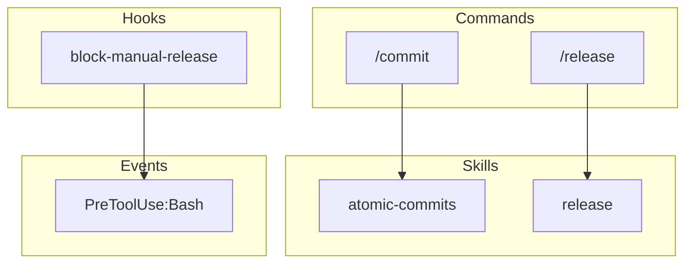

# Claude Code Graph

Generate a structural analysis and dependency graph of a Claude Code plugin. Outputs component inventory, dependency mappings, and Mermaid visualization.

## Context

!`ls .claude-plugin/plugin.json 2>/dev/null && echo "Plugin detected" || echo "No plugin.json - specify path"`

## Workflow

### Phase 1: Discover Components

**Plugin Manifest:**

```bash
PLUGIN_PATH="${1:-.}"
cat "$PLUGIN_PATH/.claude-plugin/plugin.json" | jq '{name, version, description}'
```

**Commands:**

```bash
ls "$PLUGIN_PATH/commands/"*.md 2>/dev/null | wc -l
```

**Skills:**

```bash
ls -d "$PLUGIN_PATH/skills/"*/ 2>/dev/null | wc -l
```

**Hooks:**

```bash
cat "$PLUGIN_PATH/hooks/hooks.json" 2>/dev/null | jq '.hooks | keys'
```

**Agents:**

```bash
ls "$PLUGIN_PATH/agents/"*.md 2>/dev/null | wc -l
```

### Phase 2: Parse Metadata

For each component, extract name and description dynamically:

**Command Descriptions:**

```bash
for f in "$PLUGIN_PATH/commands/"*.md; do
  name=$(basename "$f" .md)
  desc=$(sed -n '/^description:/s/description: *//p' "$f" | head -1)
  printf "%-28s %s\n" "$name" "$desc"
done
```

**Skill Descriptions:**

```bash
for d in "$PLUGIN_PATH/skills/"*/; do
  name=$(basename "$d")
  desc=$(sed -n '/^description:/s/description: *//p' "$d/SKILL.md" | head -1)
  printf "%-28s %s\n" "$name" "$desc"
done
```

**Hook Scripts:**

```bash
jq -r '.hooks | to_entries[] | .key as $event | .value[] | .hooks[] |
  "\($event)|\(.matcher // "*")|\(.command | split("/") | last)"' \
  "$PLUGIN_PATH/hooks/hooks.json"
```

**Agent Descriptions:**

```bash
for f in "$PLUGIN_PATH/agents/"*.md; do
  name=$(basename "$f" .md)
  desc=$(sed -n '/^description:/s/description: *//p' "$f" | head -1)
  echo "$name|$desc"
done
```

### Phase 3: Build Dependency Graph

**Command → Skill:**

Look for `See skills/*/SKILL.md` patterns in command files.

**Skill → Tools:**

Extract `allowed-tools` from frontmatter.

**Skill → Skill:**

Look for `Task` tool usage with skill references, or `@skill-name` patterns.

**Hook → Event:**

Parse hooks.json structure:

```json
{
  "hooks": {
    "EVENT_TYPE": [
      { "matcher": "...", "hooks": ["script.sh"] }
    ]
  }
}
```

### Phase 4: Generate Output

#### JSON Structure

```json
{
  "plugin": {
    "name": "plugin-name",
    "version": "1.0.0",
    "path": "/path/to/plugin"
  },
  "components": {
    "commands": [
      { "name": "commit", "file": "commands/commit.md", "description": "...", "allowedTools": [...] }
    ],
    "skills": [
      { "name": "atomic-commits", "file": "skills/atomic-commits/SKILL.md", "description": "...", "allowedTools": [...] }
    ],
    "hooks": [
      { "event": "PreToolUse", "matcher": "Bash", "script": "block-manual-release.sh" }
    ],
    "agents": []
  },
  "dependencies": {
    "commandToSkill": {
      "commit": "atomic-commits"
    },
    "skillToTools": {
      "atomic-commits": ["Read", "Write", "Bash", "Glob"]
    },
    "skillToSkill": {
      "release": ["claude-code-guide"]
    },
    "hookToEvent": {
      "block-manual-release.sh": "PreToolUse:Bash"
    }
  },
  "stats": {
    "totalCommands": 27,
    "totalSkills": 20,
    "totalHooks": 13,
    "totalAgents": 1
  }
}
```

#### Mermaid Diagram

Generate a Mermaid flowchart showing relationships:



## Arguments

| Argument | Description |
|----------|-------------|
| `[path]` | Path to plugin directory (default: current directory) |
| `--json` | Output raw JSON only |
| `--mermaid` | Output Mermaid diagram only |
| `--markdown` | Output with markdown tables and collapsible mermaid |
| `--output FILE` | Write output to file |

## Output Formats

### Default (Terminal-Friendly)

Optimized for Claude Code's output window. Uses Unicode box characters, aligned columns, and visual grouping. **All data is read dynamically from the filesystem at invocation time.**

```text
╭──────────────────────────────────────────────────────────────────────────────╮
│  {plugin.name} v{plugin.version}                                             │
│  {plugin.description}                                                        │
╰──────────────────────────────────────────────────────────────────────────────╯

COMPONENTS
────────────────────────────────────────────────────────────────────────────────
  📁 Commands    {count}
  ⚡ Skills      {count}
  🪝 Hooks       {count} scripts (across {count} events)
  🤖 Agents      {count}

HOOK EVENTS
────────────────────────────────────────────────────────────────────────────────
  {event}   {count} handlers  matcher: {matcher}
  ...

ALL HOOKS
────────────────────────────────────────────────────────────────────────────────
  {event}  → {script.sh}
  ...

COMMANDS ({count})
────────────────────────────────────────────────────────────────────────────────
  {name}                     {description from frontmatter}
  {name}                     {description from frontmatter}
  ...

SKILLS ({count})
────────────────────────────────────────────────────────────────────────────────
  {name}                     {description from SKILL.md frontmatter}
  {name}                     {description from SKILL.md frontmatter}
  ...

AGENTS ({count})
────────────────────────────────────────────────────────────────────────────────
  {name}
    {description from agent frontmatter}
```

**Key:** All `{placeholders}` are replaced with values read from the filesystem at runtime.

### --markdown (GitHub/Docs)

Uses markdown tables and collapsible mermaid diagram:

```markdown
## Plugin Analysis: bluera-base v0.31.5

| Type | Count |
|------|-------|
| Commands | 29 |
| Skills | 29 |
| Hooks | 12 |
| Agents | 1 |

<details>
<summary>Mermaid Diagram</summary>
(diagram)
</details>
```

### --mermaid (Diagram Only)

Outputs just the Mermaid flowchart for embedding in documentation.

### --json (Machine Readable)

Full JSON structure for programmatic use.

## Constraints

- Read-only analysis (no modifications)
- Fail fast if plugin.json missing (required file)
- Support both current directory and explicit path
- Generate valid Mermaid syntax
