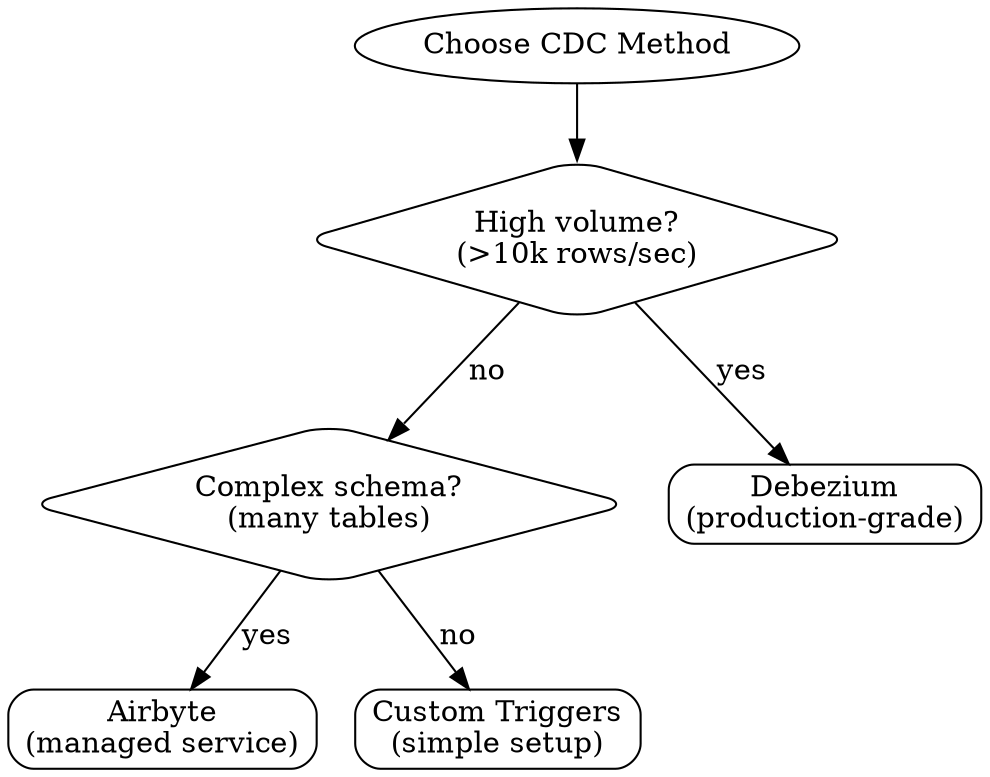

# ClickHouse CDC Patterns

## Overview

Change Data Capture (CDC) replicates database changes to ClickHouse for analytics. **Core principle:** Capture changes at source, transform for column-storage, handle deletes gracefully.

**Key challenge:** ClickHouse isn't designed for updates/deletes. Use ReplacingMergeTree or append-only patterns.

## When to Use

**Symptoms:**

- Need to sync PostgreSQL/MySQL tables to ClickHouse
- Want real-time analytics on transactional data
- Schema changes breaking replication pipeline
- Unsure how to handle DELETE operations

**When NOT to use:**

- Streaming from Kafka/message queues → See `clickhouse-streaming`
- One-time data migration → Use batch ETL
- Query optimization → See `clickhouse-patterns`

## Prerequisites

- Understanding of source database (PostgreSQL triggers, MySQL binlog)
- Basic ClickHouse knowledge → See `clickhouse-patterns`
- Familiarity with ReplacingMergeTree engine

## Quick Reference

### CDC Method Selection



| Method | Best For | Pros | Cons |
|--------|----------|------|------|
| **Debezium** | High volume, production | Log-based, no DB impact | Complex setup |
| **Airbyte** | Multi-source, managed | UI, pre-built connectors | Cost, less control |
| **Custom Triggers** | Simple, low volume | Easy to understand | DB overhead |

### Critical Patterns

| Pattern | Use Case | Key Technique |
|---------|----------|---------------|
| **Soft Delete** | Handle DELETEs | Add `is_deleted` flag |
| **ReplacingMergeTree** | Handle UPDATEs | Use version/timestamp column |
| **Schema Evolution** | Add columns | Nullable with defaults |
| **Backfill** | Initial sync | Snapshot then CDC |

## Pattern 1: PostgreSQL with Debezium

### Architecture

```
PostgreSQL (WAL) → Debezium → Kafka → ClickHouse Kafka Engine
```

### ClickHouse Setup

```sql
-- 1. Kafka staging table
CREATE TABLE users_kafka (
    id UInt64,
    name String,
    email String,
    updated_at DateTime,
    _operation String  -- INSERT, UPDATE, DELETE
) ENGINE = Kafka()
SETTINGS
    kafka_broker_list = 'kafka:9092',
    kafka_topic_list = 'dbserver1.public.users',
    kafka_group_name = 'clickhouse_consumer',
    kafka_format = 'JSONEachRow';

-- 2. Target table with dedup
CREATE TABLE users (
    id UInt64,
    name String,
    email String,
    updated_at DateTime,
    is_deleted UInt8 DEFAULT 0
) ENGINE = ReplacingMergeTree(updated_at)
ORDER BY id;

-- 3. Transform with materialized view
CREATE MATERIALIZED VIEW users_mv TO users AS
SELECT
    id, name, email, updated_at,
    if(_operation = 'DELETE', 1, 0) AS is_deleted
FROM users_kafka;

-- 4. Query active records
SELECT * FROM users FINAL WHERE is_deleted = 0;
```

### Debezium Connector

```json
{
  "name": "postgres-connector",
  "config": {
    "connector.class": "io.debezium.connector.postgresql.PostgresConnector",
    "database.hostname": "postgres",
    "database.port": "5432",
    "database.user": "replicator",
    "database.dbname": "mydb",
    "database.server.name": "dbserver1",
    "table.include.list": "public.users,public.orders",
    "plugin.name": "pgoutput"
  }
}
```

## Pattern 2: PostgreSQL with Custom Triggers

### Use Case

- Low volume (< 1k rows/sec)
- Simple schema (1-5 tables)
- No Kafka infrastructure

### PostgreSQL Trigger

```sql
CREATE OR REPLACE FUNCTION notify_changes()
RETURNS TRIGGER AS $$
BEGIN
    IF TG_OP = 'INSERT' OR TG_OP = 'UPDATE' THEN
        PERFORM pg_notify('table_changes', json_build_object(
            'table', TG_TABLE_NAME,
            'operation', TG_OP,
            'data', row_to_json(NEW)
        )::text);
        RETURN NEW;
    ELSIF TG_OP = 'DELETE' THEN
        PERFORM pg_notify('table_changes', json_build_object(
            'table', TG_TABLE_NAME,
            'operation', 'DELETE',
            'id', OLD.id
        )::text);
        RETURN OLD;
    END IF;
END;
$$ LANGUAGE plpgsql;

CREATE TRIGGER users_notify_trigger
AFTER INSERT OR UPDATE OR DELETE ON users
FOR EACH ROW EXECUTE FUNCTION notify_changes();
```

### Node.js CDC Service

```typescript
import { Client } from 'pg';
import { ClickHouse } from 'clickhouse';

const pgClient = new Client({ connectionString: process.env.PG_URL });
const clickhouse = new ClickHouse({ url: process.env.CH_URL });

async function startCDC() {
  await pgClient.connect();
  await pgClient.query('LISTEN table_changes');

  pgClient.on('notification', async (msg) => {
    const { table, operation, data, id } = JSON.parse(msg.payload);

    if (operation === 'INSERT' || operation === 'UPDATE') {
      await clickhouse.insert(table, [{ ...data, is_deleted: 0 }]);
    } else if (operation === 'DELETE') {
      await clickhouse.query(`
        ALTER TABLE ${table} UPDATE is_deleted = 1 WHERE id = ${id}
      `).toPromise();
    }
  });
}
```

## Pattern 3: MySQL Binlog

```json
{
  "name": "mysql-connector",
  "config": {
    "connector.class": "io.debezium.connector.mysql.MySqlConnector",
    "database.hostname": "mysql",
    "database.user": "debezium",
    "database.server.id": "184054",
    "database.server.name": "mysql-server",
    "table.include.list": "mydb.orders,mydb.customers"
  }
}
```

**Key differences:** Uses binlog (not WAL), requires `server.id`, schema changes tracked separately.

## Handling DELETE Operations

### Option 1: Soft Delete (Recommended)

```sql
CREATE TABLE orders (
    id UInt64,
    user_id UInt64,
    amount Decimal(10, 2),
    is_deleted UInt8 DEFAULT 0
) ENGINE = ReplacingMergeTree(updated_at)
ORDER BY id;

SELECT * FROM orders FINAL WHERE is_deleted = 0;
```

### Option 2: CollapsingMergeTree

```sql
CREATE TABLE orders (
    id UInt64,
    amount Decimal(10, 2),
    sign Int8  -- 1 = active, -1 = deleted
) ENGINE = CollapsingMergeTree(sign)
ORDER BY id;

-- Insert
INSERT INTO orders VALUES (1, 50.00, 1);
-- Delete (insert negative)
INSERT INTO orders VALUES (1, 50.00, -1);
-- Query
SELECT * FROM orders FINAL WHERE sign = 1;
```

## Schema Evolution

### Add Columns as Nullable

```sql
ALTER TABLE users ADD COLUMN phone String DEFAULT '';
ALTER TABLE users ADD COLUMN country LowCardinality(String) DEFAULT 'UNKNOWN';
```

### Schema Registry Pattern

```typescript
const schemaRegistry = {
  'users': { version: 2, columns: ['id', 'name', 'email', 'phone'] }
};

function transformRow(table: string, row: any) {
  return {
    ...row,
    phone: row.phone || '',
    country: row.country || 'UNKNOWN'
  };
}
```

## Backfill Strategy

```typescript
// 1. Snapshot existing data
async function backfillTable(tableName: string) {
  const stream = pgClient.query(`COPY (SELECT * FROM ${tableName}) TO STDOUT`);
  await pipeline(stream, csvParser(), clickhouse.insert(tableName).stream());
}

// 2. Start CDC from snapshot position
const lsn = await pgClient.query(`SELECT pg_current_wal_lsn()`);
```

## Common Mistakes

| Mistake | Why It Fails | Fix |
|---------|--------------|-----|
| **No deduplication** | Duplicate events | Use ReplacingMergeTree |
| **Hard deletes** | Not supported well | Soft delete with flag |
| **Ignoring order** | Out-of-order updates | Use version/timestamp |
| **No backfill** | Missing historical data | Snapshot before CDC |

## Performance Tips

```sql
-- Batch Kafka consumption
SETTINGS kafka_max_block_size = 65536, kafka_poll_timeout_ms = 1000;

-- Async inserts
SET async_insert = 1, wait_for_async_insert = 0;
```

## Monitoring

```sql
-- Replication lag
SELECT table, max(synced_at) AS last_sync,
       now() - max(synced_at) AS lag_seconds
FROM system.parts WHERE active GROUP BY table;

-- Kafka consumer errors
SELECT database, table, exceptions, last_exception_time
FROM system.kafka_consumers;
```

## Best Practices

**Design:**

- Use ReplacingMergeTree for tables with updates
- Always include updated_at/version column
- Implement soft deletes, not hard deletes

**Operations:**

- Monitor replication lag (< 1 minute target)
- Alert on Kafka consumer errors
- Test schema changes in staging

**Performance:**

- Batch Kafka consumption (kafka_max_block_size)
- Use async inserts
- Partition by time

## Red Flags

- ❌ "ALTER TABLE DELETE" → Extremely slow
- ❌ "Updates without version" → Race conditions
- ❌ "No lag monitoring" → Stale analytics
- ❌ "Hard deletes" → Data inconsistency

## When to Escalate

- Replication lag > 5 minutes consistently
- Kafka consumer crashes
- Schema changes breaking pipeline
- Multi-datacenter replication needed

**Resources:** Debezium docs (<https://debezium.io>), ClickHouse Kafka engine docs

## Related Skills

- **ClickHouse fundamentals:** See `clickhouse-patterns`
- **Streaming from queues:** See `clickhouse-streaming`

---

**Remember:** CDC is about consistency. Always handle deletes, monitor lag, and test schema changes thoroughly.
