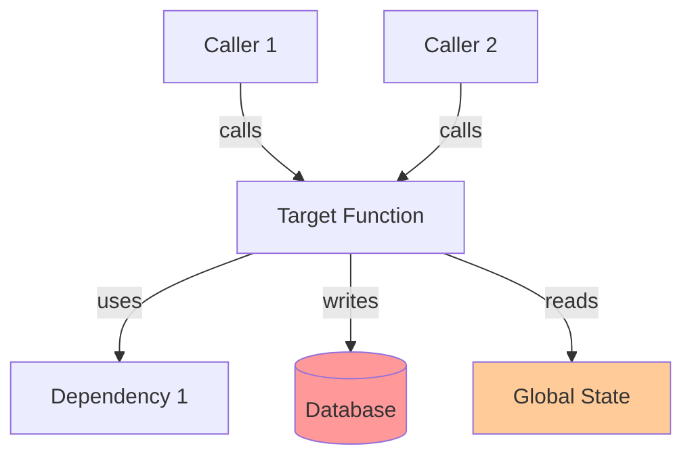

# Code Cartographer

Map the architecture, data flow, and risks in legacy codebases. Transform complex, untested code into visual diagrams and actionable guidance.

## Core Analysis Workflow

Given a function name or file path:

1. **Find the entry point** - Locate the target in the codebase using Glob/Grep
2. **Map call relationships** - Trace callers (who uses this) and callees (what this uses)
3. **Detect side effects** - Identify hidden state changes and external dependencies
4. **Filter signal from noise** - Exclude vendor/node_modules, focus on custom logic
5. **Visualize and summarize** - Generate Mermaid diagram, risk list, and plain English summary

## Step 1: Locate the Target

Use Glob to find files, then Grep to locate the specific function/class:

```bash
# For a function name
Grep pattern: "function functionName|^functionName\s*[:=]|def functionName"

# For a file path
Read the file directly
```

## Step 2: Trace Call Relationships

### Call Stack (Who calls this?)

Search for references to the target function name across the codebase:

```bash
Grep pattern: "functionName" --glob "!node_modules/*" --glob "!vendor/*" --glob "!dist/*"
```

Limit depth to 3-5 levels above the target to avoid infinite recursion.

### Dependency Tree (What does this call?)

From the target function, extract:
- Function calls within the function body
- Imports/require statements at the top of the file
- Class instantiations and method calls

Search each dependency recursively, stopping at:
- Standard library functions (console.log, print, etc.)
- Well-known framework methods (React.render, express.get, etc.)
- Third-party library code (node_modules, vendor)

## Step 3: Detect Side Effects and Risks

Scan for these red flags in the target and its direct dependencies:

### Global State Mutation
- Global variables (`global.`, `window.`, module-level variables)
- Singleton pattern modifications
- Static class variable changes

### External System Interactions
- Database queries (SQL, ORM calls like `.find()`, `.save()`, `.execute()`)
- HTTP requests (`fetch`, `axios`, `http.get`, API clients)
- File system operations (`fs.readFile`, `open()`, file writes)
- Environment variable reads (`process.env`, `os.environ`)

### Hidden Behaviors
- Event listeners or pub/sub subscriptions
- Timer/callback registration (`setTimeout`, `setInterval`)
- Logging or monitoring side effects
- Throwing exceptions that bubble up

## Step 4: Filter Signal from Noise

Exclude these directories and patterns from analysis:
- `node_modules/`, `vendor/`, `third_party/`
- `dist/`, `build/`, `out/`, `.next/`
- Test files (unless analyzing test coverage)
- Generated files (`*.generated.*`, `*.pb.go`, etc.)

Focus on:
- Application code under `src/`, `lib/`, `app/`
- Custom business logic
- Domain-specific files

## Step 5: Generate Output

### Mermaid.js Flowchart

Create a directional graph showing data flow:



Color coding:
- Red/pink (#ff9999): External systems (databases, APIs)
- Orange (#ffcc99): Global state or side effects
- Blue/white: Pure functions and local logic

### "Don't Touch" List

Identify files that are:
- Highly coupled (called by 5+ other files)
- Contain critical side effects (database schemas, auth logic, payment processing)
- Lacking tests and modifying sensitive state

Format as a bulleted list with risk justification:

```
DON'T TOUCH:
- src/auth/permissions.js - Modifies user roles, referenced by 12 files, no tests
- lib/payment/processor.js - Handles transactions, calls external Stripe API, high risk
- config/database.js - Global connection pool, change breaks entire app
```

### Plain English Summary

Write a 2-sentence summary that answers:
1. What does this code do, at a high level?
2. What are the main risks or side effects?

Example:
> "This function processes user payments by validating credit cards and charging via Stripe API. It directly modifies the database payment_records table and throws exceptions that crash the payment flow if invalid."

## Search Depth Limits

To prevent analysis explosion:
- Call stack: Max 5 levels up (who calls the caller, etc.)
- Dependency tree: Max 3 levels down (what dependencies use)
- Stop at framework boundaries (React, Express, Django, etc.)
- Stop at library boundaries (npm packages, Python packages)

## When to Use This Skill

Trigger for these user requests:
- "What does this function do?"
- "Where is this used in the codebase?"
- "I need to refactor this but I'm scared to break things"
- "Map the architecture of [feature/module]"
- "What are the side effects of calling this?"
- "Who depends on this file?"

Do NOT use for:
- Simple syntax questions
- "What does this line of code do?" (just explain directly)
- Generating new code (use other skills)
