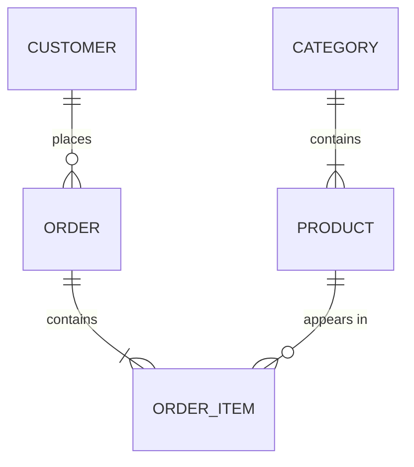
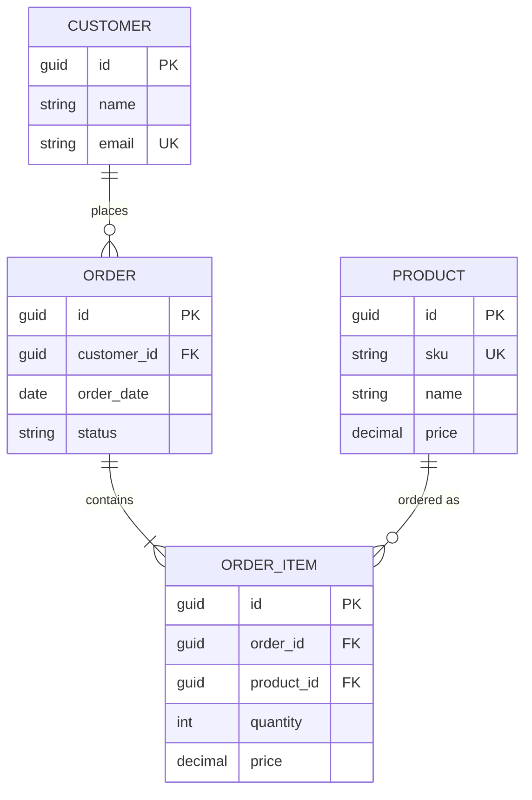
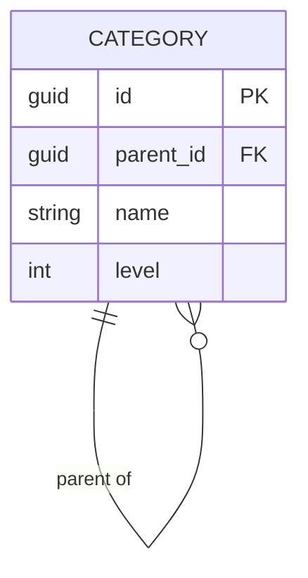

# Conceptual Data Modeling

## When to Use This Skill

Use this skill when:

- **Conceptual Modeling tasks** - Working on identify business entities, relationships, and high-level data structures from requirements and domain knowledge
- **Planning or design** - Need guidance on Conceptual Modeling approaches
- **Best practices** - Want to follow established patterns and standards

## Overview

Conceptual data modeling identifies the essential business entities and their relationships at a high level, independent of any specific database technology. It bridges business requirements and technical implementation.

## Conceptual vs Logical vs Physical

| Aspect | Conceptual | Logical | Physical |
|--------|------------|---------|----------|
| Audience | Business stakeholders | Analysts, architects | Developers, DBAs |
| Detail | High-level entities | Attributes, keys | Columns, indexes |
| Technology | None | Database-agnostic | Platform-specific |
| Focus | What data exists | How data relates | How data is stored |

## Entity Identification Process

### Step 1: Extract Nouns from Requirements

Read requirements and identify candidate entities:

```text
Requirements: "Customers place orders for products. Each order contains
multiple items. Products belong to categories."

Candidate Entities:
- Customer
- Order
- Product
- Item (OrderItem)
- Category
```

### Step 2: Filter Candidates

Eliminate non-entities:

- Attributes (name, date, price)
- Derived concepts (total, count)
- Roles (admin is a User role, not an entity)
- Events (unless storing event history)

### Step 3: Identify Relationships

| Relationship Type | Description | Example |
|-------------------|-------------|---------|
| One-to-One (1:1) | Single instance each side | User ↔ Profile |
| One-to-Many (1:N) | One to multiple | Customer → Orders |
| Many-to-Many (M:N) | Multiple both sides | Products ↔ Categories |

### Step 4: Define Cardinality and Participation

```text
Customer ─┤├─○< Order     (One customer has zero or more orders)
Order    ─┤├─┤< OrderItem (One order has one or more items)
Product  >○─┤├─ Category  (One product belongs to one category)
```

**Notation:**

- `┤├` = Mandatory (must exist)
- `○` = Optional (may not exist)
- `<` or `>` = Many side

## Conceptual Model Template

```markdown
# Conceptual Data Model: [Domain Name]

## 1. Domain Overview
[Brief description of the business domain]

## 2. Entity Catalog

### Entity: [Entity Name]
| Property | Value |
|----------|-------|
| Description | [What this entity represents] |
| Business Owner | [Who owns this data] |
| Lifecycle | [Created → Active → Archived] |
| Volume | [Expected record count] |
| Growth | [Expected growth rate] |

**Key Attributes (Business Identifiers):**
- [Natural key 1]
- [Natural key 2]

**Related Entities:**
- [Entity A] - [relationship description]
- [Entity B] - [relationship description]

## 3. Relationship Matrix

| From | To | Cardinality | Description |
|------|-----|-------------|-------------|
| Customer | Order | 1:N | Customer places orders |
| Order | OrderItem | 1:N | Order contains items |
| Product | OrderItem | 1:N | Product appears in items |
| Category | Product | 1:N | Category contains products |

## 4. Entity Relationship Diagram



## 5. Glossary

[Business terms and definitions - ubiquitous language]

```text

```

## Domain-Driven Design Alignment

### Bounded Contexts

Group entities by business capability:

```text
┌─────────────────────┐  ┌─────────────────────┐
│   Order Context     │  │  Catalog Context    │
│                     │  │                     │
│  ┌───────────────┐  │  │  ┌───────────────┐  │
│  │    Order      │  │  │  │   Product     │  │
│  │   OrderItem   │  │  │  │   Category    │  │
│  │   Shipping    │  │  │  │   Inventory   │  │
│  └───────────────┘  │  │  └───────────────┘  │
└─────────────────────┘  └─────────────────────┘
         ↕                        ↕
    Customer ID             Product ID
   (shared reference)     (shared reference)
```

### Aggregates

Identify aggregate boundaries:

```csharp
// Order Aggregate
public class Order // Aggregate Root
{
    public OrderId Id { get; }
    public CustomerId CustomerId { get; }
    public List<OrderItem> Items { get; } // Owned by Order
    public ShippingInfo Shipping { get; } // Value Object

    // OrderItems cannot exist without Order
    // Access OrderItems only through Order
}
```

### Value Objects vs Entities

| Concept | Entity | Value Object |
|---------|--------|--------------|
| Identity | Has unique ID | No identity |
| Equality | By ID | By value |
| Mutability | Mutable | Immutable |
| Example | Customer | Address, Money |

## Mermaid ER Diagram Syntax



## Common Patterns

### Hierarchical Data

```text
Category (self-referencing)
├── Electronics
│   ├── Phones
│   │   ├── Smartphones
│   │   └── Feature Phones
│   └── Computers
└── Clothing
```



### Temporal Data

```text
Track state changes over time:

ProductPrice (temporal)
- product_id
- price
- effective_from
- effective_to (nullable = current)
```

### Polymorphic Associations

```text
Attachment can belong to Order OR Product OR Customer:

Option 1: Separate FKs
attachment.order_id, attachment.product_id, attachment.customer_id

Option 2: Polymorphic
attachment.attachable_type, attachment.attachable_id
```

## Validation Checklist

- [ ] All business entities identified
- [ ] Relationships have clear cardinality
- [ ] Naming follows ubiquitous language
- [ ] Aggregate boundaries defined
- [ ] No premature physical details
- [ ] Stakeholders can understand the model
- [ ] Glossary defines all terms

## Integration Points

**Inputs from**:

- Requirements documents → Entity candidates
- Domain experts → Business rules
- `event-storming` (EA plugin) → Domain events

**Outputs to**:

- `er-modeling` skill → Logical model
- `schema-design` skill → Physical model
- DDD implementation → Aggregate design
