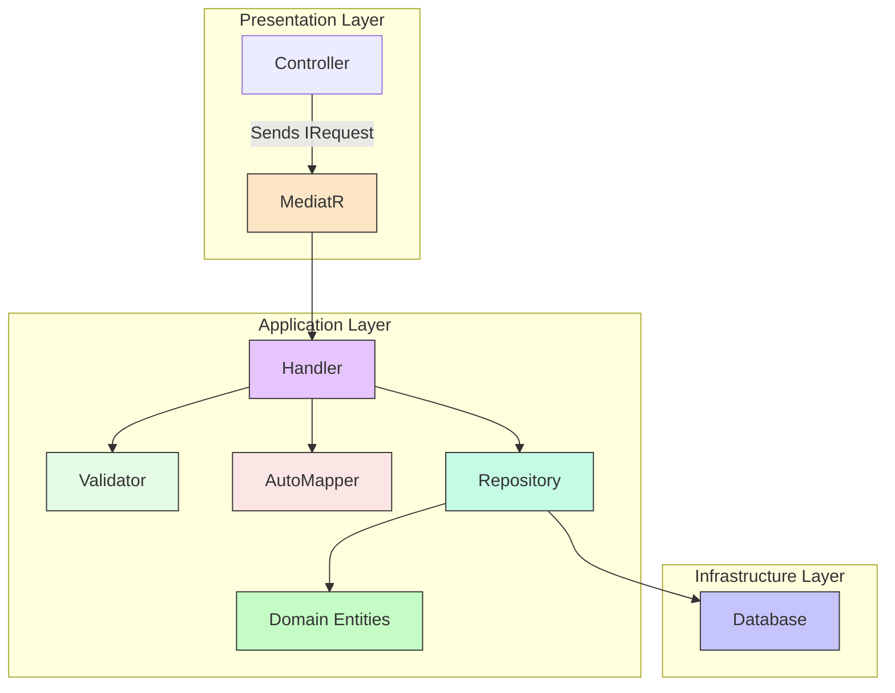

# CQRS + MediatR Guidelines

> **Project-Agnostic CQRS Guidelines**
>
> Placeholders use `{Placeholder}` syntax - see [docs/TEMPLATE_GLOSSARY.md](../../../docs/TEMPLATE_GLOSSARY.md).

## Purpose

Provides best practices for implementing **CQRS** (Command Query Responsibility Segregation) using **MediatR** in .NET Clean Architecture projects. Ensures consistent, testable, and maintainable application logic.

## When This Skill Activates

**Triggered by**:
- Keywords: "command", "query", "handler", "mediatr", "cqrs", "validation", "validator"
- Intent patterns: "create feature", "add endpoint", "implement use case"
- File patterns: `**/*Command.cs`, `**/*Query.cs`, `**/*Handler.cs`, `**/*Validator.cs`
- Content patterns: `IRequest`, `IRequestHandler`, `AbstractValidator`

## CQRS Pattern Overview



## Key Principles

1.  **Separation**: Commands (write operations) and Queries (read operations) are distinct.
2.  **Single Responsibility**: Each handler processes one specific request (command or query).
3.  **Class Requests**: Commands and Queries are defined as classes.
4.  **Validation**: FluentValidation is used at the Application boundary for input validation.
5.  **Thin Controllers**: Controllers should be minimal, primarily responsible for receiving HTTP requests, sending them to MediatR, and returning HTTP responses.
6.  **CancellationToken**: Always pass `CancellationToken` to all asynchronous methods to enable cancellation.
7.  **Repository Returns Entities**: Repositories must return domain entities, and handlers are responsible for mapping these entities to DTOs.
8.  **Validators Use Manual Instantiation**: Validators are instantiated manually within handlers, **NOT** injected via Dependency Injection.

## Resources

*For more detailed examples, refer to the `resources/` folder within this skill.*

| Resource | Description |
|----------|-------------|
| [command-patterns.md](resources/command-patterns.md) | Command structure, naming, handlers |
| [query-patterns.md](resources/query-patterns.md) | Query structure, pagination, projections |
| [handler-patterns.md](resources/handler-patterns.md) | Handler implementation, DI, error handling |
| [validation-integration.md](resources/validation-integration.md) | FluentValidation patterns and manual integration |
| [complete-examples.md](resources/complete-examples.md) | End-to-end feature examples for CQRS |

## Quick Reference

### 1. Command (Write Operation)

Commands represent actions that modify the application's state.

```csharp
// File: {Project}.Application/Features/{Entities}/Requests/Commands/Create{Entity}Command.cs
namespace {Project}.Application.Features.{Entities}.Requests.Commands;

using MediatR;
using {Project}.Application.DTOs.{Entity};
using {Project}.Application.Responses;

public class Create{Entity}Command : IRequest<BaseCommandResponse<{IdType}>>
{
    public Create{Entity}Dto {Entity}Dto { get; set; } = null!; // Command wraps a DTO
}
```
*For more details, see [command-patterns.md](resources/command-patterns.md).*

### 2. Query (Read Operation)

Queries represent requests for data and should not alter the application's state.

```csharp
// File: {Project}.Application/Features/{Entities}/Requests/Queries/Get{Entity}ListRequest.cs
namespace {Project}.Application.Features.{Entities}.Requests.Queries;

using System.Collections.Generic;
using {Project}.Application.DTOs.{Entity};
using MediatR;

public class Get{Entity}ListRequest : IRequest<List<{Entity}ListDto>>
{
    // Can include filter properties if needed
}
```
*For more details, see [query-patterns.md](resources/query-patterns.md).*

### 3. Handler (Processing Logic)

Handlers contain the business logic to execute a command or query.

```csharp
// File: {Project}.Application/Features/{Entities}/Handlers/Commands/Create{Entity}CommandHandler.cs
namespace {Project}.Application.Features.{Entities}.Handlers.Commands;

using System.Linq;
using System.Threading;
using System.Threading.Tasks;
using AutoMapper;
using {Project}.Application.Contracts.Persistence;
using {Project}.Application.DTOs.{Entity}.Validators;
using {Project}.Application.Features.{Entities}.Requests.Commands;
using {Project}.Application.Responses;
using MediatR;

public class Create{Entity}CommandHandler : IRequestHandler<Create{Entity}Command, BaseCommandResponse<{IdType}>>
{
    private readonly I{Entity}Repository _{entity}Repository;
    private readonly IMapper _mapper;
    // ... other dependencies needed for validation or business logic

    public Create{Entity}CommandHandler(I{Entity}Repository {entity}Repository, IMapper mapper /* ... */)
    {
        _{entity}Repository = {entity}Repository;
        _mapper = mapper;
    }

    public async Task<BaseCommandResponse<{IdType}>> Handle(Create{Entity}Command request, CancellationToken cancellationToken)
    {
        var response = new BaseCommandResponse<{IdType}>();

        // ✅ CRITICAL: Manual validator instantiation with dependencies
        var validator = new Create{Entity}DtoValidator(/* repositories */);
        var validationResult = await validator.ValidateAsync(request.{Entity}Dto, cancellationToken);

        if (!validationResult.IsValid)
        {
            response.Success = false;
            response.Message = "{Entity} creation failed.";
            response.Errors = validationResult.Errors.Select(e => e.ErrorMessage).ToList();
            return response;
        }

        var {entity} = _mapper.Map<{Entity}>(request.{Entity}Dto);
        {entity}.ViewCount = 0; // Set properties not coming from DTO
        {entity} = await _{entity}Repository.Create({entity});

        response.Success = true;
        response.Id = {entity}.Id;
        response.Message = "{Entity} created successfully.";
        return response;
    }
}
```
*For more details, see [handler-patterns.md](resources/handler-patterns.md).*

### 4. Validation (Manual Integration)

FluentValidation is used for input validation, with validators instantiated manually within handlers.

```csharp
// File: {Project}.Application/DTOs/{Entity}/Validators/Create{Entity}DtoValidator.cs
namespace {Project}.Application.DTOs.{Entity}.Validators;

using FluentValidation;
using {Project}.Application.Contracts.Persistence;

public class Create{Entity}DtoValidator : AbstractValidator<Create{Entity}Dto>
{
    public Create{Entity}DtoValidator(I{RelatedEntity1}Repository {relatedEntity1}Repository /* ... */)
    {
        // ... inject repositories needed for FK validation

        RuleFor(x => x.Title)
            .NotEmpty().WithMessage("Title is required")
            .MaximumLength(200);

        RuleFor(x => x.{RelatedEntity1}Id)
            .NotEmpty().WithMessage("{RelatedEntity1} is required")
            .MustAsync(async (id, cancellation) => await {relatedEntity1}Repository.Exists(id))
            .WithMessage("{RelatedEntity1} not found");
    }
}
```
*For more details, see [validation-integration.md](resources/validation-integration.md).*

## Do's

-   ✅ **DO** separate Commands (write) and Queries (read).
-   ✅ **DO** use classes for Commands/Queries (not records).
-   ✅ **DO** pass `CancellationToken` to all asynchronous methods.
-   ✅ **DO** use repositories that return domain entities (not DTOs).
-   ✅ **DO** perform DTO mapping in handlers using AutoMapper.
-   ✅ **DO** instantiate validators manually within handlers.
-   ✅ **DO** keep controllers thin, delegating to MediatR.
-   ✅ **DO** use `BaseCommandResponse<{IdType}>` for command responses (except `bool` for Delete).

## Don'ts

-   ❌ **DON'T** return entities directly from query handlers.
-   ❌ **DON'T** put business logic in controllers.
-   ❌ **DON'T** use `IRequest` without a response type.
-   ❌ **DON'T** use `.Result` or `.Wait()` in asynchronous code.
-   ❌ **DON'T** mutate state in query handlers.
-   ❌ **DON'T** throw exceptions for business validation failures; return them in the `BaseCommandResponse`.
-   ❌ **DON'T** inject validators via Dependency Injection.

---

**Related Documentation**:
- [`docs/ARCHITECTURE.md`](../../../docs/ARCHITECTURE.md) - Overall system architecture.
- [`clean-architecture-rules`](../clean-architecture-rules/SKILL.md) - Dependency enforcement.
