# Cloudflare Custom Hostnames Skill (SaaS for SaaS)

Design and implement custom hostname solutions for SaaS platforms that allow customers to bring their own domains. Handle SSL certificate provisioning, domain verification, and DNS configuration.

## SaaS Custom Hostname Architecture

```mermaid
graph TB
    subgraph "Customer Domain"
        CD[customer.com]
        CNAME[CNAME → proxy.saas.com]
    end
    subgraph "Cloudflare for SaaS"
        CH[Custom Hostname<br/>customer.com]
        SSL[SSL Certificate<br/>Auto-provisioned]
        FO[Fallback Origin<br/>app.saas.com]
    end
    subgraph "SaaS Platform"
        W[Worker<br/>Multi-tenant Router]
        DB[(Database<br/>Tenant Config)]
    end

    CD --> CNAME --> CH
    CH --> SSL --> FO --> W
    W --> DB
```



## Custom Hostname Lifecycle

| Stage | Status | Action Required |
|-------|--------|-----------------|
| 1. Created | `pending` | Customer adds CNAME record |
| 2. Verification | `pending_validation` | DNS TXT record verification |
| 3. SSL Issuance | `active` (pending SSL) | Certificate provisioning |
| 4. Active | `active` | Fully operational |
| 5. Renewal | `active` | Auto-renewal (90 days before expiry) |

## Implementation Patterns

### Pattern 1: Worker-Based Routing

Route requests based on Host header to tenant-specific configuration:

```typescript
// src/index.ts - Multi-tenant SaaS Worker
import { Hono } from 'hono';

interface Tenant {
  id: string;
  customHostname: string;
  config: Record<string, unknown>;
}

const app = new Hono<{ Bindings: Env }>();

// Middleware: Resolve tenant from hostname
app.use('*', async (c, next) => {
  const hostname = c.req.header('host') || '';

  // Check cache first
  let tenant = await c.env.KV_TENANTS.get<Tenant>(`host:${hostname}`, 'json');

  if (!tenant) {
    // Query database for tenant config
    const result = await c.env.DB.prepare(
      'SELECT * FROM tenants WHERE custom_hostname = ? OR hostname = ?'
    ).bind(hostname, hostname).first<Tenant>();

    if (result) {
      tenant = result;
      // Cache for 5 minutes
      await c.env.KV_TENANTS.put(`host:${hostname}`, JSON.stringify(tenant), {
        expirationTtl: 300
      });
    }
  }

  if (!tenant) {
    return c.text('Unknown domain', 404);
  }

  c.set('tenant', tenant);
  await next();
});

// Tenant-aware routes
app.get('/', (c) => {
  const tenant = c.get('tenant') as Tenant;
  return c.json({ tenant: tenant.id, message: 'Welcome!' });
});

export default app;
```

### Pattern 2: Custom Hostname API Integration

```typescript
// api/hostnames.ts - Custom hostname management
interface CreateHostnameRequest {
  tenantId: string;
  hostname: string;
}

export async function createCustomHostname(
  env: Env,
  request: CreateHostnameRequest
): Promise<CustomHostnameResult> {
  const { tenantId, hostname } = request;

  // 1. Create custom hostname via Cloudflare API
  const response = await fetch(
    `https://api.cloudflare.com/client/v4/zones/${env.ZONE_ID}/custom_hostnames`,
    {
      method: 'POST',
      headers: {
        'Authorization': `Bearer ${env.CF_API_TOKEN}`,
        'Content-Type': 'application/json',
      },
      body: JSON.stringify({
        hostname,
        ssl: {
          method: 'http',  // or 'cname', 'txt', 'email'
          type: 'dv',      // Domain Validation
          settings: {
            http2: 'on',
            min_tls_version: '1.2',
            tls_1_3: 'on',
          },
        },
        custom_metadata: {
          tenant_id: tenantId,
        },
      }),
    }
  );

  const result = await response.json();

  if (!result.success) {
    throw new Error(result.errors[0]?.message || 'Failed to create hostname');
  }

  // 2. Store in database
  await env.DB.prepare(
    `INSERT INTO custom_hostnames (id, tenant_id, hostname, status, cf_id)
     VALUES (?, ?, ?, ?, ?)`
  ).bind(
    crypto.randomUUID(),
    tenantId,
    hostname,
    'pending',
    result.result.id
  ).run();

  // 3. Return verification instructions
  return {
    id: result.result.id,
    hostname,
    status: result.result.status,
    verification: {
      type: result.result.ssl.method,
      // For HTTP validation
      http_url: result.result.ssl.http_url,
      http_body: result.result.ssl.http_body,
      // For CNAME/TXT validation
      cname_target: result.result.ssl.cname_target,
      txt_name: result.result.ssl.txt_name,
      txt_value: result.result.ssl.txt_value,
    },
    instructions: generateInstructions(result.result),
  };
}

function generateInstructions(hostname: any): string {
  return `
## Setup Instructions for ${hostname.hostname}

### Step 1: Add DNS Record
Add a CNAME record pointing to your SaaS proxy:

| Type  | Name                | Target                |
|-------|---------------------|----------------------|
| CNAME | ${hostname.hostname} | proxy.your-saas.com |

### Step 2: Verify Ownership (if required)
${hostname.ssl.method === 'txt' ? `
Add this TXT record:
| Type | Name | Value |
|------|------|-------|
| TXT  | ${hostname.ssl.txt_name} | ${hostname.ssl.txt_value} |
` : ''}

### Step 3: Wait for SSL
SSL certificate will be issued automatically once DNS propagates (usually 5-15 minutes).

Check status at: /api/hostnames/${hostname.id}/status
  `;
}
```

### Pattern 3: Hostname Status Webhook

```typescript
// api/webhooks/hostname-status.ts
export async function handleHostnameWebhook(
  request: Request,
  env: Env
): Promise<Response> {
  const payload = await request.json();

  // Cloudflare webhook payload
  const { data } = payload;
  const { hostname, status, ssl } = data;

  // Update database
  await env.DB.prepare(
    `UPDATE custom_hostnames SET status = ?, ssl_status = ?, updated_at = ?
     WHERE hostname = ?`
  ).bind(status, ssl?.status, new Date().toISOString(), hostname).run();

  // Clear cache
  await env.KV_TENANTS.delete(`host:${hostname}`);

  // Notify tenant if status changed to active
  if (status === 'active' && ssl?.status === 'active') {
    await notifyTenant(env, hostname, 'Your custom domain is now active!');
  }

  return new Response('OK');
}
```

## SSL Certificate Options

### Validation Methods

| Method | Description | Best For |
|--------|-------------|----------|
| `http` | HTTP file validation | Most automated; works behind proxies |
| `cname` | CNAME delegation | When customer controls DNS |
| `txt` | TXT record validation | One-time verification |
| `email` | Domain admin email | Legacy; not recommended |

### SSL Types

| Type | Certificate Authority | Cost | Use Case |
|------|----------------------|------|----------|
| `dv` | Let's Encrypt / Google Trust | Free | Standard SaaS |
| `ev` | DigiCert | $$$ | Enterprise (rare) |

### Recommended SSL Configuration

```json
{
  "ssl": {
    "method": "http",
    "type": "dv",
    "settings": {
      "http2": "on",
      "min_tls_version": "1.2",
      "tls_1_3": "on",
      "early_hints": "on"
    },
    "bundle_method": "ubiquitous",
    "wildcard": false
  }
}
```

## Troubleshooting Guide

### Common Issues

| Issue | Cause | Fix |
|-------|-------|-----|
| `pending` forever | DNS not configured | Verify CNAME record exists |
| `pending_validation` | TXT/HTTP validation failing | Check validation path accessibility |
| SSL errors | CAA records blocking | Add `0 issue "letsencrypt.org"` |
| 522 errors | Origin not reachable | Check fallback origin configuration |
| 403 Forbidden | Origin hostname mismatch | Set Host header override |

### Debugging Workflow

```javascript
// Check hostname status via MCP
mcp__cloudflare-bindings__custom_hostname_get({
  zone_id: "...",
  hostname_id: "..."
})

// List all custom hostnames
mcp__cloudflare-bindings__custom_hostnames_list({
  zone_id: "..."
})
```

### CAA Record Requirements

If customer has CAA records, they need:
```
0 issue "letsencrypt.org"
0 issue "pki.goog"
0 issue "digicert.com"
0 issuewild "letsencrypt.org"
```

## Database Schema

```sql
-- D1 schema for custom hostnames
CREATE TABLE tenants (
  id TEXT PRIMARY KEY,
  name TEXT NOT NULL,
  hostname TEXT NOT NULL,  -- Default hostname
  custom_hostname TEXT,    -- Customer's domain
  plan TEXT DEFAULT 'free',
  created_at TEXT DEFAULT (datetime('now'))
);

CREATE TABLE custom_hostnames (
  id TEXT PRIMARY KEY,
  tenant_id TEXT NOT NULL,
  hostname TEXT NOT NULL UNIQUE,
  status TEXT DEFAULT 'pending',
  ssl_status TEXT DEFAULT 'pending',
  cf_id TEXT,  -- Cloudflare custom hostname ID
  verified_at TEXT,
  expires_at TEXT,
  created_at TEXT DEFAULT (datetime('now')),
  updated_at TEXT,
  FOREIGN KEY (tenant_id) REFERENCES tenants(id)
);

CREATE INDEX idx_hostnames_tenant ON custom_hostnames(tenant_id);
CREATE INDEX idx_hostnames_hostname ON custom_hostnames(hostname);
CREATE INDEX idx_hostnames_status ON custom_hostnames(status);
```

## Wrangler Configuration

```jsonc
{
  "name": "saas-platform",
  "main": "src/index.ts",
  "compatibility_date": "2025-01-01",
  "compatibility_flags": ["nodejs_compat_v2"],

  "d1_databases": [
    { "binding": "DB", "database_name": "saas-db", "database_id": "..." }
  ],
  "kv_namespaces": [
    { "binding": "KV_TENANTS", "id": "..." }
  ],

  "vars": {
    "ZONE_ID": "your-zone-id"
  },

  // Fallback origin for custom hostnames
  "routes": [
    { "pattern": "app.your-saas.com/*", "zone_name": "your-saas.com" }
  ]
}
```

## Cost Considerations

| Feature | Cost | Included With |
|---------|------|---------------|
| Custom Hostnames | $2/hostname/month | SSL for SaaS |
| Wildcard Hostnames | $2/hostname/month | SSL for SaaS |
| SSL Certificates | Free (DV) | All plans |
| SSL for SaaS Plan | $200/month base | 100 hostnames included |
| Additional Hostnames | $0.10/hostname/month | After included quota |

### Cost Optimization Tips

- **Batch hostname creation**: Create during off-peak hours
- **Use wildcards**: `*.customer.example.com` for subdomains
- **Monitor usage**: Track active vs inactive hostnames
- **Clean up**: Remove hostnames for churned customers
- **Consider enterprise**: 10K+ hostnames? Contact CF sales

## Security Considerations

- **Hostname takeover**: Validate customer owns domain before creating
- **Certificate transparency**: Monitor CT logs for unauthorized certs
- **Origin protection**: Only allow traffic from Cloudflare IPs
- **Tenant isolation**: Ensure hostname-to-tenant mapping is secure
- **Rate limiting**: Limit hostname creation per tenant

## Output Format

```markdown
# Custom Hostname Report

**Tenant**: [Tenant Name]
**Total Hostnames**: X

## Active Hostnames

| Hostname | SSL Status | Expires | Traffic (30d) |
|----------|------------|---------|---------------|
| app.customer.com | Active | 2025-03-15 | 1.2M requests |

## Pending Hostnames

| Hostname | Status | Action Required |
|----------|--------|-----------------|
| new.customer.com | pending_validation | Add TXT record |

## Issues Detected

### [CH001] Hostname approaching SSL expiry
- **Hostname**: old.customer.com
- **Expires**: 2025-01-10
- **Fix**: Renew or remove if unused
```

## Tips

- **Wildcard support**: Use `*.example.com` for unlimited subdomains
- **Fallback handling**: Always have a catch-all route for unknown hostnames
- **Status polling**: Implement webhook or poll every 30s during setup
- **Customer communication**: Send email when hostname becomes active
- **Monitoring**: Track hostname verification success rates
- **API token scope**: Use minimal permissions (Zone:Custom Hostnames:Edit)
