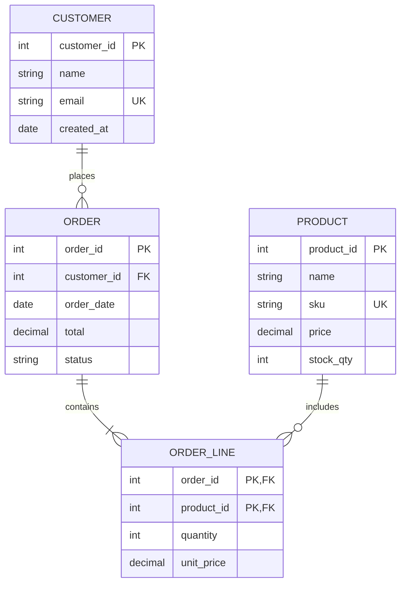
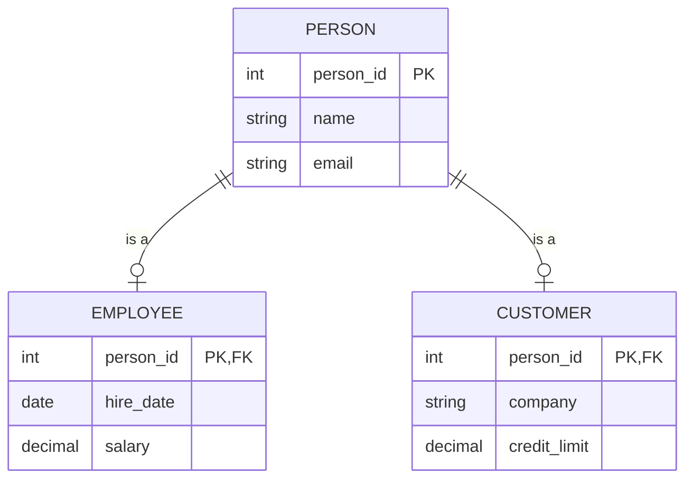
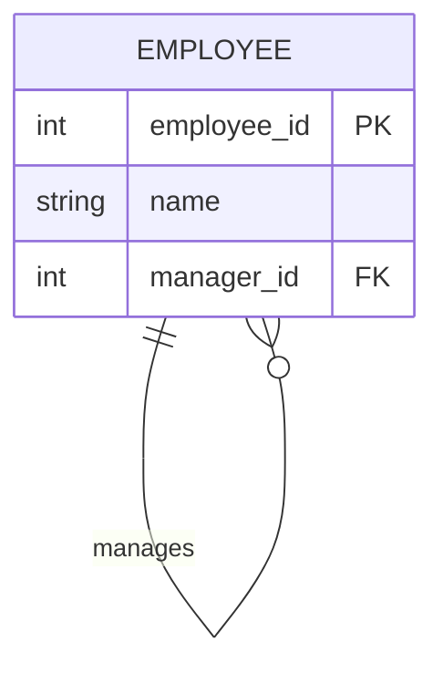
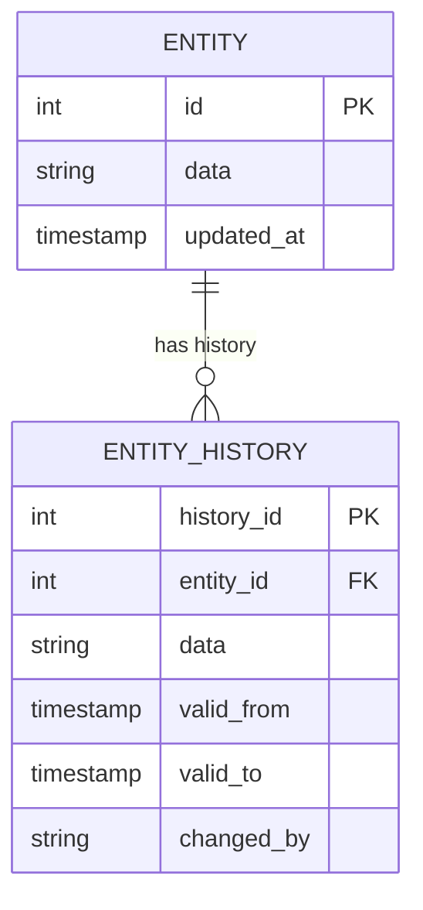

# Data Modeling

## When to Use This Skill

Use this skill when:

- **Data Modeling tasks** - Working on data modeling with entity-relationship diagrams (erds), data dictionaries, and conceptual/logical/physical models. documents data structures, relationships, and attributes
- **Planning or design** - Need guidance on Data Modeling approaches
- **Best practices** - Want to follow established patterns and standards

## Overview

Create and document data structures using Entity-Relationship Diagrams (ERDs), data dictionaries, and structured data models. Supports conceptual, logical, and physical modeling levels for database design and data architecture.

## What is Data Modeling?

**Data modeling** creates visual and structured representations of data elements and their relationships. It documents:

- **Entities**: Things about which data is stored
- **Attributes**: Properties of entities
- **Relationships**: How entities connect
- **Constraints**: Rules governing data

## Modeling Levels

| Level | Purpose | Audience | Detail |
|-------|---------|----------|--------|
| **Conceptual** | Business concepts | Business users | Entities, high-level relationships |
| **Logical** | Data structure | Analysts, designers | Entities, attributes, all relationships |
| **Physical** | Implementation | Developers, DBAs | Tables, columns, types, indexes |

### Conceptual Model

High-level view of business concepts:

- Major entities only
- Key relationships
- No attributes (or minimal)
- No technical details

### Logical Model

Technology-independent data structure:

- All entities and attributes
- Primary and foreign keys
- All relationships with cardinality
- Normalization applied
- No physical implementation details

### Physical Model

Database-specific implementation:

- Table names (physical naming)
- Column names and data types
- Indexes and constraints
- Views and stored procedures
- Database-specific features

## ERD Notation

### Entity (Rectangle)

An entity represents a thing about which data is stored.

```text
┌─────────────────┐
│    CUSTOMER     │
├─────────────────┤
│ customer_id PK  │
│ name            │
│ email           │
│ created_at      │
└─────────────────┘
```

**Entity Types:**

| Type | Description | Example |
|------|-------------|---------|
| **Strong** | Independent existence | Customer, Product |
| **Weak** | Depends on another entity | Order Line (depends on Order) |
| **Associative** | Resolves M:N relationships | Enrollment (Student-Course) |

### Attributes

| Type | Symbol | Description |
|------|--------|-------------|
| **Primary Key (PK)** | Underlined/PK | Unique identifier |
| **Foreign Key (FK)** | FK | Reference to another entity |
| **Required** | * or NOT NULL | Must have value |
| **Optional** | ○ or NULL | May be empty |
| **Derived** | / | Calculated from other attributes |
| **Composite** | {attrs} | Made of sub-attributes |
| **Multi-valued** | [attr] | Can have multiple values |

### Relationships (Lines)

**Notation Styles:**

| Style | Used In |
|-------|---------|
| Chen | Academic, conceptual |
| Crow's Foot | Industry standard |
| UML | Software design |
| IDEF1X | Government, structured |

**Crow's Foot Notation:**

| Symbol | Meaning |
|--------|---------|
| `──` | One (mandatory) |
| `──○` | Zero or one (optional) |
| `──<` | Many |
| `──○<` | Zero or many |

### Cardinality

| Notation | Meaning | Example |
|----------|---------|---------|
| 1:1 | One to one | Employee → Workstation |
| 1:M | One to many | Customer → Orders |
| M:N | Many to many | Students ↔ Courses |

**Reading Cardinality:**

"One [Entity A] has [min]..[max] [Entity B]"

Example: "One Customer has 0..many Orders"

## Workflow

### Phase 1: Identify Entities

#### Step 1: Extract Nouns from Requirements

From business requirements, identify:

- Things the business tracks
- Subjects of business rules
- Sources and targets of data

#### Step 2: Filter Candidates

| Keep | Exclude |
|------|---------|
| Independent concepts | Attributes (properties of entities) |
| Things with multiple instances | Synonyms (same concept, different name) |
| Things requiring data storage | Actions (verbs, not nouns) |

#### Step 3: Document Entities

```markdown
## Entities

| Entity | Description | Example |
|--------|-------------|---------|
| Customer | Person or organization that purchases | John Smith, Acme Corp |
| Order | Purchase transaction | Order #12345 |
| Product | Item available for sale | Widget, Gadget |
```

### Phase 2: Define Attributes

#### Step 1: List Attributes for Each Entity

For each entity, identify:

- What do we need to know about this entity?
- What uniquely identifies it?
- What data does the business reference?

#### Step 2: Classify Attributes

| Attribute | Type | Required | Notes |
|-----------|------|----------|-------|
| customer_id | PK | Yes | Surrogate key |
| email | Unique | Yes | Business key |
| name | String | Yes | |
| phone | String | No | Optional |

#### Step 3: Identify Keys

- **Primary Key (PK)**: Unique identifier
- **Natural Key**: Business-meaningful identifier
- **Surrogate Key**: System-generated identifier
- **Composite Key**: Multiple attributes combined

### Phase 3: Define Relationships

#### Step 1: Identify Connections

For each pair of entities:

- Is there a business connection?
- What is the nature of the relationship?
- What is the cardinality?

#### Step 2: Document Relationships

```markdown
## Relationships

| Relationship | From | To | Cardinality | Description |
|--------------|------|-----|-------------|-------------|
| places | Customer | Order | 1:M | Customer places orders |
| contains | Order | Product | M:N | Order contains products |
```

#### Step 3: Resolve Many-to-Many

M:N relationships require associative entities:

```text
Student ──M:N── Course

Becomes:

Student ──1:M── Enrollment ──M:1── Course
```

### Phase 4: Normalize (Logical Model)

**Normal Forms:**

| Form | Rule | Violation Example |
|------|------|-------------------|
| **1NF** | Atomic values, no repeating groups | Phone1, Phone2, Phone3 |
| **2NF** | No partial dependencies | Non-key depends on part of composite key |
| **3NF** | No transitive dependencies | Non-key depends on non-key |
| **BCNF** | Every determinant is a candidate key | Overlap in candidate keys |

**When to Denormalize:**

- Read performance critical
- Reporting/analytics use cases
- Data warehouse design
- Justified with clear trade-off analysis

### Phase 5: Create Physical Model

#### Step 1: Map to Physical Types

| Logical Type | Physical (PostgreSQL) | Physical (SQL Server) |
|--------------|----------------------|----------------------|
| String(50) | VARCHAR(50) | NVARCHAR(50) |
| Integer | INTEGER | INT |
| Decimal(10,2) | NUMERIC(10,2) | DECIMAL(10,2) |
| Date | DATE | DATE |
| Timestamp | TIMESTAMP | DATETIME2 |
| Boolean | BOOLEAN | BIT |

#### Step 2: Define Constraints

- Primary key constraints
- Foreign key constraints
- Unique constraints
- Check constraints
- Default values

#### Step 3: Plan Indexes

- Primary key (automatic)
- Foreign keys (for joins)
- Frequently queried columns
- Covering indexes for performance

## Output Formats

### Mermaid ERD



### Data Dictionary

```markdown
## Data Dictionary

### CUSTOMER

| Column | Type | Null | Key | Default | Description |
|--------|------|------|-----|---------|-------------|
| customer_id | INT | No | PK | AUTO | Unique identifier |
| name | VARCHAR(100) | No | | | Customer full name |
| email | VARCHAR(255) | No | UK | | Contact email |
| phone | VARCHAR(20) | Yes | | NULL | Contact phone |
| created_at | TIMESTAMP | No | | NOW() | Record creation |

**Indexes:**
- `pk_customer` (customer_id) - Primary
- `uk_customer_email` (email) - Unique
- `ix_customer_name` (name) - Search

**Constraints:**
- Email format validation (CHECK)
- Name length minimum 2 characters
```

### Structured Data (YAML)

```yaml
data_model:
  name: "E-Commerce"
  version: "1.0"
  date: "2025-01-15"
  level: "logical"  # conceptual, logical, physical
  analyst: "data-modeler"

  entities:
    - name: "Customer"
      type: "strong"
      description: "Person or organization that makes purchases"
      attributes:
        - name: "customer_id"
          type: "integer"
          key: "primary"
          required: true
          generated: true

        - name: "email"
          type: "string"
          length: 255
          key: "unique"
          required: true

        - name: "name"
          type: "string"
          length: 100
          required: true

    - name: "Order"
      type: "strong"
      description: "Purchase transaction"
      attributes:
        - name: "order_id"
          type: "integer"
          key: "primary"
          required: true

        - name: "customer_id"
          type: "integer"
          key: "foreign"
          references: "Customer.customer_id"
          required: true

  relationships:
    - name: "places"
      from: "Customer"
      to: "Order"
      cardinality: "1:M"
      from_participation: "optional"  # 0..1
      to_participation: "mandatory"   # 1..M
      description: "Customer places orders"

  constraints:
    - entity: "Customer"
      type: "check"
      expression: "LENGTH(name) >= 2"
      description: "Name minimum length"

  indexes:
    - entity: "Order"
      name: "ix_order_date"
      columns: ["order_date"]
      purpose: "Date range queries"
```

### Narrative Summary

```markdown
## Data Model: E-Commerce

**Version:** 1.0
**Date:** [ISO Date]
**Level:** Logical

### Entity Summary

| Entity | Description | Key Relationships |
|--------|-------------|-------------------|
| Customer | Purchasers | Places Orders |
| Order | Transactions | Belongs to Customer, Contains Products |
| Product | Items for sale | Included in Orders |
| Order Line | Order details | Links Order to Product |

### Key Relationships

1. **Customer → Order (1:M)**
   - One customer can place many orders
   - Each order belongs to exactly one customer

2. **Order ↔ Product (M:N via Order Line)**
   - An order can contain many products
   - A product can appear in many orders

### Data Integrity Rules

1. Orders cannot exist without a customer
2. Order lines must reference valid order and product
3. Stock quantity cannot be negative
4. Email must be unique per customer

### Notes

- Consider partitioning Orders by date for large volumes
- Product price stored in Order Line for historical accuracy
```

## Common Patterns

### Inheritance (Subtype/Supertype)



### Self-Referencing



### Audit Trail



## Integration

### Upstream

- **Requirements** - Data requirements source
- **domain-storytelling** - Domain concepts
- **process-modeling** - Data in processes

### Downstream

- **Database design** - Physical implementation
- **API design** - Data contracts
- **Integration** - Data exchange

## Related Skills

- `process-modeling` - Process context for data
- `journey-mapping` - Customer data touchpoints
- `decision-analysis` - Data-driven decisions
- `capability-mapping` - Data supporting capabilities

## Version History

- **v1.0.0** (2025-12-26): Initial release
