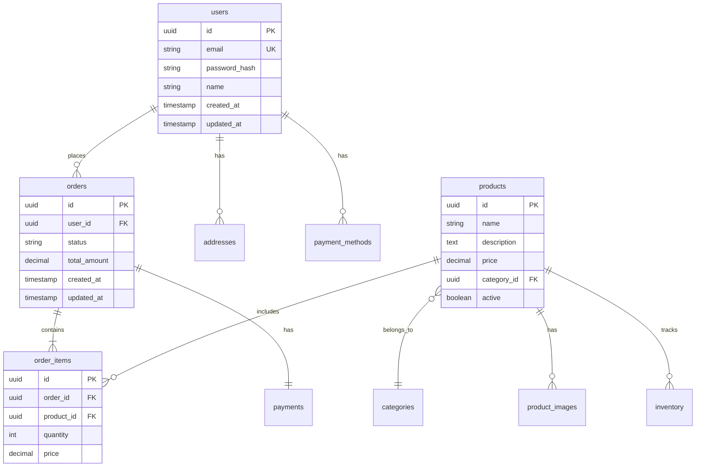

# Database Schema Documentation

## Overview

Create comprehensive database schema documentation including entity relationship diagrams (ERD), table definitions, indexes, constraints, and data dictionaries.

## When to Use

- Database schema documentation
- ERD (Entity Relationship Diagrams)
- Data dictionary creation
- Table relationship documentation
- Index and constraint documentation
- Migration documentation
- Database design specs

## Schema Documentation Template

```markdown
# Database Schema Documentation

**Database:** PostgreSQL 14.x
**Version:** 2.0
**Last Updated:** 2025-01-15
**Schema Version:** 20250115120000

## Overview

This database supports an e-commerce application with user management, product catalog, orders, and payment processing.

## Entity Relationship Diagram



---

## Tables

### users

Stores user account information.

**Columns:**

| Column | Type | Null | Default | Description |
|--------|------|------|---------|-------------|
| id | uuid | NO | gen_random_uuid() | Primary key |
| email | varchar(255) | NO | - | User email (unique) |
| password_hash | varchar(255) | NO | - | bcrypt hashed password |
| name | varchar(255) | NO | - | User's full name |
| email_verified | boolean | NO | false | Email verification status |
| two_factor_enabled | boolean | NO | false | 2FA enabled flag |
| two_factor_secret | varchar(32) | YES | - | TOTP secret |
| created_at | timestamp | NO | now() | Record creation time |
| updated_at | timestamp | NO | now() | Last update time |
| deleted_at | timestamp | YES | - | Soft delete timestamp |
| last_login_at | timestamp | YES | - | Last login timestamp |

**Indexes:**

```sql
CREATE UNIQUE INDEX idx_users_email ON users(email);
CREATE INDEX idx_users_created_at ON users(created_at);
CREATE INDEX idx_users_deleted_at ON users(deleted_at) WHERE deleted_at IS NULL;
```

**Constraints:**

```sql
ALTER TABLE users
  ADD CONSTRAINT users_email_format
  CHECK (email ~* '^[A-Za-z0-9._%+-]+@[A-Za-z0-9.-]+\.[A-Za-z]{2,}$');

ALTER TABLE users
  ADD CONSTRAINT users_name_length
  CHECK (length(name) >= 2);
```

**Triggers:**

```sql
-- Update updated_at timestamp
CREATE TRIGGER update_users_updated_at
  BEFORE UPDATE ON users
  FOR EACH ROW
  EXECUTE FUNCTION update_updated_at_column();
```

**Sample Data:**

```sql
INSERT INTO users (email, password_hash, name, email_verified)
VALUES
  ('john@example.com', '$2b$12$...', 'John Doe', true),
  ('jane@example.com', '$2b$12$...', 'Jane Smith', true);
```

---

### products

Stores product catalog information.

**Columns:**

| Column | Type | Null | Default | Description |
|--------|------|------|---------|-------------|
| id | uuid | NO | gen_random_uuid() | Primary key |
| name | varchar(255) | NO | - | Product name |
| slug | varchar(255) | NO | - | URL-friendly name (unique) |
| description | text | YES | - | Product description |
| price | decimal(10,2) | NO | - | Product price in USD |
| compare_at_price | decimal(10,2) | YES | - | Original price (for sales) |
| sku | varchar(100) | NO | - | Stock keeping unit (unique) |
| category_id | uuid | NO | - | Foreign key to categories |
| brand | varchar(100) | YES | - | Product brand |
| active | boolean | NO | true | Product visibility |
| featured | boolean | NO | false | Featured product flag |
| metadata | jsonb | YES | - | Additional product metadata |
| created_at | timestamp | NO | now() | Record creation time |
| updated_at | timestamp | NO | now() | Last update time |

**Indexes:**

```sql
CREATE UNIQUE INDEX idx_products_slug ON products(slug);
CREATE UNIQUE INDEX idx_products_sku ON products(sku);
CREATE INDEX idx_products_category_id ON products(category_id);
CREATE INDEX idx_products_active ON products(active);
CREATE INDEX idx_products_featured ON products(featured) WHERE featured = true;
CREATE INDEX idx_products_metadata ON products USING gin(metadata);
```

**Foreign Keys:**

```sql
ALTER TABLE products
  ADD CONSTRAINT fk_products_category
  FOREIGN KEY (category_id)
  REFERENCES categories(id)
  ON DELETE RESTRICT;
```

**Full-Text Search:**

```sql
-- Add full-text search column
ALTER TABLE products ADD COLUMN search_vector tsvector;

-- Create full-text index
CREATE INDEX idx_products_search ON products USING gin(search_vector);

-- Trigger to update search vector
CREATE TRIGGER products_search_vector_update
  BEFORE INSERT OR UPDATE ON products
  FOR EACH ROW
  EXECUTE FUNCTION
    tsvector_update_trigger(
      search_vector, 'pg_catalog.english',
      name, description, brand
    );
```

---

### orders

Stores customer orders.

**Columns:**

| Column | Type | Null | Default | Description |
|--------|------|------|---------|-------------|
| id | uuid | NO | gen_random_uuid() | Primary key |
| order_number | varchar(20) | NO | - | Human-readable order ID (unique) |
| user_id | uuid | NO | - | Foreign key to users |
| status | varchar(20) | NO | 'pending' | Order status |
| subtotal | decimal(10,2) | NO | - | Items subtotal |
| tax | decimal(10,2) | NO | 0 | Tax amount |
| shipping | decimal(10,2) | NO | 0 | Shipping cost |
| total | decimal(10,2) | NO | - | Total amount |
| currency | char(3) | NO | 'USD' | Currency code |
| notes | text | YES | - | Order notes |
| shipping_address | jsonb | NO | - | Shipping address |
| billing_address | jsonb | NO | - | Billing address |
| created_at | timestamp | NO | now() | Order creation time |
| updated_at | timestamp | NO | now() | Last update time |
| confirmed_at | timestamp | YES | - | Order confirmation time |
| shipped_at | timestamp | YES | - | Shipping time |
| delivered_at | timestamp | YES | - | Delivery time |
| cancelled_at | timestamp | YES | - | Cancellation time |

**Indexes:**

```sql
CREATE UNIQUE INDEX idx_orders_order_number ON orders(order_number);
CREATE INDEX idx_orders_user_id ON orders(user_id);
CREATE INDEX idx_orders_status ON orders(status);
CREATE INDEX idx_orders_created_at ON orders(created_at);
```

**Constraints:**

```sql
ALTER TABLE orders
  ADD CONSTRAINT orders_status_check
  CHECK (status IN ('pending', 'confirmed', 'processing', 'shipped', 'delivered', 'cancelled', 'refunded'));

ALTER TABLE orders
  ADD CONSTRAINT orders_total_positive
  CHECK (total >= 0);
```

**Computed Columns:**

```sql
-- Total is computed from subtotal + tax + shipping
ALTER TABLE orders
  ADD CONSTRAINT orders_total_computation
  CHECK (total = subtotal + tax + shipping);
```

---

### order_items

Line items for each order.

**Columns:**

| Column | Type | Null | Default | Description |
|--------|------|------|---------|-------------|
| id | uuid | NO | gen_random_uuid() | Primary key |
| order_id | uuid | NO | - | Foreign key to orders |
| product_id | uuid | NO | - | Foreign key to products |
| product_snapshot | jsonb | NO | - | Product data at order time |
| quantity | int | NO | - | Quantity ordered |
| unit_price | decimal(10,2) | NO | - | Price per unit |
| subtotal | decimal(10,2) | NO | - | Line item total |
| created_at | timestamp | NO | now() | Record creation time |

**Indexes:**

```sql
CREATE INDEX idx_order_items_order_id ON order_items(order_id);
CREATE INDEX idx_order_items_product_id ON order_items(product_id);
```

**Foreign Keys:**

```sql
ALTER TABLE order_items
  ADD CONSTRAINT fk_order_items_order
  FOREIGN KEY (order_id)
  REFERENCES orders(id)
  ON DELETE CASCADE;

ALTER TABLE order_items
  ADD CONSTRAINT fk_order_items_product
  FOREIGN KEY (product_id)
  REFERENCES products(id)
  ON DELETE RESTRICT;
```

**Constraints:**

```sql
ALTER TABLE order_items
  ADD CONSTRAINT order_items_quantity_positive
  CHECK (quantity > 0);

ALTER TABLE order_items
  ADD CONSTRAINT order_items_subtotal_computation
  CHECK (subtotal = quantity * unit_price);
```

---

## Views

### active_products_view

Shows only active products with category information.

```sql
CREATE VIEW active_products_view AS
SELECT
  p.id,
  p.name,
  p.slug,
  p.description,
  p.price,
  p.compare_at_price,
  p.sku,
  p.brand,
  c.name as category_name,
  c.slug as category_slug,
  (SELECT COUNT(*) FROM order_items oi WHERE oi.product_id = p.id) as times_ordered,
  (SELECT AVG(rating) FROM product_reviews pr WHERE pr.product_id = p.id) as avg_rating
FROM products p
JOIN categories c ON p.category_id = c.id
WHERE p.active = true;
```

### user_order_summary

Aggregated order statistics per user.

```sql
CREATE MATERIALIZED VIEW user_order_summary AS
SELECT
  u.id as user_id,
  u.email,
  u.name,
  COUNT(o.id) as total_orders,
  SUM(o.total) as total_spent,
  AVG(o.total) as average_order_value,
  MAX(o.created_at) as last_order_date,
  MIN(o.created_at) as first_order_date
FROM users u
LEFT JOIN orders o ON u.id = o.user_id AND o.status != 'cancelled'
GROUP BY u.id, u.email, u.name;

-- Refresh strategy
CREATE INDEX idx_user_order_summary_user_id ON user_order_summary(user_id);
REFRESH MATERIALIZED VIEW CONCURRENTLY user_order_summary;
```

---

## Functions

### calculate_order_total

Calculates order total with tax and shipping.

```sql
CREATE OR REPLACE FUNCTION calculate_order_total(
  p_subtotal decimal,
  p_tax_rate decimal,
  p_shipping decimal
)
RETURNS decimal AS $$
BEGIN
  RETURN ROUND((p_subtotal * (1 + p_tax_rate) + p_shipping)::numeric, 2);
END;
$$ LANGUAGE plpgsql IMMUTABLE;
```

### update_updated_at_column

Trigger function to automatically update updated_at timestamp.

```sql
CREATE OR REPLACE FUNCTION update_updated_at_column()
RETURNS TRIGGER AS $$
BEGIN
  NEW.updated_at = now();
  RETURN NEW;
END;
$$ LANGUAGE plpgsql;
```

---

## Data Dictionary

### Enum Types

```sql
-- Order status values
CREATE TYPE order_status AS ENUM (
  'pending',
  'confirmed',
  'processing',
  'shipped',
  'delivered',
  'cancelled',
  'refunded'
);

-- Payment status values
CREATE TYPE payment_status AS ENUM (
  'pending',
  'processing',
  'succeeded',
  'failed',
  'refunded'
);
```

### JSONB Structures

#### shipping_address format

```json
{
  "street": "123 Main St",
  "street2": "Apt 4B",
  "city": "New York",
  "state": "NY",
  "postalCode": "10001",
  "country": "US"
}
```

#### product_snapshot format

```json
{
  "name": "Product Name",
  "sku": "PROD-123",
  "price": 99.99,
  "image": "https://cdn.example.com/product.jpg"
}
```

---

## Migrations

### Migration: 20250115120000_add_two_factor_auth

```sql
-- Up
ALTER TABLE users ADD COLUMN two_factor_enabled BOOLEAN DEFAULT FALSE;
ALTER TABLE users ADD COLUMN two_factor_secret VARCHAR(32);

CREATE TABLE two_factor_backup_codes (
  id UUID PRIMARY KEY DEFAULT gen_random_uuid(),
  user_id UUID NOT NULL REFERENCES users(id) ON DELETE CASCADE,
  code_hash VARCHAR(255) NOT NULL,
  used_at TIMESTAMP,
  created_at TIMESTAMP DEFAULT NOW()
);

CREATE INDEX idx_2fa_backup_codes_user_id ON two_factor_backup_codes(user_id);

-- Down
DROP TABLE two_factor_backup_codes;
ALTER TABLE users DROP COLUMN two_factor_secret;
ALTER TABLE users DROP COLUMN two_factor_enabled;
```

---

## Performance Optimization

### Recommended Indexes

```sql
-- Frequently queried columns
CREATE INDEX CONCURRENTLY idx_users_email_verified ON users(email_verified);
CREATE INDEX CONCURRENTLY idx_products_price ON products(price);
CREATE INDEX CONCURRENTLY idx_orders_user_status ON orders(user_id, status);

-- Composite indexes for common queries
CREATE INDEX CONCURRENTLY idx_products_category_active
  ON products(category_id, active)
  WHERE active = true;

CREATE INDEX CONCURRENTLY idx_orders_user_created
  ON orders(user_id, created_at DESC);
```

### Query Optimization

```sql
-- EXPLAIN ANALYZE for slow queries
EXPLAIN ANALYZE
SELECT p.*, c.name as category_name
FROM products p
JOIN categories c ON p.category_id = c.id
WHERE p.active = true
ORDER BY p.created_at DESC
LIMIT 20;

-- Add covering index if needed
CREATE INDEX idx_products_active_created
  ON products(active, created_at DESC)
  INCLUDE (name, price, slug);
```

---

## Backup & Recovery

### Backup Schedule

- **Full Backup:** Daily at 2 AM UTC
- **Incremental Backup:** Every 6 hours
- **WAL Archiving:** Continuous
- **Retention:** 30 days

### Backup Commands

```bash
# Full backup
pg_dump -h localhost -U postgres -Fc database_name > backup.dump

# Restore
pg_restore -h localhost -U postgres -d database_name backup.dump

# Backup specific tables
pg_dump -h localhost -U postgres -t users -t orders database_name > tables.sql
```

---

## Data Retention Policy

| Table | Retention | Archive Strategy |
|-------|-----------|------------------|
| users | Indefinite | Soft delete after 2 years inactive |
| orders | 7 years | Move to archive after 2 years |
| order_items | 7 years | Move to archive with orders |
| logs | 90 days | Delete after retention period |

```

## Best Practices

### ✅ DO
- Document all tables and columns
- Create ERD diagrams
- Document indexes and constraints
- Include sample data
- Document foreign key relationships
- Show JSONB field structures
- Document triggers and functions
- Include migration scripts
- Specify data types precisely
- Document performance considerations

### ❌ DON'T
- Skip constraint documentation
- Forget to version schema changes
- Ignore performance implications
- Skip index documentation
- Forget to document enum values

## Resources

- [PostgreSQL Documentation](https://www.postgresql.org/docs/)
- [dbdiagram.io](https://dbdiagram.io/) - ERD tool
- [SchemaSpy](https://schemaspy.org/) - Schema documentation generator
- [Mermaid ERD Syntax](https://mermaid.js.org/syntax/entityRelationshipDiagram.html)
