# Database Visualization Skill

Expert knowledge for creating entity-relationship diagrams (ERDs) and visual representations of database schemas using Mermaid.js.

## Mermaid.js ERD Syntax

Mermaid.js is a text-based diagramming tool that renders beautiful diagrams from markdown-like syntax.

### Basic ERD Structure

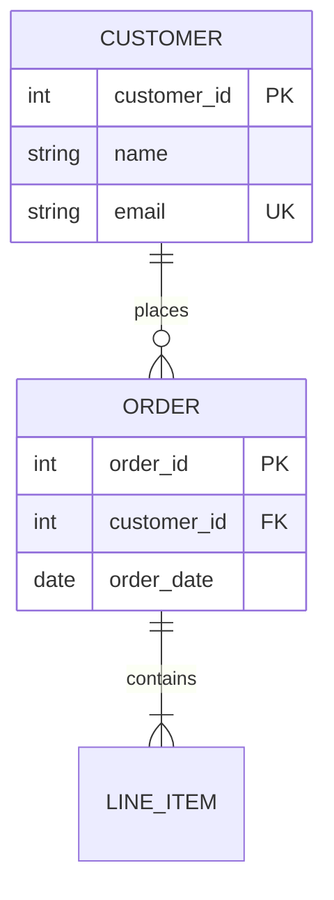

### Relationship Cardinality

Mermaid uses special notation for relationship cardinality:

| Cardinality | Left | Right | Syntax | Example |
|-------------|------|-------|--------|---------|
| Zero or one | `|o` | `o|` | `\|o--o\|` | Optional one-to-one |
| Exactly one | `||` | `||` | `\|\|--\|\|` | Required one-to-one |
| Zero or more | `}o` | `o{` | `}o--o{` | Many-to-many |
| One or more | `}|` | `|{` | `}\|--\|{` | One to many (required) |

**Common Patterns:**

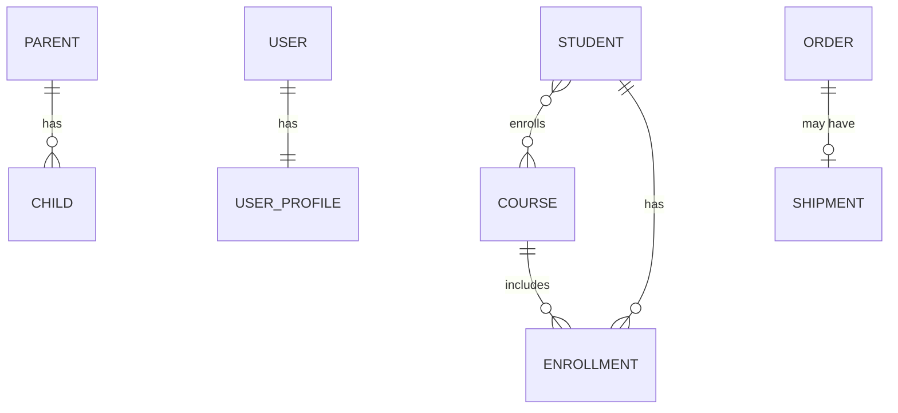

### Entity Attributes

Define entity attributes with:
- Column name
- Data type
- Constraints (PK, FK, UK)
- Optional description

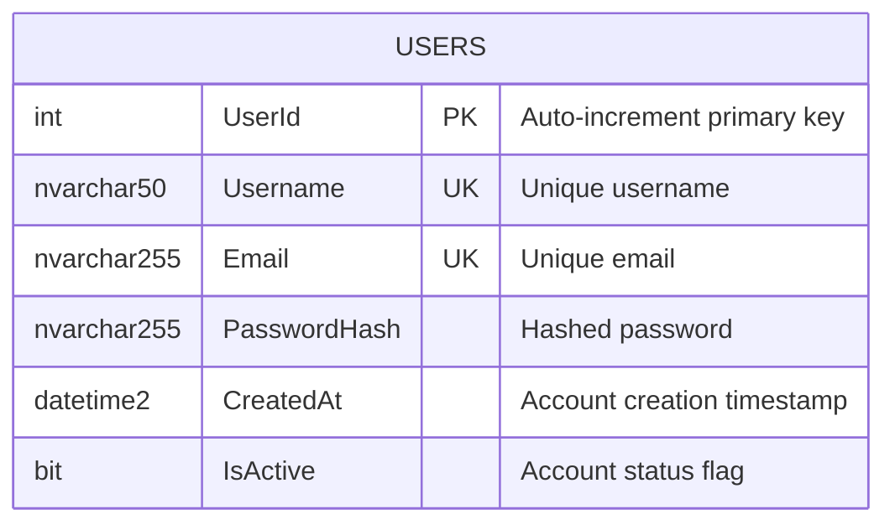

### Relationship Labels

Add meaningful labels to relationships:

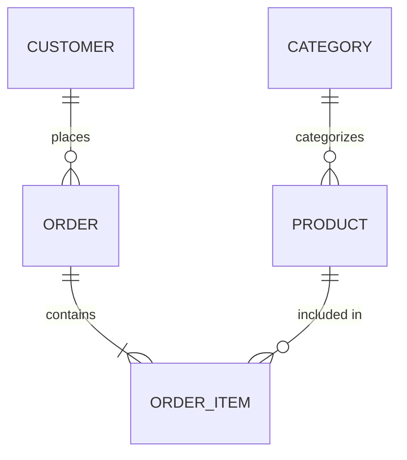

## SQL Server to Mermaid Mapping

### Data Type Mapping

| SQL Server Type | Mermaid Notation | Example |
|----------------|------------------|---------|
| `INT` | `int` | `UserId int PK` |
| `BIGINT` | `bigint` | `OrderId bigint PK` |
| `NVARCHAR(n)` | `nvarchar{n}` | `Username nvarchar50 UK` |
| `NVARCHAR(MAX)` | `nvarcharMAX` | `Content nvarcharMAX` |
| `VARCHAR(n)` | `varchar{n}` | `Code varchar20` |
| `DECIMAL(p,s)` | `decimal{p_s}` | `Price decimal10_2` |
| `DATETIME2` | `datetime2` | `CreatedAt datetime2` |
| `DATE` | `date` | `BirthDate date` |
| `TIME` | `time` | `OpenTime time` |
| `BIT` | `bit` | `IsActive bit` |
| `UNIQUEIDENTIFIER` | `guid` | `RowGuid guid PK` |

### Constraint Notation

- `PK` - Primary Key
- `FK` - Foreign Key
- `UK` - Unique Key
- `PK_FK` - Composite primary key + foreign key (junction tables)

## Complete Examples

### E-Commerce Schema

```mermaid
erDiagram
    CUSTOMERS ||--o{ ORDERS : places
    ORDERS ||--|{ ORDER_ITEMS : contains
    PRODUCTS ||--o{ ORDER_ITEMS : "ordered in"
    CATEGORIES ||--o{ PRODUCTS : categorizes
    CUSTOMERS ||--o{ ADDRESSES : has
    ORDERS ||--o| SHIPMENTS : "shipped via"

    CUSTOMERS {
        int CustomerId PK
        nvarchar100 CustomerName
        nvarchar255 Email UK
        nvarchar20 Phone
        datetime2 CreatedAt
        bit IsActive
    }

    ADDRESSES {
        int AddressId PK
        int CustomerId FK
        nvarchar200 Street
        nvarchar100 City
        nvarchar50 State
        nvarchar20 ZipCode
        nvarchar50 Country
    }

    ORDERS {
        int OrderId PK
        int CustomerId FK
        datetime2 OrderDate
        decimal10_2 TotalAmount
        nvarchar20 Status
    }

    ORDER_ITEMS {
        int OrderItemId PK
        int OrderId FK
        int ProductId FK
        int Quantity
        decimal10_2 UnitPrice
        decimal10_2 Subtotal
    }

    PRODUCTS {
        int ProductId PK
        int CategoryId FK
        nvarchar200 ProductName
        nvarcharMAX Description
        decimal10_2 Price
        int Stock
        bit IsActive
    }

    CATEGORIES {
        int CategoryId PK
        nvarchar100 CategoryName UK
        nvarchar500 Description
    }

    SHIPMENTS {
        int ShipmentId PK
        int OrderId FK UK
        nvarchar100 Carrier
        nvarchar50 TrackingNumber
        datetime2 ShippedDate
        datetime2 DeliveredDate
    }
```

### Blog Platform Schema

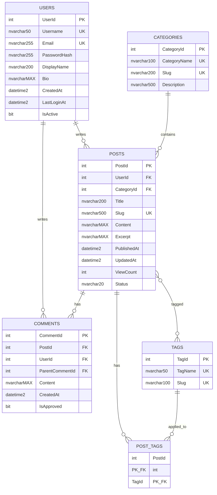

### Many-to-Many with Attributes (Enrollment System)

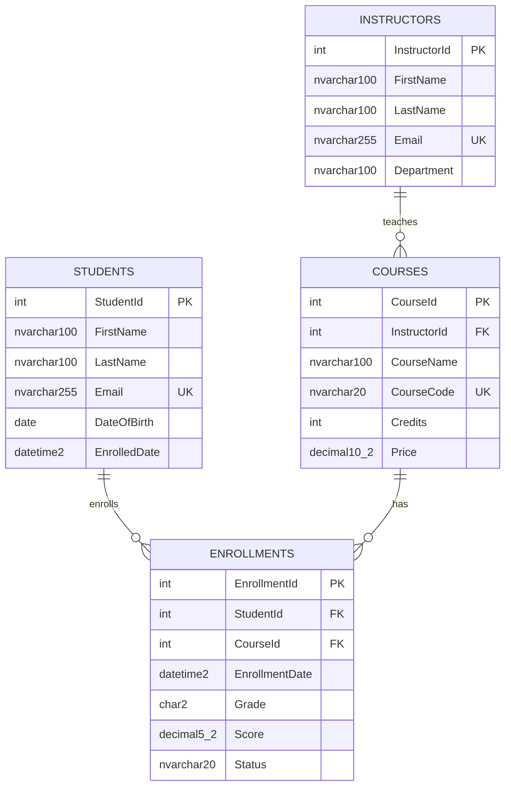

## Best Practices

### 1. Consistent Entity Naming

Choose either singular or plural and stick with it:
- ✅ Plural: `USERS`, `ORDERS`, `PRODUCTS`
- ✅ Singular: `USER`, `ORDER`, `PRODUCT`
- ❌ Mixed: `USER`, `ORDERS`, `PRODUCT`

### 2. Clear Relationship Labels

Use verb phrases that read naturally:
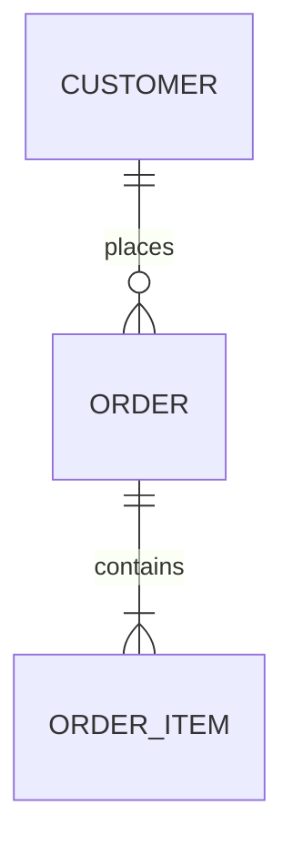

### 3. Show Important Attributes

Include enough detail to understand the schema, but don't overcrowd:
- ✅ Primary keys, foreign keys, unique constraints
- ✅ Key business attributes
- ✅ Important data types
- ❌ Every single column (too cluttered)

### 4. Group Related Entities

Organize entities logically in the diagram:
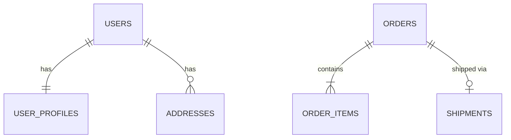

### 5. Use Composite Keys Appropriately

For junction tables in many-to-many relationships:
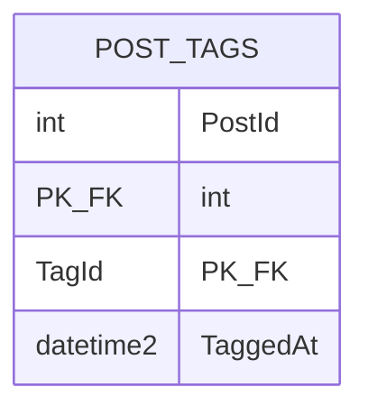

## Rendering Mermaid Diagrams

### In Markdown Files

````markdown
```mermaid
erDiagram
    USERS ||--o{ POSTS : writes
    ...
```
````

### In GitHub

GitHub automatically renders Mermaid diagrams in:
- README.md files
- Issue descriptions
- Pull request descriptions
- Wiki pages

### In VS Code

Install the "Markdown Preview Mermaid Support" extension to see live previews.

### Online Editors

- [Mermaid Live Editor](https://mermaid.live/)
- [Mermaid Chart](https://www.mermaidchart.com/)

## Common Patterns

### Self-Referencing Relationships

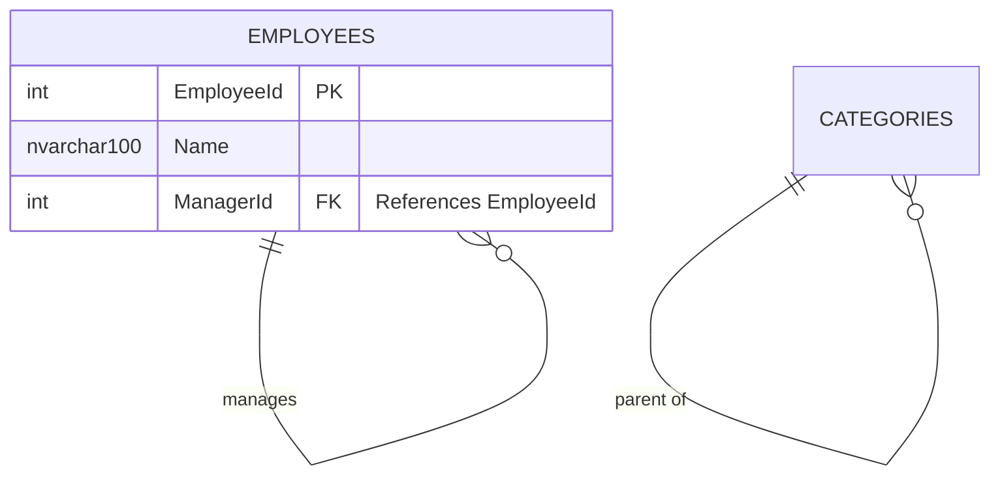

### Inheritance/Subtype Pattern

```mermaid
erDiagram
    MEDIA ||--o{ POSTS : "is a"
    MEDIA ||--o{ PHOTOS : "is a"

    MEDIA {
        int MediaId PK
        nvarchar20 MediaType "Post or Photo"
        datetime2 CreatedAt
    }

    POSTS {
        int MediaId PK_FK
        nvarchar200 Title
        nvarcharMAX Content
    }

    PHOTOS {
        int MediaId PK_FK
        nvarchar500 Url
        nvarchar200 Caption
    }
```

### Audit Columns Pattern

Show audit columns when relevant:
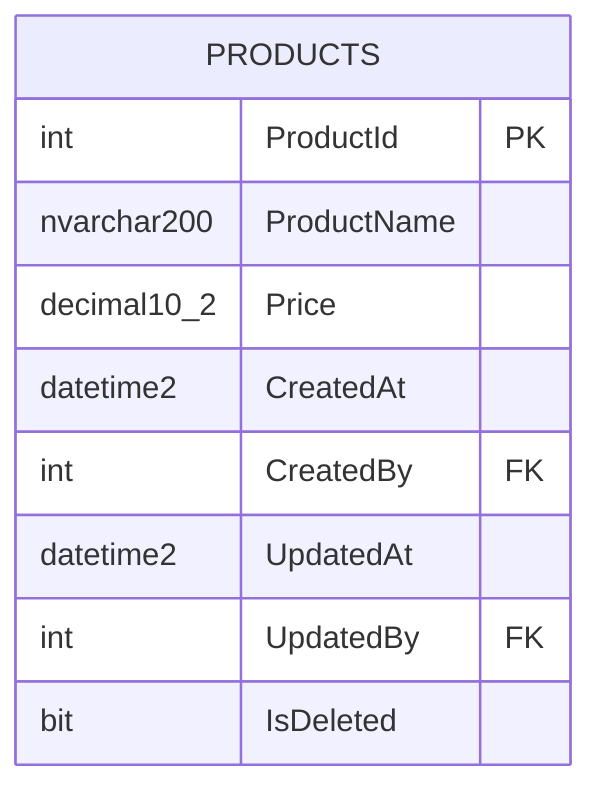

## When to Use This Skill

Use this skill when:
- Designing new database schemas
- Documenting existing databases
- Creating technical documentation
- Explaining database structure to team members
- Planning schema migrations
- Reverse-engineering databases
- Teaching database design concepts

Simply mention "ERD", "diagram", "visualize schema", or "Mermaid" and this knowledge will be applied to create clear, professional database visualizations.
