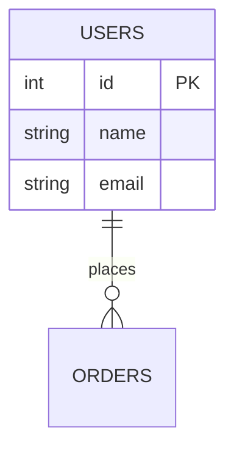
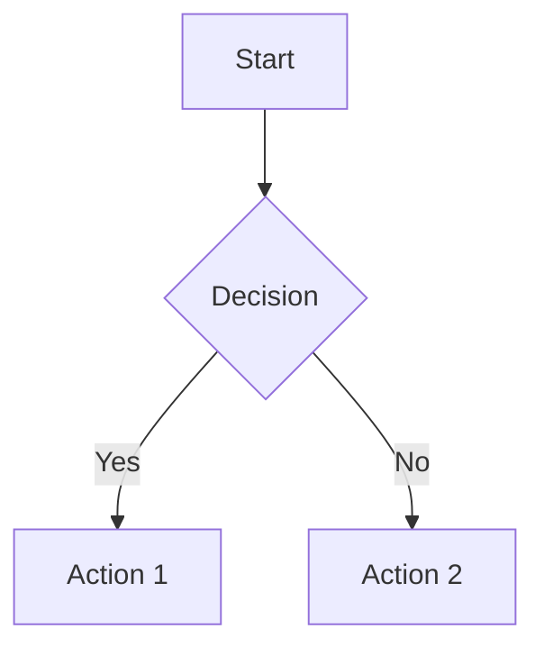
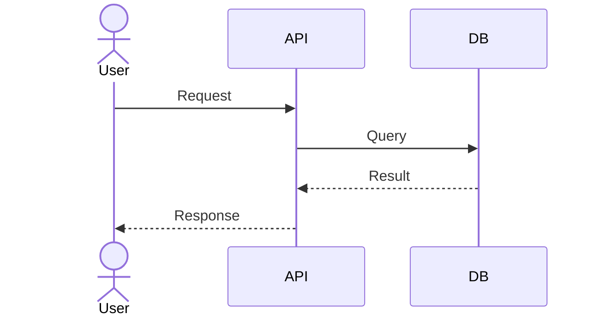

# Design Doc Generator - Technical Design Documentation Assistant

## Purpose

Design Doc Generator creates comprehensive technical design documents for software projects. The skill generates production-ready documentation covering database schemas, system architecture, API specifications, and visual diagrams using Mermaid syntax.

## When to Use This Skill

Use this skill when:

- Creating a new project and need complete technical design documentation
- Designing database schemas with relationships and constraints
- Defining RESTful API endpoints and request/response formats
- Planning system architecture and module layering
- Documenting business processes with flowcharts
- Visualizing component interactions with sequence diagrams
- Mapping data flow through system layers
- Onboarding team members to existing codebase architecture

## Core Capabilities

### 1. Database Schema Design

Generate complete database table definitions with fields, types, constraints, indexes, and relationships.

**Process:**
1. Analyze requirements to identify entities and their attributes
2. Define primary keys, foreign keys, and constraints
3. Specify data types, defaults, and nullable fields
4. Design indexes for query optimization
5. Document table relationships (one-to-one, one-to-many, many-to-many)
6. Reference `templates/database-schema.md` for standard format

**Output includes:**
- Table definitions with field specifications
- Entity-Relationship diagram (Mermaid ER diagram)
- Index recommendations with justification
- Migration scripts or DDL statements

### 2. Module Layering Design

Design system architecture with clear separation of concerns across layers.

**Process:**
1. Identify architectural layers (presentation, business, data, infrastructure)
2. Define module boundaries and responsibilities
3. Specify dependencies between layers
4. Establish communication patterns
5. Reference `references/design-patterns.md` for architectural patterns

**Output includes:**
- Layer architecture diagram
- Module responsibility matrix
- Dependency graph
- Data flow between layers

### 3. Module Interface Design

Define contracts between modules with clear input/output specifications.

**Process:**
1. Identify module boundaries from requirements
2. Define function/method signatures
3. Specify data structures for module communication
4. Document error handling and return codes
5. Reference `templates/module-design.md` for interface format

**Output includes:**
- Interface definitions
- Data transfer objects (DTOs)
- Error handling specifications
- Module dependency list

### 4. API Interface Design

Design RESTful API endpoints following industry best practices.

**Process:**
1. Identify resources from domain model
2. Map CRUD operations to HTTP methods
3. Define request/response schemas
4. Specify status codes and error responses
5. Document authentication and authorization
6. Reference `templates/api-spec.md` for API documentation format

**Output includes:**
- Endpoint list with methods and paths
- Request/response examples (JSON)
- Authentication requirements
- Rate limiting and pagination specs
- OpenAPI/Swagger specification

### 5. Business Flowchart

Create visual business process diagrams using Mermaid syntax.

**Process:**
1. Identify key business processes from requirements
2. Map decision points and branching logic
3. Define start/end states and conditions
4. Specify actors and swimlanes if needed
5. Reference `references/mermaid-diagrams.md` for flowchart syntax

**Output includes:**
- Mermaid flowchart code
- Process descriptions per step
- Decision logic documentation
- Alternative flow paths

### 6. Data Flow Diagram

Visualize how data moves through the system from input to persistence.

**Process:**
1. Trace data from external input through system layers
2. Identify data transformations at each stage
3. Specify data stores and external systems
4. Document data formats at each boundary
5. Reference `references/mermaid-diagrams.md` for DFD syntax

**Output includes:**
- Level 0 DFD (context diagram)
- Level 1 DFD (decomposed processes)
- Data dictionary defining all data elements
- Data transformation rules

### 7. Sequence Diagram

Generate sequence diagrams showing component interactions over time.

**Process:**
1. Identify actors and components
2. Map message flow for key operations
3. Specify synchronous vs asynchronous calls
4. Document error scenarios and timeouts
5. Reference `references/mermaid-diagrams.md` for sequence diagram syntax

**Output includes:**
- Mermaid sequence diagram code
- Message descriptions with parameters
- Lifeline documentation
- Alternative flows and error handling

## Workflow Integration

### New Project Design

1. **Requirements Analysis** → Extract entities, processes, and use cases
2. **Database Design** → Generate schema with ER diagram
3. **Architecture Design** → Create module layering and interfaces
4. **API Design** → Define RESTful endpoints
5. **Documentation** → Generate all diagrams and compile design document

### Existing Project Documentation

1. **Code Analysis** → Parse existing code structure
2. **Reverse Engineering** → Extract schemas and API patterns
3. **Documentation Generation** → Create comprehensive design docs
4. **Gap Analysis** → Identify missing or inconsistent elements

### Incremental Updates

1. **Change Request** → Identify affected components
2. **Impact Analysis** → Update relevant diagrams and schemas
3. **Version Documentation** → Track changes and maintain history

## Design Document Structure

Generate documents following this outline:

```markdown
# [Project Name] Technical Design Document

## 1. Overview
- Project background
- System objectives
- Scope and boundaries

## 2. System Architecture
- Architecture diagram
- Layer descriptions
- Technology stack

## 3. Database Design
- ER diagram
- Table definitions
- Index strategy

## 4. Module Design
- Module breakdown
- Interface specifications
- Dependencies

## 5. API Design
- Endpoint specifications
- Request/response formats
- Authentication

## 6. Business Processes
- Flowcharts
- Process descriptions

## 7. Data Flow
- Data flow diagrams
- Data dictionary

## 8. Sequence Diagrams
- Key operations
- Component interactions
```

## Additional Resources

### Template Files

Ready-to-use templates for consistent documentation:
- **`templates/database-schema.md`** - Database schema template with ER diagram
- **`templates/api-spec.md`** - API specification template following OpenAPI standards
- **`templates/module-design.md`** - Module interface design template

### Reference Files

Detailed guides and best practices:
- **`references/design-patterns.md`** - Architectural patterns (Layered, Hexagonal, Clean Architecture)
- **`references/mermaid-diagrams.md`** - Mermaid syntax guide for all diagram types

### Example Files

Complete working examples:
- **`examples/ecommerce-design-doc.md`** - Full design document for e-commerce system

## Best Practices

1. **Start with requirements**: Ensure design aligns with business needs before documenting
2. **Iterative refinement**: Update docs as design evolves; treat as living documents
3. **Diagram consistency**: Use consistent naming and styling across all diagrams
4. **Version control**: Track design changes alongside code changes
5. **Stakeholder review**: Validate technical design with both technical and business stakeholders
6. **Mermaid validation**: Verify Mermaid syntax renders correctly in supported viewers

## Common Use Cases

**Scenario 1: New Microservice**
- Generate database schema for service-specific data
- Design REST API for service communication
- Create sequence diagrams showing service interactions

**Scenario 2: Legacy System Migration**
- Document existing system architecture
- Design target architecture with module boundaries
- Map data flows between old and new systems

**Scenario 3: Feature Addition**
- Identify affected modules and tables
- Update API with new endpoints
- Document new business processes

**Scenario 4: Team Onboarding**
- Generate comprehensive design documentation
- Create visual diagrams for quick understanding
- Document module interfaces for integration guidance

## Diagram Syntax Quick Reference

**ER Diagram:**


**Flowchart:**


**Sequence Diagram:**


## Technical Requirements

- **Mermaid support**: Documentation viewer must support Mermaid rendering
- **Markdown output**: All documentation in Markdown format
- **UTF-8 encoding**: Ensure proper handling of special characters
- **Version control**: Design documents should be tracked in Git

## Limitations

- Mermaid diagrams may not render in all markdown viewers
- Database schema generation assumes relational database patterns
- Complex sequence diagrams may become difficult to read; consider splitting
- Generated documentation requires human review for business-specific context
