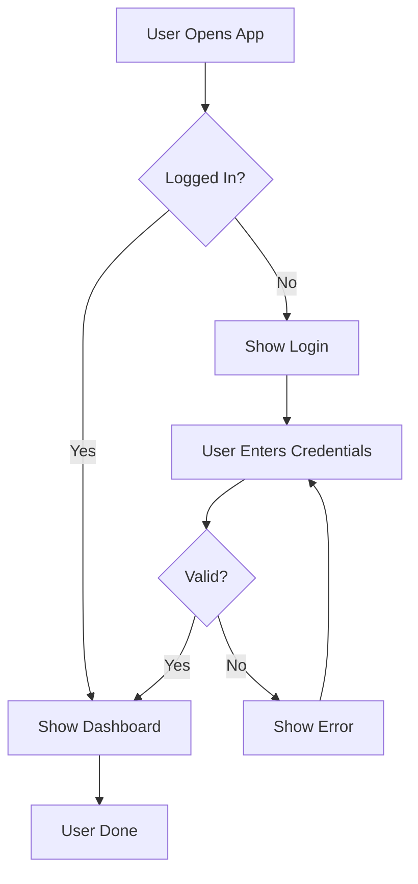
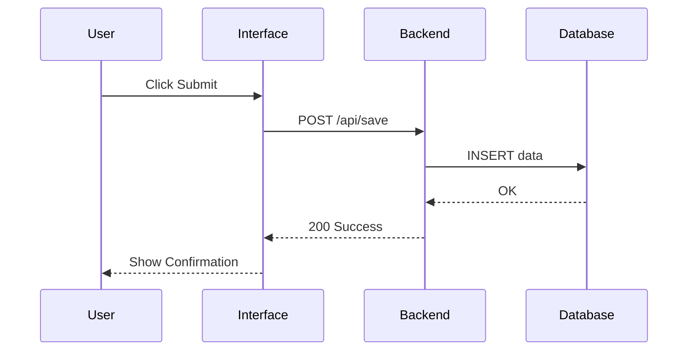
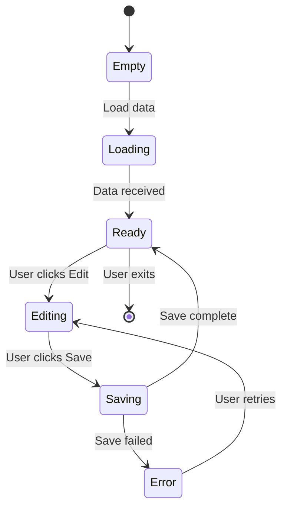

# ASCII Design Reviewer

A comprehensive skill for product owners and stakeholders to review Phase 1 ASCII UI designs. This skill analyzes designs for user journey completeness, asks clarifying questions, creates workflow diagrams, and documents system behavior and error handling.

## Two Perspectives: Designer vs Reviewer

### Designer (ASCII UI Designer Skill)
- Creates ASCII mockups
- Shows layout and structure
- Iterates on visual design

### Reviewer (This Skill - ASCII Design Reviewer)
- Analyzes user journeys
- Questions assumptions
- Validates requirements
- Documents workflows
- Plans error handling
- Creates system diagrams

## Core Purpose

When you have an approved ASCII design from Phase 1, you need to answer:
- **Does the design actually solve the user's problem?**
- **Have we thought through the entire user journey?**
- **What happens when things go wrong?**
- **How does data flow through the system?**
- **What states can the system be in?**
- **Are there missing steps or unclear interactions?**

This skill addresses all of these questions.

## What This Skill Does

### 1. Analyzes User Journeys
- Maps out how users interact with the design
- Identifies step-by-step user flows
- Questions unclear interactions
- Validates completeness

### 2. Asks Clarifying Questions
- Probes requirements
- Questions assumptions
- Identifies missing details
- Ensures product alignment

### 3. Creates Mermaid Diagrams

**User Journey Flowchart**:
```
User starts → Action 1 → Decision → Action 2 → Success
                           ↓
                        Error handling
```

**Sequence Diagram** (interactions between user and system):
```
User → Interface → Backend → Database
 |      |          |        |
 └──────request───→|        |
        └──response──────────┘
```

**State Chart** (system states and transitions):
```
State: Empty → Loading → Ready → Processing → Error
       ↓                              ↓
       └─────────────────────────────┘
```

### 4. Documents System Behavior
For each step in the journey:
- What happens
- What data is involved
- What the user sees
- What validations occur
- How long it takes

### 5. Plans Error Handling
- What can go wrong
- How to detect errors
- How to recover
- What users see
- How to prevent it

## Review Workflow

### Step 1: Provide the ASCII Design
```
"Please review this ASCII design:
[Paste ASCII mockup]

Context:
- Feature: User profile management
- Users: Regular app users
- Goal: Allow users to edit their profile
"
```

### Step 2: Receive Comprehensive Review

The skill provides:

1. **Questions & Clarifications** (what needs explanation)
2. **User Journey Flowchart** (Mermaid diagram)
3. **Sequence Diagrams** (system interactions)
4. **State Charts** (system states)
5. **Detailed Behavior Documentation** (step-by-step)
6. **Error Handling Plan** (what can go wrong)
7. **Missing Requirements** (what's not shown)
8. **Recommendations** (improvements)

### Step 3: Iterate on Design
Based on review feedback, go back to Phase 1 and refine the design.

### Step 4: Final Approval
Once design passes review, move to Phase 2 (implementation).

## Key Review Areas

### User Journey Analysis
- Does design show complete user flow?
- Are entry points clear?
- Are exit points defined?
- What are alternate paths?
- Can users get stuck?

### Requirement Validation
- Does design solve stated problem?
- Are all features visible?
- Are interactions clear?
- Is data shown appropriately?
- Are permissions handled?

### System Behavior
- What happens at each step?
- What validations apply?
- What's the sequence?
- How do users know what happened?
- What feedback is needed?

### Error Handling
- What can go wrong?
- How do we catch it?
- How do users recover?
- What's the rollback?
- How do we prevent it?

### Data Flow
- Where does data come from?
- Where does it go?
- What transformations happen?
- What's stored vs temporary?
- What's the sequence?

### States & Transitions
- What states exist?
- How do we transition?
- What triggers transitions?
- Can we go backward?
- Are any transitions invalid?

## Mermaid Diagrams Explained

### User Journey Flowchart
Shows the complete user path through the interface:



**Read this to understand**: What are all the possible paths through the system?

### Sequence Diagram
Shows interactions between user, interface, and backend:



**Read this to understand**: What talks to what and in what order?

### State Chart
Shows all possible system states and transitions:



**Read this to understand**: What are all the states and how do we move between them?

## Questions This Skill Asks

### About Users
- Who are the target users?
- What's their experience level?
- What devices do they use?
- What's their context?
- What's their goal?

### About Features
- Why is this button here?
- What happens when user clicks X?
- How do users know what to do?
- What if user does Y instead?
- Is there a better way?

### About Data
- Where does this data come from?
- How is it validated?
- What format is it in?
- How long is it kept?
- Who can see it?

### About Errors
- What if the server is down?
- What if data is invalid?
- What if user loses connection?
- What if user closes without saving?
- What if permissions change?

### About Edge Cases
- What if there's no data?
- What if there's too much data?
- What if user is offline?
- What if user is slow?
- What if user navigates away?

## Types of Diagrams

### User Journey Flowchart
- **Best for**: Showing all possible paths
- **Shows**: Decisions, loops, alternatives
- **Use when**: Mapping complete user flow

### Swimlane Diagram
- **Best for**: Showing roles/actors
- **Shows**: Who does what
- **Use when**: Multiple users/systems

### Sequence Diagram
- **Best for**: Showing interactions
- **Shows**: Order of operations
- **Use when**: Multi-step processes

### State Chart
- **Best for**: Showing valid states
- **Shows**: Transitions and validity
- **Use when**: Complex state management

### Entity Relationship
- **Best for**: Showing data relationships
- **Shows**: How entities connect
- **Use when**: Complex data models

## Behavior Documentation Format

For each screen/step, document:

```
STEP: User Views Profile
─────────────────────────────────────

USER SEES:
- Profile picture
- Name, email, bio
- Edit button (if own profile)

USER CAN:
- Click edit button
- View other user profile
- Share profile

VALIDATIONS:
- Profile must exist
- User must have permission
- Data must be valid

BACKEND:
- GET /api/users/{id}
- Check permissions
- Format response

ERRORS:
- User not found → Show 404
- No permission → Show 403
- Server error → Show 500
```

## Error Handling Strategy

For each potential error:

```
ERROR: Invalid Email Format
─────────────────────────────────────

DETECTION:
- User enters invalid format
- Backend validation fails
- User submits form

HOW TO CATCH:
- Client-side validation (instant)
- Backend validation (final)
- Email verification (confirmation)

WHAT USER SEES:
- Red error message
- Specific error text
- How to fix it

RECOVERY:
- User can edit field
- Show suggested format
- Offer suggestions

PREVENTION:
- Input masking
- Placeholder examples
- Help text
- Validation feedback
```

## Review Checklist

✓ All user paths are shown
✓ Entry and exit points clear
✓ All interactions marked
✓ Error states considered
✓ Data flow documented
✓ Permissions addressed
✓ Edge cases handled
✓ Performance considered
✓ Accessibility thought about
✓ Mobile experience clear

## When to Use This Skill

✅ **Use when**:
- Design is ready for review
- Need to validate requirements
- Want to understand full flow
- Need to document behavior
- Planning error handling
- Preparing for implementation
- Getting stakeholder alignment

❌ **Don't use when**:
- Still exploring design ideas (use Phase 1)
- Need to implement (use Phase 2)
- Design is incomplete
- Requirements unclear

## Workflow

```
Phase 1: Design         → ASCII Design Reviewer ← You are here
ASCII mockup created    Analyze design
  ↓
Receive review          ← Questions & diagrams
  ↓
Iterate design          ← Back to Phase 1 if needed
  ↓
Design approved         ← Ready for implementation
  ↓
Phase 2: Code           → Implement with confidence
```

## Output You Get

### 1. Critical Questions
Questions that must be answered before coding

### 2. Mermaid Diagrams
- User journey flowchart
- Sequence diagrams (system interactions)
- State charts (valid states)
- Data flow (where data goes)

### 3. Detailed Documentation
- Step-by-step behavior
- What happens at each interaction
- What the system does
- What users see

### 4. Error Handling Plan
- What can go wrong
- How to detect it
- How to recover
- How to prevent it

### 5. Edge Cases
- Unusual scenarios
- Boundary conditions
- Error paths
- Recovery scenarios

### 6. Recommendations
- Design improvements
- Missing features
- Better UX
- Security considerations

## Example Review Request

```
"Please review this ASCII design for a password reset flow:

[ASCII Design]

Context:
- Feature: Forgot password flow
- Users: App users who forgot password
- Goal: Allow users to reset password securely
- Constraints: Must be secure, mobile-friendly

Questions:
1. What happens if user doesn't receive email?
2. How long is reset link valid?
3. Can users reset while logged in?
4. What if user already has pending reset?
"
```

## Example Review Output

```
CRITICAL QUESTIONS
───────────────────
1. Is email verification required?
2. What happens if email doesn't exist?
3. How long should reset token last?
4. Should we notify user of failed attempts?
5. Can attacker enumerate valid emails?

USER JOURNEY FLOWCHART
──────────────────────
[Mermaid diagram showing all paths]

SEQUENCE DIAGRAM
────────────────
[Mermaid showing user → backend → email service]

STATE CHART
───────────
[Mermaid showing: RequestReset → EmailSent → TokenValidated → PasswordUpdated]

STEP-BY-STEP BEHAVIOR
─────────────────────
Step 1: User clicks Forgot Password
  - Shows email input
  - Validations: Email format
  - User sees: Instructions

Step 2: User enters email
  - Backend checks if email exists
  - Generates reset token (valid 1 hour)
  - Sends email
  - Show success message

ERROR HANDLING
──────────────
If email not found:
  - Don't reveal if email exists (security)
  - Show: "If email exists, you'll get reset link"
  - Rate limit password reset attempts
  - Log suspicious activity

If email fails to send:
  - Retry 3 times
  - If still fails, notify user
  - Offer alternative: security questions

If token expires:
  - Show message: "Link expired"
  - Offer to send new link
  - Log attempted reuse
```

## Success Criteria

Review is complete when:

✓ All user paths are mapped
✓ All questions answered
✓ All edge cases considered
✓ Error handling planned
✓ Data flow documented
✓ State transitions clear
✓ Diagrams are complete
✓ Team is aligned
✓ Ready for implementation

---

# How to Use This Skill

## Basic Usage

```
"Review this ASCII design and provide:
- User journey analysis
- Mermaid diagrams
- Error handling plan
- Behavior documentation

[Paste ASCII design]"
```

## Advanced Usage

```
"As a product owner reviewing this design:

Design: [ASCII mockup]
Users: [Who uses this?]
Context: [What problem does it solve?]
Constraints: [Limitations?]
Questions: [What I'm unsure about]

Please provide:
1. Critical questions I should answer
2. User journey flowchart
3. Sequence of interactions
4. State transitions
5. Error handling for each step
6. Recommendations"
```

## Iterating on Review

```
"Based on your review, I updated the design:
[New ASCII mockup]

Does this address the issues?"
```

---

**This skill turns ASCII designs into fully-documented, validated, ready-for-implementation features.**
