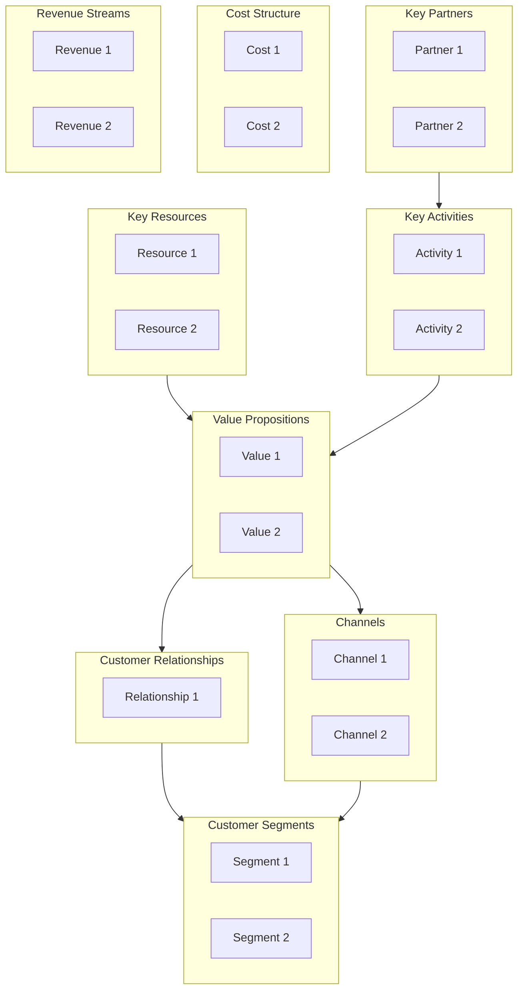

# Business Model Canvas

Design and analyze business models using Osterwalder's Business Model Canvas and Lean Canvas. Creates structured 9-block canvases for business model innovation, startup validation, and strategic planning.

## What is a Business Model Canvas?

A **Business Model Canvas (BMC)** is a strategic management template for developing new or documenting existing business models. It's a visual chart describing a firm's value proposition, infrastructure, customers, and finances.

| Aspect | Business Model Canvas | Lean Canvas |
|--------|----------------------|-------------|
| **Creator** | Alexander Osterwalder | Ash Maurya |
| **Focus** | Established businesses | Startups, early-stage |
| **Emphasis** | Value creation & delivery | Problem-solution fit |
| **Key Difference** | Key Partners, Key Resources | Problem, Solution, Unfair Advantage |

## The 9 Building Blocks

### Business Model Canvas Blocks

```text
┌─────────────────┬─────────────────┬─────────────────┬─────────────────┬─────────────────┐
│ Key Partners    │ Key Activities  │ Value           │ Customer        │ Customer        │
│                 │                 │ Propositions    │ Relationships   │ Segments        │
│ Who helps us?   │ What do we do?  │                 │                 │                 │
│                 │                 │ What value do   │ How do we       │ Who do we       │
│                 ├─────────────────┤ we deliver?     │ interact?       │ serve?          │
│                 │ Key Resources   │                 │                 │                 │
│                 │                 │                 ├─────────────────┤                 │
│                 │ What do we      │                 │ Channels        │                 │
│                 │ need?           │                 │                 │                 │
│                 │                 │                 │ How do we       │                 │
│                 │                 │                 │ reach them?     │                 │
├─────────────────┴─────────────────┴─────────────────┴─────────────────┴─────────────────┤
│ Cost Structure                                      │ Revenue Streams                   │
│ What does it cost?                                  │ How do we earn?                   │
└─────────────────────────────────────────────────────┴───────────────────────────────────┘
```

### Block Definitions

| Block | Question | Examples |
|-------|----------|----------|
| **Customer Segments** | Who are our most important customers? | Mass market, Niche, Segmented, Diversified |
| **Value Propositions** | What value do we deliver? What problems do we solve? | Newness, Performance, Customization, Price |
| **Channels** | How do we reach and deliver to customers? | Direct, Indirect, Own, Partner |
| **Customer Relationships** | How do we interact with each segment? | Personal, Automated, Self-service, Communities |
| **Revenue Streams** | How does each segment pay? | Asset sale, Subscription, Licensing, Advertising |
| **Key Resources** | What do we need to deliver our value proposition? | Physical, Intellectual, Human, Financial |
| **Key Activities** | What must we do well? | Production, Problem Solving, Platform/Network |
| **Key Partnerships** | Who helps us? | Strategic alliances, Suppliers, Joint ventures |
| **Cost Structure** | What are our major costs? | Fixed, Variable, Economies of scale/scope |

## Workflow

### Phase 1: Preparation

#### Step 1: Define Context

```markdown
## Canvas Context

**Organization:** [Company / Product / Initiative]
**Purpose:** [New business / Innovation / Documentation / Pivot]
**Scope:** [Entire business / Product line / Service]
**Date:** [ISO date]
**Facilitator:** canvas-facilitator
```

#### Step 2: Gather Inputs

Before filling the canvas:

- Existing business plans, strategy documents
- Customer research, personas
- Competitive analysis
- Financial data (if documenting existing model)

### Phase 2: Fill the Canvas (Right to Left)

Start with Customer Segments (demand side), then move to Value Proposition and infrastructure (supply side).

#### Step 1: Customer Segments

```markdown
## Customer Segments

| Segment | Description | Size | Priority |
|---------|-------------|------|----------|
| [Name] | [Who are they? Demographics, needs] | [Market size] | Primary/Secondary |

**Questions to answer:**
- For whom are we creating value?
- Who are our most important customers?
- What are their jobs-to-be-done?
```

##### Segment Types

| Type | Description | Example |
|------|-------------|---------|
| **Mass Market** | Large group, similar needs | Consumer electronics |
| **Niche Market** | Specialized, specific needs | Luxury goods |
| **Segmented** | Distinct segments, related needs | Banks (retail vs wealth) |
| **Diversified** | Unrelated segments | Amazon (retail + AWS) |
| **Multi-sided** | Interdependent segments | Platforms (users + advertisers) |

#### Step 2: Value Propositions

```markdown
## Value Propositions

| Segment | Value Proposition | Type | Differentiation |
|---------|-------------------|------|-----------------|
| [Segment] | [What value delivered?] | [Type] | [Why us over competitors?] |

**Questions to answer:**
- What value do we deliver to each segment?
- Which customer problems are we solving?
- What bundles of products/services do we offer?
```

##### Value Proposition Types

| Type | Description |
|------|-------------|
| **Newness** | New, previously unavailable |
| **Performance** | Better performance |
| **Customization** | Tailored to needs |
| **Getting the Job Done** | Helps complete a task |
| **Design** | Superior design |
| **Brand/Status** | Status or brand value |
| **Price** | Lower price |
| **Cost Reduction** | Reduces customer costs |
| **Risk Reduction** | Reduces customer risks |
| **Accessibility** | Makes available to new users |
| **Convenience** | Easier to use |

#### Step 3: Channels

```markdown
## Channels

| Phase | Channel | Type | Effectiveness |
|-------|---------|------|---------------|
| Awareness | [How do customers learn about us?] | Own/Partner | High/Med/Low |
| Evaluation | [How do they evaluate?] | Own/Partner | High/Med/Low |
| Purchase | [How do they buy?] | Own/Partner | High/Med/Low |
| Delivery | [How do we deliver?] | Own/Partner | High/Med/Low |
| After Sales | [How do we support?] | Own/Partner | High/Med/Low |
```

#### Step 4: Customer Relationships

```markdown
## Customer Relationships

| Segment | Relationship Type | Purpose | Cost |
|---------|-------------------|---------|------|
| [Segment] | [Type] | Acquisition/Retention/Upselling | High/Med/Low |
```

##### Relationship Types

| Type | Description |
|------|-------------|
| **Personal Assistance** | Human interaction |
| **Dedicated Personal** | Specific rep assigned |
| **Self-Service** | No direct relationship |
| **Automated Services** | Automated personalization |
| **Communities** | User communities |
| **Co-creation** | Customers help create value |

#### Step 5: Revenue Streams

```markdown
## Revenue Streams

| Segment | Revenue Type | Pricing Model | % of Revenue |
|---------|--------------|---------------|--------------|
| [Segment] | [Type] | Fixed/Dynamic | [Percentage] |
```

##### Revenue Types

| Type | Description | Pricing |
|------|-------------|---------|
| **Asset Sale** | Selling ownership rights | List price, Volume, Negotiation |
| **Usage Fee** | Pay per use | Per unit, Tiered |
| **Subscription** | Recurring payment | Monthly, Annual |
| **Lending/Renting** | Temporary access | Time-based |
| **Licensing** | Permission to use IP | Per license, Royalty |
| **Brokerage** | Intermediation fee | Commission |
| **Advertising** | Display ads | CPM, CPC, CPA |

#### Step 6: Key Resources

```markdown
## Key Resources

| Resource | Category | Source | Strategic Importance |
|----------|----------|--------|---------------------|
| [Resource] | Physical/IP/Human/Financial | Own/Lease/Partner | Critical/Important/Supporting |
```

#### Step 7: Key Activities

```markdown
## Key Activities

| Activity | Category | Importance | Insource/Outsource |
|----------|----------|------------|-------------------|
| [Activity] | Production/Problem Solving/Platform | Critical/Important | Insource/Outsource |
```

#### Step 8: Key Partnerships

```markdown
## Key Partnerships

| Partner | Type | Motivation | Resources Provided |
|---------|------|------------|-------------------|
| [Partner] | Strategic Alliance/Coopetition/JV/Supplier | Optimization/Risk/Acquisition | [What they provide] |
```

##### Partnership Motivations

- **Optimization and Economy of Scale** - Reduce costs
- **Reduction of Risk and Uncertainty** - Share risk
- **Acquisition of Resources and Activities** - Gain capabilities

#### Step 9: Cost Structure

```markdown
## Cost Structure

| Cost Category | Type | Driver | % of Total |
|---------------|------|--------|------------|
| [Cost] | Fixed/Variable | [What drives it] | [Percentage] |

**Cost Focus:** ☐ Cost-Driven ☐ Value-Driven
```

### Phase 3: Analysis and Validation

#### Step 1: Check Coherence

| Check | Question | Pass? |
|-------|----------|-------|
| **Value-Customer Fit** | Does value proposition address segment needs? | ☐ |
| **Channel-Segment Fit** | Do channels reach segments effectively? | ☐ |
| **Revenue-Cost Balance** | Do revenues exceed costs? | ☐ |
| **Resource-Activity Alignment** | Do resources support key activities? | ☐ |
| **Partnership Logic** | Do partnerships fill capability gaps? | ☐ |

#### Step 2: Identify Risks

```markdown
## Business Model Risks

| Block | Risk | Likelihood | Impact | Mitigation |
|-------|------|------------|--------|------------|
| [Block] | [Risk description] | H/M/L | H/M/L | [Action] |
```

## Lean Canvas (Alternative)

For startups and early-stage ventures, use Lean Canvas which replaces some blocks:

| BMC Block | Lean Canvas Block | Why the Change |
|-----------|-------------------|----------------|
| Key Partners | Problem | Focus on problem validation |
| Key Activities | Solution | Focus on solution validation |
| Key Resources | Key Metrics | Measure what matters |
| Customer Relationships | Unfair Advantage | Competitive moat |

### Lean Canvas Template

```markdown
## Lean Canvas: [Product/Startup]

**Date:** [ISO date]
**Iteration:** [1, 2, 3...]

### Problem (Top 3)
1. [Most critical problem]
2. [Second problem]
3. [Third problem]

**Existing Alternatives:** [How do customers solve this today?]

### Customer Segments
**Early Adopters:** [Who will use first?]

### Unique Value Proposition
**Single, clear message:** [One sentence that explains why you're different and worth attention]

**High-Level Concept:** [X for Y analogy, e.g., "Uber for dog walking"]

### Solution (Top 3 Features)
1. [Feature addressing Problem 1]
2. [Feature addressing Problem 2]
3. [Feature addressing Problem 3]

### Channels
[Path to customers - how will you reach early adopters?]

### Revenue Streams
[Revenue model, pricing, lifetime value]

### Cost Structure
[Customer acquisition costs, hosting, people, etc.]

### Key Metrics
[The numbers that tell you how you're doing]

### Unfair Advantage
[Something that cannot easily be copied or bought]
```

## Output Formats

### Narrative Summary

```markdown
## Business Model Summary: [Organization]

**Date:** [ISO date]
**Analyst:** canvas-analyst
**Type:** Business Model Canvas / Lean Canvas

### Executive Summary
[2-3 sentence summary of the business model]

### Customer Focus
- **Primary Segment:** [Description]
- **Value Delivered:** [Core value proposition]
- **Channels:** [Primary channels]

### Value Creation
- **Key Activities:** [Core activities]
- **Key Resources:** [Critical resources]
- **Key Partners:** [Strategic partners]

### Financial Model
- **Revenue Model:** [How money is made]
- **Cost Structure:** [Major cost drivers]
- **Unit Economics:** [Key metrics]

### Risks and Opportunities
| Type | Description | Priority |
|------|-------------|----------|
| Risk | [Top risk] | High |
| Opportunity | [Top opportunity] | High |

### Recommendations
1. [Priority recommendation]
2. [Secondary recommendation]
```

### Structured Data (YAML)

```yaml
business_model_canvas:
  version: "1.0"
  date: "2025-01-15"
  organization: "Acme Corp"
  analyst: "canvas-analyst"
  type: "business_model_canvas"  # or "lean_canvas"

  customer_segments:
    - name: "SMB Owners"
      description: "Small business owners seeking efficiency"
      size: "5M in target market"
      priority: primary
      jobs_to_be_done:
        - "Manage invoicing"
        - "Track expenses"

  value_propositions:
    - segment: "SMB Owners"
      proposition: "Automated bookkeeping that saves 10 hours/week"
      type: convenience
      differentiation: "AI-powered categorization"

  channels:
    - phase: awareness
      channel: "Content marketing"
      type: own
      effectiveness: high
    - phase: purchase
      channel: "Website"
      type: own
      effectiveness: high

  customer_relationships:
    - segment: "SMB Owners"
      type: self_service
      purpose: retention
      cost: low

  revenue_streams:
    - segment: "SMB Owners"
      type: subscription
      pricing: "fixed"
      amount: "$29/month"
      percentage: 85

  key_resources:
    - name: "AI/ML Platform"
      category: intellectual
      source: own
      importance: critical

  key_activities:
    - activity: "Platform development"
      category: production
      importance: critical
      insource: true

  key_partnerships:
    - partner: "Accounting Firms"
      type: strategic_alliance
      motivation: acquisition
      provides: "Referrals, expertise"

  cost_structure:
    focus: value_driven
    costs:
      - category: "Engineering"
        type: fixed
        percentage: 40
      - category: "Cloud hosting"
        type: variable
        percentage: 15

  validation:
    value_customer_fit: true
    channel_segment_fit: true
    revenue_cost_balance: true
```

### Mermaid Diagram



## When to Use

| Scenario | Use Business Model Canvas? |
|----------|---------------------------|
| New venture planning | Yes - full canvas |
| Startup validation | Yes - Lean Canvas preferred |
| Business model innovation | Yes - explore alternatives |
| Strategic planning | Yes - document current state |
| M&A analysis | Yes - compare models |
| Product line analysis | Partial - focused canvas |

## Integration

### Upstream

- **stakeholder-analysis** - Identify customer segments
- **swot-pestle-analysis** - Environmental context
- **journey-mapping** - Customer experience insights

### Downstream

- **Requirements** - Feature requirements from value propositions
- **Financial modeling** - Revenue and cost projections
- **Roadmaps** - Initiative prioritization

## Related Skills

- `stakeholder-analysis` - Customer and partner analysis
- `swot-pestle-analysis` - Strategic context
- `value-stream-mapping` - Operational efficiency
- `capability-mapping` - Organizational capabilities
- `decision-analysis` - Business model decisions

## Version History

- **v1.0.0** (2025-12-26): Initial release
