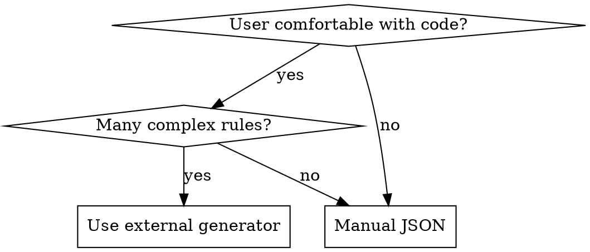

# Creating Karabiner-Elements Modifications

## Overview

Karabiner-Elements is a macOS keyboard customization tool using JSON configuration. This skill provides a systematic workflow to create complex modifications correctly and efficiently.

**Core principle**: Clarify requirements first, choose simplest approach, use correct structure, test with EventViewer.

## When to Use

Use this skill when:
- User requests Karabiner-Elements keyboard remapping
- Creating or modifying `~/.config/karabiner/karabiner.json`
- Need to remap keys, modifier combinations, or app-specific shortcuts

**ESPECIALLY under time pressure** - templates prevent structural errors that waste more time debugging.

Don't use for:
- Other keyboard tools (xmodmap, xkb, AutoHotkey)
- System keyboard preferences (different tool)

## Red Flags - STOP and Use This Skill

If you catch yourself thinking:
- "I'll work from memory to save time" → Templates are FASTER than memory
- "I know Karabiner syntax" → Structural errors happen when skipping templates
- "This is urgent, no time for the skill" → Urgency is when errors happen most
- "Simple modification, don't need templates" → Field name errors break simple configs too

**All of these mean: Use the templates below. Faster AND correct.**

## Workflow

### 1. Clarify Requirements

**ALWAYS ask if ambiguous:**
- Which keys map to which? (e.g., "arrow keys" = up/down or left/right?)
- Which applications? (global or app-specific?)
- Tap vs hold behavior? (if modifier involved)

### 2. Choose Approach



**External generators** (more efficient for complex cases):
- **GokuRakuJoudo** - Concise edn format, less boilerplate
- **karabiner.ts** - TypeScript with type safety
- **Web configurators** - GUI for non-programmers

See: https://karabiner-elements.pqrs.org/docs/json/external-json-generators/

**Manual JSON** (direct editing):
- Quick one-off modifications
- Simple remapping
- Learning/understanding the structure

### 3. Write Configuration

Use templates below for common patterns.

### 4. Test

**Use Karabiner-EventViewer** (included with Karabiner-Elements):
1. Open EventViewer from Karabiner-Elements menu
2. Press the key combination
3. Verify event transformation

Don't rely on "it should work" - always test.

## Quick Reference: Common Patterns

### Simple Key Remap

```json
{
  "description": "Change caps_lock to escape",
  "manipulators": [
    {
      "type": "basic",
      "from": {
        "key_code": "caps_lock"
      },
      "to": [
        {
          "key_code": "escape"
        }
      ]
    }
  ]
}
```

### Modifier + Key Combination

```json
{
  "description": "Change control+m to return",
  "manipulators": [
    {
      "type": "basic",
      "from": {
        "key_code": "m",
        "modifiers": {
          "mandatory": ["control"]
        }
      },
      "to": [
        {
          "key_code": "return_or_enter"
        }
      ]
    }
  ]
}
```

### Tap vs Hold (Dual Function)

```json
{
  "description": "Caps lock to control (hold) or escape (tap)",
  "manipulators": [
    {
      "type": "basic",
      "from": {
        "key_code": "caps_lock",
        "modifiers": {
          "optional": ["any"]
        }
      },
      "to": [
        {
          "key_code": "left_control"
        }
      ],
      "to_if_alone": [
        {
          "key_code": "escape"
        }
      ]
    }
  ]
}
```

### App-Specific Modification

```json
{
  "description": "Command+h to delete in Terminal only",
  "manipulators": [
    {
      "type": "basic",
      "from": {
        "key_code": "h",
        "modifiers": {
          "mandatory": ["command"]
        }
      },
      "to": [
        {
          "key_code": "delete_or_backspace"
        }
      ],
      "conditions": [
        {
          "type": "frontmost_application_if",
          "bundle_identifiers": ["^com\\.apple\\.Terminal$"]
        }
      ]
    }
  ]
}
```

## File Location

**Config file**: `~/.config/karabiner/karabiner.json`

**Structure**: Add rules to the `complex_modifications.rules` array:

```json
{
  "profiles": [
    {
      "name": "Default profile",
      "complex_modifications": {
        "rules": [
          // ADD NEW RULES HERE
          {
            "description": "...",
            "manipulators": [...]
          }
        ]
      }
    }
  ]
}
```

## Common Mistakes

| Mistake | Fix |
|---------|-----|
| Using `"title"` field | Use `"description"` instead |
| Extra `"rules"` wrapper | Rule object has `description` + `manipulators` directly |
| Forgetting `"type": "basic"` | Always include in each manipulator |
| Wrong bundle identifier | Check app's bundle ID: `osascript -e 'id of app "AppName"'` |
| Not testing | Always use EventViewer to verify |
| Over-engineering | Start with simple approach, add complexity only if needed |
| Skipping skill under time pressure | Time pressure causes errors; templates save time |

## Common Rationalizations

| Excuse | Reality |
|--------|---------|
| "I'll work from memory to save time" | Memory fails under pressure. Templates take 10 seconds. |
| "I know the Karabiner syntax" | Knowing ≠ remembering correctly. "title" vs "description" errors are common. |
| "This is too urgent for workflow" | Debugging wrong structure wastes 10x more time than using template. |
| "Simple config doesn't need templates" | Simple configs break from same field name errors as complex ones. |
| "Templates are slower" | Copy-paste template: 10 sec. Debug JSON error: 5 min. |

## Finding Key Codes

**Common key codes**:
- Letters: `"a"` to `"z"`
- Numbers: `"1"` to `"9"`, `"0"`
- Modifiers: `"left_control"`, `"left_shift"`, `"left_command"`, `"left_option"`
- Special: `"escape"`, `"return_or_enter"`, `"delete_or_backspace"`, `"tab"`, `"spacebar"`
- Arrows: `"up_arrow"`, `"down_arrow"`, `"left_arrow"`, `"right_arrow"`
- Function: `"f1"` to `"f12"`, `"f13"` to `"f24"`

**Full reference**: Use EventViewer to see key codes for any key.

## When to Use Lazy Modifiers

**Avoid unless necessary.** Simple modifier remapping works for 95% of cases.

Only use lazy modifiers when you specifically need the modifier itself not to generate events until combined with another key.

## Real-World Impact

Following this workflow:
- Prevents structural JSON errors (wrong field names)
- Avoids over-engineering (unnecessary complexity)
- Saves time (templates vs documentation research)
- Ensures testing (EventViewer catches issues early)
- Clarifies ambiguous requirements (prevents wrong implementation)
