# Data Vault Modeling

## When to Use This Skill

Use this skill when:

- **Data Vault Modeling tasks** - Working on design hub/link/satellite structures for enterprise data warehouses using data vault 2.0 methodology
- **Planning or design** - Need guidance on Data Vault Modeling approaches
- **Best practices** - Want to follow established patterns and standards

## Overview

Data Vault is a detail-oriented, historical tracking, and uniquely linked set of normalized tables supporting enterprise data warehouses. Designed for agility, auditability, and scalability.

## Data Vault Components

```text
┌─────────────────────────────────────────────────────────────────┐
│                         DATA VAULT                               │
├─────────────────────────────────────────────────────────────────┤
│                                                                  │
│  ┌──────────┐         ┌──────────┐         ┌──────────┐        │
│  │   HUB    │◄───────►│   LINK   │◄───────►│   HUB    │        │
│  │ Customer │         │  Orders  │         │ Product  │        │
│  └────┬─────┘         └────┬─────┘         └────┬─────┘        │
│       │                    │                    │               │
│  ┌────┴─────┐         ┌────┴─────┐         ┌────┴─────┐        │
│  │SATELLITE │         │SATELLITE │         │SATELLITE │        │
│  │ CustInfo │         │ OrderDtl │         │ ProdInfo │        │
│  └──────────┘         └──────────┘         └──────────┘        │
│                                                                  │
└─────────────────────────────────────────────────────────────────┘
```

## Hub Tables

### Purpose

Hubs store unique business keys - the core business concepts that won't change.

### Hub Structure

| Column | Purpose |
|--------|---------|
| Hub Hash Key | Primary key (hash of business key) |
| Business Key | Natural identifier from source |
| Load Date | First load timestamp |
| Record Source | Origin system identifier |

### Hub Example

> **Note:** Data Vault 2.0 uses snake_case with standardized prefixes (`hub_`, `sat_`, `link_`) as part of its methodology. This convention is acceptable for Data Vault schemas even on SQL Server.

```sql
CREATE TABLE hub_customer (
    hub_customer_hk BINARY(32) NOT NULL PRIMARY KEY,
    customer_bk VARCHAR(50) NOT NULL,
    load_dts DATETIME2 NOT NULL,
    record_source VARCHAR(100) NOT NULL
);

CREATE UNIQUE INDEX IX_hub_customer_bk ON hub_customer(customer_bk);
```

### Hub Template

```markdown
# Hub: hub_customer

## Business Key
customer_id - Unique customer identifier from CRM

## Sources
- CRM System (primary)
- E-commerce Platform
- Mobile App

## Hash Key Generation
SHA-256(UPPER(TRIM(customer_id)))

## Notes
- Business key is stable, never changes
- Multiple sources may provide same customer
```

## Link Tables

### Purpose

Links represent relationships between business concepts (hubs).

### Link Types

| Type | Description | Example |
|------|-------------|---------|
| Standard Link | N:M relationship | Customer-Product |
| Hierarchical Link | Self-referencing | Employee-Manager |
| Same-As Link | Duplicate resolution | Customer-Customer |
| Transactional Link | Transaction with measures | Order (with amount) |

### Link Structure

| Column | Purpose |
|--------|---------|
| Link Hash Key | Primary key (hash of hub keys) |
| Hub Hash Key 1..N | Foreign keys to hubs |
| Load Date | First load timestamp |
| Record Source | Origin system |

### Link Example

```sql
CREATE TABLE link_order (
    link_order_hk BINARY(32) NOT NULL PRIMARY KEY,
    hub_customer_hk BINARY(32) NOT NULL,
    hub_product_hk BINARY(32) NOT NULL,
    hub_store_hk BINARY(32) NOT NULL,
    order_bk VARCHAR(50) NOT NULL,  -- Degenerate key
    load_dts DATETIME2 NOT NULL,
    record_source VARCHAR(100) NOT NULL,

    CONSTRAINT FK_link_order_customer
        FOREIGN KEY (hub_customer_hk)
        REFERENCES hub_customer(hub_customer_hk),
    CONSTRAINT FK_link_order_product
        FOREIGN KEY (hub_product_hk)
        REFERENCES hub_product(hub_product_hk)
);
```

## Satellite Tables

### Purpose

Satellites store descriptive attributes and track history through delta detection.

### Satellite Types

| Type | Description | Example |
|------|-------------|---------|
| Descriptive | Attributes for a hub | Customer demographics |
| Effectivity | Relationship validity | Order status |
| Multi-Active | Multiple concurrent values | Phone numbers |
| Status Tracking | State changes | Order lifecycle |

### Satellite Structure

| Column | Purpose |
|--------|---------|
| Hub/Link Hash Key | FK to parent hub/link |
| Load Date | Record timestamp (part of PK) |
| Load End Date | Optional: end of validity |
| Hash Diff | Change detection hash |
| Attributes | Descriptive columns |
| Record Source | Origin system |

### Satellite Example

```sql
CREATE TABLE sat_customer_details (
    hub_customer_hk BINARY(32) NOT NULL,
    load_dts DATETIME2 NOT NULL,
    load_end_dts DATETIME2,
    hash_diff BINARY(32) NOT NULL,
    -- Attributes
    customer_name VARCHAR(100),
    email VARCHAR(255),
    phone VARCHAR(20),
    address_line1 VARCHAR(200),
    city VARCHAR(100),
    state VARCHAR(50),
    postal_code VARCHAR(20),
    country VARCHAR(50),
    -- Audit
    record_source VARCHAR(100) NOT NULL,

    PRIMARY KEY (hub_customer_hk, load_dts),
    CONSTRAINT FK_sat_customer_hub
        FOREIGN KEY (hub_customer_hk)
        REFERENCES hub_customer(hub_customer_hk)
);
```

## Hash Key Generation

### Standard Hash Function

```csharp
public static class DataVaultHasher
{
    public static byte[] GenerateHashKey(params string[] businessKeys)
    {
        var concatenated = string.Join("|",
            businessKeys.Select(k =>
                k?.Trim().ToUpperInvariant() ?? string.Empty));

        using var sha256 = SHA256.Create();
        return sha256.ComputeHash(Encoding.UTF8.GetBytes(concatenated));
    }

    public static byte[] GenerateHashDiff(object entity)
    {
        var json = JsonSerializer.Serialize(entity,
            new JsonSerializerOptions { PropertyNamingPolicy = null });

        using var sha256 = SHA256.Create();
        return sha256.ComputeHash(Encoding.UTF8.GetBytes(json));
    }
}
```

## Data Vault Architecture Layers

```text
┌─────────────────────────────────────────────────────────────────┐
│                        INFORMATION MART                          │
│         (Dimensional models, aggregates, reports)                │
└─────────────────────────────────────────────────────────────────┘
                              ▲
┌─────────────────────────────────────────────────────────────────┐
│                        BUSINESS VAULT                            │
│    (Derived data, business rules, calculated attributes)        │
└─────────────────────────────────────────────────────────────────┘
                              ▲
┌─────────────────────────────────────────────────────────────────┐
│                          RAW VAULT                               │
│          (Hubs, Links, Satellites - source-aligned)             │
└─────────────────────────────────────────────────────────────────┘
                              ▲
┌─────────────────────────────────────────────────────────────────┐
│                        STAGING AREA                              │
│             (Transient, source-aligned extracts)                │
└─────────────────────────────────────────────────────────────────┘
```

## Point-in-Time (PIT) Tables

### Purpose

PIT tables optimize queries by pre-joining satellite data at specific points in time.

```sql
CREATE TABLE pit_customer (
    pit_customer_hk BINARY(32) NOT NULL,
    snapshot_dts DATETIME2 NOT NULL,
    hub_customer_hk BINARY(32) NOT NULL,

    -- Satellite load dates (for joins)
    sat_customer_details_load_dts DATETIME2,
    sat_customer_loyalty_load_dts DATETIME2,
    sat_customer_preferences_load_dts DATETIME2,

    PRIMARY KEY (pit_customer_hk),
    CONSTRAINT FK_pit_customer_hub
        FOREIGN KEY (hub_customer_hk)
        REFERENCES hub_customer(hub_customer_hk)
);
```

## Bridge Tables

### Purpose

Bridge tables resolve many-to-many relationships for easier querying.

```sql
CREATE TABLE bridge_customer_product (
    bridge_hk BINARY(32) NOT NULL PRIMARY KEY,
    hub_customer_hk BINARY(32) NOT NULL,
    hub_product_hk BINARY(32) NOT NULL,
    snapshot_dts DATETIME2 NOT NULL,
    order_count INT,
    total_revenue DECIMAL(18,2),
    first_order_dts DATETIME2,
    last_order_dts DATETIME2
);
```

## Mermaid ER Diagram

```mermaid
erDiagram
    HUB_CUSTOMER {
        binary hub_customer_hk PK
        varchar customer_bk UK
        datetime2 load_dts
        varchar record_source
    }

    HUB_PRODUCT {
        binary hub_product_hk PK
        varchar product_bk UK
        datetime2 load_dts
        varchar record_source
    }

    LINK_ORDER {
        binary link_order_hk PK
        binary hub_customer_hk FK
        binary hub_product_hk FK
        varchar order_bk
        datetime2 load_dts
        varchar record_source
    }

    SAT_CUSTOMER_DETAILS {
        binary hub_customer_hk FK
        datetime2 load_dts PK
        binary hash_diff
        varchar customer_name
        varchar email
        varchar record_source
    }

    SAT_ORDER_DETAILS {
        binary link_order_hk FK
        datetime2 load_dts PK
        binary hash_diff
        decimal quantity
        decimal unit_price
        varchar record_source
    }

    HUB_CUSTOMER ||--o{ SAT_CUSTOMER_DETAILS : "has history"
    HUB_CUSTOMER ||--o{ LINK_ORDER : "places"
    HUB_PRODUCT ||--o{ LINK_ORDER : "ordered in"
    LINK_ORDER ||--o{ SAT_ORDER_DETAILS : "has details"
```



## Loading Patterns

### Hub Loading

```csharp
public async Task LoadHub(
    IEnumerable<SourceCustomer> customers,
    CancellationToken ct)
{
    foreach (var batch in customers.Chunk(1000))
    {
        var hubRecords = batch.Select(c => new HubCustomer
        {
            HubCustomerHk = DataVaultHasher.GenerateHashKey(c.CustomerId),
            CustomerBk = c.CustomerId,
            LoadDts = DateTime.UtcNow,
            RecordSource = "CRM"
        });

        await _context.BulkMergeAsync(hubRecords,
            options => options.ColumnPrimaryKeyExpression = x => x.HubCustomerHk,
            ct);
    }
}
```

### Satellite Delta Detection

```csharp
public async Task LoadSatellite(
    IEnumerable<SourceCustomer> customers,
    CancellationToken ct)
{
    foreach (var customer in customers)
    {
        var hubHk = DataVaultHasher.GenerateHashKey(customer.CustomerId);
        var hashDiff = DataVaultHasher.GenerateHashDiff(customer);

        // Check if changed
        var current = await _context.SatCustomerDetails
            .Where(s => s.HubCustomerHk == hubHk && s.LoadEndDts == null)
            .FirstOrDefaultAsync(ct);

        if (current == null || !current.HashDiff.SequenceEqual(hashDiff))
        {
            // Close current record
            if (current != null)
            {
                current.LoadEndDts = DateTime.UtcNow;
            }

            // Insert new record
            _context.SatCustomerDetails.Add(new SatCustomerDetails
            {
                HubCustomerHk = hubHk,
                LoadDts = DateTime.UtcNow,
                HashDiff = hashDiff,
                CustomerName = customer.Name,
                Email = customer.Email,
                RecordSource = "CRM"
            });
        }
    }

    await _context.SaveChangesAsync(ct);
}
```

## Naming Conventions

| Object | Prefix | Example |
|--------|--------|---------|
| Hub | HUB_ | HUB_CUSTOMER |
| Link | LNK_or LINK_ | LINK_ORDER |
| Satellite | SAT_ | SAT_CUSTOMER_DETAILS |
| Bridge | BRG_or BRIDGE_ | BRIDGE_CUSTOMER_PRODUCT |
| Point-in-Time | PIT_ | PIT_CUSTOMER |
| Reference | REF_ | REF_COUNTRY |

## Validation Checklist

- [ ] Business keys identified for all hubs
- [ ] Links capture all significant relationships
- [ ] Satellites track appropriate change granularity
- [ ] Hash keys use consistent algorithm (SHA-256)
- [ ] Hash diff implemented for delta detection
- [ ] Load dates populated consistently
- [ ] Record source tracked for auditability
- [ ] Naming conventions applied consistently

## Integration Points

**Inputs from**:

- `conceptual-modeling` skill → Business entities
- `er-modeling` skill → Source relationships
- Source system analysis → Business keys

**Outputs to**:

- `dimensional-modeling` skill → Information marts
- `migration-planning` skill → ETL/ELT design
- `schema-design` skill → Physical implementation
