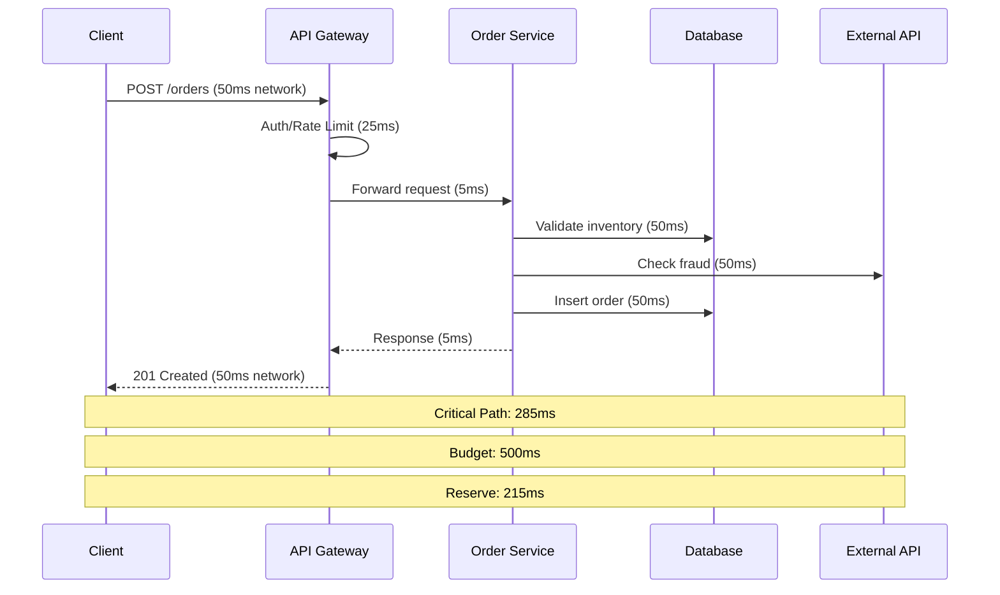

# Performance Budgeting Skill

## When to Use This Skill

Use this skill when:

- **Performance Budgeting tasks** - Working on allocate latency budgets and performance targets across system components
- **Planning or design** - Need guidance on Performance Budgeting approaches
- **Best practices** - Want to follow established patterns and standards

## Overview

Allocate latency budgets and performance targets across system components to meet end-to-end SLOs.

## MANDATORY: Documentation-First Approach

Before performance budgeting:

1. **Invoke `docs-management` skill** for performance patterns
2. **Verify current performance best practices** via MCP servers
3. **Base budgets on measured baselines, not assumptions**

## Performance Budget Concept

```text
Performance Budget Allocation:

End-to-End Target: 500ms (P95)

┌─────────────────────────────────────────────────────────────────────────────┐
│                         Total Budget: 500ms                                  │
├─────────────┬──────────────┬──────────────┬──────────────┬─────────────────┤
│   Network   │    API GW    │   Service    │   Database   │    Reserve      │
│    50ms     │    25ms      │    200ms     │    150ms     │     75ms        │
│    (10%)    │    (5%)      │    (40%)     │    (30%)     │    (15%)        │
└─────────────┴──────────────┴──────────────┴──────────────┴─────────────────┘

Key Principles:
• Reserve 10-20% for unexpected overhead
• Allocate proportionally to complexity
• Measure and adjust based on reality
• Budget for P95, not average
```

## Budget Allocation Template

````markdown
# Performance Budget: [User Journey/Operation]

## Overview

**Operation:** [e.g., "Submit Order"]
**End-to-End Target:** [e.g., "500ms (P95)"]
**User Impact:** [e.g., "Critical conversion path"]
**Baseline Measurement:** [e.g., "Current P95: 750ms"]

## Component Breakdown

| Component | Budget (ms) | % of Total | Current (ms) | Status |
|-----------|-------------|------------|--------------|--------|
| Client Rendering | 50 | 10% | 45 | ✅ |
| Network (RTT) | 50 | 10% | 40 | ✅ |
| CDN/Load Balancer | 10 | 2% | 8 | ✅ |
| API Gateway | 25 | 5% | 30 | ⚠️ |
| Auth Middleware | 15 | 3% | 12 | ✅ |
| Order Service | 150 | 30% | 180 | ❌ |
| Database Queries | 100 | 20% | 95 | ✅ |
| External API | 50 | 10% | 45 | ✅ |
| **Reserve** | 50 | 10% | - | - |
| **Total** | **500** | **100%** | **455** | - |

## Critical Path Analysis



## Optimization Priorities

### Over Budget (❌)

1. **Order Service (180ms vs 150ms budget)**
   - Issue: Sequential database calls
   - Action: Parallelize inventory and fraud checks
   - Expected gain: 50ms

### At Risk (⚠️)

1. **API Gateway (30ms vs 25ms budget)**
   - Issue: Auth token validation overhead
   - Action: Cache validated tokens
   - Expected gain: 10ms

### Healthy (✅)

- All other components within budget

````text

````

## Latency Percentile Strategy

```text
Percentile Allocation Strategy:

┌─────────────────────────────────────────────────────────────────────────────┐
│  Percentile  │   Target    │   Use Case                                     │
├──────────────┼─────────────┼───────────────────────────────────────────────│
│     P50      │   100ms     │   Typical user experience                      │
│     P75      │   200ms     │   Good experience for most users               │
│     P90      │   350ms     │   Acceptable experience threshold              │
│     P95      │   500ms     │   SLO target (primary metric)                  │
│     P99      │   1000ms    │   Worst acceptable experience                  │
│     P99.9    │   2000ms    │   Timeout threshold                            │
└─────────────┴─────────────┴───────────────────────────────────────────────┘

Rule of Thumb:
• P99 ≤ 2x P95
• P95 ≤ 2x P50
• If ratios are higher, investigate tail latency
```

## Budget Categories

### By Component Type

```markdown
## Typical Budget Allocations by Component

### Network & Infrastructure (15-25%)
| Component | Typical Budget | Notes |
|-----------|---------------|-------|
| Client Network | 20-100ms | Varies by geography |
| CDN | 5-20ms | Cache hit vs miss |
| Load Balancer | 1-5ms | Should be minimal |
| Service Mesh | 2-10ms | Proxy overhead |

### Application Layer (40-60%)
| Component | Typical Budget | Notes |
|-----------|---------------|-------|
| Auth/Authz | 10-50ms | Cache tokens |
| Business Logic | 50-200ms | Complexity dependent |
| Serialization | 5-20ms | JSON vs binary |
| Validation | 5-30ms | Input complexity |

### Data Layer (20-30%)
| Component | Typical Budget | Notes |
|-----------|---------------|-------|
| Database Query | 10-100ms | Per query |
| Cache Lookup | 1-10ms | Redis/Memcached |
| File Storage | 20-100ms | Object storage |

### External Dependencies (10-20%)
| Component | Typical Budget | Notes |
|-----------|---------------|-------|
| Third-party API | 50-200ms | Add circuit breaker |
| Payment Gateway | 100-500ms | User-facing timeout |
| Email Service | N/A | Async, no budget |
```

## C# Implementation

```csharp
// Performance Budget Model
public sealed record PerformanceBudget
{
    public required string OperationName { get; init; }
    public required TimeSpan EndToEndTarget { get; init; }
    public required Percentile TargetPercentile { get; init; }
    public required IReadOnlyList<ComponentBudget> Components { get; init; }

    public TimeSpan TotalAllocated =>
        TimeSpan.FromMilliseconds(
            Components.Sum(c => c.Budget.TotalMilliseconds));

    public TimeSpan Reserve =>
        EndToEndTarget - TotalAllocated;

    public bool IsValid =>
        TotalAllocated <= EndToEndTarget &&
        Reserve >= TimeSpan.FromMilliseconds(EndToEndTarget.TotalMilliseconds * 0.1);
}

public sealed record ComponentBudget
{
    public required string ComponentName { get; init; }
    public required ComponentCategory Category { get; init; }
    public required TimeSpan Budget { get; init; }
    public TimeSpan? CurrentMeasured { get; init; }

    public BudgetStatus Status => CurrentMeasured switch
    {
        null => BudgetStatus.Unknown,
        var m when m <= Budget => BudgetStatus.Healthy,
        var m when m <= Budget * 1.2 => BudgetStatus.AtRisk,
        _ => BudgetStatus.OverBudget
    };
}

public enum ComponentCategory
{
    Network,
    Infrastructure,
    Application,
    Database,
    Cache,
    ExternalApi,
    Reserve
}

public enum Percentile
{
    P50,
    P75,
    P90,
    P95,
    P99,
    P999
}

public enum BudgetStatus
{
    Unknown,
    Healthy,
    AtRisk,
    OverBudget
}

// Budget Analyzer
public sealed class PerformanceBudgetAnalyzer
{
    public BudgetAnalysis Analyze(PerformanceBudget budget)
    {
        var overBudget = budget.Components
            .Where(c => c.Status == BudgetStatus.OverBudget)
            .ToList();

        var atRisk = budget.Components
            .Where(c => c.Status == BudgetStatus.AtRisk)
            .ToList();

        var totalCurrent = TimeSpan.FromMilliseconds(
            budget.Components
                .Where(c => c.CurrentMeasured.HasValue)
                .Sum(c => c.CurrentMeasured!.Value.TotalMilliseconds));

        return new BudgetAnalysis
        {
            Budget = budget,
            ComponentsOverBudget = overBudget,
            ComponentsAtRisk = atRisk,
            TotalCurrentLatency = totalCurrent,
            IsWithinBudget = totalCurrent <= budget.EndToEndTarget,
            Recommendations = GenerateRecommendations(overBudget, atRisk)
        };
    }

    private static IReadOnlyList<string> GenerateRecommendations(
        IReadOnlyList<ComponentBudget> overBudget,
        IReadOnlyList<ComponentBudget> atRisk)
    {
        var recommendations = new List<string>();

        foreach (var component in overBudget)
        {
            var overage = component.CurrentMeasured!.Value - component.Budget;
            recommendations.Add(
                $"[CRITICAL] {component.ComponentName} exceeds budget by " +
                $"{overage.TotalMilliseconds:F0}ms - optimize immediately");
        }

        foreach (var component in atRisk)
        {
            recommendations.Add(
                $"[WARNING] {component.ComponentName} approaching budget limit - " +
                "monitor closely");
        }

        return recommendations;
    }
}

public sealed record BudgetAnalysis
{
    public required PerformanceBudget Budget { get; init; }
    public required IReadOnlyList<ComponentBudget> ComponentsOverBudget { get; init; }
    public required IReadOnlyList<ComponentBudget> ComponentsAtRisk { get; init; }
    public required TimeSpan TotalCurrentLatency { get; init; }
    public required bool IsWithinBudget { get; init; }
    public required IReadOnlyList<string> Recommendations { get; init; }
}
```

## Monitoring Integration

### OpenTelemetry Instrumentation

```csharp
public sealed class BudgetTracingMiddleware
{
    private readonly RequestDelegate _next;
    private readonly PerformanceBudget _budget;
    private static readonly ActivitySource ActivitySource = new("PerformanceBudget");

    public BudgetTracingMiddleware(
        RequestDelegate next,
        PerformanceBudget budget)
    {
        _next = next;
        _budget = budget;
    }

    public async Task InvokeAsync(HttpContext context)
    {
        using var activity = ActivitySource.StartActivity("HttpRequest");

        var sw = Stopwatch.StartNew();

        try
        {
            await _next(context);
        }
        finally
        {
            sw.Stop();

            activity?.SetTag("performance.budget.target_ms",
                _budget.EndToEndTarget.TotalMilliseconds);
            activity?.SetTag("performance.budget.actual_ms",
                sw.Elapsed.TotalMilliseconds);
            activity?.SetTag("performance.budget.within_budget",
                sw.Elapsed <= _budget.EndToEndTarget);

            // Record histogram for percentile analysis
            PerformanceMetrics.RequestDuration.Record(
                sw.Elapsed.TotalMilliseconds,
                new KeyValuePair<string, object?>("operation", _budget.OperationName));
        }
    }
}

public static class PerformanceMetrics
{
    private static readonly Meter Meter = new("PerformanceBudget");

    public static readonly Histogram<double> RequestDuration =
        Meter.CreateHistogram<double>(
            name: "request.duration.ms",
            unit: "ms",
            description: "Request duration in milliseconds");

    public static readonly Counter<long> BudgetExceeded =
        Meter.CreateCounter<long>(
            name: "performance.budget.exceeded",
            description: "Number of requests exceeding budget");
}
```

## Budget Review Process

```markdown
## Performance Budget Review Checklist

### Weekly Review
- [ ] Check P95 latency against budget
- [ ] Identify any components over budget
- [ ] Review alert history for budget breaches
- [ ] Update current measurements

### Monthly Review
- [ ] Analyze latency trends
- [ ] Evaluate budget allocation accuracy
- [ ] Adjust budgets based on measurements
- [ ] Plan optimization for over-budget components

### Quarterly Review
- [ ] Revisit end-to-end targets
- [ ] Align with SLO changes
- [ ] Update reserve allocation
- [ ] Document lessons learned
```

## Workflow

When creating performance budgets:

1. **Measure**: Establish current baseline (P50, P95, P99)
2. **Target**: Define end-to-end target based on user needs
3. **Map**: Identify all components in critical path
4. **Allocate**: Distribute budget proportionally
5. **Reserve**: Keep 10-20% for unexpected overhead
6. **Instrument**: Add monitoring for each component
7. **Optimize**: Address over-budget components
8. **Review**: Regular budget reviews and adjustments

## References

For detailed guidance:

---

**Last Updated:** 2025-12-26
