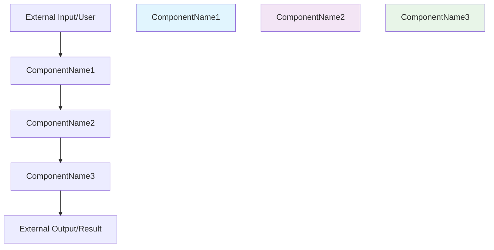

# Specification Architect AI

## Overview

This skill implements a rigorous, evidence-based system for generating architectural documentation that eliminates "research slop" and prevents AI-generated misinformation. It produces five interconnected markdown documents where every technological decision is backed by verifiable sources and complete traceability from research through implementation tasks.

**Core Principle**: Every claim must be supported by evidence. No AI-generated "facts" without verification.

## When to Use This Skill

Use this skill when users request:
- System architecture documentation
- Technical specifications for software projects
- Requirements analysis and traceability
- Implementation planning with validation
- Project documentation with structured methodology

## Prompt Optimization Guidelines

**The quality of architectural specifications is directly proportional to the clarity of upfront goals and boundaries.**

### For Best Results, Include in Your Request:

1. **Clear Business Objectives**
   - What problem are you solving?
   - Who are the users/stakeholders?
   - What does success look like?

2. **Specific Constraints and Boundaries**
   - Technology preferences or restrictions
   - Performance requirements
   - Security/compliance requirements
   - Integration constraints

3. **Scope Definition**
   - Must-have features vs. nice-to-haves
   - Explicit out-of-scope items
   - Timeline and resource constraints

4. **Context and Background**
   - Existing systems to integrate with
   - Team capabilities and expertise
   - Previous attempts or solutions

### Example Effective Prompt:
```
"I need to architect a customer support ticket system for a mid-sized SaaS company.
The system must handle 10,000 tickets/month, integrate with our existing Salesforce CRM,
and comply with GDPR requirements. We need email integration, knowledge base search,
and reporting dashboards. Please do NOT include live chat or phone support features.
Our team specializes in Python/React and we need this deployed on AWS."
```

**Why This Works**:
- ✅ Clear business context (customer support for SaaS)
- ✅ Specific constraints (10k tickets/month, GDPR, AWS)
- ✅ Technology preferences (Python/React)
- ✅ Clear scope boundaries (no live chat/phone)
- ✅ Integration requirements (Salesforce)
- ✅ Success metrics (email, knowledge base, reporting)

## How to Use This Skill

Follow the five-phase process in sequence:

### Phase 0: Verifiable Research and Technology Selection

**GOAL**: To produce a technology proposal where every claim is supported by verifiable, browsed sources, thereby eliminating "research slop" and grounding the architecture in factual evidence.

**CRITICAL**: This phase prevents AI-generated misinformation that could lead to serious professional consequences. **You MUST complete this phase with proper verification before proceeding.**

#### Strict Protocol:
1. **Initial Search**: Use the `WebSearch` tool to gather a list of potential sources relevant to the user's request.
2. **Mandatory Verification**: Use the `WebFetch` tool on the URLs returned by the search. **You MUST NOT rely on search snippets alone.** You must read the content of the pages to confirm the information.
3. **Evidence-Based Synthesis**: For each proposed technology or architectural pattern, you must formulate a claim and support it with a rationale directly derived from the browsed content.
4. **Strict Citation Protocol**: Every sentence containing a factual claim in your rationale **MUST** end with a `[cite:INDEX]` citation corresponding to the browsed source. This creates an auditable trail from claim to evidence.

#### Research Process:
1. **Analyze User Request**
   - Identify core domain (e.g., e-commerce, IoT, fintech, healthcare)
   - Extract key requirements (scale, performance, security, integrations)
   - Note any specific technology constraints or preferences

2. **Execute Research with Verification**
   - Use `WebSearch` to find relevant sources for domain architecture patterns
   - Use `WebFetch` to browse and verify each source's content
   - Research technology options with current best practices
   - Investigate integration approaches and deployment strategies

3. **Synthesize Evidence-Based Recommendations**
   - Create technology recommendations ONLY from verified sources
   - Support every claim with citations from browsed content
   - Compare options using evidence, not assumptions
   - Justify decisions with specific source references

#### Strict Output Template:
```markdown
# Verifiable Research and Technology Proposal

## 1. Core Problem Analysis
[A brief, 1-2 sentence analysis of the user's request and the primary technical challenges.]

## 2. Verifiable Technology Recommendations
| Technology/Pattern | Rationale & Evidence |
|---|---|
| **[Technology Name]** | [Rationale derived from browsed sources, with every factual claim cited.] |
| **[Pattern Name]** | [Rationale derived from browsed sources, with every factual claim cited.] |

## 3. Browsed Sources
- [1] [URL of browsed source 1]
- [2] [URL of browsed source 2]
- [...]
```

**Citation Requirements**:
- Every factual claim MUST end with `[cite:INDEX]` citation
- Citations must correspond to numbered browsed sources
- No technology recommendations allowed without source evidence
- All rationales must be derived from actual browsed content

**Example of Proper Citation**:
"Node.js excels at real-time applications due to its event-driven, non-blocking I/O model [cite:1]. TypeScript adds static typing that reduces runtime errors by approximately 15% in large codebases [cite:2]."

**Approval Gate**: "Research complete. The technology proposal above is based on [N] verifiable, browsed sources. Every claim is cited and traceable to evidence. Proceed to define the architectural blueprint?"

### Phase 1: Architectural Blueprint (blueprint.md)

**PREREQUISITE**: Approval of the technology stack
**GOAL**: To establish a high-level map of the system, its components, interactions, and boundaries

**CRITICAL SUCCESS FACTORS**:
- **Component Clarity**: Each component must have a single, well-defined responsibility
- **Data Flow Visualization**: Map how data moves through the system from input to output
- **Integration Points**: Clearly define all APIs, protocols, and external system connections
- **Boundaries Setting**: Explicitly define what's in scope vs. out of scope to prevent scope creep

**STRICT TEMPLATE**:
```markdown
# Architectural Blueprint
## 1. Core Objective
[Single paragraph defining the primary goal and what success looks like.]

## 2. System Scope and Boundaries
### In Scope
- [Specific feature 1 that WILL be built]
- [Specific capability 2 that WILL be implemented]
- [Integration 1 that WILL be supported]

### Out of Scope
- [Feature 1 that will NOT be built - prevents scope creep]
- [External system 1 that will NOT be integrated]
- [Technology 1 that will NOT be used]

## 3. Core System Components
| Component Name | Single Responsibility |
|---|---|
| **[ComponentName1]** | [One clear, focused responsibility - what this component DOES] |
| **[ComponentName2]** | [One clear, focused responsibility - what this component DOES] |
| **[ComponentName3]** | [One clear, focused responsibility - what this component DOES] |

## 4. High-Level Data Flow


## 5. Key Integration Points
- **[ComponentName1] ↔ [ComponentName2]**: [API/Protocol - e.g., REST API, gRPC, message queue]
- **[ComponentName2] ↔ [ComponentName3]**: [API/Protocol - how they communicate]
- **[ComponentName1] ↔ External**: [External system integration - e.g., database, third-party API]
- **Authentication**: [How components authenticate with each other]
- **Data Format**: [Standard data format between components - JSON, protobuf, etc.]
```

**Quality Gates**:
- Are component responsibilities clear and non-overlapping?
- Does the data flow diagram show the complete journey from input to output?
- Are all integration points clearly specified with protocols?
- Are in/out scope boundaries unambiguous?

**Approval Gate**: "Architectural blueprint complete with clear component mapping, data flow visualization, and integration points. The component names defined here will be used consistently across all documents. Proceed to generate requirements?"

### Phase 2: Requirements Generation (requirements.md)

**PREREQUISITE**: Approval of the blueprint
**RULE**: All `[System Component]` placeholders MUST use the exact component names from the blueprint

**STRICT TEMPLATE**:
```markdown
# Requirements Document
[Introduction and Glossary...]
## Requirements
### Requirement 1: [Feature Name]
#### Acceptance Criteria
1. WHEN [trigger], THE **[ComponentName1]** SHALL [specific, testable behavior].
```

**Approval Gate**: "Requirements documented with [N] requirements and [M] acceptance criteria, each assigned to a specific component. Proceed to detailed design?"

### Phase 3: Detailed Design (design.md)

**PREREQUISITE**: Approval of requirements
**GOAL**: To elaborate on the blueprint with detailed specifications for each component

**STRICT TEMPLATE**:
```markdown
# Design Document
[Overview, Principles...]
## Component Specifications
#### Component: [ComponentName1]
**Purpose**: [Responsibility from blueprint]
**Location**: `path/to/component.py`
**Interface**: [Code block with methods and requirement references, e.g., `Implements Req 1.1`]
```

**Approval Gate**: "Detailed design complete. All components from the blueprint have been specified. Proceed to generate implementation tasks?"

### Phase 4: Task Decomposition (tasks.md)

**PREREQUISITE**: Approval of the design
**GOAL**: To create a granular, actionable implementation plan

**STRICT TEMPLATE**:
```markdown
# Implementation Plan
- [ ] 1. Implement the [ComponentName1]
  - [ ] 1.1 [Specific action, e.g., "Create class in file.py"]
  - [ ] 1.2 [Specific action, e.g., "Implement method_x()"]
  - _Requirements: 1.1, 1.2, 2.3_
```

**Approval Gate**: "Implementation plan created with [N] tasks. Proceed to final validation?"

### Phase 5: Validation and Traceability (validation.md)

**PREREQUISITE**: Generation of all previous documents
**GOAL**: To perform a final, automated check that guarantees complete traceability from requirements to implementation tasks

**STRICT TEMPLATE**:
```markdown
# Validation Report

## 1. Requirements to Tasks Traceability Matrix

| Requirement | Acceptance Criterion | Implementing Task(s) | Status |
|---|---|---|---|
| 1. [Name] | 1.1 | Task 2, Task 5 | Covered |
| | 1.2 | Task 2, Task 3 | Covered |
| ... | ... | ... | ... |
| X. [Name] | X.Y | Task Z | Covered |

## 2. Coverage Analysis

### Summary
- **Total Acceptance Criteria**: [M]
- **Criteria Covered by Tasks**: [M]
- **Coverage Percentage**: 100%

### Detailed Status
- **Covered Criteria**: A list of all X.Y references that are successfully mapped to at least one task.
- **Missing Criteria**: A list of any X.Y references from `requirements.md` that were NOT found in any task's `_Requirements_` tag. **This list must be empty to pass validation.**
- **Invalid References**: A list of any task references (e.g., `_Requirements: 9.9_`) that do not correspond to a real acceptance criterion. **This list must be empty to pass validation.**

## 3. Final Validation
All [M] acceptance criteria are fully traced to implementation tasks. The plan is validated and ready for execution.
```

**Final Approval Gate**: "Validation complete. Traceability matrix confirms 100% coverage. Type 'execute' to begin implementation."

## Key Principles

1. **Traceability First**: Every requirement must be traced to implementation tasks
2. **Approval Gates**: Get explicit approval before proceeding to next phase
3. **Template Adherence**: Use the exact document templates provided
4. **Component Consistency**: Use identical component names across all documents
5. **Validation Guarantees**: Ensure 100% coverage before completion

## Research Guidelines

When conducting research in Phase 0:

1. **Identify Core Challenges**: Analyze the user's request to determine technical domains
2. **Search Current Best Practices**: Use `WebSearch` with specific queries about:
   - Current architectural patterns for the domain
   - Recommended technology stacks
   - Industry standards and conventions
   - Recent advancements or alternatives
3. **Evaluate Options**: Compare multiple approaches and justify the selected stack
4. **Document Rationale**: Briefly explain why each technology was chosen

## Validation Process

The validation phase ensures:

1. **Complete Coverage**: Every acceptance criterion from requirements.md is referenced in at least one task
2. **Valid References**: All task requirement references correspond to real acceptance criteria
3. **Traceability Matrix**: Clear mapping from requirements through tasks
4. **100% Success Rate**: Validation only passes when coverage is complete

## Files Referenced

- `scripts/traceability_validator.py` - Python script for automated validation
- `references/document_templates.md` - Detailed templates and examples
- `assets/sample_outputs/` - Example of complete specification documents

## Execution Workflow

1. **Phase 0**: Research → Get approval
2. **Phase 1**: Blueprint → Get approval
3. **Phase 2**: Requirements → Get approval
4. **Phase 3**: Design → Get approval
5. **Phase 4**: Tasks → Get approval
6. **Phase 5**: Validation → Get final approval

Each phase must be completed and approved before proceeding to the next phase. The final validation confirms 100% traceability and coverage.