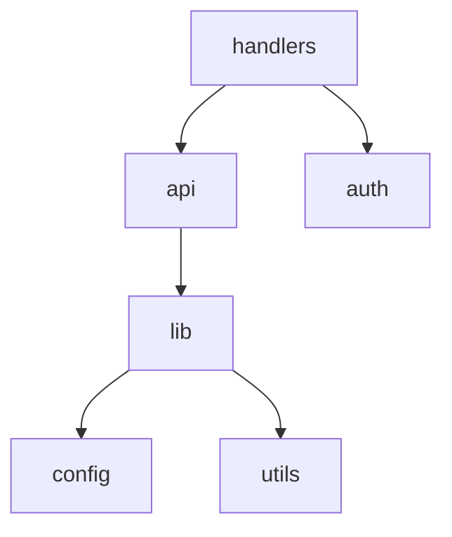

# Rust Dependency Analysis

Analyze internal module dependencies in Rust crates and generate Mermaid diagrams.

## Prerequisites

Requires [uv](https://docs.astral.sh/uv/) - dependencies are managed automatically, no pip install needed.

```bash
# Ask to install uv (if not already installed)
curl -LsSf https://astral.sh/uv/install.sh | sh
```

## Quick Start

```bash
# Show module structure tree
rust-deps.sh structure

# Generate Mermaid dependency graph
rust-deps.sh graph

# Check for circular dependencies (CI-friendly)
rust-deps.sh check
```

## Commands Reference

### `rust-deps.sh structure`

Displays the hierarchical module tree of the crate.

```bash
rust-deps.sh structure                    # Full structure
rust-deps.sh structure --depth 2          # Limit depth
rust-deps.sh structure --focus api        # Focus on specific module
```

### `rust-deps.sh graph`

Generates a Mermaid dependency diagram.

```bash
rust-deps.sh graph                        # Output to stdout
rust-deps.sh graph --output deps.md       # Save to file
rust-deps.sh graph --focus handlers       # Focus on module subtree
rust-deps.sh graph --direction LR         # Left-to-right layout (default: TD)
```

### `rust-deps.sh check`

Verifies the module graph is acyclic (no circular dependencies). Returns exit code 0 if valid DAG, 1 if cycles exist.

```bash
rust-deps.sh check                        # Check at module level
rust-deps.sh check --depth 3              # Check at plugin level (e.g., crate::plugins::X)
rust-deps.sh check --quiet                # Silent, exit code only
```

The `--depth` flag aggregates module paths before cycle detection. Use `--depth 3` for plugin-level cycles in typical Rust projects with `src/plugins/` structure.

## Mermaid Output

The graph command outputs Mermaid syntax that renders in GitHub, GitLab, and documentation tools:

````markdown

````

### Embedding in Documentation

Add to your README.md or rustdoc:

```rust
#[cfg_attr(doc, aquamarine::aquamarine)]
/// Module architecture:
/// ```mermaid
/// graph TD
///     lib --> config
///     api --> lib
/// ```
pub mod api {}
```

## CI Integration

Add DAG verification to your GitHub Actions workflow:

```yaml
name: Architecture Check
on: [push, pull_request]

jobs:
  dependency-check:
    runs-on: ubuntu-latest
    steps:
      - uses: actions/checkout@v4
      - uses: astral-sh/setup-uv@v4
      - name: Verify no circular dependencies
        run: ./rust_deps.py check
```

## How It Works

The analyzer uses tree-sitter to parse Rust source files directly, extracting:

- `mod` declarations (inline and file-based)
- `use crate::`, `use super::`, `use self::` statements

This approach:
- Uses minimal memory (~50-100 MB)
- Runs in seconds, not minutes
- Works on incomplete or broken code
- Requires no compilation

**Trade-off**: May miss some indirect dependencies that only exist at the type level (e.g., trait implementations). For architecture visualization and cycle detection, this is typically sufficient.

## Script Locations

The analysis scripts are located in this skill's `scripts/` directory:
- `rust_deps.py` - Main analyzer (can be run directly with `./rust_deps.py` or `uv run rust_deps.py`)
- `rust-deps.sh` - Shell wrapper
