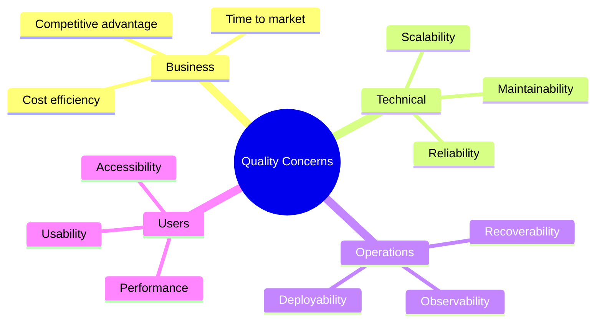

# Quality Attribute Workshop (QAW) Facilitation Skill

## When to Use This Skill

Use this skill when:

- **Qaw Facilitation tasks** - Working on quality attribute workshop (qaw) facilitation for eliciting and prioritizing nfrs
- **Planning or design** - Need guidance on Qaw Facilitation approaches
- **Best practices** - Want to follow established patterns and standards

## Overview

Facilitate Quality Attribute Workshops to systematically elicit, refine, and prioritize non-functional requirements with stakeholders.

## MANDATORY: Documentation-First Approach

Before facilitating a QAW:

1. **Invoke `docs-management` skill** for workshop facilitation patterns
2. **Verify SEI QAW methodology** via MCP servers (perplexity for latest practices)
3. **Base all guidance on SEI/Carnegie Mellon QAW methodology**

## QAW Overview

The Quality Attribute Workshop is a stakeholder-centric method for eliciting quality attribute requirements early in the architecture lifecycle.

```text
QAW Process Flow:

┌─────────────────────────────────────────────────────────────────────────────┐
│                         Quality Attribute Workshop                           │
├─────────────────────────────────────────────────────────────────────────────┤
│                                                                              │
│  Phase 1: Preparation (Before Workshop)                                      │
│  ├── Identify stakeholders                                                   │
│  ├── Gather business/mission context                                         │
│  └── Prepare materials and agenda                                            │
│                                                                              │
│  Phase 2: Presentation (Day 1 Morning)                                       │
│  ├── Business/mission drivers                                                │
│  ├── Architectural plan overview                                             │
│  └── Quality attribute clarification                                         │
│                                                                              │
│  Phase 3: Scenario Brainstorming (Day 1 Afternoon)                          │
│  ├── Generate raw scenarios                                                  │
│  ├── Group and consolidate                                                   │
│  └── Initial prioritization                                                  │
│                                                                              │
│  Phase 4: Scenario Refinement (Day 2 Morning)                               │
│  ├── Refine top scenarios                                                    │
│  ├── Add stimulus/response measures                                          │
│  └── Validate with stakeholders                                              │
│                                                                              │
│  Phase 5: Prioritization (Day 2 Afternoon)                                  │
│  ├── Vote on scenarios                                                       │
│  ├── Rank by importance                                                      │
│  └── Document results                                                        │
│                                                                              │
└─────────────────────────────────────────────────────────────────────────────┘
```

## Workshop Preparation

### Stakeholder Identification

```markdown
# Stakeholder Analysis for QAW

## Stakeholder Matrix

| Role | Name | Quality Concerns | Influence | Availability |
|------|------|------------------|-----------|--------------|
| Product Owner | | Business value, cost | High | Confirmed |
| Architect | | Maintainability, scalability | High | Confirmed |
| Operations | | Reliability, observability | Medium | Confirmed |
| Security | | Confidentiality, compliance | Medium | Confirmed |
| End User Rep | | Usability, performance | Medium | Invited |
| Dev Lead | | Testability, modifiability | Medium | Confirmed |

## Stakeholder Concerns Map



### Pre-Workshop Briefing Document

```markdown
# QAW Briefing Document

**System:** [System Name]
**Date:** [Workshop Date]
**Duration:** 2 days (recommended)
**Location:** [Physical/Virtual]

## Business Context

### Mission Statement
[Brief description of the system's purpose and value]

### Key Business Drivers
1. [Driver 1 - e.g., "Reduce operational costs by 30%"]
2. [Driver 2 - e.g., "Support 10x user growth in 2 years"]
3. [Driver 3 - e.g., "Meet compliance requirements by Q4"]

### Constraints
- Budget: [Budget constraints]
- Timeline: [Delivery timeline]
- Technology: [Required technologies or platforms]
- Regulatory: [Compliance requirements]

## Architectural Context

### Current State
[Brief description of existing architecture, if any]

### Proposed Direction
[High-level architectural vision]

### Key Decisions Already Made
- [Decision 1]
- [Decision 2]

## Quality Attribute Focus Areas
Based on business drivers, we expect to focus on:
- [ ] Performance
- [ ] Scalability
- [ ] Security
- [ ] Reliability
- [ ] Usability
- [ ] Maintainability
- [ ] Other: ___________

## Pre-Reading Materials
1. [Link to system overview]
2. [Link to business case]
3. [Link to existing architecture docs]
```

## Workshop Facilitation

### Phase 1: Business Context Presentation

```markdown
# Business Context Session (30-45 minutes)

## Agenda
1. Welcome and introductions (5 min)
2. Workshop objectives and process overview (10 min)
3. Business/mission drivers presentation (15 min)
4. Q&A and clarification (15 min)

## Facilitation Script

"Welcome to the Quality Attribute Workshop for [System Name].

Our goal over the next two days is to:
1. Understand the quality attributes that matter most
2. Create concrete, measurable scenarios
3. Prioritize these scenarios to guide architecture decisions

Let's start by hearing from [Business Sponsor] about the business
drivers and strategic context for this system."

## Capture Template
| Driver | Description | Impact on Quality | Priority |
|--------|-------------|-------------------|----------|
| | | | |
```

### Phase 2: Architecture Overview

```markdown
# Architecture Context Session (30-45 minutes)

## Agenda
1. Current state architecture (10 min)
2. Proposed architectural approach (15 min)
3. Known constraints and decisions (10 min)
4. Q&A (10 min)

## Key Questions to Ask
- What are the key components/services?
- What are the main integration points?
- What technologies are mandated?
- What are the biggest technical risks?

## Architecture Context Capture
| Aspect | Current State | Proposed State | Constraints |
|--------|---------------|----------------|-------------|
| Deployment | | | |
| Data | | | |
| Integration | | | |
| Security | | | |
```

### Phase 3: Scenario Brainstorming

```markdown
# Scenario Brainstorming Session (2-3 hours)

## Facilitation Technique: Round-Robin

1. Each stakeholder writes 3-5 scenarios on cards (10 min)
2. Go around the room, each person reads one scenario (30 min)
3. Group similar scenarios (15 min)
4. Clarify and consolidate (30 min)
5. Repeat for additional rounds as needed

## Scenario Generation Prompts

**Performance:**
- "What happens when 1000 users try to [action] simultaneously?"
- "How quickly must the system respond to [critical operation]?"

**Availability:**
- "What happens if [component] fails during peak usage?"
- "How long can the system be down before it impacts [business function]?"

**Security:**
- "What if an attacker tries to [attack vector]?"
- "How do we protect [sensitive data] from [threat]?"

**Modifiability:**
- "What if we need to add [new feature] next quarter?"
- "How difficult would it be to replace [technology]?"

**Usability:**
- "How quickly can a new user complete [core task]?"
- "What happens when a user makes a mistake during [process]?"

## Raw Scenario Capture

| ID | Stakeholder | Raw Scenario | Quality Attribute |
|----|-------------|--------------|-------------------|
| RS-001 | | | |
| RS-002 | | | |
```

### Phase 4: Scenario Refinement

```markdown
# Scenario Refinement Session (2-3 hours)

## Six-Part Scenario Template

For each prioritized scenario, refine using this structure:

| Part | Description | Example |
|------|-------------|---------|
| **Source** | Entity that generates the stimulus | End user, External system, Timer |
| **Stimulus** | Event or condition | Request, Failure, Attack, Change |
| **Artifact** | Part of system affected | Service, Database, UI |
| **Environment** | System state when stimulus occurs | Normal, Peak load, Degraded |
| **Response** | How system should respond | Process, Reject, Recover |
| **Measure** | Quantifiable response metric | Latency, Availability, Time |

## Refined Scenario Template

### QA-[ID]: [Title]

**Quality Attribute:** [Performance/Availability/Security/etc.]
**Priority:** [High/Medium/Low]
**Stakeholder:** [Who raised this]

| Component | Specification |
|-----------|---------------|
| **Source** | |
| **Stimulus** | |
| **Artifact** | |
| **Environment** | |
| **Response** | |
| **Response Measure** | |

**Business Justification:**
[Why this matters to the business]

**Technical Notes:**
[Any architectural considerations]
```

### Phase 5: Prioritization

```markdown
# Scenario Prioritization Session (1-2 hours)

## Voting Method: Dot Voting

1. Each stakeholder gets 10 dots
2. Distribute dots across scenarios (max 3 per scenario)
3. Count votes and rank scenarios
4. Discuss top scenarios for consensus

## Prioritization Matrix

| Scenario ID | Title | Votes | Business Impact | Technical Risk | Final Priority |
|-------------|-------|-------|-----------------|----------------|----------------|
| QA-001 | | | High/Med/Low | High/Med/Low | 1 |
| QA-002 | | | | | 2 |
| QA-003 | | | | | 3 |

## Priority Categories

**Must Have (Top 5):** These scenarios MUST be addressed in the architecture.
**Should Have (6-10):** Address if resources allow.
**Could Have (11+):** Future consideration.

## Consensus Check

For each top-priority scenario, confirm:
- [ ] All stakeholders understand the scenario
- [ ] Response measure is realistic and measurable
- [ ] Business justification is accepted
- [ ] No stakeholder has blocking concerns
```

## Workshop Outputs

### QAW Results Document

```markdown
# Quality Attribute Workshop Results

**System:** [System Name]
**Date:** [Date]
**Participants:** [List of participants]
**Facilitator:** [Facilitator name]

## Executive Summary

[2-3 paragraph summary of workshop outcomes]

## Business Drivers Summary

| Driver | Description | Quality Implications |
|--------|-------------|---------------------|
| BD-1 | | |
| BD-2 | | |

## Prioritized Quality Attribute Scenarios

### Priority 1: QA-001 - [Title]

**Quality Attribute:** Performance
**Stakeholder:** Operations Team

| Component | Specification |
|-----------|---------------|
| Source | End user via web browser |
| Stimulus | Submits order during peak hours |
| Artifact | Order processing service |
| Environment | Black Friday (10x normal load) |
| Response | Order is validated and queued for processing |
| Response Measure | 95th percentile response time < 2 seconds |

**Business Justification:**
Peak period sales represent 40% of annual revenue. Slow performance
directly translates to cart abandonment and lost sales.

**Architectural Implications:**
- Requires horizontal scaling capability
- Need queue-based decoupling
- Consider read replicas for product catalog

---

### Priority 2: QA-002 - [Title]
[Continue for each prioritized scenario...]

## Summary Statistics

| Quality Attribute | Scenarios | Top 5 | Top 10 |
|-------------------|-----------|-------|--------|
| Performance | 8 | 2 | 4 |
| Availability | 5 | 1 | 2 |
| Security | 6 | 1 | 2 |
| Modifiability | 4 | 1 | 1 |
| Usability | 3 | 0 | 1 |

## Next Steps

1. [ ] Distribute results to all stakeholders
2. [ ] Architecture team to propose tactics for top scenarios
3. [ ] Schedule follow-up review in 2 weeks
4. [ ] Incorporate scenarios into ADR process

## Appendix: All Scenarios

[Complete list of all scenarios generated, including non-prioritized]
```

## C# Implementation Support

```csharp
// Quality Attribute Scenario Model
public sealed record QualityAttributeScenario
{
    public required string Id { get; init; }
    public required string Title { get; init; }
    public required QualityAttribute Attribute { get; init; }
    public required ScenarioPriority Priority { get; init; }

    public required string Source { get; init; }
    public required string Stimulus { get; init; }
    public required string Artifact { get; init; }
    public required string Environment { get; init; }
    public required string Response { get; init; }
    public required string ResponseMeasure { get; init; }

    public required string BusinessJustification { get; init; }
    public string? TechnicalNotes { get; init; }
    public IReadOnlyList<string> Stakeholders { get; init; } = [];
}

public enum QualityAttribute
{
    Performance,
    Availability,
    Security,
    Modifiability,
    Usability,
    Testability,
    Interoperability,
    Portability
}

public enum ScenarioPriority
{
    MustHave,
    ShouldHave,
    CouldHave
}

// QAW Results
public sealed record QawResults
{
    public required string SystemName { get; init; }
    public required DateOnly WorkshopDate { get; init; }
    public required IReadOnlyList<string> Participants { get; init; }
    public required IReadOnlyList<BusinessDriver> BusinessDrivers { get; init; }
    public required IReadOnlyList<QualityAttributeScenario> Scenarios { get; init; }

    public IEnumerable<QualityAttributeScenario> TopPriority =>
        Scenarios.Where(s => s.Priority == ScenarioPriority.MustHave)
                 .OrderBy(s => s.Id);
}

public sealed record BusinessDriver(
    string Id,
    string Description,
    IReadOnlyList<QualityAttribute> QualityImplications);
```

## Virtual QAW Adaptations

For remote workshops:

```markdown
## Virtual QAW Tools

### Collaboration Platforms
- **Miro/Mural**: Visual scenario brainstorming
- **Mentimeter**: Real-time voting
- **Google Docs**: Collaborative scenario refinement

### Agenda Adjustments
- Shorter sessions (2 hours max) with breaks
- More structured turn-taking
- Async pre-work for scenario generation
- Recording for absent stakeholders

### Facilitation Tips
- Use breakout rooms for small group work
- Require cameras on for engagement
- Designate a note-taker separate from facilitator
- Have backup facilitator for tech issues
```

## Workflow

When facilitating a QAW:

1. **Prepare**: Identify stakeholders, gather context, prepare materials
2. **Present**: Business drivers, architecture context, quality attributes
3. **Brainstorm**: Generate raw scenarios using prompts
4. **Refine**: Convert to six-part scenario format with measures
5. **Prioritize**: Vote, rank, and achieve consensus
6. **Document**: Create comprehensive results document
7. **Follow-up**: Track scenario implementation in architecture

## References

For detailed guidance:

---

**Last Updated:** 2025-12-26
