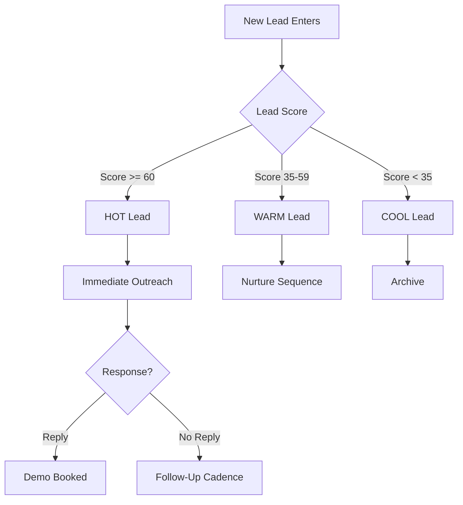
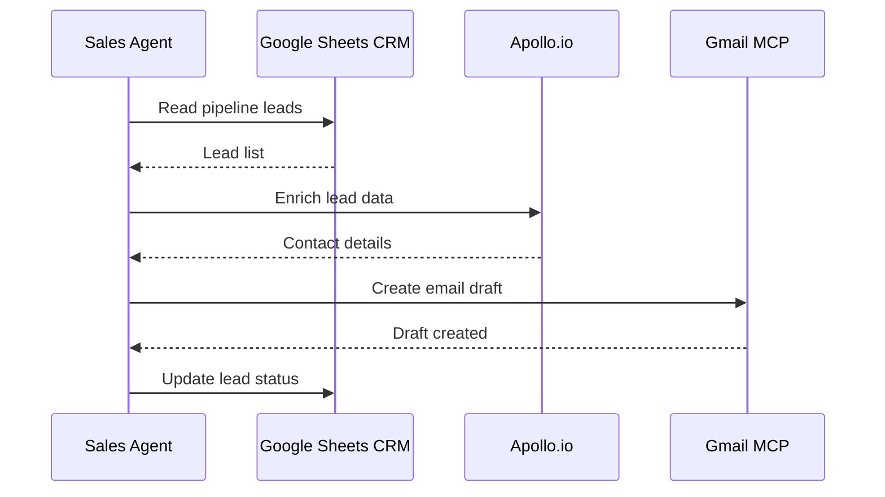

# Diagram Creator

Generates professional diagrams using Mermaid.js syntax for flowcharts, sequence diagrams, org charts, user journeys, system architecture, entity relationships, and Gantt charts. Outputs renderable Mermaid code that can be embedded in docs, READMEs, Notion, or exported as images. Supports GTM-specific diagrams: sales funnels, outreach cadences, lead routing, tech stack architecture.

## Prerequisites

- `agency.config.json` in the project root
- Diagram request with context (what to visualize, audience, purpose)
- Optional: existing process documentation to diagram

## Phase 0: Intake

1. Read `agency.config.json` from the project root.
2. Extract `agency.name` for branding context.
3. Extract `services[]`, `outreach.cadence`, `crm.tabs` for GTM-specific diagrams.
4. Extract `tools.*` for tech stack diagrams.
5. Collect inputs from the user:
   - **Subject**: what to diagram (process, system, flow, organization)
   - **Type**: flowchart, sequence, journey, architecture, ERD, Gantt, org chart
   - **Detail level**: high-level overview, detailed implementation, or technical spec
   - **Audience**: technical team, client, stakeholders, internal docs
   - **Nodes/steps**: key elements to include (or ask to extract from description)

## Phase 1: Diagram Type Selection

Match the request to the optimal Mermaid diagram type:

| Use Case | Diagram Type | Mermaid Syntax |
|----------|-------------|----------------|
| Decision flow, process steps | Flowchart | `flowchart TD` |
| API calls, system interactions | Sequence diagram | `sequenceDiagram` |
| Customer experience | User journey | `journey` |
| System components | Architecture (C4-style flowchart) | `flowchart TD` with subgraphs |
| Database schema | Entity relationship | `erDiagram` |
| Project timeline | Gantt chart | `gantt` |
| Team structure | Org chart | `flowchart TD` |
| State machine, lead stages | State diagram | `stateDiagram-v2` |
| Git workflow | Gitgraph | `gitGraph` |
| Funnel visualization | Flowchart with styled widths | `flowchart TD` |

If the user's request maps to multiple types, recommend the best fit and offer alternatives.

## Phase 2: Structure Planning

Before generating code, outline the diagram structure:

```
DIAGRAM PLAN:
---
Type: [selected type]
Direction: [TD (top-down) / LR (left-right) / RL / BT]
Nodes: [list of nodes/entities]
Relationships: [list of connections]
Subgraphs: [groupings if needed]
Styling: [color coding, shapes, line types]
```

**Node naming conventions:**
- Use clear, short labels (3-5 words max per node)
- Use consistent casing (Title Case for entities, lowercase for actions)
- Prefix IDs for clarity: `lead_new`, `stage_demo`, `sys_apollo`

**Layout decisions:**
- Processes with clear start/end: top-down (TD)
- Timelines and sequences: left-right (LR)
- Hierarchies: top-down (TD)
- Interactions between systems: left-right (LR)

## Phase 3: Mermaid Code Generation

Generate clean, well-commented Mermaid code.

**Flowchart example (lead routing):**


**Sequence diagram example (outreach flow):**


**Styling rules:**
- Use subgraphs to group related nodes
- Apply color classes for visual distinction:
  - Green: success states, completed steps
  - Red: error states, lost deals
  - Blue: active processes, current state
  - Gray: inactive, archived
- Keep edge labels short (2-4 words)
- Limit to 15-20 nodes per diagram (split into multiple if larger)

## Phase 4: Validation

Check the generated Mermaid code for:

**Syntax validation:**
- All node IDs are unique
- All referenced nodes are defined
- Brackets and quotes are balanced
- Direction declaration is valid
- Subgraph declarations are properly closed

**Readability validation:**
- No overlapping labels
- Logical flow direction (no unnecessary back-arrows)
- Consistent node shapes (rectangles for processes, diamonds for decisions, circles for start/end)
- Labels are readable at standard rendering size

**Completeness validation:**
- All requested elements are represented
- No orphan nodes (disconnected from the flow)
- Start and end points are clear
- Edge cases are represented where relevant

Fix any issues before outputting.

## Phase 5: Output

Return the diagram in multiple formats:

```json
{
  "diagram": {
    "title": "[Diagram title]",
    "type": "[flowchart/sequence/journey/erDiagram/gantt/stateDiagram/gitGraph]",
    "description": "[What this diagram shows]",
    "mermaid_code": "[Complete Mermaid.js code block]",
    "node_count": 12,
    "relationship_count": 15,
    "subgraphs": ["[list of subgraph names]"],
    "rendering_notes": "[Any notes about optimal rendering: width, theme, etc.]",
    "embed_instructions": {
      "markdown": "Wrap in ```mermaid code fence",
      "notion": "Use /mermaid block and paste code",
      "github": "Mermaid renders natively in .md files",
      "export_image": "Use mermaid.live or mmdc CLI to export PNG/SVG"
    }
  }
}
```

Also output the raw Mermaid code block for immediate copy-paste:

```
DIAGRAM: [Title]
---
[Mermaid code here, ready to render]
```

If the diagram is complex (>15 nodes), offer to split into:
- High-level overview diagram
- Detailed sub-process diagrams

## Example Usage

**Trigger phrases:**
- "Create a flowchart of our sales process"
- "Diagram the outreach cadence"
- "Make a sequence diagram for the lead enrichment flow"
- "Visualize our tech stack architecture"
- "Create an org chart for the sales team"
- "Draw the lead scoring decision tree"

```
User: Diagram our outreach cadence from agency.config.json
Assistant: [reads cadence config, generates a flowchart showing Day 1-11 touchpoints across channels with decision branches for replies]
```

```
User: Create a system architecture diagram for the GTM stack
Assistant: [reads tools config, generates architecture diagram with Apollo, Gmail, Chrome, CRM, and their data flows]
```
