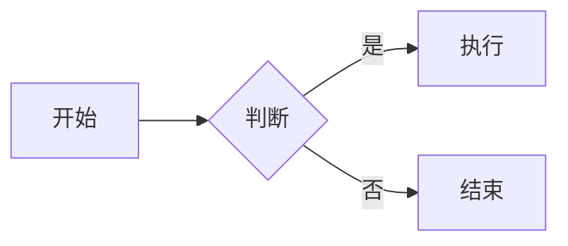
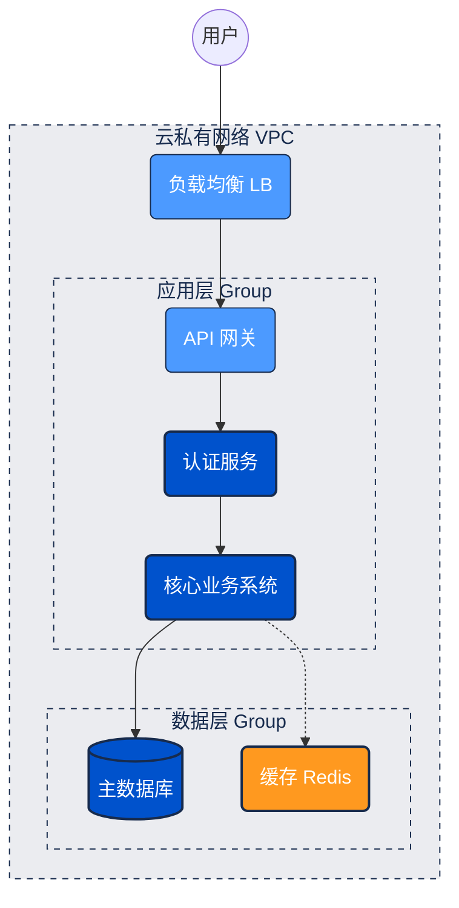

# Diagram Creator

## Quick Start

Use **Mermaid** as the default choice - it's versatile, well-supported, and handles most diagram types:

## Tool Selection Guide

**Default:** Use Mermaid for most cases (flowcharts, sequence diagrams, Gantt charts, ER diagrams)

**Alternative tools for specific needs:**
- **Complex UML/C4:** PlantUML
- **Network/Architecture:** GraphViz (DOT)
- **ASCII art style:** Ditaa
- **Timeline/Waveforms:** WaveDrom
- **Full list:** See [TOOLS.md](TOOLS.md)

## Recommended Colors

Apply these colors for professional, consistent diagrams:

| 用途 | 颜色 | HEX | 场景 |
| :--- | :--- | :--- | :--- |
| **主色** | 深海蓝 | `#0052CC` | 核心系统、主要服务 |
| **辅色** | 天空蓝 | `#4C9AFF` | 子系统、API 网关 |
| **中性** | 浅灰 | `#EBECF0` | 背景、分组、边界 |
| **强调** | 活力橙 | `#FF991F` | 重点模块、第三方依赖 |
| **线条** | 深炭灰 | `#172B4D` | 连接线、文字、边框 |

## Example

## Workflow

1. Understand the diagram requirements and type needed
2. Select appropriate tool (default: Mermaid)
3. Design structure and layout
4. Apply recommended colors for visual clarity
5. Generate clean diagram code
6. Validate syntax and readability

Output only the diagram code - no XML tags, no extra explanations.
