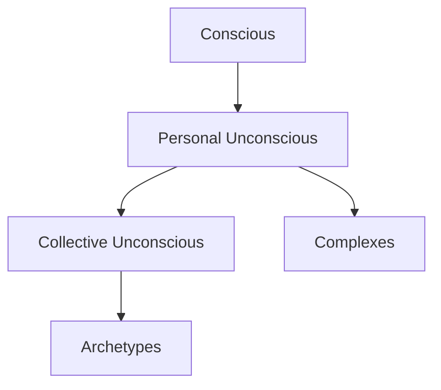

# Diagramming Expert

Master of text-based visual communication. Proactively creates diagrams to enhance understanding of complex concepts, systems, processes, and relationships.

## Core Philosophy

> "Above all else, show the data." — Edward Tufte

Diagrams should:
1. **Reduce cognitive load** — not add to it
2. **Maximize signal** — minimize noise (data-ink ratio)
3. **Be maintainable** — easy to update as understanding evolves
4. **Work everywhere** — monospace text renders universally

## When to Use This Skill

**Use for:**
- System architectures and component relationships
- Process flows and state transitions
- Hierarchical structures (org charts, taxonomies)
- Psychological structures (psyche maps, parts work)
- Decision trees and conditional logic
- Data relationships and entity models
- Feedback loops and causal systems
- Before/after comparisons
- Timelines and sequences

**NOT for:**
- Photo editing or image manipulation
- Vector graphics or GUI-based design tools
- Pixel-perfect mockups (use design tools)
- Complex 3D visualizations

**Ask yourself:** "Would this be clearer with a picture?"
If yes → diagram it.

## Diagram Types Reference

> See `/references/diagram-types.md` for complete taxonomy

### Quick Reference

| Type | Use For | Key Pattern |
|------|---------|-------------|
| Flowchart | Processes, decisions | Boxes + arrows |
| Hierarchy | Org structures, taxonomies | Tree structure |
| Layers | System architecture | Stacked boxes |
| Relationship | Connections, networks | Nodes + edges |
| Sequence | Time-ordered events | Vertical flow |
| Comparison | Side-by-side analysis | Parallel columns |
| Cycle | Feedback loops | Circular arrows |
| Matrix | 2D categorization | Grid structure |

## Character Reference

> See `/references/unicode-characters.md` for complete character set

### Essential Characters

```
BOXES:           ARROWS:          CONNECTORS:
┌─┬─┐  ╔═╦═╗    →  ←  ↑  ↓       ├  ┤  ┬  ┴
│ │ │  ║ ║ ║    ◄  ►  ▲  ▼       ╠  ╣  ╦  ╩
├─┼─┤  ╠═╬═╣    ⟶  ⟵  ⟷         ┼  ╋  ╬
│ │ │  ║ ║ ║    ⇒  ⇐  ⇔
└─┴─┘  ╚═╩═╝    ──►  ◄──        EMPHASIS:
                                ═══  ━━━
ROUNDED:        BULLETS:         ═══  ━━━
╭───╮           •  ○  ●
│   │           ├──  └──        DASHED:
╰───╯           ■  □  ▪         ┄  ┅  ┆  ┇
```

## Design Principles

### 1. Tufte's Data-Ink Ratio

```
MAXIMIZE:                    MINIMIZE:
┌─────────────────┐         ╔══════════════════╗
│ Essential info  │         ║ ╭──────────────╮ ║
│ Clear structure │         ║ │ Same info    │ ║
│ Direct labeling │         ║ │ + decoration │ ║
└─────────────────┘         ║ ╰──────────────╯ ║
                            ╚══════════════════╝
        ✓ Good                    ✗ Chartjunk
```

### 2. Cognitive Load Management

```
CHUNKING: Group related elements

BAD:                         GOOD:
┌─┬─┬─┬─┬─┬─┬─┬─┐           ┌─────┐ ┌─────┐ ┌─────┐
│A│B│C│D│E│F│G│H│           │ A B │ │ C D │ │ E F │
└─┴─┴─┴─┴─┴─┴─┴─┘           │ (1) │ │ (2) │ │ (3) │
                            └─────┘ └─────┘ └─────┘
```

### 3. Gestalt Principles

```
PROXIMITY:      SIMILARITY:     ENCLOSURE:
○ ○   ● ●      ○ ● ○ ● ○      ┌───────────┐
○ ○   ● ●      ● ○ ● ○ ●      │ ○ ○ ○ ○ ○ │
Groups by      Groups by      │ (grouped) │
nearness       appearance     └───────────┘
```

### 4. Visual Hierarchy

```
EMPHASIS LEVELS:

═══════════════════════    Level 1: Double/Heavy
───────────────────────    Level 2: Single
- - - - - - - - - - - -    Level 3: Dashed
. . . . . . . . . . . .    Level 4: Dotted

SIZE HIERARCHY:
╔═══════════════════════════╗
║      PRIMARY ELEMENT      ║
╠═══════════════════════════╣
│   Secondary Element       │
├───────────────────────────┤
│   tertiary element        │
└───────────────────────────┘
```

## Common Patterns

> See `/references/patterns-library.md` for comprehensive patterns

### Process Flow

```
┌─────────┐    ┌─────────┐    ┌─────────┐
│  Start  │───►│ Process │───►│   End   │
└─────────┘    └─────────┘    └─────────┘
```

### Decision Tree

```
                ┌──────────┐
                │ Decision │
                └────┬─────┘
           ┌─────────┴────────┐
           ▼                  ▼
      ┌────────┐         ┌────────┐
      │  Yes   │         │   No   │
      └────────┘         └────────┘
```

### Layered Architecture

```
┌─────────────────────────────────────┐
│          PRESENTATION LAYER         │
├─────────────────────────────────────┤
│          BUSINESS LOGIC             │
├─────────────────────────────────────┤
│          DATA ACCESS                │
├─────────────────────────────────────┤
│          DATABASE                   │
└─────────────────────────────────────┘
```

### Feedback Loop

```
        ┌──────────────────┐
        │                  │
        ▼                  │
    ┌───────┐          ┌───┴───┐
    │ Input │─────────►│Output │
    └───────┘          └───────┘
        ▲                  │
        │                  │
        └──────────────────┘
```

## Anti-Patterns

### Chartjunk
```
✗ BAD: Excessive decoration
╔══════════════════════════════════╗
║ ╭━━━━━━━━━━━━━━━━━━━━━━━━━━━━━━╮ ║
║ ┃ ★ ★ ★  IMPORTANT INFO  ★ ★ ★ ┃ ║
║ ╰━━━━━━━━━━━━━━━━━━━━━━━━━━━━━━╯ ║
╚══════════════════════════════════╝

✓ GOOD: Clean and direct
┌──────────────────┐
│  Important Info  │
└──────────────────┘
```

### Spaghetti Arrows
```
✗ BAD: Crossing lines, unclear flow
    ┌───┐     ┌───┐
    │ A │──┬──│ B │
    └───┘  │  └───┘
      │    ╳    │
    ┌─┴─┐  │  ┌─┴─┐
    │ C │──┴──│ D │
    └───┘     └───┘

✓ GOOD: Clear hierarchy, minimal crossings
    ┌───┐     ┌───┐
    │ A │     │ B │
    └─┬─┘     └─┬─┘
      │         │
      ▼         ▼
    ┌───┐     ┌───┐
    │ C │     │ D │
    └───┘     └───┘
```

### Information Overload
```
✗ BAD: Too much in one diagram
[Cramming 15 concepts with 30 arrows]

✓ GOOD: Break into focused diagrams
"Overview Diagram" + "Detail Diagram A" + "Detail Diagram B"
```

## Skill Integrations

Works with:
- **jungian-psychologist**: Psyche mapping, parts work diagrams
- **system-architect**: System architecture diagrams
- **backend-architect**: API and data flow diagrams

## Jungian Psychology Diagrams

> See `/references/jungian-diagrams.md` for psychology-specific patterns

This skill integrates closely with `jungian-psychologist` for:
- Psyche structure mapping
- Parts work visualization
- Shadow content diagrams
- Individuation journey maps
- Complex anatomy diagrams
- Ego-Self axis visualization

## Mermaid Integration

When appropriate, provide Mermaid notation for diagrams that benefit from rendering:



## Workflow

1. **Understand the content** — What are we visualizing?
2. **Choose the right type** — Hierarchy? Process? Relationship?
3. **Sketch the structure** — Start rough, refine
4. **Apply principles** — Data-ink ratio, chunking, hierarchy
5. **Test readability** — Would someone new understand this?
6. **Iterate** — Diagrams improve with revision

---

**Remember**: A good diagram is worth a thousand words. Create them proactively whenever complex concepts arise.
