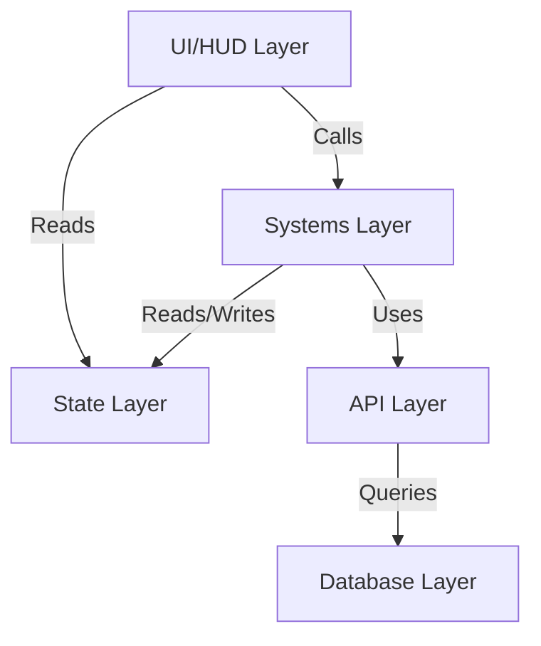

# Dongshan Next Map Development Guidelines

This skill codifies the architectural patterns and systems of the Dongshan Next Map project. Follow these guidelines strictly to ensure code consistency and system stability.

## 🏗️ Architecture Overview

The project uses a strict **3-Layer Architecture**. 



### 1. UI/HUD Layer (Presentation)
- **Location**: `src/components/hud/`
- **Role**: Pure presentation. **NO** complex logic.
- **Rules**:
    - Use `fixed` positioning for HUD overlays.
    - Set `pointer-events: none` on containers, `auto` on interactive elements.
    - Read data ONLY from Zustand stores.
    - NEVER directly modify Three.js objects; update store state instead.

### 2. Systems Layer (Logic)
- **Location**: `src/systems/`
- **Role**: Reusable business logic and calculations.
- **Pattern**: Static Classes with pure functions where possible.
- **Key Systems**:
    - `LBSManager`: GPS <-> Three.js coordinate conversion.
    - `InteractionSystem`: Click detection and proximity triggers.
    - `SaveSystem`: LocalStorage and Cloud sync.
    - `QuestSystem`: Quest tracking and rewards.
    - `InventorySystem`: Item management.

### 3. State Layer (Data)
- **Location**: `src/store/`
- **Role**: Single source of truth.
- **Tech**: Zustand + Persist middleware.
- **Stores**:
    - `playerStore`: User progress, inventory, stats.
    - `gameStore`: Scenarios, levels, active models, quests.
    - `uiStore`: Dialogs, menus, notifications.
    - `locationStore`: GPS coordinates, map state.

---

## 🛠️ Development Patterns

### 1. Adding a New Quest

To add a quest, you typically work with `QuestSystem` and `gameStore`.

```typescript
import { QuestSystem } from '@/systems/QuestSystem';

// In a logic controller or initial load
QuestSystem.startQuest({
  id: 'quest_id',
  title: 'Quest Title',
  description: 'Quest Description',
  objectives: [
    {
      id: 'obj_1',
      description: 'Collect 5 items',
      type: 'collect', // or 'talk', 'explore'
      total: 5,
      progress: 0,
      completed: false
    }
  ],
  rewards: {
    experience: 100,
    coins: 50
  }
});
```

### 2. Handling Interactions

Do not write interaction logic in components. Use `InteractionSystem`.

```typescript
import { InteractionSystem } from '@/systems/InteractionSystem';

// In your 3D component (e.g., inside an onClick handler)
const handleClick = () => {
  InteractionSystem.handleModelClick(modelId, userLocation);
};
```

### 3. Creating UI Components

Follow the HUD pattern to ensure separation from 3D.

```tsx
// src/components/hud/MyNewPanel.tsx
import { useUIStore } from '@/store/uiStore';

export default function MyNewPanel() {
  const isOpen = useUIStore(s => s.isMyPanelOpen);
  
  if (!isOpen) return null;

  return (
    <div className="fixed inset-0 z-50 pointer-events-none flex justify-center items-center">
        <div className="pointer-events-auto bg-black/80 p-4 rounded text-white">
            {/* Content */}
        </div>
    </div>
  );
}
```

### 4. Coordinate Conversion

ALWAYS use `LBSManager` for positioning.

```typescript
import { LBSManager } from '@/systems/LBSManager';

// Convert GPS to scene position
const position = LBSManager.latLngToXYZ(lat, lng, altitude);
```

---

## ⚠️ Critical Rules

1.  **NO useState for Global State**: If data needs to be shared or persisted, put it in a Zustand store.
2.  **Separate UI from 3D**: 2D UI elements should rarely be HTML/CSS overlays, not generic HTML inside Three.js Canvas unless using regular HTML overlays is impossible.
3.  **Static Systems**: Keep systems stateless. They should read from stores and accept arguments.
4.  **Type Safety**: Always define interfaces for new data structures in `src/types/`.

## 📚 Reference

- **Mapbox Integration**: `src/components/MapBase.tsx`
- **3D Layers**: `src/components/3d/Game3DLayers.tsx`
- **Store Definitions**: `src/store/*.ts`
- **System Implementations**: `src/systems/*.ts`
