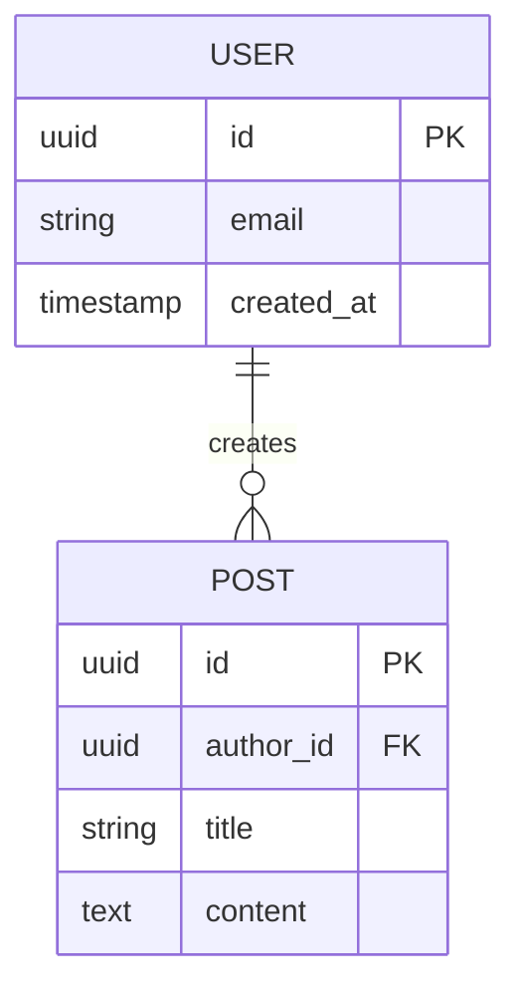

# ER Diagram and Data Modeling

> **STUB: This skill is not yet implemented**
>
> This placeholder preserves the documented plugin structure.
> See parent plugin README for planned capabilities.

## Planned Capabilities

- Entity-relationship diagram generation
- Cardinality and relationship notation
- Primary/foreign key identification
- Normalization analysis (1NF, 2NF, 3NF)
- Index recommendation
- Schema migration planning

## Mermaid ER Syntax

## Implementation Status

- [ ] Core implementation
- [ ] References documentation
- [ ] Output templates
- [ ] Integration tests
