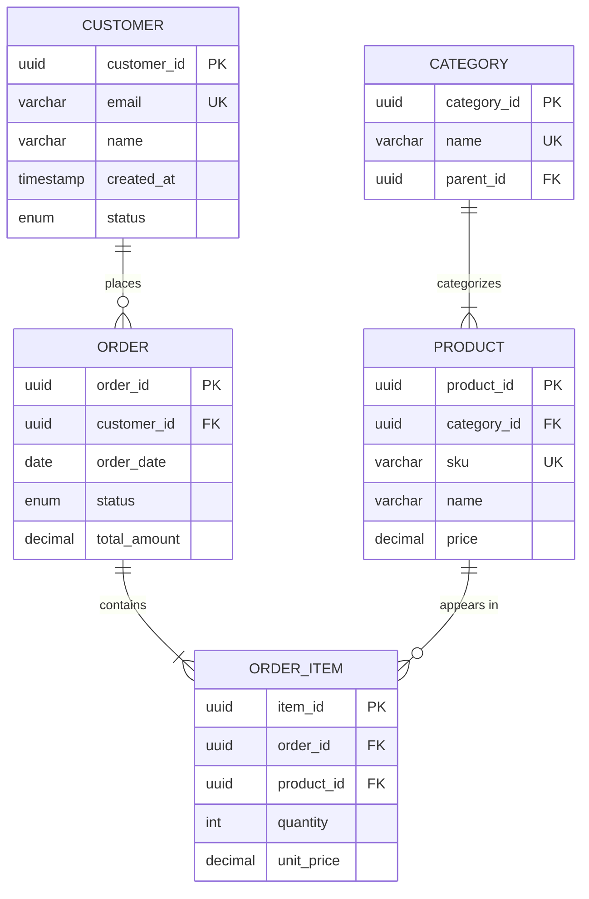

# Entity-Relationship Modeling

## When to Use This Skill

Use this skill when:

- **Er Modeling tasks** - Working on create entity-relationship diagrams with proper normalization, keys, and cardinality for logical data models
- **Planning or design** - Need guidance on Er Modeling approaches
- **Best practices** - Want to follow established patterns and standards

## Overview

Entity-Relationship (ER) modeling creates logical data models that define entities, attributes, relationships, and constraints independent of specific database implementation.

## ER Diagram Notations

### Crow's Foot Notation (Recommended)

```text
Symbols:
──┤├──  One (mandatory)
──○──   Zero (optional)
──<     Many
──>     Many (reverse)

Examples:
CUSTOMER ──┤├──○< ORDER    (One customer, zero or more orders)
ORDER    ──┤├──┤< ITEM     (One order, one or more items)
PRODUCT  >○──┤├── CATEGORY (Many products, one category)
```

### Chen Notation

```text
┌──────────┐         ┌──────────┐
│ CUSTOMER │────<places>────│  ORDER   │
└──────────┘    1:N        └──────────┘
```

## Normalization

### First Normal Form (1NF)

**Rule**: Eliminate repeating groups; each column contains atomic values.

```text
BEFORE (violates 1NF):
┌────────────────────────────────────────┐
│ Order                                  │
├────────────────────────────────────────┤
│ order_id │ products (comma-separated)  │
│ 1        │ "Laptop, Mouse, Keyboard"   │
└────────────────────────────────────────┘

AFTER (1NF):
┌─────────────────────────┐   ┌──────────────────────────┐
│ Order                   │   │ OrderItem                │
├─────────────────────────┤   ├──────────────────────────┤
│ order_id PK            │───│ order_id FK              │
│ order_date             │   │ product_id FK            │
│ customer_id FK         │   │ quantity                 │
└─────────────────────────┘   └──────────────────────────┘
```

### Second Normal Form (2NF)

**Rule**: Be in 1NF + no partial dependencies (all non-key columns depend on the entire primary key).

```text
BEFORE (violates 2NF):
┌───────────────────────────────────────────────────────┐
│ OrderItem                                             │
├───────────────────────────────────────────────────────┤
│ order_id PK │ product_id PK │ product_name │ quantity │
│ (product_name depends only on product_id, not full key)│
└───────────────────────────────────────────────────────┘

AFTER (2NF):
┌─────────────────────────────┐   ┌──────────────────────┐
│ OrderItem                   │   │ Product              │
├─────────────────────────────┤   ├──────────────────────┤
│ order_id PK FK              │   │ product_id PK        │
│ product_id PK FK ───────────┼───│ product_name         │
│ quantity                    │   │ price                │
└─────────────────────────────┘   └──────────────────────┘
```

### Third Normal Form (3NF)

**Rule**: Be in 2NF + no transitive dependencies (non-key columns don't depend on other non-key columns).

```text
BEFORE (violates 3NF):
┌────────────────────────────────────────────────────────┐
│ Order                                                  │
├────────────────────────────────────────────────────────┤
│ order_id PK │ customer_id │ customer_name │ order_date │
│ (customer_name depends on customer_id, not order_id)   │
└────────────────────────────────────────────────────────┘

AFTER (3NF):
┌────────────────────────────┐   ┌─────────────────────────┐
│ Order                      │   │ Customer                │
├────────────────────────────┤   ├─────────────────────────┤
│ order_id PK                │   │ customer_id PK          │
│ customer_id FK ────────────┼───│ customer_name           │
│ order_date                 │   │ email                   │
└────────────────────────────┘   └─────────────────────────┘
```

### Boyce-Codd Normal Form (BCNF)

**Rule**: Be in 3NF + every determinant is a candidate key.

```text
BEFORE (violates BCNF):
┌───────────────────────────────────────────────────────────┐
│ CourseInstructor                                          │
├───────────────────────────────────────────────────────────┤
│ student_id PK │ course PK │ instructor                    │
│ (instructor → course, but instructor is not a candidate key) │
└───────────────────────────────────────────────────────────┘

AFTER (BCNF):
┌──────────────────────────┐   ┌────────────────────────────┐
│ Enrollment               │   │ CourseAssignment           │
├──────────────────────────┤   ├────────────────────────────┤
│ student_id PK FK         │   │ instructor PK              │
│ instructor_id PK FK ─────┼───│ course                     │
└──────────────────────────┘   └────────────────────────────┘
```

## ER Diagram Template

```markdown
# Logical Data Model: [System Name]

## 1. Entity Definitions

### Entity: Customer
| Attribute | Type | Constraints |
|-----------|------|-------------|
| customer_id | UUID | PK |
| email | VARCHAR(255) | UK, NOT NULL |
| name | VARCHAR(100) | NOT NULL |
| created_at | TIMESTAMP | NOT NULL, DEFAULT NOW |
| status | ENUM | NOT NULL, DEFAULT 'active' |

**Business Rules:**
- Email must be unique across all customers
- Status can be: active, suspended, closed

### Entity: Order
| Attribute | Type | Constraints |
|-----------|------|-------------|
| order_id | UUID | PK |
| customer_id | UUID | FK → Customer, NOT NULL |
| order_date | DATE | NOT NULL |
| status | ENUM | NOT NULL |
| total_amount | DECIMAL(10,2) | NOT NULL |

**Business Rules:**
- Order must have at least one OrderItem
- Total is calculated from items

## 2. Relationship Definitions

| Relationship | From | To | Cardinality | Participation |
|--------------|------|-----|-------------|---------------|
| places | Customer | Order | 1:N | Optional |
| contains | Order | OrderItem | 1:N | Mandatory |
| references | OrderItem | Product | N:1 | Mandatory |

## 3. Entity-Relationship Diagram



## 4. Keys Summary

| Entity | Primary Key | Unique Keys | Foreign Keys |
|--------|-------------|-------------|--------------|
| Customer | customer_id | email | - |
| Order | order_id | - | customer_id |
| OrderItem | item_id | - | order_id, product_id |
| Product | product_id | sku | category_id |
| Category | category_id | name | parent_id (self) |

```text

```

## Key Types

| Key Type | Purpose | Example |
|----------|---------|---------|
| Primary Key (PK) | Unique row identifier | order_id |
| Unique Key (UK) | Alternative unique identifier | email, sku |
| Foreign Key (FK) | Reference to another table | customer_id |
| Composite Key | Multi-column primary key | (order_id, product_id) |
| Natural Key | Business-meaningful identifier | social_security_number |
| Surrogate Key | System-generated identifier | auto-increment, UUID |

## Cardinality Notation Reference

```text
Crow's Foot:
┤├    One (and only one)
○     Zero (optional)
<     Many

Combinations:
──┤├──┤├──   One-to-One (mandatory both)
──┤├──○──    One-to-One (optional one side)
──┤├──○<──   One-to-Many (mandatory one, optional many)
──┤├──┤<──   One-to-Many (mandatory both)
──>○──○<──   Many-to-Many (optional both)
```

## .NET EF Core Mapping

```csharp
// Entity Configuration
public class CustomerConfiguration : IEntityTypeConfiguration<Customer>
{
    public void Configure(EntityTypeBuilder<Customer> builder)
    {
        builder.ToTable("Customers");

        // Primary Key
        builder.HasKey(c => c.Id);

        // Properties
        builder.Property(c => c.Email)
            .IsRequired()
            .HasMaxLength(255);

        builder.HasIndex(c => c.Email)
            .IsUnique();

        // Relationships
        builder.HasMany(c => c.Orders)
            .WithOne(o => o.Customer)
            .HasForeignKey(o => o.CustomerId)
            .OnDelete(DeleteBehavior.Restrict);
    }
}

public class OrderConfiguration : IEntityTypeConfiguration<Order>
{
    public void Configure(EntityTypeBuilder<Order> builder)
    {
        builder.ToTable("Orders");

        builder.HasKey(o => o.Id);

        // Owned entity (value object)
        builder.OwnsOne(o => o.ShippingAddress, sa =>
        {
            sa.Property(a => a.Street).HasColumnName("ShippingStreet");
            sa.Property(a => a.City).HasColumnName("ShippingCity");
        });

        // One-to-Many
        builder.HasMany(o => o.Items)
            .WithOne()
            .HasForeignKey(i => i.OrderId)
            .OnDelete(DeleteBehavior.Cascade);
    }
}
```

## Common Modeling Decisions

### When to Denormalize

| Scenario | Action |
|----------|--------|
| Reporting performance | Create read-optimized views |
| Frequent joins hurt performance | Consider caching or denormalization |
| Audit history | Keep normalized, add temporal tables |
| High write frequency | Stay normalized |

### Handling Many-to-Many

```text
Option 1: Junction Table (Recommended)
PRODUCT >──○ PRODUCT_CATEGORY ○──< CATEGORY

Option 2: Array/JSON (for simple cases, NoSQL)
Product { categories: ["electronics", "accessories"] }
```

## Validation Checklist

- [ ] All entities in at least 3NF
- [ ] Primary keys defined for all entities
- [ ] Foreign keys properly reference parent tables
- [ ] Cardinality documented for all relationships
- [ ] NULL/NOT NULL constraints specified
- [ ] Unique constraints identified
- [ ] Data types appropriate for each attribute
- [ ] Naming conventions consistent

## Integration Points

**Inputs from**:

- `conceptual-modeling` skill → Entity candidates
- Requirements → Business rules

**Outputs to**:

- `schema-design` skill → Physical implementation
- EF Core migrations → Database creation
- Documentation → API design
