# Generate Mermaid Diagrams Skill

This skill activates when you need to create visual documentation using Mermaid diagrams.

## When This Skill Activates

Automatically engage when:
- Creating flowcharts for processes or algorithms
- Documenting API interactions with sequence diagrams
- Designing database schemas with ERDs
- Mapping state transitions with state diagrams
- Illustrating user journeys
- Explaining system architecture

## Diagram Type Selection

### Flowchart
**Use for:** Process flows, decision trees, algorithm logic
**Best when:** Showing sequential steps and decision points

### Sequence Diagram
**Use for:** Component interactions, API calls, time-based processes
**Best when:** Showing how components communicate over time

### ERD (Entity Relationship Diagram)
**Use for:** Database schemas, data models, relationships
**Best when:** Designing or documenting data structure

### State Diagram
**Use for:** State machines, lifecycle flows, status transitions
**Best when:** Tracking object states and transitions

### User Journey
**Use for:** User experience flows, emotional journey, touchpoints
**Best when:** Understanding user perspective through process

## Diagram Creation Workflow

### 1. Choose Appropriate Diagram Type
Match diagram type to information structure

### 2. Identify Key Elements
- What are the main components/nodes?
- What relationships/flows exist?
- What decisions or branches occur?
- What states or transitions matter?

### 3. Organize Layout
- Top-to-bottom or left-to-right
- Group related elements
- Minimize line crossings
- Logical flow direction

### 4. Use Clear Labels
- Descriptive node names
- Action-oriented labels
- Consistent terminology
- Avoid abbreviations unless standard

### 5. Add Context
- Title the diagram
- Provide description
- Explain key elements
- Note important details

## Mermaid Syntax Reference

### Flowchart

#### Basic Structure
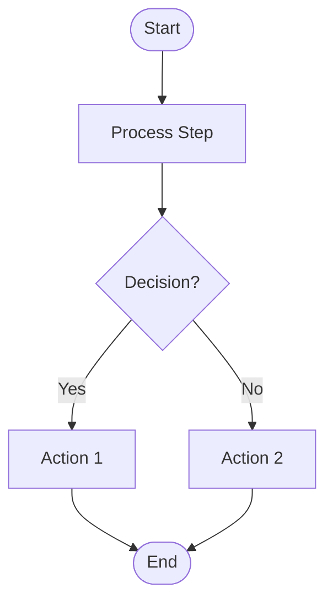

#### Node Shapes
- `[]` Rectangle (process)
- `()` Rounded rectangle (start/end)
- `{}` Diamond (decision)
- `[()]` Stadium (start/end alt)
- `[[]]` Subroutine
- `[()]` Database

#### Direction
- `TD` or `TB` - Top to bottom
- `LR` - Left to right
- `RL` - Right to left
- `BT` - Bottom to top

### Sequence Diagram

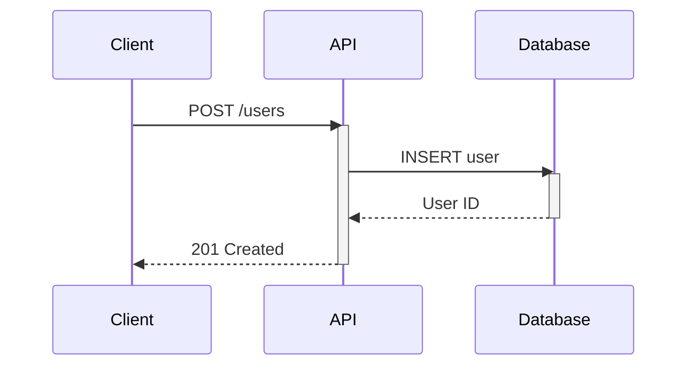

#### Arrow Types
- `->` Solid line
- `-->` Dotted line
- `->>` Solid arrow
- `-->>` Dotted arrow

#### Activation/Deactivation
- `activate Actor` - Show active
- `deactivate Actor` - Show inactive

### ERD

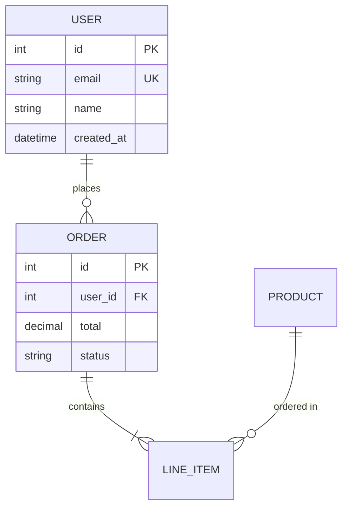

#### Relationships
- `||--||` One to one
- `||--o{` One to many
- `}o--o{` Many to many
- `||--o|` One to zero or one

#### Attributes
- `PK` - Primary Key
- `FK` - Foreign Key
- `UK` - Unique Key

### State Diagram

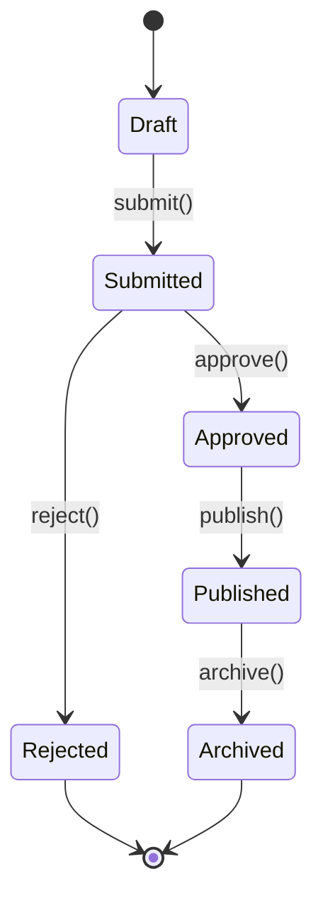

#### Special States
- `[*]` - Start/End state
- State names use camelCase or PascalCase
- Transitions labeled with actions

### User Journey

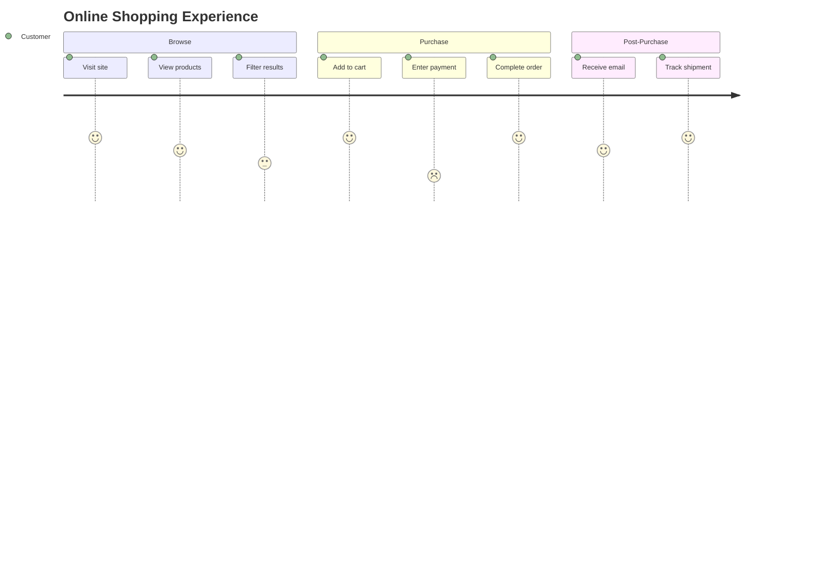

#### Satisfaction Scores
- 1-2: Poor experience
- 3: Neutral
- 4-5: Good experience

## Best Practices

### Clarity

#### Good: Descriptive Labels
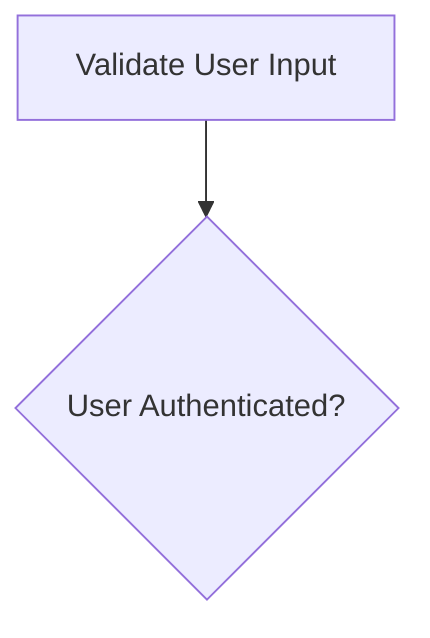

#### Avoid: Cryptic Labels
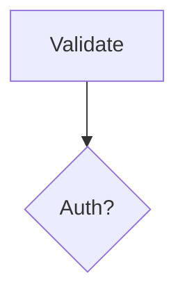

### Simplicity

#### Good: Focused Scope
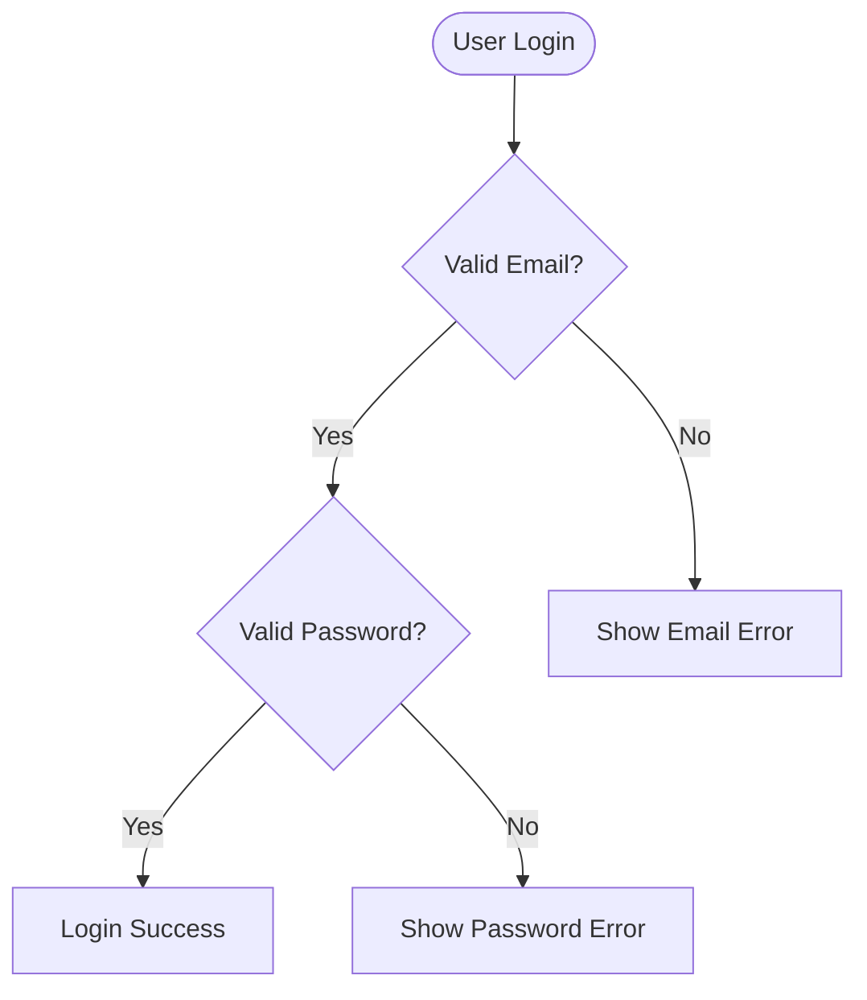

#### Avoid: Too Complex
Don't try to fit an entire system in one diagram - break into multiple focused diagrams

### Layout

#### Good: Logical Flow
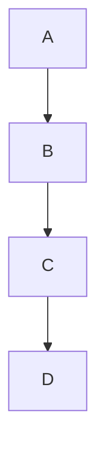

#### Avoid: Crossing Lines
Organize nodes to minimize line crossings

### Consistency

- Use same node shape for same type of element
- Use consistent naming conventions
- Keep style uniform across project diagrams

## Diagram Output Format

When creating a diagram, provide:

### 1. Context
```markdown
# [Diagram Title]

[Brief description of what this diagram shows and why it's important]
```

### 2. The Diagram
````markdown
```mermaid
[diagram code]
```
````

### 3. Explanation
```markdown
## Key Elements

- **[Element Name]**: Description of what it represents
- **[Element Name]**: Description

## Flow Description

[Step-by-step walkthrough if needed]

## Notes

- [Important consideration]
- [Edge case or special behavior]
```

## File Organization

Save diagrams to:
- **Architecture diagrams** → `docs/architecture/diagrams/[name].md`
- **Feature flows** → `docs/features/[feature-name]-[type].md`
- **Data models** → `docs/architecture/models/[name].md`

### Naming Convention
`[subject]-[diagram-type].md`

Examples:
- `authentication-flow.md`
- `order-checkout-sequence.md`
- `user-order-erd.md`
- `order-status-state.md`

## Common Patterns

### API Request Flow
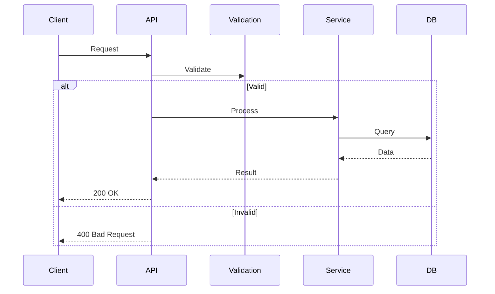

### Authentication Flow
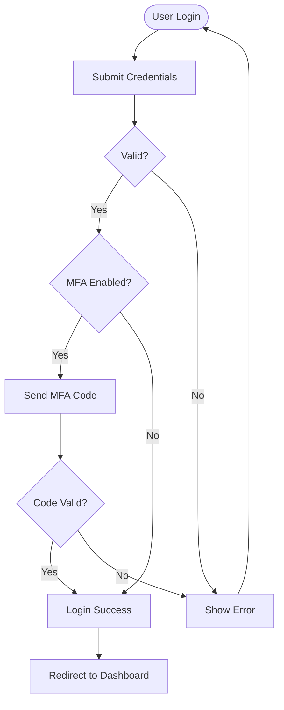

### State Transitions
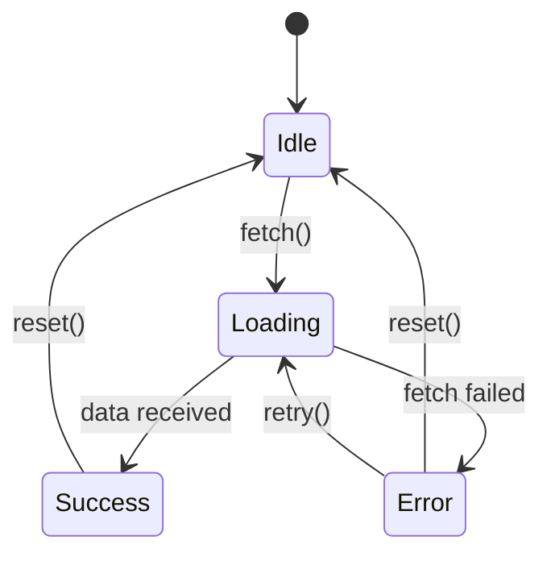

### Database Schema
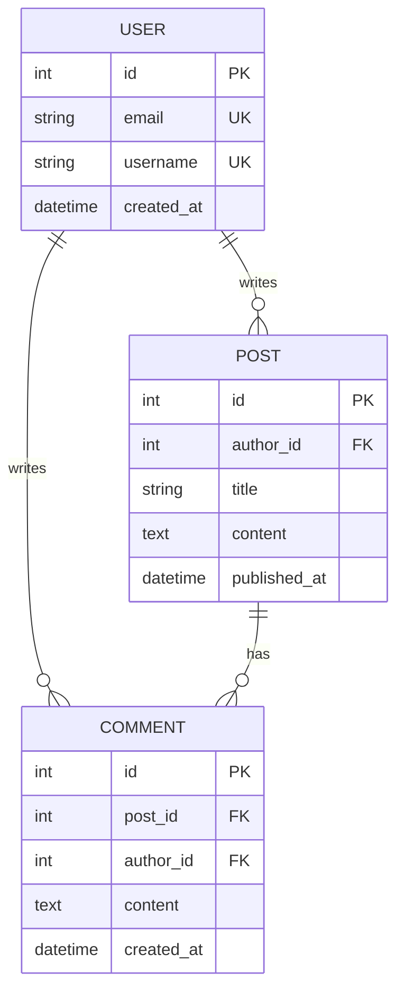

## Diagram Quality Checklist

- [ ] Appropriate diagram type chosen
- [ ] All nodes clearly labeled
- [ ] Logical flow direction
- [ ] Minimal line crossings
- [ ] Consistent naming
- [ ] Context provided
- [ ] Key elements explained
- [ ] Saved to correct location
- [ ] File name follows convention
- [ ] Mermaid syntax valid

## Testing Diagrams

Before finalizing:
1. Copy Mermaid code
2. Test in [Mermaid Live Editor](https://mermaid.live)
3. Verify layout is clear
4. Check labels are readable
5. Ensure no syntax errors

## References

- Mermaid syntax: `.claude/skills/generate-mermaid/references/mermaid-syntax.md`
- Common patterns: `.claude/skills/generate-mermaid/references/common-patterns.md`

## Constraints

- Keep diagrams focused on one aspect
- Break complex systems into multiple diagrams
- Maintain consistency across project diagrams
- Update diagrams when system changes
- Don't diagram everything - only what adds value
