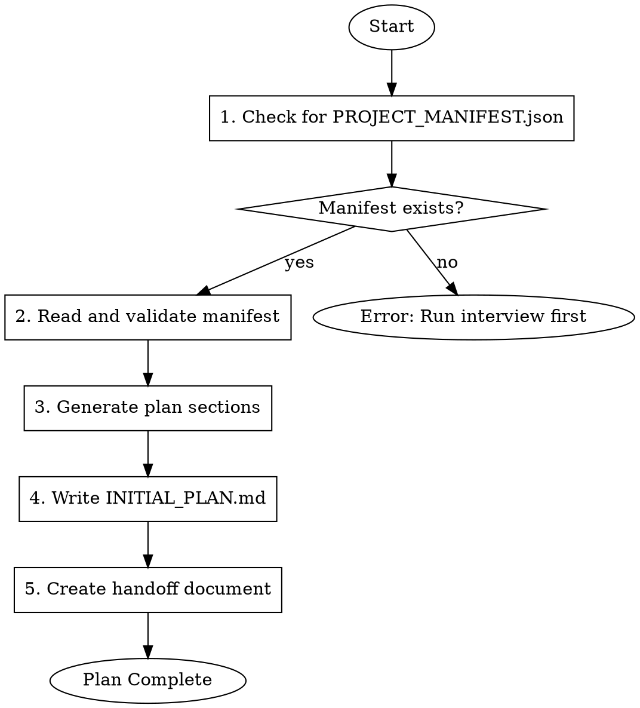

# Gmacko Plan Generator

Generate `INITIAL_PLAN.md` from an existing `PROJECT_MANIFEST.json`.

## Prerequisites

- `PROJECT_MANIFEST.json` must exist in the repository root
- Run `gmacko-init-interview` first if manifest doesn't exist

## Workflow



## Execution Steps

### Step 1: Check for Manifest

```bash
# Verify PROJECT_MANIFEST.json exists
if [ ! -f "PROJECT_MANIFEST.json" ]; then
  echo "ERROR: PROJECT_MANIFEST.json not found"
  echo "Run the gmacko-init-interview skill first"
  exit 1
fi
```

### Step 2: Read and Validate

Read `PROJECT_MANIFEST.json` and validate:
- Required fields present: `project.name`, `platforms`, `integrations`
- Version is supported (1.0.0)
- At least one platform enabled

### Step 3: Generate Plan Sections

Generate `INITIAL_PLAN.md` with these sections:

#### Executive Summary
- Project name and description
- Key decisions table (platforms, auth, payments, API style, deployment)

#### MVP Scope
- In-scope features (from `goals.mvpScope`)
- Out-of-scope features (from `goals.outOfScope`)

#### Success Metrics
- Table of metrics from `goals.successMetrics`

#### Data Model
- Entity relationship diagram (ASCII art)
- Table definitions for each entity in `database.entities`
- Relationship descriptions

#### API Routers
- List each router from `api.routers`
- Generate standard CRUD operations for each
- Note real-time requirements if `api.realtime` is true

#### Screen Specifications
For each screen in `screens.mvp`:
- Purpose
- Key components
- Auth requirements
- Data dependencies (which API calls)

#### Integration Configuration
For each enabled integration:
- Provider and purpose
- Key configuration options
- Webhooks needed (if any)
- Events to track (for analytics)

#### Deployment Environments
- Table of environments (name, branch, domain)
- Environment-specific notes

#### Implementation Milestones
Generate 4-week milestone plan:

**Week 1: Foundation**
- Setup and provisioning
- Database schema
- Auth integration
- Basic API routers

**Week 2: Core Features**
- Primary CRUD operations
- Main screens
- Real-time integration (if enabled)

**Week 3: Polish**
- Payment integration (if enabled)
- Settings/preferences
- Analytics events
- Error handling

**Week 4: Launch**
- Landing page
- Staging deployment
- QA testing
- Production deployment

### Step 4: Write INITIAL_PLAN.md

Write the generated plan to `INITIAL_PLAN.md` in the repository root.

Include header:
```markdown
# Initial Plan: [Display Name]

> Generated from PROJECT_MANIFEST.json on [date]
> Template Version: 1.0.0
```

Include footer:
```markdown
---

*This plan was generated by the gmacko-init-plan skill. Updates should be reflected in PROJECT_MANIFEST.json first, then regenerate this document.*
```

### Step 5: Create Handoff Document

Write `docs/ai/handoffs/init-plan.md`:

```markdown
# Initialization Handoff: Plan Generated

## Status
- [x] PROJECT_MANIFEST.json created
- [x] INITIAL_PLAN.md generated

## Artifacts
- PROJECT_MANIFEST.json: Project configuration (source of truth)
- INITIAL_PLAN.md: Human-readable implementation roadmap

## Next Steps
- [ ] Review INITIAL_PLAN.md with stakeholders
- [ ] Run `gmacko-init-bootstrap` to execute setup.sh
- [ ] Run `gmacko-init-provision` to configure services

## Verification Checklist
- [ ] Project name is correct
- [ ] All required integrations are listed
- [ ] Data model matches requirements
- [ ] Screens cover MVP scope
- [ ] Milestones are realistic
```

## Output Example

See `docs/ai/examples/INITIAL_PLAN.example.md` for a complete example.

## Red Flags

| Rationalization | Correction |
|-----------------|------------|
| "I'll generate a plan without a manifest" | STOP: Manifest is required source of truth |
| "I'll add features not in the manifest" | Only include what's specified in manifest |
| "I'll skip the handoff document" | ALWAYS create handoff for audit trail |
| "The milestones seem too long, I'll shorten them" | Keep 4-week structure; adjust scope instead |

## Dependencies

- Requires: `PROJECT_MANIFEST.json`
- Produces: `INITIAL_PLAN.md`, `docs/ai/handoffs/init-plan.md`
- Next skill: `gmacko-init-bootstrap`
