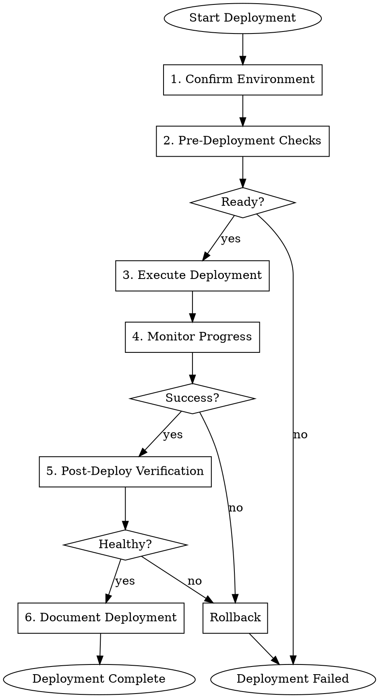

# Gmacko Web Deployment (Vercel)

Deploy the Next.js web application to Vercel with proper verification and rollback planning.

## When to Use

- Release preparation is complete
- Ready to deploy to staging or production
- Need to verify a deployment
- Need to rollback a deployment

## Prerequisites

- Release summary exists: `docs/ai/releases/[date]-v[version].md`
- Vercel CLI authenticated: `vercel whoami`
- Vercel project linked: `vercel link`

## Workflow



## Execution Steps

### Step 1: Confirm Environment

**CRITICAL**: Always confirm target environment before deployment.

Ask user:
> I'm preparing to deploy to Vercel.
>
> **Target Environment**: [staging/production]
> **Branch**: [current branch]
> **Version**: [version from release summary]
>
> Please confirm:
> 1. Is this the correct environment? (yes/no)
> 2. Have you reviewed the release summary? (yes/no)
> 3. Is this a good time to deploy? (yes/no)

For **production** deployments, require explicit confirmation:
> ⚠️ **PRODUCTION DEPLOYMENT**
>
> This will affect live users. Please type "deploy to production" to confirm.

### Step 2: Pre-Deployment Checks

Run verification before deploying:

```bash
# Check current deployment status
vercel ls --limit 5

# Verify build succeeds locally
pnpm build

# Check for uncommitted changes
git status

# Verify we're on the right branch
git branch --show-current

# Check Vercel project is linked
vercel project ls
```

Checklist:
```markdown
## Pre-Deployment Checklist

- [ ] Build passes locally
- [ ] No uncommitted changes
- [ ] On correct branch
- [ ] Vercel project linked
- [ ] Environment variables verified
- [ ] Database migrations applied (if any)
```

### Step 3: Execute Deployment

**For Staging**:
```bash
# Deploy to preview (staging)
vercel

# Or deploy specific branch
vercel --target preview
```

**For Production**:
```bash
# Deploy to production
vercel --prod

# With specific scope
vercel --prod --scope gmacko
```

Capture deployment URL:
```bash
DEPLOYMENT_URL=$(vercel --prod 2>&1 | grep -o 'https://[^ ]*')
echo "Deployment URL: $DEPLOYMENT_URL"
```

### Step 4: Monitor Progress

Monitor deployment status:

```bash
# List recent deployments
vercel ls --limit 3

# Get deployment status
vercel inspect [deployment-url]

# Watch build logs (if available)
vercel logs [deployment-url] --follow
```

Report progress:
```
Deployment Status
=================
URL: https://my-app-abc123.vercel.app
Status: BUILDING / READY / ERROR
Build Duration: Xs

Build Logs:
[Show relevant log excerpts]
```

### Step 5: Post-Deployment Verification

Run smoke tests on deployed environment:

```markdown
## Smoke Test Checklist

### Critical Paths
- [ ] Homepage loads (< 3s)
- [ ] Sign in works
- [ ] Sign up works
- [ ] Dashboard loads (authenticated)
- [ ] Core feature works

### API Health
- [ ] tRPC endpoints responding
- [ ] Database queries working
- [ ] Auth middleware functioning

### Integrations
- [ ] Clerk authentication
- [ ] Stripe payments (test mode)
- [ ] PostHog tracking
- [ ] Sentry error reporting
```

Check for errors:
```bash
# Check Sentry for new errors
# (Manual: Visit Sentry dashboard)

# Check Vercel logs for errors
vercel logs [deployment-url] --since 5m
```

### Step 6: Document Deployment

Update release summary:

```markdown
## Deployment Record

### Web (Vercel)
- **Deployed at**: [timestamp]
- **Deployment URL**: [url]
- **Deployment ID**: [id]
- **Status**: SUCCESS / FAILED
- **Build time**: [Xs]

### Verification
- Smoke tests: PASSED / FAILED
- Error rate: Normal / Elevated
- Performance: Normal / Degraded

### Notes
[Any observations or issues]
```

Report to user:
```
DEPLOYMENT COMPLETE
===================

Environment: Production
URL: https://app.example.com
Deployment ID: dpl_xxxxx

Smoke Tests: 5/5 PASSED
Error Rate: Normal
Response Time: ~200ms avg

Deployment successful! Monitoring for issues...
```

## Rollback Procedure

If issues detected:

```bash
# List previous deployments
vercel ls --limit 10

# Rollback to previous deployment
vercel rollback

# Or rollback to specific deployment
vercel rollback [deployment-url-or-id]
```

Document rollback:
```markdown
## Rollback Record

- **Rolled back at**: [timestamp]
- **Reason**: [description]
- **Rolled back to**: [deployment-id]
- **Status**: SUCCESS

### Post-Rollback Verification
- [ ] Previous version accessible
- [ ] Core functionality working
- [ ] No data loss
```

## Environment-Specific Notes

### Staging
- Deployed from feature branches or `staging` branch
- Used for QA and demos
- Can have test data

### Production
- Deployed from `main` branch only
- Affects real users
- Requires extra confirmation
- Consider deployment timing (avoid peak hours)

## Error Handling

### Build Failure
1. Check build logs: `vercel logs [url]`
2. Common causes:
   - Type errors (run `pnpm typecheck`)
   - Missing dependencies
   - Environment variable issues
3. Fix locally, push, redeploy

### Runtime Errors
1. Check Sentry dashboard
2. Check Vercel function logs
3. Rollback if critical
4. Fix and redeploy

### Performance Issues
1. Check Vercel Analytics
2. Compare with baseline
3. Identify slow endpoints/pages
4. Consider rollback if severe

## Red Flags

| Rationalization | Correction |
|-----------------|------------|
| "Just push to main, it'll be fine" | Follow full deployment process |
| "Skip smoke tests, build passed" | ALWAYS verify deployed functionality |
| "Production during peak hours is fine" | Deploy during low-traffic periods when possible |
| "Skip confirmation for staging" | Confirm environment for ALL deployments |
| "Rollback isn't necessary" | Always have rollback plan ready |

## Integration

- **Input**: Target environment, version
- **References**: Release summary, deployment history
- **Output**: Updated release record, deployment URL
- **Next**: `gmacko-release-close` or monitor
